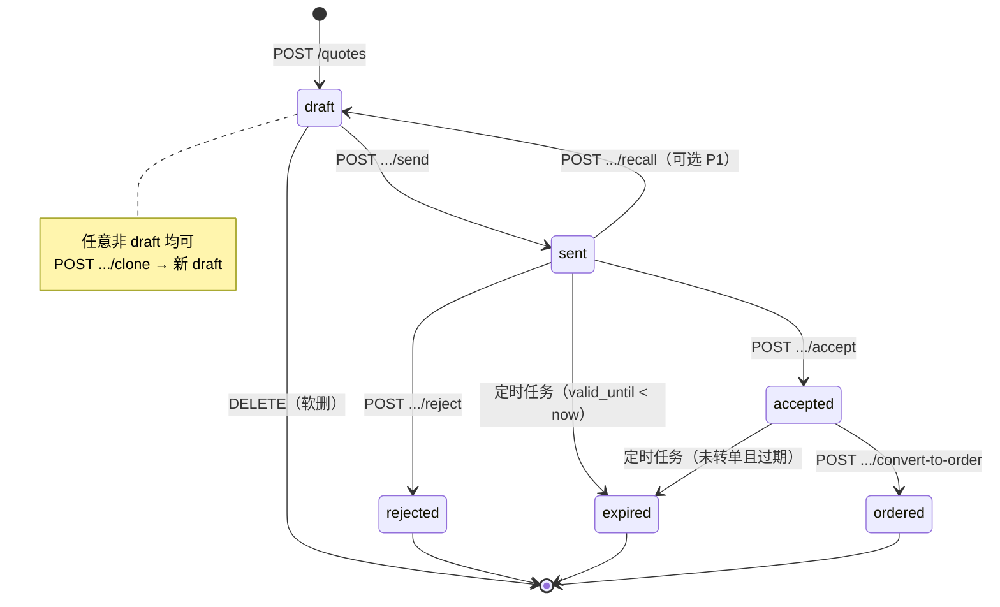

# 报价状态机与操作控制规格

> 目标：对齐行业共性（发出后锁定、终态只读、改价走复制），并收紧当前前后端不一致点。  
> 范围：`quotes` 生命周期；不含完整审批流实现（仅预留钩子）。  
> 对照现状：`quote_service.py` / `QuoteDetail.vue` / FR-QUOTE-03。  
> **实现状态（2026-07-23）：P0 + P1 已落地**（PATCH 禁 status、非 draft 锁明细、convert 仅 accepted、reject/recall、过期 Job、send 校验明细）。P2 审批钩子未做。

---

## 1. 目标状态机

保留现有枚举，不新增对外状态值（审批用旁路字段，见 §5）：

```
QUOTE_STATUSES = draft | sent | accepted | rejected | expired | ordered
```



### 非法迁移一律 409

| From \\ To | draft | sent | accepted | rejected | expired | ordered |
|------------|-------|------|----------|----------|---------|---------|
| draft | — | ✅ send | ❌ | ❌ | ❌ | ❌ |
| sent | ✅ recall(P1) | — | ✅ accept | ✅ reject | ✅ job | ❌ |
| accepted | ❌ | ❌ | — | ❌ | ✅ job | ✅ convert |
| rejected | ❌ | ❌ | ❌ | — | ❌ | ❌ |
| expired | ❌ | ❌ | ❌ | ❌ | — | ❌ |
| ordered | ❌ | ❌ | ❌ | ❌ | ❌ | — |

说明：`clone` 不改原单状态，始终新建 `draft`。

---

## 2. 各状态允许的 API / 字段变更

约定：

- ✅ 允许 ❌ 禁止（409） 👁 只读 ⊕ 新建资源  
- 权限列：除列表/详情外，变更类均需 **权限码 + 负责人**（与现 UI `canMutateQuote` 一致；管理员策略另议）

| API | 权限 | draft | sent | accepted | rejected | expired | ordered |
|-----|------|-------|------|----------|----------|---------|---------|
| `GET /quotes` / `GET /quotes/{id}` | view/list_* | 👁 | 👁 | 👁 | 👁 | 👁 | 👁 |
| `POST /quotes` | create | ⊕ 仅能创建为 draft | — | — | — | — | — |
| `PATCH /quotes/{id}` 头字段（subject/客户/联系人/valid_until/extra…） | edit | ✅ | ❌ | ❌ | ❌ | ❌ | ❌ |
| `PATCH` 明细 `lines` / 折扣 / 税 | edit | ✅ | ❌ | ❌ | ❌ | ❌ | ❌ |
| `PATCH` 直接改 `status` | — | **禁止**（改走专用动作） | 同左 | 同左 | 同左 | 同左 | 同左 |
| `PATCH` 仅 `owner_user_id` | edit（分配） | ✅ | ✅ | ✅ | ✅ | ❌ | ❌ |
| `POST .../send` | send | ✅ → sent | 幂等可保留（已是 sent 则 200 不改） | ❌ | ❌ | ❌ | ❌ |
| `POST .../accept` | accept | ❌ | ✅ → accepted | 幂等 | ❌ | ❌ | ❌ |
| `POST .../reject`（新建，见 §3） | edit 或 accept | ❌ | ✅ → rejected | ❌ | 幂等 | ❌ | ❌ |
| `POST .../recall`（P1） | edit | ❌ | ✅ → draft | ❌ | ❌ | ❌ | ❌ |
| `POST .../convert-to-order` | order.convert | ❌ | ❌ | ✅ → ordered | ❌ | ❌ | ❌（已转则 409） |
| `POST .../clone` | create | ⊕ | ⊕ | ⊕ | ⊕ | ⊕ | ⊕ |
| `DELETE /quotes/{id}` | delete | ✅ | ✅（建议仅未接受） | ❌ | ✅ | ✅ | ❌ |
| `POST /cpq/quotes/{id}/pdf` | view/edit | ✅ 草稿水印 | ✅ 正式 | ✅ | ✅ | ✅ | ✅ |
| 活动/标签/附件 | 各自权限 | ✅ | ✅ | ✅ | ✅ | ✅ | ✅ |

### PATCH 收紧规则（相对现状）

当前 `update_quote` 允许任意状态写 `status` / 明细。目标行为：

1. `status` 不得出现在 PATCH body；否则 422。  
2. 非 `draft` 且 body 含 `lines` / `discount_rate` / 金额相关字段 → 409。  
3. `sent`/`accepted` 仅允许改 `owner_user_id`（及明确白名单元数据，若需要）。

### convert 与现状差异

| | 现状 | 目标 |
|--|------|------|
| 允许源状态 | `accepted` \| `draft` \| `sent` | **仅 `accepted`** |
| UI | 仅 accepted 显示按钮 | 保持 |
| 已转单 | `converted_order_id` 存在 → 409 | 保持 |

---

## 3. 专用动作（替代 PATCH 改状态）

| 动作 | Method | 成功后 status | 备注 |
|------|--------|---------------|------|
| 发送 | `POST /quotes/{id}/send` | `sent` | 仅 draft；建议校验至少 1 行明细 |
| 接受 | `POST /quotes/{id}/accept` | `accepted` | 仅 sent；过期日已过应先标 expired 再拒 accept |
| 拒绝 | `POST /quotes/{id}/reject` | `rejected` | **新建**；body 可选 `reason`；替代现「PATCH status=rejected」 |
| 撤回 | `POST /quotes/{id}/recall` | `draft` | P1；仅 sent 且未 accept |
| 转订单 | `POST /quotes/{id}/convert-to-order` | `ordered` | 仅 accepted；写 `converted_order_id` |
| 复制 | `POST /quotes/{id}/clone` | 新单 draft | 任意存活状态 |

过期不走人工 API，由 Job：

```
WHERE status IN ('sent','accepted')
  AND valid_until IS NOT NULL
  AND valid_until < now()
  AND converted_order_id IS NULL
→ status = 'expired'
```

`accepted` 已转单的不标过期。

---

## 4. 前端按钮矩阵（与 API 对齐）

| 状态 | 编辑 | 发送 | 接受 | 拒绝 | 撤回(P1) | 转订单 | 复制 | 删除 | PDF |
|------|------|------|------|------|----------|--------|------|------|-----|
| draft | ✅ | ✅ | — | — | — | — | ✅ | ✅ | ✅ 水印 |
| sent | — | — | ✅ | ✅ | ✅ | — | ✅ | ✅ | ✅ |
| accepted | — | — | — | — | — | ✅ | ✅ | — | ✅ |
| rejected | — | — | — | — | — | — | ✅ | ✅ | ✅ |
| expired | — | — | — | — | — | — | ✅ | ✅ | ✅ |
| ordered | — | — | — | — | — | —（可链到订单） | ✅ | — | ✅ |

H5：维持只读列表（FR-QUOTE-06）；不暴露状态推进按钮。

---

## 5. 审批钩子（不扩枚举，MVP 可空跑）

不增加 `pending_approval` 到 `QUOTE_STATUSES`，避免破坏现有筛选/报表。旁路：

```json
// quotes.extra_data 或独立列（二选一，推荐独立列后续迁移）
{
  "approval_status": "none" | "pending" | "approved" | "rejected",
  "approval_required": true,
  "approval_reason": "discount_over_threshold"
}
```

规则建议：

- `send` 前：若 `approval_required && approval_status != approved` → 409「待审批」。  
- 草稿 PDF：`approval_status != approved` 时强制水印「草稿/未审批」。  
- 阈值：头折或行折超过租户配置（如 10%）自动 `approval_required=true`。

完整审批流、审批人工作台 → 后续版本；本规格只要求 **send 闸门可插**。

---

## 6. 实现优先级

| 优先级 | 项 | 说明 |
|--------|----|------|
| P0 | PATCH 禁止改 status；非 draft 禁止改明细 | 堵住 API 绕过 |
| P0 | convert 仅 accepted | 与 UI / FR-QUOTE-04 一致 |
| P0 | `POST .../reject` + 前端改走专用接口 | 状态机闭合 |
| P0 | accept 前校验未过期 | 与 expired 语义一致 |
| P1 | 过期 Job | `expired` 真正生效 |
| P1 | recall | 发出后改价的正规路径（否则只能 clone） |
| P1 | send 校验明细非空 | 防空报价外发 |
| P2 | 审批钩子 + 草稿水印 | 对齐 CPQ 调研 |
| P2 | Primary Quote（商机主报价） | 商机金额同步，另开需求 |

---

## 7. 验收要点

1. `draft` 可 PATCH 明细；`sent` 后 PATCH lines → 409。  
2. `PATCH { status: "accepted" }` → 422。  
3. `draft`/`sent` 调 convert → 409；仅 `accepted` 成功且 status=`ordered`。  
4. `reject` 后不可 accept/convert；可 clone 出新 draft。  
5. `valid_until` 已过的 `sent`：accept → 409（或 Job 已标 expired）。  
6. UI 按钮与上表一致；列表行操作与详情一致。  
7. 自动化：扩展 `verify_crm_23_d.py` / 新增状态机用例覆盖非法迁移。

---

## 8. 与需求规格关系

- 兼容 **FR-QUOTE-03**：`draft → sent → accepted/rejected/expired/ordered`。  
- 收紧 **FR-QUOTE-04**：转订单仅自 `accepted`（规格原文「一键生成订单草稿」隐含已确认）。  
- 审批 / Primary Quote 不改 FR 编号，作为增强项挂后续版本。
