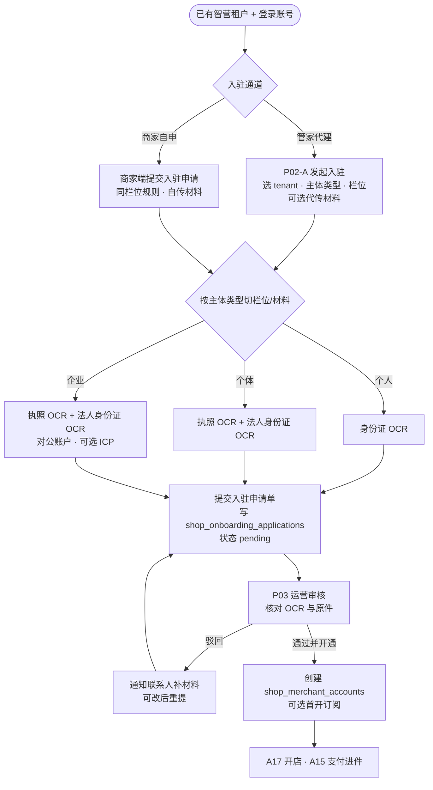
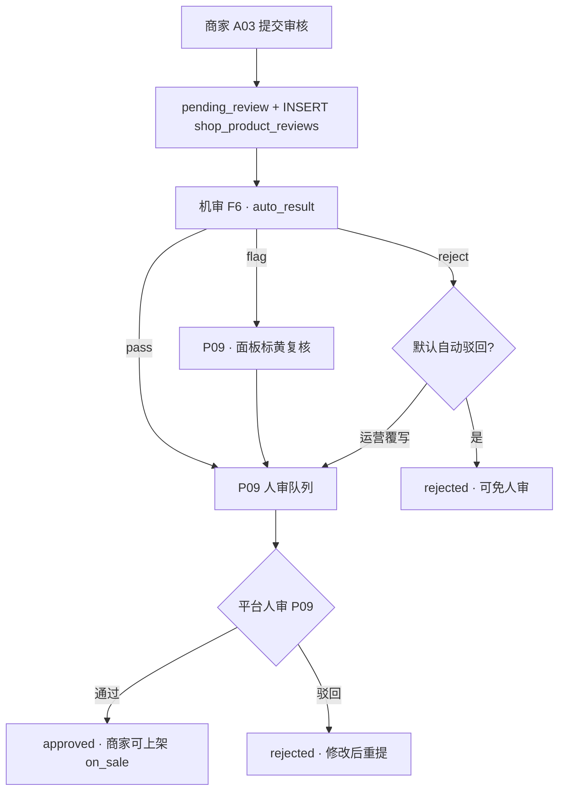

# 智营获客 · 内容获客商城 Phase 1 产品需求文档（PRD）

> 文档基线：Phase 1 交易层（Alembic 098–101 入驻 M0 ✅；仓库 head **103**；交易主干自 **104+**）｜状态：🚧 开发中｜更新日期：2026-08-12  
> 配套可视化：[index.html](./index.html)（平台 P01–P12 · 商家 A01–A23 · 买家 M01–M15）  
> 执行计划：[内容获客平台-执行计划 v2.0](../../02-执行计划/内容获客平台-执行计划.md)（一步一验 · 严格用例）  
> 来源：[内容获客平台方案摘要](../../00-总览/内容获客平台方案摘要.md)、[功能实施清单](./内容获客平台_功能实施清单.md)  
> 状态图例：✅ Phase 1 交付目标｜⏳ Phase 2+｜🚫 本 Phase 不做

## 一、目标与边界

**定位**：「AI 内容工厂 + 交易闭环 + CRM」三位一体中的 **交易层首期**。

**实体层级**：**平台** → **商家（三类主体入驻）** → **店铺（可多店）** → **商品/订单**。套餐在 **P10 灵活配置**，商家已购权益按 **生效起止时间** 管理（**P11**）。

**Phase 1 做**：多店模型 + P10/P11 + 三类主体入驻 + 交易闭环。  
**Phase 1 不做**：商家自助购套餐、剩余天数折算（Phase 2）。验收期可由 P11 人工开通 `basic`。

### 1.1 Phase 1 范围总表（A1 / P1 / 🚫）

> 与 [功能实施清单](./内容获客平台_功能实施清单.md) 同步；**验收对照**见 [§九 验收与测试](#九验收与测试)。

| 类别 | 编号 | 功能项 | Phase 1 | 线框 / API | 备注 |
|------|------|--------|---------|------------|------|
| AI×商城 | **A1-01** | 创作成果复用导出 | ⏳ 可选 | 创作顾问导出 | 非 Mx 硬验收；可粘贴 A03 详情 |
| 平台 | **A1-02** | 平台运营端 P01–P12 | ✅ 目标 | [06-平台端UI](./06-平台端UI.html) · §8.1–8.4 | 含 P10/P11/P12 |
| 交易 | **P1-01** | 商品类型模型 | ✅ | A02/A03 · §8.8 | course/digital/service |
| 内容 | **P1-02** | 专栏/课时 | ✅ | A04/A05 · §8.8.2 | tenant 隔离 |
| 内容 | **P1-03** | 数字资料包 | ✅ | A06 · §8.8.2 | 下载履约 M09 |
| 履约 | **P1-04** | 服务预约/次数卡 | ✅ | A07/A08 · §8.10 | 核销扣次 |
| 用户 | **P1-05** | 买家/enrollment | ✅ | A11 · §8.10 | 禁止硬映射 CRM Contact |
| 交易 | **P1-06** | 统一权益状态机 | ✅ | A12 · §8.9/8.10 | F2 退款关权益 |
| 交易 | **P1-07** | 订单与支付 | ✅ | A09/A10 · §8.9 | M3 硬验收 |
| 交易 | **P1-08** | 退款撤销权益 | ✅ | F2 · §8.9 | 退款后不可履约 |
| 私域 | **P1-09** | 小程序履约端 | ✅ | M06–M10 · §8.12 | 学课/核销/已购 |
| 内容 | **P1-10** | 视频播放/试看 | ✅ | M07/M08 · §8.12 | 续播/倍速 |
| 公域 | **P1-11** | 抖音 Mx · 链路 ① | ✅ | A14/F3 · §8.11 | 抖店付→领权→履约 |
| 公域 | **P1-11b** | 抖音 Mx · 链路 ② | ⏳ M8 | F3b · §8.11.2 | 与 ① 二选一先通 |
| 私域 | **P1-12** | 领权短信 | ✅ | A15/A09 · M14 | 公域进自有端 |
| 管理 | **P1-13** | Web 商家管理端 | ✅ | A01–A23 | 商品/订单/买家/权益/公域设置 |
| 数据 | **P1-14** | 交易看板 | ✅ | A01 · §8.15.1 | 下钻 A09 等 |
| 经营 | **P1-15** | 营客台桥接 | ⏳ 可选 | §3.6 | 非强制 |
| 获客 | **P1-16** | IP 获客演示包 | ✅ 目标 | [index §P1-16](./index.html#p1-16-demo) · §9.3 | CTA→挂载→下单脚本 |
| 交易 | **P1-17** | C 端发票申请 | ✅ | M13/A13 · §8.10 | 抬头/税号 |
| 私域 | **P1-18** | 买家订单中心 | ✅ | M11/M12 · §8.12 | 与已购分离 |
| 合规 | **P1-19** | 商品上架闸 | ✅ | P09/A02 · §四 | 机审+人审 |
| 公域 | **P1-20** | 公域挂载闸 | ✅ | A14/F7 · §8.11 | 未过审不可同步 |
| 合规 | **P1-21** | 商品合规审计 | ✅ | P09 · §8.8.3 | 驳回原因留痕 |

**本 Phase 明确不做（🚫）**：

| 项 | 说明 |
|----|------|
| 🚫 商家自助购套餐 | 无收银台；续费/换档走 P11 人工或管家 P02-B-R |
| 🚫 套餐剩余天数折算 | Phase 2 `proration` |
| 🚫 商家端原生 App | Phase 1 仅 Web（A21/A22 为智营主站 Auth，非店后台 App） |
| 🚫 买家端 H5 独立站 | Phase 1 买家仅微信小程序（M01–M15） |
| 🚫 自定义商家 role code | A16 仅内置模板微调勾选 |
| 🚫 撤销核销 | A08 Phase 1 不支持 |
| 🚫 发票冲红全流程 | 已开票退款仅标 `needs_red_flush`（Phase 2） |
| 🚫 实物/门店 SKU | `shop_products.type` 扩展 Phase 2+ |
| 🚫 创作顾问→商品草稿自动导入 | A03「从创作顾问导入」Phase 2；**Phase 1 按钮灰显不可点**（见 [A03](./01-管理端UI.html#a03)） |
| 🚫 公域四链路全组合 | Mx 先通 ① **或** ② 一条；路径 A/B 与链路独立但验收期择一 |
### 1.2 Phase 1 闭环边界声明（已知开放边）

> 对照 [业务与数据闭环分析](./21-PRD-Phase1-业务与数据闭环分析.md)。下列项**不阻塞 Mx 交易验收**，但实现与验收须对齐边界，避免误判为缺陷。

| 类别 | 边界 | Phase 1 做法 | 后续 |
|------|------|--------------|------|
| 套餐资金流 | 商家→平台 B2B 购套餐 | 线下对公 + P11 人工开通；系统外收款，靠备注勾稽 | Phase 2 自助购 |
| 平台→商家结算 | P05 清结算 | UI/API/权限 + **F10 数据模型**；批次 T+1 生成，打款人工确认 | 自动分账对接 |
| 公域退款 | 抖店/课程库 refund 事件 | Webhook `event=order.refund` → 同 **F2** 关权（§8.11） | — |
| 发票冲红 | 已开票后退款 | F2 仅标 `needs_red_flush=true`；**红冲人工线下** | Phase 2 全流程 |
| 买家身份 | 私域 openid / 公域 mobile / 课程库 openid | **mobile 归一** + openid 绑定（§3.2 · 04 `#b`） | 跨 tenant 合并 Phase 2 |
| 机审 | F6 上架闸 | 六类规则 + 聚合逻辑；**Phase 1 可 stub 全 flag**（见 [§四 #f6-auto-rules](./PRD-内容获客商城-phase1.md#f6-auto-rules)） | 规则引擎增强（ASR/画面） |
| 公域链路 | Mx 验收 | **先通链路 ① 或 ② 一条**；路径 A/B 其余组合 Phase 2 | §3.5 |

**真·数据断点（本版已补文档）**：① 公域 refund→F2（§8.11）；② 结算表 + F10（04 / 03）；③ 买家身份归一策略（04 `#b`）。

## 二、商家主体 · 店铺 · 套餐 · 订阅

### 2.1 商家主体类型（要区分）

| entity_type | 中文 | 典型材料 | 说明 |
|-------------|------|----------|------|
| `personal` | 个人 | 身份证 | 限额更严；部分套餐不可购（P10 配置） |
| `individual_business` | 个体工商户 | 执照 + 法人身份证 | 可对公/法人收款 |
| `enterprise` | 企业 | 执照 + 对公 + 类目资质 | 完整 B 端能力 |

入驻审核 **P03** 按类型展示不同材料项；支付进件路径随主体变化。注册与入驻字段映射见 **§2.1.0**；**登录后落点与页面壳**见 **§2.1.0a**；入驻流程与栏位见 **§2.1.1**。

### 2.1.0 智营主站注册 → 商城入驻（字段映射）

**两层分离**（见 [index 入驻流程图](./index.html)）：**注册** = 办智营会员卡（`tenant` + 企业 admin）；**入驻** = 办商城开店许可证（`shop_onboarding_applications` → `shop_merchant_accounts`）。注册页**不**收集证照、主体类型、商城字段。

**主站注册页**（`apps/web/src/views/Register.vue` · `POST /auth/register`）：

| 注册页字段 | 落库 | 含义 |
|------------|------|------|
| **昵称** | `users.display_name` | **系统显示名**（团队、负责人、超管用户列表「昵称」列）；≠ 商城商家 `display_name`；≠ 证照 `legal_name` |
| 登录手机号 | `users.phone` | 登录凭证；亦作重要通知默认手机 |
| 密码 | `users.hashed_password` | 登录密码 |
| 工作台名称 | `tenants.name` | 团队/工作台识别名；≠ 执照名 `legal_name` |

**唯一性校验**（注册提交时）：

| 字段 | 平台唯一 | 校验规则 | 失败提示 |
|------|:--------:|----------|----------|
| 昵称 | **否** | ≥2 字 | 「昵称至少 2 个字符」 |
| 登录手机号 | **是** | 11 位、未注册 | 「手机号已注册」 |
| 工作台名称 | **是** | ≥2 字、`tenants.name` 不重复 | 「工作台名称已存在」 |
| 密码 | — | ≥8 位 | 「密码至少 8 位」 |

> **说明**：昵称仅团队内展示，允许多人同名；工作台名称用于租户识别与商城入驻默认展示名，须全平台唯一。`tenants.industry_code` **不在注册页展示**，服务端默认 `finance`（行业模板可在设置中修改）。

注册成功后：`create_tenant_with_admin` → 当前用户为 tenant **企业 admin**（`memberships`）。

**昵称维护**（`users.display_name`）：

| 场景 | 谁可改 | 页面 / API（规划） |
|------|--------|-------------------|
| 注册 | 本人 | `Register.vue` → `POST /auth/register` |
| 本人修改 | 本人 | **设置 → 我的账号**（[`S-ACCOUNT`](./01-管理端UI.html#s-account) · `PATCH /auth/me`） |
| 管理员改成员 | 企业 admin | 设置 → 角色与成员（已有 `SettingsTeam`） |
| 平台超管 | 超管 | 用户管理（`AdminUsers`「昵称」列） |

**S-ACCOUNT · 我的账号（线框 · Phase 1.1）**

入口：侧栏头像 / 设置中心首卡「我的账号」→ `/settings/account`（全员可见，无需额外权限码）。

```
┌─ 我的账号 ─────────────────────────────┐
│ 昵称 *        [ 李老师____________ ]    │  ← users.display_name
│ 登录手机号     138****8000  （只读）     │  ← 换绑走验证流程 Phase 2
│ 修改密码       [ 去修改 ]               │
│                                        │
│ [ 保存 ]  [ 取消 ]                      │
└────────────────────────────────────────┘
```

保存昵称后：团队列表、负责人下拉、内容作者名等即时更新；**不自动**改写已提交的商城入驻单 `contact_name`（仅影响后续新申请默认值）。

**注册 → 商家自申入驻（A20）默认带出**：

| 入驻字段 | 商家自申默认值 | 可改 | 运营代建 P02-A |
|----------|----------------|:----:|----------------|
| `tenant_id` | 当前登录 tenant（隐式） | — | 搜索选择已有 tenant；**管家仅可选运营预分配给自己的 tenant** |
| `contact_name` | `users.display_name`（**昵称**） | ✓ | 填客户联系人，≠ 平台登录用户 |
| `contact_mobile` | `users.phone` | ✓ | 填客户手机，≠ 管家手机 |
| `display_name`（商家展示名） | `tenants.name` | ✓ | 手工填写 |
| `legal_name` | —（须证照 OCR/手填） | ✓ | 同左；**不**从 `tenants.name` 自动写入 |
| `unified_social_credit_code` | `tenants.credit_code`（若已填）只读预填 | ✓ | 同左 |
| `initiator` | `merchant_self` | — | `ops_assisted` + `operator_id` |

**动线**（详图见 **§2.1.0a**）：注册成功 → Dashboard 横幅「开通内容获客商城」→ [A20 入驻申请](./01-管理端UI.html#a20) → 提交 `pending` → [P03](./06-平台端UI.html#p03) 审核。

**A20 API 契约**：见 **§8.5**（`GET /shop/onboarding/status` · 提交/重提）。

**操作页线框**：[A21 登录](./01-管理端UI.html#a21) · [A22 注册](./01-管理端UI.html#a22) · 商家自申 [A20](./01-管理端UI.html#a20) · 运营代建 [P02-A](./06-平台端UI.html#p02a)。

### 2.1.0a 登录注册与页面动线（智营工作台 vs 商城商家后台）

> **产品决策**：注册/登录**仍进智营工作台**（`/dashboard`），**不**在注册页收集商城资质；「能卖课开店」须单独走 **A20 入驻** → **P03 审核**。商城经营后台（A01–A19）为**独立侧栏壳**，与 CRM/创作工作台并列，非替代关系。

#### 以前 vs 现在

| | 商城模块上线前 | Phase 1 设计 |
|---|----------------|--------------|
| **注册** | 创建账号 + 工作台 → 直接用 CRM/创作 | **不变**：`tenant` + 企业 admin |
| **登录后默认落点** | `/dashboard` 智营工作台 | **不变**：默认仍 `/dashboard`，**不是** A01 交易看板 |
| **开店卖课** | 无 | **新增**：A20 入驻 → P03 审核 → `shop_merchant_accounts` |

#### 完整用户动线

```mermaid
flowchart TB
  subgraph auth [智营主站 · 无侧栏 AuthLayout]
    A22[A22 注册 /register]
    A21[A21 登录 /login]
  end

  subgraph workspace [智营工作台 · AppLayout 现有]
    DASH[/dashboard 工作台]
    BANNER[入驻引导横幅]
    A20[A20 入驻申请]
    A20P[审核中 / 已驳回]
  end

  subgraph shop [商城商家后台 · ShopLayout 新建]
    A01[A01 交易看板]
    A17[A17 开店]
    BIZ[商品 / 订单 / 核销 …]
  end

  A22 -->|自动登录| DASH
  A21 -->|默认| DASH
  A21 -->|platform_admin| ADMIN[/admin]
  A21 -->|多 tenant| SELECT[/select-tenant]
  DASH --> BANNER
  BANNER --> A20
  A20 -->|pending| A20P
  A20P -->|P03 通过| A01
  A01 --> A17
  A17 --> BIZ
```

#### 三层页面壳

| 壳 | 布局组件（规划） | 路由前缀 | 页面范围 | 侧栏 |
|----|------------------|----------|----------|------|
| **Auth** | 无侧栏 auth 页 | `/login` · `/register` · `/forgot-password` | A21 · A22 | 无 |
| **智营工作台** | `AppLayout`（✅ 已有） | `/` · `/dashboard` · `/crm/*` · `/create` … | 创作 · CRM · 知识库 · 设置 | 现有智营菜单 |
| **商城商家后台** | `ShopLayout`（📋 待建） | `/shop/*` | A01–A19（A20 入驻在智营壳内） | 概览 · 商品 · 订单 · 设置 … |

**壳间切换**：智营侧栏增加「内容获客商城」入口（已入驻且有权时）；商城顶栏提供「返回智营工作台」。未入驻时智营侧栏显示「开通商城」→ A20。

#### 登录 / 注册（A21 / A22）

- 实现对照：`apps/web/src/views/Login.vue` · `Register.vue`
- **无侧栏**；页脚须明示：**「注册 ≠ 商城入驻」**（开通商城须在入驻流程提交主体资质，平台审核）
- 登录成功落点（与现网一致）：

| 条件 | 落点 |
|------|------|
| `platform_admin` | `/admin` |
| 多 tenant 待选 | `/select-tenant` |
| 默认 | `/dashboard`（可展示入驻横幅，**不**直跳 `/shop`） |

注册成功：`POST /auth/register` → 自动登录 → `/dashboard`（**不**直跳商城后台）。

#### 登录后第一站：智营 Dashboard

用户首屏仍为 **智营工作台**（内容统计、CRM 快捷入口、待办等），**不是** A01 交易看板。按入驻状态叠加引导：

| `onboarding_status` | Dashboard 表现 | 侧栏 |
|---------------------|----------------|------|
| `not_onboarded` | 顶部渐变横幅「开通内容获客商城」+「立即申请」→ A20 | 「开通商城」 |
| `reviewing` | 横幅「入驻申请审核中」（只读，可查看详情） | 同上 |
| `rejected` | 红色提示 + 驳回原因 +「修改重提」 | 同上 |
| `active`（已入驻） | **隐藏**入驻横幅 | 「内容获客商城」→ `/shop/dashboard` |

**入驻入口（三处，PRD 统一）**：

1. Dashboard 横幅（A20-0，见 [01-管理端UI.html#a20-banner](./01-管理端UI.html#a20-banner)）
2. 智营侧栏「开通商城」（未入驻时）
3. 注册成功页底部引导（仍落 `/dashboard`，由横幅承接）

状态数据源：`GET /shop/onboarding/status`（§8.5）。

#### A20 入驻申请（智营壳内）

- 路由（规划）：`/shop/onboarding`（全页或大抽屉；**仍在 AppLayout**，非 ShopLayout）
- 栏位与 [P02-A](./06-平台端UI.html#p02a) 同源；**无「关联租户」**（隐式当前 `active_tenant_id`）
- 默认带出见上表 §2.1.0「注册 → 商家自申入驻」；`legal_name` **须**证照 OCR/手填，**不**从工作台名称自动写入
- 子态页面：

| 子页 | 条件 | 交互 |
|------|------|------|
| A20 表单 | 未提交（**无草稿态**；未落库） | 提交 · 取消 |
| A20-P 审核中 | `status=pending` | 只读（文案「审核中」） |
| A20-R 已驳回 | `status=rejected` | 展示原因 · 修改重提 |

> **与 04 对齐**：`shop_onboarding_applications.status` 仅 `pending` / `approved` / `rejected`；提交即 `pending`。管家代建 P02-A 同样无「保存草稿」。

已入驻用户**隐藏** A20 入口，改走 A17（开店）/ A18（套餐）。

#### 入驻通过后：商城商家后台（A01–A19）

独立 **ShopLayout** 侧栏（线框见 [01-管理端UI.html#a01](./01-管理端UI.html#a01)）：

| 侧栏分组 | 页面 |
|----------|------|
| 概览 | **A01** 交易看板（商城首页，≠ `/dashboard`） |
| 商品 · 内容 · 资料 · 服务 | A02–A07 |
| 核销台 | A08（`shop_clerk` 角色仅此菜单） |
| 订单 · 买家 · 权益 · 开票 | A09–A13 |
| 公域对接 | A14 |
| 店铺管理 | A17（多店；顶栏切 `shop_id`） |
| 设置 | A15 支付 · A18 套餐 · A19 单店 · A16 角色与成员 |

顶栏：**当前店铺** ▾ · 套餐档位 · 当前角色。首次入驻后引导：**A17 创建第一家店** → A02/A03 上架商品。

#### 前端路由规划（`apps/web`）

| 路由 | 壳 | 页面 | 状态 |
|------|-----|------|:----:|
| `/login` | Auth | A21 | ✅ |
| `/register` | Auth | A22 | ✅ |
| `/dashboard` | AppLayout | 智营工作台 + 入驻横幅 | ✅ 工作台；📋 横幅 |
| `/shop/onboarding` | AppLayout | A20 入驻 | 📋 |
| `/shop/dashboard` | ShopLayout | A01 交易看板 | 📋 |
| `/shop/products` … | ShopLayout | A02–A19 | 📋 |

API 前缀与前端路由对应：商家 API `/api/v1/shop/*`（§8.0）；前端 `/shop/*` 为 SPA 路由，**非** API 路径。

#### 设计要点（避免混淆）

1. **两个「工作台」**：智营 `/dashboard` = AI 营销 + CRM；商城 `/shop/dashboard`（A01）= 交易看板。文案与埋点须区分。
2. **注册成功不直跳商城后台**：多数用户尚无主体资质，应先见横幅引导入驻。
3. **店员 `shop_clerk`**：登录后仅见核销台（A08），不进智营 CRM 菜单。
4. **商家完整后台仅 Web**（对标小鹅通/有赞 PC 管理台）；H5 仅 A21-H/A22-H 登录注册线框，**不做**完整店后台 H5（Phase 2 可选店员轻量 H5）。

### 2.1.1 商家入驻流程（双通道 · OCR · 字段）

**前置**：须已有智营 `tenant` + 可登录账号（**不在入驻单里新建账号密码**）。企业 admin 登录商家端；经营联系人手机仅用于通知补材料。

**流程图**（技术详图见 [03-数据流.html#f0](./03-数据流.html#f0)）：



#### 流程说明

| 步骤 | 谁 | 页面 | 写库 / 状态 |
|------|-----|------|-------------|
| 1 前置 | 智营主站 | 注册/邀请 | 已有 `tenant`；`users` + `memberships`（企业 admin） |
| 2 发起 | 运营 | P02-A | `shop_onboarding_applications`；`initiator=ops_assisted` |
| 2′ 发起 | 商家 admin | **A20** 入驻申请 | 同上；`initiator=merchant_self` |
| 3 上传 | 运营/商家 | P02-A / 商家端 | 证件图 → **OCR 预填** → 人工可改 |
| 4 提交 | 管家/商家 | — | `status=pending`；P02 入驻状态 → `reviewing` |
| 5 审核 | 运营 | P03 | 通过 → 建 merchant + 订阅；驳回 → `rejected` + 通知 |
| 6 入驻后 | 商家 | A17 / A15 | 开店；支付进件见 **§8.7.3**（材料规则同主体类型） |

**名称约定**（三者不同，勿混用）：

| 字段 | 表 / 来源 | 含义 | 维护时机 |
|------|-----------|------|----------|
| `legal_name` | `shop_merchant_accounts` / 申请单 | **主体名称**（个人=姓名；个体/企业=执照名） | 入驻申请；审核通过写入 merchant |
| `display_name` | 申请单 → merchant | **商家展示名**（列表/运营看到的品牌名，可≠执照名） | 商家自申默认 `tenants.name`；运营代建手工填写 |
| `shop_stores.name` | 店铺表 | **店铺名称**（买家看到的店名） | 入驻后 **A17** 开店 |

**代表人与账号**：

| 概念 | 说明 |
|------|------|
| 法定代表人 | 个体/企业必填；材料含法人身份证；OCR 识别姓名/证号 |
| 经营联系人 | `contact_name` + `contact_mobile`；收短信/站内通知；可与法人不同 |
| 登录账号 | 复用智营 `users`；tenant 的 **企业 admin** 经营商家端；**不在 P02-A 设密码** |

#### P02-A / 商家自申 · 栏位（按主体类型显隐）

**公共栏位**（三类均有）：

| 字段 | 必填 | 说明 |
|------|:----:|------|
| `tenant_id` | ✓（P02-A） | 搜索已有智营租户；不可选已入驻 / 有待审单；**管家**（`list_assigned`）仅可选 <code>shop_tenant_prospect_assignments.account_manager_user_id=本人</code> 的 tenant；**超管/运营**（`list_all`）可选全站未入驻 tenant |
| `entity_type` | ✓ | `personal` / `individual_business` / `enterprise` |
| `legal_name` | ✓ | 主体名称；可从 tenant 企业信息预填，须与执照/身份证一致 |
| `display_name` | ✓ | 商家展示名；商家自申默认 `tenants.name`，可改；运营代建须手工填写 |
| `contact_name` | ✓ | 经营联系人姓名 |
| `contact_mobile` | ✓ | 11 位手机；通知补材料 |
| `remark` | — | 运营代建备注 |

**按类型追加**：

| 字段 | 个人 | 个体 | 企业 |
|------|:----:|:----:|:----:|
| `id_no` | ✓ | — | — |
| `unified_social_credit_code` | — | ✓ | ✓ |
| `legal_rep_name` | — | ✓ | ✓ |
| 身份证正反面（材料） | ✓ | 法人证 | 法人证 |
| 营业执照（材料） | — | ✓ | ✓ |
| 手持照 | 可选 | — | — |
| 对公账户信息 | — | 可选 | ✓ |
| ICP / 类目资质 | — | 按类目 | 按类目 |

选 tenant 后：若智营「设置 → 企业信息」已有 `credit_code` / 公司名，**只读预填**到 `legal_name`、信用代码；提交仍以证照 OCR/上传为准。

#### 资质 OCR（Phase 1 ✅）

上传证件图后调用 OCR 服务，**预填表单**；用户可修改后再提交；P03 审核展示「识别值 vs 填写值」。

| 证照类型 | OCR 识别字段 | 预填目标 |
|----------|-------------|----------|
| 身份证正面 | 姓名、身份证号、地址 | `legal_name`（个人）/ `legal_rep_name`（法人证）、`id_no` |
| 身份证反面 | 签发机关、有效期限 | `qualification_files` 元数据；过期告警 |
| 营业执照 | 名称、统一社会信用代码、法人、住所、经营范围 | `legal_name`、`unified_social_credit_code`、`legal_rep_name` |

**交互规则**：

1. 上传即触发 OCR；loading 态；失败 toast「识别失败，请手动填写或重新拍照」
2. OCR 结果写入 `ocr_results` JSONB（含 `doc_type`、`confidence`、`raw`、`mapped_fields`）
3. 低置信度（如 &lt;0.85）字段标黄，提交前须人工确认勾选
4. 运营 P03 审核面板：展示原图缩略图 + OCR 字段；与填写值不一致时高亮
5. **不自动通过**：OCR 仅辅助填表，资质闸仍须人审 P03

**API 约定**：完整契约见 **§八 Phase 1 API 契约**（含平台 P02/P03/P11、商家 A20）；OCR 摘要如下：

- `POST /shop/onboarding/ocr` · `POST /admin/shop/onboarding/ocr`：`doc_type`（`id_card_front` | `id_card_back` | `business_license`）+ 图片 `file_id`
- 响应：`fields` + `confidence`（Phase 1 可为 stub）；不落库，前端合并进申请表单
- 提交申请时把 `ocr_results` 一并写入 `shop_onboarding_applications`

**操作页线框**：[06-平台端UI.html#p02a](./06-平台端UI.html#p02a)（运营代建 · 三类切换）· [01-管理端UI.html#a20](./01-管理端UI.html#a20)（商家自申 · 默认带出注册信息）· [P03](./06-平台端UI.html#p03)（审核含 OCR 对照）

### 2.2 层级

```
平台
  └── 商家 merchant（主体类型 + 资质）
        ├── 订阅 subscriptions（可多条 active，可叠加；effective_at ～ expires_at）
        └── 店铺 stores（1…N，受合并后配额限制）
              └── 商品 / 订单（shop_id）
```

### 2.3 套餐灵活配置（P10）

- **功能字典** `shop_plan_features`：平台维护<strong>分组树 + 叶子功能</strong>（参考小鹅通套餐按模块折叠勾选）：
  - **功能分组**（`node_type=group`）：父节点，仅目录；可嵌套一层（Phase 1 建议仅根分组 → 子功能）
  - **子功能**（`node_type=leaf`）：实际权益项，须挂 `parent_id`；分三类数值形态：
  - **开关型**（`bool`）：合并模式 `any`（任一套餐开通即生效）
  - **存量配额**（`int` / `unlimited`）：合并模式 **`max` 或 `sum`**（P10 按功能项配置，如店铺数常取 max、商品槽位可取 sum 加购）
  - **周期次数**（`usage`）：合并模式 **`max` 或 `sum`**（如每日提审、每月短信；加购包常用 sum）
- **套餐模板** `shop_subscription_plans`：`stackable`（可否与其他套餐并存）、`replace_group`（主套餐换档互斥组）、`quotas` + `features` + `usage_limits`
- 除 free/basic/flagship 外，可配置 **加购包**（`addon_*`，`stackable=true`）

### 2.3.1 多套餐叠加与权益合并

- 商家可同时拥有 **多条 active 订阅**（主套餐 + 加购包，或不同品类加购）
- **`purchase_mode=stack`**：叠加，旧订阅继续有效
- **`purchase_mode=replace`**：同 `replace_group` 内换档（如 basic→flagship），旧条 `superseded`
- 校验/API 统一调用 **`merge_entitlements(active_snapshots)`**，按各功能项 `aggregate_mode` 合并后再比配额与次数

| aggregate_mode | 适用 | 规则 |
|----------------|------|------|
| `any` | bool | 任一为 true → true |
| `max` | int / usage | 取最大值；出现 unlimited → unlimited |
| `sum` | int / usage | 各条相加 |

### 2.3.2 用量计数

- 表 **`shop_merchant_feature_usage`**：按 `tenant_id + feature_code + period_key` 累计（**多套餐共享同一计数池**）
- 上限 = 合并后的 `usage_limits`；业务前走 **F9**
- **A15 / P11** 展示 merged 结果；支付与套餐分页

示例：基础版（20 次/日提审）+ 提审加购包（+10）→ **30 次/日**（sum）；基础版（3 店）换档旗舰版 → **不限店**（max + unlimited）

### 2.4 已购权益与时间段（P11）

每条 `shop_merchant_subscriptions` 独立记录生效区间；**有效能力 = 全部 active 条合并**。

- **叠加购**：`purchase_mode=stack`，列表可见多条生效中
- **换档**：`purchase_mode=replace`，同 `replace_group` 旧条 superseded
- **单条到期**：仅该条失效，合并结果重算；全部到期回落免费版
- **查看**：单商家合并权益 → **P02-B 当前权益** + 商家 **A18** 只读；跨商家订阅流水 → **P11 订阅台账**（不展示合并权益面板）；支付 **A15** 独立配置

#### 2.4.0 P02 商家 vs P11 订阅台账（边界）

| 维度 | P02 商家 | P11 订阅台账 |
|------|----------|--------------|
| 列表粒度 | 1 行 = 1 个 `tenant` | 1 行 = 1 条 `subscription`（同商家可多行） |
| 核心职责 | 租户主数据、入驻状态、管家、标签、**套餐健康度摘要** | 跨商家订阅流水、待处理续费作业台、财务对账 |
| 合并权益 / 用量 | **P02-B 当前权益**（权威） | **不展示**（商家列链 P02-B） |
| P02 列表套餐操作 | **仅「当前权益」**（即将到期/已到期同生效中）；续费/重开/换档不进列表 | — |
| 通用人工开通 | 不在 P02 列表提供 | P11 顶栏 **P11-A** |

线框：[06 #p11-vs-p02](./06-平台端UI.html#p11-vs-p02)

#### 2.4.1 套餐到期 · 平台端展示（P02 / P11）

**策略（Phase 1）**：全部订阅到期后**回落免费版**（软降级），不做有赞式整站打烊；商家端按合并额度禁用按钮（见 A18）。

**入驻状态**与**套餐健康度**在 P02 **分列**，互不替代：

| 套餐状态 | 判定 | P02 展示 | 运营动作 |
|----------|------|----------|----------|
| 生效中 | ≥1 条 active 且最晚到期 >30 天 | 绿色 badge | **当前权益** → P02-B |
| 即将到期 | 最晚到期 ≤30 天 | 权益至「剩 N 天」；≤7 天红色 + 行浅黄底 | **当前权益** → P02-B；写操作在 P02-B / P11 |
| 已到期 | 无 active 订阅 | 灰色「已到期」；套餐列「免费版（已到期）」 | **当前权益** → P02-B；重开/续费在 P02-B 或 P11 |
| — | 未入驻 / 审核中 | — | 按入驻矩阵 |

**快捷 Tab**：全部 · 我的客户 · 待审入驻 · 即将到期 · 已到期 · 已暂停（与 P01 指标卡下钻联动）。

#### 2.4.2 商家管家（`platform_shop_cs`）

平台侧**客户成功 / BD**角色，负责所辖商家的入驻协助与续费跟进：

| 项 | 说明 |
|----|------|
| 数据范围 | [`platform.shop.merchant.list_assigned`](05-角色权限.html#perm-platform-shop-merchant-list_assigned) → 已入驻商家 `account_manager_user_id = 本人`；**未入驻** tenant 须先经运营 **P02-E 预分配**（`shop_tenant_prospect_assignments`）后方可在 P02-A 搜索与「我的客户」可见 |
| 默认能力 | 商家查看与跟进写（`merchant.read`）、发起入驻（**仅预分配 tenant**）、订阅只读、P02-B 服务记录 |
| 不做 | 入驻审核、暂停/恢复、P11 写开通（无 [`platform.shop.subscription.manage`](05-角色权限.html#perm-platform-shop-subscription-manage)） |
| 续费跟进 | 无 P11 写权限时，从 **P02-B 当前权益 / 服务记录** 提交 [P02-B-R](./06-平台端UI.html#p02b-renewal)（**P02 列表不设续费/重开按钮**，仅角标「续费申请中」）；写 `shop_merchant_service_logs`，通知具备 [`subscription.manage`](05-角色权限.html#perm-platform-shop-subscription-manage) 的运营 |
| 服务记录 | [P02-B Tab](./06-平台端UI.html#p02b-service) 时间线：跟进、入驻协助、续费申请及结案 |
| 分配 | [`platform.shop.merchant.assign`](05-角色权限.html#perm-platform-shop-merchant-assign) 由超管/日常运营在 **P02-E** 指定；**未入驻** tenant 预分配后管家方可在 P02-A 搜到；P03 通过时可默认审核人=管家 |

#### 2.4.2b P02-E 改派后流程归属

**原则**：`account_manager_user_id` 只表示**当前负责管家**（数据范围 + 新跟进），**不回写**历史记录的 `operator_user_id` / 入驻单 `operator_id`。流程实例挂在**商家 tenant**，不挂在管家账号上迁移。

| 类别 | 流程 / 数据 | 改派后处理 | 原管家 | 新管家 |
|------|-------------|------------|--------|--------|
| **已完结** | 服务记录（跟进 `logged`、续费 `completed`/`cancelled`） | **不变**；时间线仍展示原操作人 | 失去 `list_assigned` 后**不可再查看**该商家 | 可**只读**查看全部历史 |
| **已完结** | P11 已开通订阅、P02-B 操作日志、已审出入驻单 | **不变** | 同上 | 只读 |
| **在途** | `renewal_request` · `pending`/`processing` | **不取消、不改申请人**；仍由运营 P11 结案 | 待办从「我的客户」消失；**不可**再打开该商家详情 | **继承可见**；P01「续费申请中」+1；可查看、写跟进催促；**不可**代原管家撤单（须运营 `subscription.manage` 取消） |
| **在途** | P03 入驻审核 · `pending` | **继续审**；与当前管家解耦（审核权 `approve`） | 若为自己代发起，审核中 tenant 仍可能在其「我的客户」（`reviewing` 规则）直至改派 | 未入驻预分配改派后，新管家可见 tenant 并代发起/跟进 |
| **在途** | P02-A 已提交待审单 | 申请单**不撤回**；`operator_id` 保持代发起人 | 审核完成前仍可在 P03 看到自己发起的单（`list_assigned`+自发起规则） | 通过后 `account_manager` 以 merchant 上**当时**管家为准 |
| **在途** | 商家 `suspended` / 订单积压 / P07 稽查 | 与管家无关，**不因改派变更** | — | — |
| **侧效应** | P11 `pending_renewals` 待办 | 仍按**商家**聚合；运营侧**不变** | — | — |
| **侧效应** | 改派瞬间 | 写操作日志「分配管家」；**建议**自动补一条服务记录 `type=note`：「管家改派：A → B」 | — | 若有 pending 续费，**站内信**通知新管家接手（Phase 1 建议） |

**清空管家**（`account_manager_user_id=null`）：商家进入「未分配」池；在途流程同样**不取消**，仅双方管家都不可见（`list_all` 运营仍可见可再分配）。

线框矩阵：[06#p02e-handover](./06-平台端UI.html#p02e-handover) · [06#p02e-inflight-reject](./06-平台端UI.html#p02e-inflight-reject) · API：`POST /admin/shop/merchants/{tenant_id}/assign-manager`（§8.4，📋）。

#### 2.4.2c 在途驳回 / 取消处理

与 [§2.4.2b 改派](./PRD-内容获客商城-phase1.md#242b-p02-e-改派后流程归属) 交叉时的统一规则：

| 原则 | 说明 |
|------|------|
| **术语** | 续费申请等服务记录用 **`cancelled`（取消）**；入驻/商品/开票等用 **`rejected`（驳回）** |
| **历史归属** | `operator_user_id` / 入驻单 `operator_id` **不变**；仅终态与原因字段更新 |
| **通知管家** | 一律通知**取消/驳回时刻**的 `account_manager_user_id`（**非**原申请人）；未分配则仅运营 + 短信联系人 |
| **改派无关** | 驳回/取消**不因改派而撤销或重开**；改派只影响「谁接手后续跟进」 |
| **再发起** | 见下表「能否再发起」；须满足无新 `pending` 续费、商家非 `closed` 等 |

| 在途类型 | 入口 | 操作人 | 可驳/消状态 | 落库要点 | 通知 | 再发起 |
|----------|------|--------|-------------|----------|------|--------|
| **续费申请** `renewal_request` | P11 待办 / P11-A「取消申请」 | `subscription.manage` | `pending`；`processing` 须先「退回 pending」或开通结案 | `status=cancelled`；`payload_json.cancel_reason` ≥4 字；`cancelled_by`；`updated_at` | 当前管家 + 可选通知原 `operator_user_id` | 商家 `active` 且无 pending → **P02-B-R 重提**（新管家或原管家改派前提交的，均由**当前**管家跟进） |
| **续费** `processing` | P11-A「退回待处理」 | `subscription.manage` | 仅 `processing`→`pending` | 写 `status=pending` + 备注 | — | 继续 P11 结案或取消 |
| **续费** 清退联动 | `POST .../close` | 系统 | `pending`/`processing` | `cancelled`；`cancel_reason=merchant_closed` | 当前管家 | **不可**再提 |
| **入驻申请** `pending` | P03 子 Tab「驳回」 | `approve` | 仅 `pending` | `status=rejected`；`reject_code` + `reject_reason` ≥4 字 | 短信 `contact_mobile` + 站内信**当前**预分配管家 | tenant 无 pending → 商家 **A20-R 改材料重提** 或管家 **P02-A 新单**（未入驻） |
| **入驻** 已驳回 | A20-R / P02-A | 商家 admin / 管家 | `rejected`→新 `pending` | 新申请或 `PUT` 重提（§8.5）；`operator_id` 为**重提人** | 进 P03 待审 | — |

**管家改派后遇驳回/取消**：新管家在「我的客户」看到该商家 → 服务记录时间线只读原申请与取消原因 → 写跟进或协助客户重提；**不修改**已 `cancelled`/`rejected` 行的操作人字段。

**与运营「驳回」区分**：续费申请运营侧文案用「**取消申请**」（不写驳回），避免与 P03 入驻驳回混淆。

线框：[06#p02e-inflight-reject](./06-平台端UI.html#p02e-inflight-reject) · API：`POST .../renewal-requests/{log_id}/cancel`（§8.4）。

线框见 [P02](./06-平台端UI.html#p02) · [P08](./06-平台端UI.html#p08) · 权限见 [05-角色权限#platform](./05-角色权限.html#platform)。

**Phase 1 无独立「管家工作台」页（S4）**：`platform_shop_cs` 的全部操作落在 **P02 列表/详情**（发起入驻 P02-A、服务记录 P02-B、续费申请 P02-B-R）与 **P03 入驻协助只读**；P01「我的客户」指标卡下钻即所辖商家列表。Phase 2 可评估独立 CS 工作台。

#### 2.4.2a 商家客服（`shop_support` · S4）

商家 tenant 内置角色，**无独立会话/工单页**（Phase 2）。Phase 1 工作流：

| 能力 | 落点页面 | 说明 |
|------|----------|------|
| 订单处理/退款 | A09 · A10 | 与 `shop_admin` 共享列表；`shop_support` 无商品/店铺写权限 |
| 买家/权益查询 | A11 · A12 | 只读 + 退款/重发短信 |
| 开票 | A13 | 处理 M13 提交的申请 |
| 核销 | — | 一般由 `shop_clerk` 在 A08；`shop_support` 可选只读 |

配置入口：[A16](./01-管理端UI.html#a16) 启用内置角色并分配成员。与平台 `platform_shop_cs`（跨租户管家）**不同域**。

#### 2.4.3 套餐续费付费流程（Phase 1）

商家向平台购买/续费套餐（B2B）。**Phase 1 仅线下收款 + P11 人工开通**；**商家自助购套餐放 Phase 2**（届时商家可在 A18 在线下单支付，本流程仍保留作对公/大客户通道）。与 **A15 微信支付**（买家购课 C 端收款）无关。

| 步骤 | 角色 | 动作 | 系统落点 |
|------|------|------|----------|
| 1 | 商家管家 | 与客户确认续费意向、目标套餐与**续费金额**；填写 P02-B-R 并勾选「已与客户确认」 | — |
| 2 | 商家 | **线下付款**（常见为**对公转账**至平台收款账户；账户由商务/财务线下提供） | 系统外 |
| 3 | 商家管家 | 提交 [P02-B-R](./06-平台端UI.html#p02b-renewal) 申请续费；说明栏写明付款方式（如「客户走对公，请运营本周内 P11 开通」） | 写 `renewal_request`；通知 `subscription.manage` 运营；P11 待办 +1 |
| 4 | 运营 / 财务 | 核对到账（对公流水 / 合同 / 发票） | 系统外 |
| 5 | 运营 | [P11-A 处理续费申请](./06-平台端UI.html#p11a-renewal) 预填；运营备注「对公已到账 ¥x,xxx」；确认开通并结案 | 写 subscription；服务记录 `completed`；商家 A18 可见新权益 |

**付费场景对照**：

| 场景 | 付款方 → 收款方 | Phase 1 | 页面 |
|------|-----------------|---------|------|
| 套餐续费 / 换档 / 加购 | 商家 → 平台 | 线下对公 / 线下已收款 → P11-A / P11-B / P11-C | [P02-B-R](./06-平台端UI.html#p02b-renewal) · [P11-A 续费预填](./06-平台端UI.html#p11a-renewal) · [付费流程说明](./06-平台端UI.html#renewal-payment-flow) |
| 买家购课 / 下单 | 终端用户 → 商家 | 微信子商户在线支付 | [A15](./01-管理端UI.html#a15) |
| **商家自助购套餐** | 商家 → 平台 | **Phase 2** 在线支付；Phase 1 不可用 | 规划：商家 A18 |

**Phase 2 规划**：商家端 A18 增加「在线购买 / 续费」入口并对接平台收款；剩余天数折算、自助换档一并交付。Phase 1 验收不阻塞，统一走上表人工流程。

**P02-B-R 不收款**：抽屉转交续费/加购/换档诉求；须填写**应付金额**（`quoted_amount_cents`，**可编辑**，默认=标价，**允许 0**；0/议价须说明原因）；申请类型为 stack 加购时 UI 显示「加购金额」，落库字段相同。页内链接 [#renewal-payment-flow](./06-平台端UI.html#renewal-payment-flow)。

**P02-B-R 栏位**（续费 / 加购 / 换档共用同一抽屉，栏位来源见线框 [#p02b-renewal](./06-平台端UI.html#p02b-renewal)）：

| 栏位 | 来源 | 落库 | 规则 |
|------|------|------|------|
| 商家（只读） | P02-B 路由 `tenant_id` → `shop_merchant_accounts` | `merchant_id` / `tenant_id` | 展示 `display_name` + `legal_name`；标题同步 |
| 当前套餐（只读） | 优先 active 主套餐；否则最近已过期主套餐作「原套餐」；再无则仅免费版 | —（级联参考 `plan_code`） | **禁止笼统「无」**。① active：档位+剩余天；② 已到期有历史：`免费版（已到期）· 原×× · 已于止日到期`（可续费同档/升级重开，禁加购）；③ 从未付费主套餐：`免费版/尚未开通主套餐`（续费/升级/加购均禁用，走 P11） |
| 申请类型 | 用户选择（受套餐态约束） | `payload_json.application_kind` + `purchase_mode` | `renew_same` / `stack_addon` / `replace_upgrade`；切换时重算目标与金额；已到期禁 stack |
| 目标套餐 / 加购包 | P10 上架模板（按类型过滤；续费参照当前或原 `plan_code`） | `payload_json.target_plan_code` 等 | 与申请类型级联不可混选；选中后刷新标价与金额默认 |
| 预计生效区间 | **不落库**；UI 只读预览 | — | 按 `billing_period` 推算；管家不填；运营在 P11 确认 `effective_at`/`expires_at` |
| 套餐标价（只读） | P10 `price_cents` | `payload_json.catalog_price_cents` | 快照，仅供对照 |
| **续费金额 / 加购金额 / 换档金额** | 默认=标价；**用户可改** | `payload_json.quoted_amount_cents` | 必填；**≥0（允许 0）**；0 或≠标价须在说明写明原因 |
| 客户确认 | 用户勾选 | `payload_json.customer_confirmed` | 须 true |
| 说明 | 用户填写 | `content` | ≥4 字；付款方式、折扣原因等 |

#### 2.4.4 商家入驻状态变更（P02-C / P02-D）

> **注意**：本节为商家/店铺**状态变更**与联动规则；**支付进件**见 **§8.7.3 A15**，勿与本节混淆。

| 操作 | 权限 | 前置 | 写库 | 副作用 |
|------|------|------|------|--------|
| **暂停** P02-C | `platform.shop.merchant.manage` | `merchant.status=active`；原因 ≥4 字 | `status=suspended`；`shop_merchant_service_logs`（`type=status_change`） | 旗下 `shop_stores.status` 强制 `paused`（不可营业）；商家端不可登录；**订阅不自动取消** |
| **恢复** P02-D | 同上 | `merchant.status=suspended` | `status=active`；服务记录 | 店铺**不自动**恢复营业，须商家 A17 自行「恢复营业」 |

**暂停后各块联动控制**（以 `merchant.status=suspended` 为全局闸门；原则：阻断新经营与新交易，不撤销已购买家权益，不自动取消套餐）：

| 域 | 暂停后 | 恢复后 |
|----|--------|--------|
| **商家端** | 不可登录；session 鉴权失效 | 可登录；须 A17 逐店恢复营业 |
| **旗下店铺** | 全部 `shop_stores` → `paused` | 保持 `paused`，商家自行恢复 |
| **买家 · 新购** | M01～M04 不可访问/下单，展示「暂停营业」 | 店铺恢复营业后可购 |
| **买家 · 已购履约** | M06～M10 学课/领取/预约/核销**不受影响**（校验 entitlement，不校验店铺营业态） | 无额外操作 |
| **订单/退款** | 进行中订单不阻断；商家不可登录处理，恢复后自行处理 | 商家处理积压 |
| **商品/公域** | **不自动**下架或暂停映射；新链路在店铺层拦截 | 原上架商品自动可售 |
| **套餐订阅** | active 订阅继续，`expires_at` 倒计时；P11 写操作全禁 | 可 P11 开通/换档/续费 |
| **平台续费申请** | 不可新提 P02-B-R；pending 须先恢复再 P11 结案 | 可提交/结案 |
| **平台只读/跟进** | P02-B 详情可进；`merchant.read` 含跟进写（服务记录/续费申请）；分配管家、打标签另须对应权限 | 不变 |

与 **A17-B 单店暂停** 区别：商家暂停 = 全 tenant 关店 + 禁登 + 平台订阅写全禁。与 **closed 清退** 区别：暂停可恢复，订阅倒计时继续。

**暂停/恢复期间订单积压（S3）**：

| 场景 | Phase 1 做法 |
|------|----------------|
| 暂停中买家下单 | M02–M04 拦截「暂停营业」；原则上无新单 |
| 暂停前已付款待处理 | 订单状态不变；商家不可登录，**积压自然累积** |
| 恢复后提醒 | 商家首次登录 A01 展示**黄色横幅**：「店铺已恢复，您有 N 笔订单待处理」；N = `pending_fulfill` + `refund` 相关待办 |
| 批量处理 | [A09](./01-管理端UI.html#a09) 快捷 Tab「待发货/待处理」+ 高级筛选 `created_during=suspended`（可选）；支持导出 CSV（≤5000 条，同列表导出权限） |
| 平台侧 | P02 恢复后不在平台代操作订单；管家可在 P02-B 服务记录写跟进提醒商家 |

**API**：`POST /admin/shop/merchants/{tenant_id}/suspend` · `POST .../resume` · `POST .../close`（§8.4）。

#### 2.4.5 商家清退（P02-F · `closed`）

**定义**：平台对严重违规、合同终止或商家主动退出经营的**终态**处置。与 **暂停（`suspended`）** 可恢复不同，清退 **不可逆**（Phase 1 不提供「恢复清退」）。

| 对比 | `suspended` 暂停 | `closed` 清退 |
|------|------------------|---------------|
| 可逆 | ✓ `resume` | ✗ Phase 1 不可恢复 |
| 商家登录 | 禁登 | 禁登 |
| 旗下店铺 | 强制 `paused` | 强制 `paused`（永久） |
| active 订阅 | 继续倒计时 | **继续倒计时**（不自动取消、不退款） |
| P11 写操作 | 禁 | 禁 |
| P02-B 写操作 | 禁（续费申请等） | 禁；**标签只读** |
| 买家新购 | 拦截 | 拦截 |
| 买家已购履约 | entitlement 不阻断 | entitlement 不阻断 |
| 公域映射 | 不自动变更 | 不自动变更；**新 Webhook 拒单** |
| 重新入驻 | 恢复后可经营 | **同一 `tenant_id` 不可再次入驻**（须新 tenant） |

**谁可操作**：[`platform.shop.merchant.manage`](05-角色权限.html#perm-platform-shop-merchant-manage)（建议仅平台超管 / 日常运营；管家 **不可** 清退）。

**入口**：P02 列表行内（`active` 或 `suspended`）→ **清退** → [P02-F](./06-平台端UI.html#p02f) 确认弹窗。

**前置**：

- `merchant.status` ∈ {`active`, `suspended`}
- 原因码 + 说明 ≥4 字；二次确认勾选「清退不可恢复」
- 若有 `pending` 续费申请 → 自动写 `cancelled` 并通知管家

**写库**：

- `shop_merchant_accounts.status=closed`；`closed_at`；`closed_by`；`close_reason_code` / `close_reason_text`
- 全部 `shop_stores.status=paused`
- `shop_merchant_service_logs`（`type=status_change`，`from→closed`）

**P02 列表**：入驻状态列 **已清退**；行内仅 **详情（只读）**；快捷 Tab 可增加「已清退」筛选（`list_all`）。

**清退后各块联动控制**（以 `merchant.status=closed` 为**终态闸门**；完整矩阵见 [06#p02f-linkage](./06-平台端UI.html#p02f-linkage)）：

| 域 | 清退后 | 与 `suspended` 差异 |
|----|--------|---------------------|
| **可逆性** | Phase 1 **不可恢复**；无 `reopen` API | 暂停可 P02-D 恢复 |
| **重新入驻** | 同一 `tenant_id` **永久禁止**；须新 tenant | 暂停恢复后可经营 |
| **商家端** | 永久禁登；全部写 API 403 | 暂停可 resume |
| **旗下店铺** | 全部 `paused`；**不可再恢复营业** | 暂停后商家可 A17 开店 |
| **买家 · 新购** | M02～M04 拦截（同暂停） | 同 |
| **买家 · 已购履约** | M06～M10 entitlement **不阻断** | 同 |
| **订单/退款** | 在途不跳转；商家不可登录；积压靠平台/线下（**无恢复自处理**） | 暂停可恢复后商家处理 |
| **商品/公域** | 不自动下架；Webhook 新单**拒单** `merchant_status_blocked` | 清退后永不自动可售 |
| **套餐订阅** | active 订阅继续倒计时；到期回落免费版 | 同 |
| **P11 订阅写** | **永久禁用**（非「先恢复」） | 暂停恢复后可 P11 |
| **续费申请** | 不可新提；pending/processing **自动 `cancelled`** + 通知 | 暂停 pending **保留**待恢复 |
| **P02-B** | 全 Tab **只读**；隐藏写跟进/续费申请/打标/分配管家 | 暂停仍允许跟进/打标/分配 |
| **P02-E 分配管家** | 隐藏 + API 拒 | 暂停可改派 |
| **清结算 P05** | 在途批次可结清；**不再生成**新账期 | 同对在途款 |
| **P07/P09** | 在途工单可结案/强制下架 | 运营收尾不受阻 |
| **P01 看板** | 待办类指标剔除该商家 | 清退后无管家待办 |

**P02-B Tab 只读**：概览（无换档/加购/编辑标签）· 当前权益（无行内写）· 店铺/材料/审计只读 · 服务记录（仅「查看」历史，无 P02-B-N/R）· 标签只读。

**副作用事务**（`POST .../close` 单事务或可靠补偿）：

1. `shop_merchant_accounts` → `closed` + 原因字段  
2. 全部 `shop_stores` → `paused`  
3. `renewal_request` 且 `status∈{pending,processing}` → `cancelled`（`payload_json.cancel_reason=merchant_closed`）  
4. `shop_merchant_service_logs` `status_change`（`from`→`closed`）  
5. 异步：通知管家 + 具备 `subscription.manage` 的运营（被取消的 pending 摘要）

**API**：`POST /admin/shop/merchants/{tenant_id}/close`（§8.4）。**无** `reopen` 接口（Phase 1）。

#### 2.4.6 平台业务编码（全站）

**原则**：UUID 仅数据库主键与 API 内部关联；运营端列表、详情标题、待办、导出、客服沟通一律展示**业务编码**（`merchant_no` / `application_no` / `log_no` 等）。`tenant_id` 仅高级列设置或技术排障可见。

**实体与编码字段**（权威表见 [04#platform-code-rule](./04-数据模型.html#platform-code-rule)）：

| 实体 | 字段 | 默认示例 | 生成时机 |
|------|------|----------|----------|
| 商家（入驻主体） | `merchant_no` | `SH202608100001` | P03 通过建 merchant |
| 入驻申请 | `application_no` | `OB202608040012` | 提交 `pending` |
| 续费/加购/换档申请 | `log_no`（`renewal_request`） | `RF202608050003` | P02-B-R 提交 |
| 其它服务记录 | `log_no` | `SV202608050088` | P02-B-N 写跟进 |
| 平台类目 | `code` | `cat.vocational.002` | P04 新增 |
| 套餐模板 / 功能字典 | `code` | `PL003` / `PF012` | P10 新建（未传则自动；套餐可选手工语义码） |
| 订阅/开通单 | `subscription_no` | `DY202608100008` | P11 确认开通 |
| 清结算批次 | `batch_no` | `JS2026310001` | F10 周关账出批；`JS` + ISO 年周 + 全局流水（商家见列表列） |
| 店铺 | `store_no` | `DP0001` | A17 创建 |
| 违规工单 | `case_no` | `WG202608070015` | P07 建单 |

**规则配置**：对齐 CRM「设置 → 编号规则」；平台单例表 `shop_platform_number_rules` + `shop_platform_number_counters`；服务 `platform_number_service.generate_platform_number`（同构 `crm/number_service.py`）。

- **集中入口**：内容获客 → **角色与编码** → Tab「**编码规则**」[P08-F](./06-平台端UI.html#p08f)（`platform.user.manage`）；账号与商城角色见主站 `/admin/users` [P08-AU](./06-平台端UI.html#p08-admin-users)
- **类目快捷入口**：P04 顶栏「编码规则 ↗」→ 跳转 P08-F Tab（或 [P04-E](./06-平台端UI.html#p04e) 只看类目继承说明）
- **修改规则仅影响后续新增**；已落库编码不可改
- **搜索**：各列表主搜索框支持按业务编码模糊匹配

### 2.5 平台端 · P10 套餐配置（操作说明）

**入口**：平台运营端 → **P10 套餐配置**（权限 [`platform.shop.plan.manage`](05-角色权限.html#perm-platform-shop-plan-manage)）。产品内为<strong>两个独立 Tab</strong>：<a href="./06-平台端UI.html#p10-dict">字典列表</a> · <a href="./06-平台端UI.html#p10-plans">模板列表</a>（勿混在同一列表页）。顶栏子 Tab（P10-F/A/E…）为线框走查入口，上线产品从列表工具栏/行内打开抽屉。

#### 第一步：维护功能字典

| 操作 | 说明 |
|------|------|
| 新增功能分组 | `node_type=group`；填名称、排序；`code` 建议 `group.*`；**无**类型/合并方式/埋点。名称<strong>同层唯一</strong>；`sort_order` 默认同层 `max+10` |
| 新增子功能 | `node_type=leaf`；选**所属分组**；填**分类**、**类型**；`code` 可留空自动。仅 <code>code</code> 全局唯一；`sort_order` 默认同 parent `max+10` |
| 编辑分组 | 可改名称、排序、上级、说明；<code>code</code> / <code>node_type</code> 不可改 |
| 编辑子功能 | 见 P10-E：可改名称、所属分组、合并方式、周期、埋点、单位、说明、排序；<code>code</code> / <code>category</code> / <code>value_type</code> 不可改。可选「同步到已有套餐模板」（默认不勾选） |
| 停用 | `is_active=false`；新模板不可再勾选。P10-B 可选勾选「从已有套餐模板移除」— <strong>默认不勾选</strong>（模板 JSON 保留、编辑灰显）；勾选则批量清理各模板 `features[]`。已购 snapshot 不变 |
| 启用 | `is_active=true`；可再次被模板勾选；**不自动**加回已有模板 |

**停用/启用与套餐模板**：见线框 [§字典停用联动](./06-平台端UI.html#p10-feature-lifecycle)。**P10-B** 停用时可勾选「从已有套餐模板移除」；**P10-E** 编辑时可勾选「同步到已有套餐模板」（可选统一数值）；均默认不勾选。已购 snapshot 永不变。

线框：[P10-F 新增分组](./06-平台端UI.html#p10f) · [P10-A 新增子功能](./06-平台端UI.html#p10a) · [P10-E 编辑](./06-平台端UI.html#p10e) · [P10-B 停用](./06-平台端UI.html#p10b) · [P10-G 启用](./06-平台端UI.html#p10g) · 字典列表默认<strong>树形</strong>展示。

**配置原则**：

- 主套餐能力（店铺数、抖店开关）→ 字典项 + 各档套餐填不同数值
- 加购包只填增量项（如 `usage.sms_claim_send: 500`），并设 `stackable=true`
- 存量「店铺数」建议 `aggregate_mode=max`；「商品槽位、短信、提审次数」建议 `sum`

#### 第二步：维护套餐模板

| 操作 | 落点 | 说明 |
|------|------|------|
| 新建主套餐 | [P10-H](./06-平台端UI.html#p10h) | `plan_type=main` · `stackable=false` · 须 `replace_group` · 默认**未上架** |
| 新建加购包 | [P10-I](./06-平台端UI.html#p10i) | `plan_type=addon` · `stackable=true` · 只填增量能力 · 默认**未上架** |
| 详情 | [P10-K](./06-平台端UI.html#p10k) | 只读；套餐名 / 行内「详情」；底栏可进 P10-J |
| 编辑 | [P10-J](./06-平台端UI.html#p10j) | `code` / `plan_type` / `stackable` 不可改；`is_public` 走 P10-C/D |
| 上架 / 下架 | P10-D / P10-C | 不影响已购 snapshot |

**命名与排序**：

| 字段 | 规则 |
|------|------|
| `code` | **全局唯一**；可自动 `PL###` 或手工语义码；创建后**只读** |
| `name` | **全局唯一**（主套餐与加购包共用）；展示名，P11 下拉不混淆 |
| `sort_order` | 默认 `scope 内 max+10`：主套餐按 `replace_group`、加购按 `plan_type=addon`；首条 **10**；影响列表排序与 P11 换档档位比较 |

**保存与上架**（P10-H / I / J）：

- 保存默认 **`is_public=false`（未上架）**，P11 / P03 **不可选**
- 新建表单可勾选「**保存后上架**」→ 等同保存 + P10-D 校验（≥1 项功能、主套餐 replace_group 合法等）
- 已上架模板改价/改能力：**保存即生效于之后新开通**；已购 `plan_snapshot` **不变**
- 上架/下架与保存**分离**：编辑页 `is_public` 只读展示，行内走 P10-D / P10-C

字段对照见线框 [§套餐模板字段规则](./06-平台端UI.html#p10-plan-field-edit-spec)。

| 字段 | 怎么填 |
|------|--------|
| `code` / 名称 | `code` 可自动（`PL003`）或手工语义（`flagship_1y`）；名称必填 |
| `stackable` | 主套餐 false；加购包 true |
| `replace_group` | 主套餐互斥组 `main`；加购包留空 |
| `is_public` | 是否对商家展示（Phase 2 自助购用） |
| `allowed_entity_types` | 限制可购主体（个人版可仅 `personal`） |
| 配额/开关/次数 | 按 <a href="./06-平台端UI.html#p10-feature-picker-spec">§套餐能力勾选区</a> 分组树勾选；支持搜索、仅看已选、组级全选；∞ 写 `unlimited` |

**预置种子**：free / basic / flagship（`replace_group=main`）+ 可选加购包示例。

#### 第三步：保存与生效

- 保存模板 **不回写** 已购商家（依赖 `plan_snapshot`）
- 新开通/续费/加购走 **P11**，写入新 subscription + snapshot
- 改 P10 后仅影响 **之后新购** 的 snapshot

详见 UI 原型：[功能字典](./06-平台端UI.html#p10-dict) · [套餐模板](./06-平台端UI.html#p10-plans)

### 2.5续 平台端 · P05 清结算（业务规则）

**入口**：平台运营端 → **P05 清结算**（权限 [`platform.shop.settlement`](05-角色权限.html#perm-platform-shop-settlement)）。完整线框与规格表见 [06#p05](./06-平台端UI.html#p05) · [§结算规则](./06-平台端UI.html#p05-settlement-rules)。

#### 业务定位

平台代收购课订单款，按类目扣除平台服务费后，将净额结算给商家。P05 是**平台侧对账打款台账**；与微信/抖店分账通道可并存。Phase 1：**批次系统自动生成 + 财务人工确认打款**，不对接银行自动划付。与套餐 B2B 续费（§2.4.3 线下对公）无关。

#### 两个「T+」不要混 · 日滚动 ≠ 日打款

| 概念 | 默认 | 含义 |
|------|------|------|
| **可结延迟** | **T+7** | 订单支付满 7 自然日才可**入当期账池**（`settlement_delay_days`） |
| **F10 日跑** | **T+1** | 每日把新满足条件的订单/退款**记入开放账期**（台账滚动）；**不**每天生成待打款批次 |
| **出账周期** | **周结** | 自然周关账一次 → 每商家+店铺 **1 条批次**（含 net≤0）；仅 net&gt;0 为 `pending` 待打款 |

#### 入批与拆批

- **日跑入池**：`paid` + `settled_at IS NULL` + `paid_at + delay ≤ 处理日`；退款 `succeeded` 同期入池。
- **周关账出批**：账期结束（默认周日）对开放账期关账，按 `tenant_id` + `shop_id` 汇总生成批次。
- **应结**：`period_net = gross - platform_fee - refund_reversal`；`net = period_net + opening_balance`（opening≤0，来自未抵扣的 `carried_forward` 批次）。

#### 净额分支（含「仅退款」）

**原则**：每账期每 tenant+shop **必落 1 条批次**（P05 可查）；仅 `pending` 需财务打款。

| 关账净额 | status | 处理 |
|----------|--------|------|
| **net &gt; 0** | `pending` | 财务 P05-B 打款；`paid` 时同步更新被吸收的 `carried_forward` → `offset_settled` |
| **net = 0** | `closed` | P05 可见；无打款；回写 `settled_at` |
| **net &lt; 0** | `carried_forward` | P05 可见，应结为负；挂账待下期 `opening_balance` 抵扣；Phase 1 不自动追款 |

#### 结转状态同步

吸收批次 B（`opening_balance_cents < 0`）确认 `paid` 时，**同一事务**内：

1. B → `paid`，写 `paid_at`
2. 所有计入 B 的 `carried_forward` 源批次 → `offset_settled`
3. 写 `offset_by_batch_id = B.id`、`offset_settled_at`

打款失败（`payment_failed`）**不**回滚已 `offset_settled` 的源批次（确认打款与结转同步原子提交）。

**UI 线框**（结转抵扣全链路）：[06#p05-carry-offset-flow](./06-平台端UI.html#p05-carry-offset-flow) · [P05-A 结转中](./06-平台端UI.html#p05a-carried) · [含上期结转待结算](./06-平台端UI.html#p05a-pending-carry) · [已抵扣](./06-平台端UI.html#p05a-offset-settled)。

#### 打款与状态

| 状态 | 运营动作 |
|------|----------|
| `pending` | P05-B 确认打款（须净额 &gt; 0、收款账户有效） |
| `paid` | 写 `paid_at`、凭证 URL；回写 `settled_at`；触发结转同步 |
| `payment_failed` | P05-C 重试或退回待结算 |
| `closed` | 只读详情 |
| `carried_forward` | 只读详情；等待下期抵扣 |
| `offset_settled` | 只读详情；链到吸收批次 |

#### 列表默认列与批次号

| 项 | 规格 |
|----|------|
| **默认列** | 结算批次、商家、周期、成交额、平台抽成、**退款冲正**、应结、生成时间、状态、操作 |
| **可排序列** | 结算批次、成交额、生成时间 |
| **列设置可选** | 打款时间、打款人 |
| **退款冲正列** | 映射 `refund_reversal_cents`；为 0 显示 `—`，&gt;0 显示金额 |
| **批次号** | `JS` + ISO 年周 + 全局 4 位流水（`reset_period=weekly`），例 `JS2026310001`；商家/店铺不嵌入编号 |

#### 能否人为调整（Phase 1）

| 操作 | 是否支持 |
|------|----------|
| 手工新建 / 合并 / 拆分批次 | **否** |
| 修改应结金额、增删明细 | **否**（只读） |
| 确认打款 / 重试 / 导出凭证 | **是** |
| 调账行 `adjustment` | **预留**（模型有字段，无 UI） |

**退款衔接**：未打款前退款 → 未入批订单不进本批；已入批未打款退款 → **下一周期**冲正。清退商家：在途 `pending` 须结清，之后 F10 跳过该 tenant。

数据流：[F10](./03-数据流.html#f10) · 模型：[04#settle](./04-数据模型.html#settle) · API：§8.14.3。

### 2.5续2 平台端 · P06 渠道与支付配置（业务说明）

**入口**：平台运营端 → **P06 渠道与支付配置**（权限 [`platform.shop.channel`](05-角色权限.html#perm-platform-shop-channel)）。线框见 [06#p06](./06-平台端UI.html#p06) · [06#p06-wechat-pay](./06-平台端UI.html#p06-wechat-pay) · [§功能说明](./06-平台端UI.html#p06-business-spec)。

#### 做什么

P06 配置**平台与抖音/微信开放平台的对接凭据**，以及**微信支付服务商**（API 证书、v3 密钥、统一 notify），是全站公域与私域支付的「总开关」：

| 能力 | 依赖 P06 |
|------|----------|
| 抖店 Webhook 收单/退款 | 回调 URL + AppSecret 验签（§8.11） |
| 抖店 API（商品同步等） | AppKey/Secret 换 access_token |
| Mx 链路 ① 抖店付 + 领权 | 路径 A 下全站共用一套应用（§3.5） |
| **私域微信支付 / 子商户进件** | 服务商商户号 + API 证书 + notify URL；平台代调微信进件 API |
| **退款 notify 验签** | 与支付共用服务商证书（§8.11） |

**不在 P06 做的事**：商品映射、P03 入驻资质审核 → 分别在 **A14**、**P03** 完成。商户**支付进件**材料在本页与 P02-B **只读查看** + 代调微信。

#### 平台级 vs 商家级

| 层级 | 页面 | 配置内容 |
|------|------|----------|
| **平台通道** | P06 | 抖店 AppKey/Secret、全局回调；**微信服务商**商户号/证书/v3 密钥、notify；轮换与连通性测试 |
| **平台进件** | P06 [进件列表](./06-平台端UI.html#p06-onboarding-list) · P02-B [支付进件 Tab](./06-平台端UI.html#p02b-payment) | 查看商家进件材料与开通状态；刷新/代提微信 |
| **商家提交** | A15 | 提交/补充进件材料；**不配置**证书与回调 |
| **商家映射** | A14 | 本店商品 ↔ 抖店 SKU 映射 |

#### 与公域路径/链路的关系

- **路径 A（平台官方店，Phase 1 默认）**：商家不各自申请抖店应用；P06 配一次，A14 只做 SKU 映射。
- **链路 ①（抖店付 + 领权，Mx 首选）**：买家在抖店付款 → Webhook 进平台 → F3 建单 + 短信领权 → 小程序履约。
- **链路 ②（小程序内付）**：Phase 2 扩展；P06 后续补课程库等配置，Phase 1 微信第三方平台仅只读展示。

#### 运维要点

1. **回调 URL** 由平台生成，须与抖店/微信商户平台登记**完全一致**（见 [04 §Webhook](./04-数据模型.html#webhook-urls)）。
2. **Secret / v3 密钥 / API 证书** 保存后脱敏；轮换须二次确认，旧凭据 **24h** 宽限期（P06-B / P06-D）。
3. 保存或轮换后执行**连通性测试**；失败则全站抖店回流或私域支付中断。
4. 商家 A15 进件依赖 P06 服务商配置；子商户号开通后写入租户设置，商家不可见证书。

API：§8.11 `GET/PUT /admin/shop/channel-config` · `GET/PUT …/channel-credentials/wechat-pay` · `POST …/test`。

### 2.5续3 平台端 · P07 违规稽查（业务规则）

**入口**：平台运营端 → **P07 违规稽查**（权限 [`platform.shop.moderate`](05-角色权限.html#perm-platform-shop-moderate)）。完整线框见 [06#p07](./06-平台端UI.html#p07) · [§稽查规则](./06-平台端UI.html#p07-moderation-rules)。

#### 业务定位

事后稽查闸（方案摘要 §5 第四道闸）：处理**内容/商品违规、敏感词、买家投诉、用户举报**。与 **P09 上架前人审** 分工：P09 管「能不能卖」，P07 管「卖了之后要不要下架/结案」。

**不是订单流**：抖店 Webhook 的支付/退款通知走 [F3](./03-数据流.html#f3)/[F2](./03-数据流.html#f2)，**不写入** `shop_moderation_cases`。

#### 数据从哪来

| 展示层 | 来源 |
|--------|------|
| P07 顶栏汇总 + P01 `open_moderation_cases` | `GET /admin/shop/moderation-cases/summary`；`open_count` = pending + processing |
| P07 列表 | `GET /admin/shop/moderation-cases` → 表 `shop_moderation_cases` |

#### 建单来源（F12 入库）

| 来源 | case_type | 说明 |
|------|-----------|------|
| [F6](./03-数据流.html#f6) 机审 flag/reject | `sensitive_word` | 商家提审商品；自动建单 `pending` |
| [F7](./03-数据流.html#f7) 外部审核拒绝 | `external_audit` / `product_violation` | 公域侧拒审/阻断 |
| 买家投诉 / P02-B `complaint` | `buyer_complaint` | Phase 1 可人工转工单 |
| 用户举报 / 运营巡查 | `user_report` / `manual` | 手工或半自动入库 |

#### 工单状态与处置

| status | 含义 | 操作 |
|--------|------|------|
| `pending` | 待处理 | 下架（须 `force_off`）· 接单 |
| `processing` | 处理中 | 结案（结论 ≥4 字） |
| `closed` | 已结案 | 只读；Phase 1 不可 reopen |

**强制下架**（P07-A → P09-B）：`off_sale` + listing `blocked`；**已购权益保留**；新公域订单 Webhook 拒单。**不自动退款**——资金走 F2/结算冲正，与稽查工单解耦。

#### 两步处置（业务语言）

**商品类违规：先下架，再结案。** 两步先后，不是并行；同一工单不会同时出现两个按钮。

| 步骤 | 运营在干什么 | 对商家/商品的影响 | 工单 |
|------|--------------|-------------------|------|
| **① 下架** | **立刻止血**——确认违规，先把商品从货架撤下，阻断继续售卖与公域新单 | **确认下架的瞬间商品就已下架**；已购用户仍可学/用；不自动退款 | 待处理 → 处理中 |
| **② 结案** | **收尾归档**——记录处理结论（警告/误报/已沟通整改等），留档并可选通知商家 | **不再动商品**；下架已在①完成 | 处理中 → 已结案 |

**非商品类**（买家投诉、订单纠纷等）：无「下架」，流程为 **接单 → 处理中 → 结案**。

线框详解：[06#p07-two-step-flow](./06-平台端UI.html#p07-two-step-flow)。

**汇总指标**：待处理 / 处理中 / 本月已结案 / 本月强制下架——口径见 [06#p07-summary-stats](./06-平台端UI.html#p07-summary-stats)。

数据流：[F12](./03-数据流.html#f12) · 模型：[04#moderate](./04-数据模型.html#moderate) · API：§8.14.4。

### 2.6 平台端 · P11 开通订阅（操作说明）

| 场景 | 操作 | purchase_mode |
|------|------|----------------|
| 入驻首开 | P03 通过时选套餐，或 P11「人工开通」 | stack（免费/试用） |
| 换档升级 | P11-B「换档」→ 选 P10 <strong>更高档主套餐</strong>（同 <code>replace_group</code> · <code>sort_order</code> 更高 · 已上架）；标价随选中目标套餐带出；填**换档金额**（默认标价） | replace（同 `main` 组旧条 superseded） |
| 加购包 | P11-A「叠加加购」→ 选 P10 <strong>加购模板</strong>（`plan_type=addon` · `stackable=true` · 已上架）；标价随选中加购包带出；填**加购金额**（默认标价） | stack |
| 续费（加购行） | P11-C「续费」；订阅行锁定，标价取模板/快照；填**续费金额**（默认标价） | stack 新时间段 |
| 续费（管家申请） | P02-B-R → P11-A「处理续费」预填；按 `application_kind` 分流至本页 / 叠加加购 / 换档 | 按申请 |
| 调整 | 改 `effective_at` / `expires_at` | 须 operator 审计 |

开通后商家在 **A18 套餐信息** 可见合并权益；**A15** 配置支付进件。

**管家续费申请（P02-B-R）**：管家提交 `renewal_request` 后，P01 指标卡「待处理续费」计数 +1；P02 列表行展示「续费申请中」**角标**（非操作按钮）；P11 顶部 [#p11-todo](./06-平台端UI.html#p11-todo) 待办条 + 订阅行「处理续费」。运营从 P02-B 服务记录「处理续费」或待办「去处理」进入 [#p11a-renewal](./06-平台端UI.html#p11a-renewal) 预填面板；开通成功后自动将服务记录标为 `completed` 并回写 `related_subscription_id`。**付费方式**：Phase 1 商家线下对公/线下已收款，运营在 P11 确认到账后开通；**商家自助购套餐 Phase 2**。详见 [§2.4.3 套餐续费付费流程](#243-套餐续费付费流程phase-1) · [线框 #renewal-payment-flow](./06-平台端UI.html#renewal-payment-flow)。

**P11 API 契约**：见 **§8.3**（人工开通、续费结案、换档/取消）。

### 2.7 商家端 · 怎么用平台配置的权益

商家 **不能改套餐**，只能查看合并结果并在业务页触达能力边界。Phase 1 变更联系平台 P11；Phase 2 自助购。

| 商家页 | 看到的配置结果 | 怎么用 |
|--------|----------------|--------|
| **A15 支付与进件** | 商家提交进件材料、查看状态、测试支付 | 商家级；**证书/回调由 P06 平台维护** |
| **A15-S 短信/领权** | 领权域名、过期天数（商家可改） | 签名/模板由 **P12** 向供应商申请审核后分配；商家只读 |
| **A18 套餐信息** | 生效订阅、合并额度、周期用量 | 只读；升级联系平台 |
| **A19 单店设置** | 本店 Logo/简介、退款默认策略 | 按当前店编辑；A17「单店设置」入口 |
| **A17 店铺管理** | `已用 / max_shops`（合并后；已用含 draft/paused，不含 closed） | 未达上限可新建（默认 draft）；开业闸见 §A17 |
| **A02/A03 商品** | 在售数 vs `max_products`；提审 `已用/上限/日` | 超限不可上架；提审按钮显示剩余次数，用尽提示加购 |
| **A14 公域对接** | 抖店开关（合并后 `channel.doudian`） | 未开通套餐时映射入口灰色 + 说明文案 |
| **领权短信**（订单/设置） | 短信 `已用/上限/月` | 在 **A15-S** 配领权参数；签名/模板在 **P12** 分配；额度见 **A18** |

**商家可见文案要点**（A18 固定说明区）：

1. 您当前有 N 条生效中的套餐，**以下为合并后的实际可用额度**
2. 加购包到期后对应额度会下降，已用次数不重置
3. 升级/加购请联系平台客服，或 Phase 2 在线购买

详见 UI：[A15 支付进件](./01-管理端UI.html#a15) · [A15-S 短信领权](./01-管理端UI.html#a15-sms) · [A18 套餐](./01-管理端UI.html#a18) · [A19 单店](./01-管理端UI.html#a19)

### 2.8 商家设置与角色（A15 / A15-S / A16 / A18 / A19 / A23）

| 层级 | 页面 | 数据 | 说明 |
|------|------|------|------|
| 商家级 | **A15** | `shop_tenant_settings` + 进件快照 | **微信支付进件**：提交材料、查看子商户状态；全店共用 |
| 商家级 | **A15-S** | `shop_tenant_settings`（短信字段） | **短信与领权**：领权域名/过期天数可编辑；签名/模板由平台分配、只读 |
| 商家级 | **A23** | 公域对接配置 | 选链路/路径、绑店、Webhook 验通 |
| 商家级 | **A16** | `roles` / `memberships` | **角色与成员**：设置中心入口；内置角色启用/禁用、成员绑定；矩阵只读 |
| 商家级 | A18 | 订阅 snapshot 合并 | 套餐只读 |
| **店铺级** | **A19** | `shop_store_settings` | 本店展示、退款默认；**随顶栏 shop_id 切换** |

设置顶栏横导航（**五块并列**）：**支付与进件 · 短信/领权 · 套餐信息 · 单店设置 · 角色与成员**（公域对接 **A23** 不进横导航，仅从设置中心卡片或 A14 链入）。侧栏「设置」首屏 → [**A-SET 设置中心**](./01-管理端UI.html#a-settings)。

平台运营账号与商城角色见 **主站 `/admin/users`**（[P08-AU](./06-平台端UI.html#p08-admin-users)）；内置角色说明与编码规则见 [P08](./06-平台端UI.html#p08)。

**店员单店范围**（`shop_clerk`）：`shop_store_memberships` 表（见 [04-数据模型#ssm](./04-数据模型.html#ssm)）；A16-A 分配时 `store_ids[]`；API 正文见 **§8.7.1**（与下表一致）。

### 2.8.1 成员与店铺范围 API（A16-A）📋

> 请求/响应 JSON 权威规格：[§8.7.1](./PRD-内容获客商城-phase1.md#871-成员与店铺范围a16-a)。

## 三、合规四道闸（Phase 1 覆盖前三道）

| 闸 | 说明 | 平台页 | 商家页 |
|----|------|--------|--------|
| 主体资质闸 | 商家入驻内容获客 | P03 | A17（开店前置） |
| **商品上架闸** | 机审 + 人审，`pending_review` | **P09** | A02–A03 |
| **公域挂载闸** | 过审后才可映射抖店/课程库 | P06 | A14 |
| 事后稽查闸 | 举报、敏感词、投诉；强制下架（F12 入库，**非**抖店订单 Webhook） | [P07](./06-平台端UI.html#p07) · [§2.5续3](./PRD-内容获客商城-phase1.md#25续3-平台端--p07-违规稽查业务规则) | — |

素材合规（AI 内容工厂产出）在 Phase 3/4，与创作顾问联动。

### 3.2 买家身份解析（跨端归一 · I1）

买家在**商家 tenant** 维度唯一，禁止 FK 到 CRM `contacts`。Phase 1 归一策略：

| 入口 | 标识 | 落库 |
|------|------|------|
| 私域小程序登录 | 微信 `openid` | `shop_buyers.wx_openid` |
| 公域链路①领权 | 短信 `mobile` | `shop_buyers.mobile`；领权时绑定 openid |
| 公域链路②内付 | `buyer_open_id` | 同 openid 查或建 buyer |

**合并规则**（`UK(tenant_id, mobile)` 为主）：

1. 领权（M14）：按 token 内 `mobile` 查 buyer；存在则绑定 `wx_openid`；不存在则 INSERT buyer + 写 `orders.buyer_id`
2. 小程序登录：按 `openid` 查；若仅有 openid 无 mobile，允许下单但 M04 须补绑手机
3. **禁止**同一 tenant 下 `(mobile, openid)` 指向两条 buyer；冲突时以**先付费/先领权**记录为主，另一条标记 `merged_into_id`（Phase 1 可日志告警 + 人工合并）

数据表见 [04-数据模型.html#b](./04-数据模型.html#b)。

#### 3.2.1 多店场景买家体验（#14）

买家主体 **tenant 级唯一**（`UK(tenant_id, mobile)`），订单/权益带 `shop_id` 区分来源店：

| 能力 | Phase 1 行为 |
|------|--------------|
| 购物车 | **无跨店购物车**；每次下单绑定当前 `shop_id` 上下文 |
| M06 已购 | **tenant 级汇总**：展示该商家下所有店的已购，卡片标注来源店名 |
| M11 订单 | **tenant 级汇总**；筛选 Chip 可按 `shop_id` 过滤 |
| 重复购买同一商品 | 不同店若上架相同 `product_id`（不同 shop）视为不同 SKU；同店重复购买走 entitlement 去重 |
| 切换店铺 | 小程序须从**目标店入口**（二维码/链接）进入；session 内 `shop_id` 切换 → 重新 `GET /mp/shop/store` |

商家 A11 买家列表为 **tenant 跨店汇总**；详情 Tab 订单可按 `shop_id` 筛选。

### 3.3 商品下架与已购权益（#11）

**硬规则（Phase 1）**：

| 事件 | 新买家 | 已购买家（entitlement `active`） |
|------|--------|----------------------------------|
| 商品 `off_sale` / 下架 | M02 不展示或灰显不可购 | **不受影响**：M06–M10 照常履约 |
| 商品 `rejected` / 未上架 | 不可购 | 已购保留（购买时快照已开权） |
| 商家 `suspended` / 店铺 `paused` | M02–M04 拦截 | 已购不阻断（§2.4.4） |
| 商家 `closed` 清退 | 不可新购 | 已购不阻断 |
| 平台 P07/P09 强制下架 | 不可新购 + listing blocked | **已购保留**；新 Webhook 拒单 |

**内容版本策略**：

| 内容类型 | 已购买家看到 | 商家改内容后 |
|----------|--------------|--------------|
| 课程课时 | 购买时 `column_id` 下**当前已发布课时列表** | **跟最新发布**：新课时自动可见；删除/下架课时已学进度保留只读 |
| 数字资料 | `digital_package` 当前 assets 列表 | 跟最新（新增文件可见）；删除文件已下载记录保留 |
| 服务 | `service_offer` 当前配置 | 跟最新时段/次数规则；已预约不受影响 |

**快照**：`order_items.title_snapshot` / `product_snapshot` 仅用于订单展示与审计，**不锁定**履约内容版本（与知识付费行业惯例一致）。Phase 2 可选「购买时内容快照」加购包。

### 3.5 抖音公域 Mx 验收（路径 A/B · 链路 ①/②）

> **Mx** = Phase 1 硬验收门槛：抖音公域至少跑通 **一条** 完整闭环：**挂载 → 付款 → 履约 → 退款关权益**。详见 [执行计划 §3](../../02-执行计划/内容获客平台-执行计划.md) · 功能清单 P1-11 / P1-11b。
>
> **流程总览**：[03 · A14 抖音对接总览](./03-数据流.html#a14-dy-flow)（商家五步法 + 链路①成交）· 商家映射页 [01 · A14](./01-管理端UI.html#a14-list) · 状态机 [01#a14-mapping-state](./01-管理端UI.html#a14-mapping-state)。

#### 3.5.1 两个维度（勿混用）

| 维度 | 问什么 | 选项 | 配置落点 |
|------|--------|------|----------|
| **路径（店归谁）** | 抖店/小程序主体归平台还是商家 | **路径 A** 平台官方店 · **路径 B** 商家自有店/子商户 | P06 全局应用 · A14 商家绑定 |
| **链路（钱从哪走）** | 付款发生在哪、履约在哪 | **链路 ①** 抖店付 → 领权 → 小程序履约 · **链路 ②** 挂小程序 → 小程序内付+学 | `shop_channel_listings.path_type` · F3 / F3b |

**Phase 1 决策**：验收期 **先通一条链路**（① 或 ② 二选一）；路径 A/B 与链路独立组合，但须与商务/进件合同一致。全组合矩阵 Phase 2 再扩。

#### 3.5.2 路径 A vs 路径 B

| | 路径 A · 平台官方店 | 路径 B · 商家交付店 |
|---|---------------------|---------------------|
| 抖店主体 | 平台统一抖店 | 商家子店 / 服务商代运营 |
| 收款 | 通常先进平台再结算商家 | 商家子商户直收或分账 |
| 商家配置 | A14 选「平台店」+ 映射 SKU | A14 绑商家抖店 AppKey |
| 清结算 | P05 批次打款给商家 | 微信/抖店分账为主；P05 可选 |
| Mx 演示 | 适合平台统一招商 | 适合已进件商家 |

#### 3.5.3 链路 ① vs 链路 ②

| | 链路 ① 抖店付 + 领权 | 链路 ② 小程序内付 + 学 |
|---|------------------------|---------------------------|
| 买家路径 | 抖店下单 → 短信领权 → 小程序 | 短视频/直播挂小程序 → 小程序内下单支付 |
| 数据流 | [F3](./03-数据流.html#f3) | [F3b](./03-数据流.html#f3b) |
| 订单 `channel` | `doudian` | `dy_knowledge` 或 `wx_mp`（小程序内微信付） |
| 领权短信 | **必须**（`shop_claim_tokens`） | 通常 **不需要**（买家已在小程序登录） |
| 公域侧审核 | 抖店商品同步 + Webhook | 课程库 / 小程序提审 `external_audit_status=approved` |
| Phase 1 建议 | 教培抖店成熟场景优先 | 泛知识 / 课程库场景 |

**共同硬规则**（两条链路均须）：

1. 商品 `on_sale` + 人审通过（**Mx 首单不允许跳过人审**）
2. 过 [F7 公域挂载闸](./03-数据流.html#f7)（listing `mapped` + 外部审核通过）
3. 建单幂等：`UK(channel, external_order_no)`
4. 退款回调 → F2 关权益，`entitlement_revoked_at` 可验收

#### 3.5.4 Mx 验收用例（最小集）

| # | 步骤 | 验收点 |
|---|------|--------|
| 1 | 商家 A02–A03 上架课类 SKU → P09 人审通过 → `on_sale` | `shop_product_reviews.manual_result=approved` |
| 2 | A14 创建映射 · `path_type` 与选定链路一致 | `shop_channel_listings.listing_status=mapped` |
| 3 | 公域侧完成挂载（抖店/课程库） | `external_audit_status=approved` |
| 4 | 公域下单并支付成功 | `shop_orders` + `shop_payments`；幂等重放不双开权益 |
| 5 | 链路 ①：领权短信 → M14 绑定买家 | `claim_tokens.claimed_buyer_id`；`orders.buyer_id` |
| 5′ | 链路 ②：小程序 M04 支付 | `orders.status=paid`；无 claim_pending |
| 6 | 买家履约（M06–M10 任一种） | `shop_entitlements.status=active` |
| 7 | 商家或买家退款成功 | F2：`entitlements.revoked`；不可再学/核销 |
| 8 | 重复 Webhook / 支付通知 | 仍仅 1 条权益 |

**失败须可观测**：未过挂载闸的 Webhook → 拒单 + `shop_channel_audit_logs`；领权过期 → M14 过期态。

#### 3.5.5 与 API 的对应

- 商家映射与同步：§8.11
- 公域 Webhook（无 JWT）：§8.11 `POST /integrations/doudian/webhook` 等
- 买家领权/支付：§8.12
- 平台渠道配置：P06 · `GET/PUT /admin/shop/channel-config`

#### 3.5.6 四链路组合矩阵与 Phase 2 门槛（S5）

路径（A/B）× 链路（①/②）共 **4 种组合**；Phase 1 Mx **只验收其中 1 种**（与商务合同一致），其余 3 种列为 Phase 2 门槛，避免范围蔓延。

| 组合 | 路径 | 链路 | Phase 1 | Phase 2 验收门槛（摘要） |
|------|------|------|---------|-------------------------|
| **①-A** | 平台官方店 | 抖店付+领权 | ✅ **Mx 首选** | — |
| ①-B | 商家自有抖店 | 抖店付+领权 | ⏳ Phase 2 | 商家子店进件 + A14 绑商家 AppKey + 同 Mx 8 步 |
| ②-A | 平台官方店 | 小程序内付+学 | ⏳ Phase 2 | 课程库提审 + F3b + 平台店分账 |
| ②-B | 商家交付店 | 小程序内付+学 | ⏳ Phase 2 | 商家小程序 + 微信子商户 + F3b 全链路 |

**Phase 1 未选组合的处理**：配置界面可展示但须标注「未开通」；Webhook/映射 API 对未开通组合返回 `422 channel_combo_not_enabled`；文档与验收脚本不覆盖。


### 3.6 可选 · CRM 营客台桥接（P1-15）

> **Phase 1 非硬验收**；演示需要时实现最小事件写入。买家 **≠** `contacts`；仅经 `crm_activities` 软关联。

| 商城事件 | 写入时机 | `crm_activities` 摘要 |
|----------|----------|----------------------|
| `shop.order.paid` | 支付成功 F1 | 买家手机 · 商品名 · 金额 · `shop_order_id` |
| `shop.entitlement.revoked` | 退款 F2 | 关权益原因 |
| `shop.buyer.first_purchase` | 买家首单 | 新学员标记（不自动建 Contact） |

**实现**：内部 `shop_crm_bridge.emit(event)`；payload 存 `activity.payload_json.shop_*`。**无**对外 REST。

**不做**：`shop_buyers` 自动升级 CRM 客户；不 FK `contacts`。

**文档状态（P2）**：本节已闭合 PRD 审查项「CRM 桥接」；Phase 1 **非硬验收**，演示级实现即可。

## 四、商品状态机

```
draft → pending_review → approved → on_sale
              ↓ rejected
on_sale → off_sale（保留 approved，可再上架）
```

### 机审 × 人审（F6 / P09） {#f6-p09-review-flow}

**先机审、后人审**——机审写 `auto_result`（自动筛查），人审写 `manual_result`（最终闸门）。机审 pass **不等于**能卖；人审 `approved` 后商家才能上架。



流程图（SVG）：[03#f6-flow](./03-数据流.html#f6-flow) · [06#p09-auto-manual-flow](./06-平台端UI.html#p09-auto-manual-flow) · 本节锚点 `#f6-p09-review-flow`

| 机审 `auto_result` | 对人审的影响 |
|--------------------|--------------|
| `pass` | 进 P09，仍须人工确认 |
| `flag` | 进 P09，面板展示命中规则，须复核 |
| `reject` | 默认自动 `rejected`（可免人审）；误报可覆写进 P09（备注≥4字+审计） |

#### 机审规则（F6） {#f6-auto-rules}

**触发**：`POST /shop/products/{id}/submit-review` 写入 `pending_review` 后**同步**执行。规则全文与数据流表：[03#f6-auto-rules](./03-数据流.html#f6-auto-rules) · UI [06#p09-auto-review-rules](./06-平台端UI.html#p09-auto-review-rules)。

| rule_code | 规则 | 扫描字段 | 默认级别 |
|-----------|------|----------|----------|
| `sensitive_word` | 敏感词库（分级） | 名称/副标题/简介/关联内容摘要 | 违禁→`reject`；可疑→`flag` |
| `exaggerated_claim` | 夸大承诺词表 | 同上 | `flag` |
| `prohibited_category` | 禁售类目 | `category_id` vs P04 `blocked` | `reject` |
| `category_qualification` | 类目资质 | 类目要求 × 商家主体/入驻材料 | `reject` |
| `media_compliance` | 封面/素材 | 封面元数据、二维码/外链图 | `flag` |
| `external_link` | 外链引流 | 非白名单 URL、微信号变体 | `flag` |

**聚合**：多规则命中取最高严重度 → `auto_result`：`reject` > `flag` > `pass`。明细写入 `shop_product_reviews.auto_flags[]`，摘要同步 `shop_products.compliance_flags`。

**提审前置校验**（422，不进机审）：必填项、关联内容有效、日提审额度（F9）、`line_price ≥ price`。

**Phase 1 stub**：`compliance.auto_review_mode=stub` 时固定 `auto_result=flag`，一律走人审，不阻塞 M4/Mx 验收。

**`auto_flags[]` 元素**：`rule` · `level` · `field` · `snippet` · `message` · `dict_version`（可选）。

```json
[
  {"rule": "exaggerated_claim", "level": "flag", "field": "subtitle", "snippet": "保证成交", "message": "夸大承诺"},
  {"rule": "sensitive_word", "level": "reject", "field": "name", "snippet": "违禁词", "dict_version": "v3"}
]
```

**提审响应**（商家 A03）：返回 `auto_result` + `auto_flags` 摘要；`reject` 时 `detail`=「机审未通过，请修改后提交审核」。

- `draft` / `rejected`：商家可编辑；**不可**直接 `on_sale`。
- `pending_review`：平台 P09 人审；机审 `reject` 可直接驳回。
- `approved`：人审通过；商家执行「上架」→ `on_sale`。
- **Mx 公域首单不允许跳过人审。**

数据表见 [04-数据模型.html](./04-数据模型.html)：`shop_products`、`shop_product_reviews`、`shop_channel_listings`。

### 4.1 退款业务规则与状态机（Phase 1）

> 技术关权见 [F2](./03-数据流.html#f2) · API §8.9 · 公域 §8.11 R1–R6。

#### 4.1.1 退款政策配置（#5）

Phase 1 **商家可配置 + 平台默认兜底**（非仅技术流程）：

| 配置项 | 配置位置 | Phase 1 规则 |
|--------|----------|--------------|
| 默认退款策略 | **A19** `default_refund_policy` | 新商品继承；枚举见下 |
| 单品覆盖 | **A03** `refund_policy` | 可逐商品覆盖 A19 默认 |
| 退款窗口 | **Phase 1 固定** | 下单后至履约完成前（由策略枚举隐含）；**无「N 天内可退」天数配置**（Phase 2） |
| 发起方 | 业务规则 | 见下表「谁可发起」 |
| 审核 | 业务规则 | `manual_only` 须商家 A09/A10 审核；其余按策略自动或买家自助 |
| 已学课时影响 | **Phase 1 固定** | `before_fulfill`：课程任一课时 `progress>0` · 资料已下载 · 服务已有核销/扣次 → **禁止自助退**，须商家人工审核 |

**字段名**：商家端统一 **「退款策略」**（`refund_policy`），非「退货策略」。落库/API 仅存枚举值，不存展示文案。

**`refund_policy` 枚举（A03 / A19 / 04 §通用）**：

| 值 | 买家自助（M12-A） | 商家发起（A09/A10） | 说明 |
|----|-------------------|---------------------|------|
| `always_allow` | ✓ 付款后至 revoked 前 | ✓ | 课程类常用；仍校验未开票或已标 `needs_red_flush` |
| `before_fulfill` | ✓ 仅**零履约**（见下表） | ✓ | 有学习/下载/核销记录 → 买家端禁用，商家可人工退 |
| `manual_only` | ✗ | ✓ | 买家端不展示「申请退款」 |

**A03 下拉展示文案（按 `shop_products.type`）** — 枚举相同，仅 `before_fulfill` 第二项随类型换说法；`always_allow` / `manual_only` 三类型一致：

| 枚举 | 课程 `course` | 资料 `digital` | 服务 `service` | A19 默认页 / P09 快照 |
|----|---------------|----------------|----------------|----------------------|
| `always_allow` | 随时可退 | 随时可退 | 随时可退 | 随时可退 |
| `before_fulfill` | **履约前可退** | **履约前可退** | **未使用可退** | 履约前可退（通用说明含核销） |
| `manual_only` | 仅人工审核 | 仅人工审核 | 仅人工审核 | 仅人工审核 |

**零履约判定（`before_fulfill` / `未使用可退`）**：

| 类型 | 视为已履约（买家自助退禁用） |
|------|------------------------------|
| 课程 | 任一关联课时 `progress > 0` |
| 资料 | 买家已产生下载记录 |
| 服务 | 已有核销记录或次数卡 `used_count > 0` |

新建商品 A03 默认继承 A19 `default_refund_policy`；切换商品类型后下拉**不换枚举**，仅刷新 `before_fulfill` 的展示文案与副说明。提审快照 `snapshot_json.refund_policy` 存枚举 + **当时**展示文案（供 P09 只读）。

**谁可发起**：

| 发起方 | 入口 | 权限/条件 |
|--------|------|-----------|
| 买家 | M12-A · M12 详情 | 策略允许 + 订单 `paid` + 无进行中退款 |
| 商家 | A09-B（列表行内 / A10 顶栏共用） | `shop.order.refund` + 策略允许 |
| 平台 | — | Phase 1 无平台代退入口 |
| 公域平台 | Webhook `order.refund` | 验签通过；走 §8.11 R1–R6 |

**退款理由**：`reason_code` 枚举 `buyer_request` / `quality_issue` / `duplicate` / `other`；商家发起 `remark` ≥4 字。Phase 1 **不强制平台审核工单**，商家 `manual_only` 即视为人工审核。

#### 4.1.2 部分退款（#4）

**Phase 1 默认：单笔订单单 `order_item` → 仅支持全额退款关权。** `partial_refunded` 为公域/多明细预留态。

| 订单态 | 触发条件 | 金额校验 | 权益处理 |
|--------|----------|----------|----------|
| `refunded` | `refund_amount_cents = order.paid_amount_cents` | 必须相等（私域 M12/A09） | **F2 全额**：`entitlements.status=revoked` · `enrollments.revoked` |
| `partial_refunded` | 外部 Webhook 推送 `refund_amount < paid` | 0 < amount ≤ 已付未退余额 | 见下 |
| `refunding` | 已调微信/抖店退款 API，待回调 | — | 权益仍 `active`，回调成功后转上 |

**`partial_refunded` 权益规则（Phase 1 边界）**：

1. **单 item 订单**（Phase 1 常态）：外部部分退金额仍 **整单关权**（`revoked`），差额记 `refunds` 留痕；避免「半权益」履约歧义。
2. **多 item 订单**（Phase 2）：按 `order_item_id` 粒度部分 `revoked`；未退 item 保持 `active`。
3. 私域小程序 **M12-A / 商家 A09**：`422`「Phase 1 仅支持全额退款」若 `amount_cents < paid`。

**状态机**（全图见 [O1 订单状态机](./03-数据流.html#o1)）：

| 路径 | 要点 |
|------|------|
| 私域建单 | `pending_payment` → 支付 F1 → `paid`；超时/关单/取消 → `closed` |
| 抖店链路① | Webhook → `claim_pending`（已付+开权益）→ M14 领权 → `paid` |
| 私域退款 | `paid` → `refunding` → `refunded`（Phase 1 仅全额）；回调失败回 `paid` |
| 公域退款 | `paid` / `claim_pending` → `refunded` \| `partial_refunded`（F2 直写，可不经 `refunding`） |

```
paid → refunding → refunded | partial_refunded
paid → refunded（公域 Webhook 直写）
claim_pending → paid（M14 领权）| refunded（抖店退款）
pending_payment → paid（F1）| closed（超时/关单/取消）
refunding + 回调失败 → paid（可重试）
```

已开票：任一退款成功前检查 `invoice_requests.status=issued` → 允许退但写 `needs_red_flush=true`（Phase 1 人工红冲）。**流程图**：[F2′ 退款×发票](./03-数据流.html#f2-invoice-flow) · 商家 UI [A09-B 已开票样例](./01-管理端UI.html#a09b-invoiced) · 买家 [M12-A 已开票样例](./02-买家端UI.html#m12a-invoiced)。

**开票金额**：`invoice_requests.amount_cents` = 订单买家实付，**不含**平台类目抽成（抽成仅在 P05/F10 清结算 `platform_fee_cents` 扣除）。


## 五、核心数据流

| 编号 | 名称 | 文档 |
|------|------|------|
| **O1** | **订单状态机** | [03-数据流.html#o1](./03-数据流.html#o1) |
| **F0** | **商家入驻（双通道 · OCR · 审核）** | [03-数据流.html#f0](./03-数据流.html#f0) |
| F1 | 私域支付开权 | [03-数据流.html#f1](./03-数据流.html#f1) |
| F2 | 退款关权 | [F2](./03-数据流.html#f2) |
| **F2′** | **退款×已开票（冲红标记）** | [F2′](./03-数据流.html#f2-invoice-flow) |
| F3 | 抖店领权（链路 ① · 须已过挂载闸） | [F3](./03-数据流.html#f3) |
| **F3b** | **小程序内付+学（链路 ②）** | [F3b](./03-数据流.html#f3b) |
| F4 | 预约核销 | F4 |
| F5 | 开票 | F5 |
| **F6** | **商品上架合规闸** | [F6](./03-数据流.html#f6) |
| **F7** | **公域挂载闸** | [F7](./03-数据流.html#f7) |
| **F8** | **套餐叠加/换档/到期** | [F8](./03-数据流.html#f8) |
| **F9** | **套餐用量校验与计数** | [F9](./03-数据流.html#f9) |
| **F10** | **清结算批次生成与打款** | [F10](./03-数据流.html#f10) |
| **F11** | **IP 获客演示编排（P1-16）** | [F11](./03-数据流.html#f11)（编排流，非交易主干） |
| **F12** | **违规稽查工单入库（P07）** | [F12](./03-数据流.html#f12) |
| **A14** | **抖音对接总览（配置→挂载→成交）** | [A14](./03-数据流.html#a14-dy-flow) |

合计：**O1 + F0–F12（含 F3b）+ A14 = 16 张核心图**（另有 F2′ 退款×发票小节）。入口统计见 [index.html](./index.html) · [README](./README.md#文档规模与-index-统计一致)。

**Phase 1 HTTP 契约**（平台 P02/P03/P11、商家 A20、**交易主干 §8.7–8.12**）：[§八 API 契约](#八phase-1-api-契约)。

## 六、权限要点

**商家**：[`shop.store.manage`](05-角色权限.html#perm-shop-store-manage)、[`shop.product.submit_review`](05-角色权限.html#perm-shop-product-submit_review)、[`shop.product.publish`](05-角色权限.html#perm-shop-product-publish)、[`shop.channel.map`](05-角色权限.html#perm-shop-channel-map)。角色配置 UI → [A16](./01-管理端UI.html#a16)（设置中心入口 · 内置角色 · 成员绑定；Phase 1 不可自定义角色）。

**平台**：[`platform.shop.onboarding.initiate`](05-角色权限.html#perm-platform-shop-onboarding-initiate)（P02-A）、[`platform.shop.approve`](05-角色权限.html#perm-platform-shop-approve)（P03）、[`platform.shop.merchant.list_all`](05-角色权限.html#perm-platform-shop-merchant-list_all) / [`list_assigned`](05-角色权限.html#perm-platform-shop-merchant-list_assigned)（数据范围）、[`platform.shop.merchant.assign`](05-角色权限.html#perm-platform-shop-merchant-assign)（分配管家）、套餐与商家管理等。运营账号与四个内置商城角色在 **主站 `/admin/users`** 维护（[P08-AU](./06-平台端UI.html#p08-admin-users)）；角色矩阵见 [P08-A](./06-平台端UI.html#p08a)。

完整矩阵与**权限码权威清单**：[05-角色权限.html#catalog](./05-角色权限.html#catalog)（各页出现的 `platform.shop.*` / `shop.*` 均可点击跳转查看含义）。

## 七、列表页通用规范（对齐智营 CRM）

### 7.0 操作页线框规范（原型走查）

> **金标准样例**：[06-平台端UI.html#p02](./06-平台端UI.html#p02)（P02 商家租户）· 完整规范见 [PRD写作规范 §2.5](../../00-总览/PRD写作规范.md#25-操作页原型走查规范p02-金标准)

操作页须交付 **七层骨架**（标题 → 业务语境 → 权限 → 子页 Tab → 线框 → 三张规格表 → 链路小结）与 **列表五件套**（快捷 Tab · CRM 工具栏 · 高级筛选展开态 · 全状态样例行 · 分页）。子页命名：`P02` 列表 · `P02-A` 抽屉 · `P02-B-{tab}` 详情 Tab。

HTML 原型（`01-管理端UI.html` / `02-买家端UI.html` / `06-平台端UI.html`）中，**线框内**（`.auth-card`、`.wf-form`、小程序 `.phone` 内表单等模拟真实 UI 的区域）只放**用户可见**文案：

- 标签、placeholder、按钮、页脚说明（如注册页「已有账号？去登录」）
- 简短输入引导（如「团队内显示的名称」「至少 8 位」）

**线框外**补充研发/产品注解（`.side-note`、`字段说明` 表、`点击校验` 表、PRD 本节）：

- 落库字段名、API、唯一性、预填规则、权限码
- 如「昵称 → `users.display_name`」「仅工作台名称平台唯一」「入驻默认带出 A20」
- **禁止**在线框内写 `A20`、`tenants.name`、`.hint` 技术说明或绿色「预填自…」角标

H5 线框与 Web 字段一致；注解同样放在线框外。

#### 7.0.1 §2.5 走查完成度（对照 P02 金标准）

> **唯一金标准样例**：[06-平台端UI.html#p02](./06-平台端UI.html#p02) **P02 商家租户**（平台运营端）。商家 A* / 买家 M* 页为**对照 P02** 做同等深度走查，**不是**新的金标准样例。


| 页面 | 四张规格表 | note-b | 快捷 Tab | 高级筛选 ▴ | 链路小结 | 对照 P02 |
|------|------------|--------|----------|-------------|----------|----------|
| **P02** 商家租户 | ✅ | ✅ | ✅ | ✅ | ✅ | **金标准样例** |
| P01 看板 | ✅ | ✅ | — | — | ✅ | 已对照 |
| P03 入驻审核 | ✅ | ✅ | ✅ | ✅ | ✅ | 已对照 |
| P04 类目费率 | ✅ | ✅ | — | ✅ | ✅ | 已对照 |
| P05 清结算 | ✅ | ✅ | — | ✅ | ✅ | 已对照 |
| P06 对接配置 | ✅ | ✅ | — | — | ✅ | 已对照 |
| P07 违规稽查 | ✅ | ✅ | — | ✅ | ✅ | 已对照 |
| P08 账号角色 | ✅ | ✅ | — | ✅ | ✅ | 已对照 |
| P09 商品审核 | ✅ | ✅ | ✅ | ✅ | ✅ | 已对照 |
| P10 套餐字典 | ✅ | ✅ | — | ✅ | ✅ | 已对照 |
| P11 订阅台账 | ✅ | ✅ | — | ✅ | ✅ | 已对照 |
| **A01** 看板 | ✅ | ✅ | — | — | ✅ | 已对照 |
| **A02** 商品 | ✅ | ✅ | ✅ | ✅ | ✅ | 已对照 |
| A03 商品编辑 | ✅ | ✅ | — | — | ✅ | 已对照 |
| **A04** 专栏 | ✅ | ✅ | ✅ | ✅ | ✅ | 已对照 |
| A05 课时 | ✅ | ✅ | — | — | ✅ | 已对照 |
| A06 资料 | ✅ | ✅ | — | — | ✅ | 已对照 |
| A07 服务 | ✅ | ✅ | — | ✅ | ✅ | 已对照 |
| A08 核销 | ✅ | ✅ | — | — | ✅ | 已对照 · [查询 vs 核销](./01-管理端UI.html#a08-view-vs-execute) |
| A08 核销记录 | ✅ | ✅ | — | — | ✅ | 行内仅查看 · [a08-log](./01-管理端UI.html#a08-log) |
| **A09** 订单 | ✅ | ✅ | ✅ | ✅ | ✅ | 已对照 |
| A10 订单详情 | ✅ | ✅ | — | — | ✅ | 已对照 |
| **A11** 买家 | ✅ | ✅ | ✅ | ✅ | ✅ | 已对照 |
| **A12** 权益 | ✅ | ✅ | ✅ | ✅ | ✅ | 已对照 |
| **A13** 开票 | ✅ | ✅ | ✅ | ✅ | ✅ | 已对照 |
| **A14** 公域 | ✅ | ✅ | ✅ | ✅ | ✅ | 已对照 |
| A15 支付进件 | ✅ | ✅ | Tab | — | ✅ | 已对照 |
| A16 成员角色 | ✅ | ✅ | — | — | ✅ | 已对照 |
| **A17** 店铺 | ✅ | ✅ | ✅ | ✅ | ✅ | 已对照 |
| A18 套餐权益 | ✅ | ✅ | — | — | ✅ | 已对照 |
| A19 店铺策略 | ✅ | ✅ | — | — | ✅ | 已对照 |
| A20 入驻申请 | ✅ | ✅ | — | — | ✅ | 已对照 |
| A21 登录 | ✅ | ✅ | — | — | ✅ | 已对照 |
| A22 注册 | ✅ | ✅ | — | — | ✅ | 已对照 |
| A08-C 店员壳 | ✅ | — | — | — | ✅ | 配套线框 · 非独立 Tab |
| M02–M14 买家 | ✅ | ✅ | Chip | — | ✅ | 已对照 |
| M00/M01/M15 | ✅ | 部分 | — | — | 部分 | 总览/登录/我的 · 无列表四表 |

> **审计修复后走查复核**（2026-08-10）
>
> 本表 ✅ 标注已于 2026-08-10 审计修复完成后**重新复核**。审计共发现 **115 个问题**（UI 核对 91 个：高 13 / 中 31 / 低 47；DM/DF/PERM 审计 24 个：高 9 / 中 9 / 低 6），已由 Cursor 全部修复。复核抽检关键项如下：
>
> | 抽检项 | 修复前 | 修复后 | 验证位置 |
> |--------|--------|--------|----------|
> | A06 字段名 | `delivery_mode` | `deliver_mode` | `01-管理端UI.html` L1226 |
> | A07 服务模式枚举 | `appointment/punch_card` | `booking/times_card` | `01-管理端UI.html` L1369 |
> | A09 导出权限码 | `shop.order.view` | `shop.order.export` | `01-管理端UI.html` L1578 · `05-角色权限.html` L147/316 |
> | A10/A13 开票权限码 | `shop.invoice.read` / `shop.invoice.write` | `shop.invoice.view` / `shop.invoice.process` | `01-管理端UI.html` L1724/2073 · `05-角色权限.html` L156-157/313-314 |
> | A09 订单关闭权限 | 缺失 `shop.order.close` | 已补 | `01-管理端UI.html` L437/1462 · `05-角色权限.html` L148/315 |
> | P07 工单号前缀 | `MOD` | `WG` | `06-平台端UI.html` L4037/4189/4221/4880 |
> | 订单状态枚举 | `pending_pay` | `pending_payment` | `04-数据模型.html` L404/652/715 · `03-数据流.html` L132 |
>
> 详见 [UI 核对报告](../../../ui-review-report/ui-review-report.html)（91 项全部标注「已修」）· [Phase1 审计报告](./21-PRD-Phase1-审计报告.md)（格式/规范层 6 项已修）· [业务与数据闭环分析](./21-PRD-Phase1-业务与数据闭环分析.md)（业务层缺口已标注 Phase 归属）。

配套线框：**A08-C** 店员壳（`#a08-clerk`）· **S-ACCOUNT** 我的账号 · **P03-C**（`#p03-c`）服务记录入驻只读落点。**Auth**：A21 登录 · A22 注册（非店员壳；店员见 A08-C）。

**四张规格表**（操作页必备，样例见 P02）：

| 表 | 列 |
|----|-----|
| 状态 × 操作矩阵 | 状态 · 行内操作 · 落点 · 权限 |
| 点击校验 | 操作 · 前置校验（①②③） · 失败提示（toast 原文） · 成功落点 |
| UI 线框覆盖 | 操作 · 触发位置 · UI 线框锚点 · 点击校验引用 |
| **下拉/选择规格** | 控件 · 单选/多选 · 枚举/来源 · 取值逻辑 · **级联** · 落库/API（见 [PRD写作规范 §2.5.9](../../00-总览/PRD写作规范.md#259-下拉与选择控件规格) · [04 §级联](./04-数据模型.html#select-cascade)） |

所有 **Web 端主列表页**（平台 P02/P03/P09/P11/P05/P07、商家 A02/A04/A09/A11/A12/A13/A14/A17 等）统一复用智营 CRM 列表交互，参照线索列表（`CrmListToolbar` + `CrmAdvancedFilterDialog` + 列偏好）：

| 能力 | 说明 |
|------|------|
| **快捷筛选** | 工具栏左侧：实体视图切换（可选）+ 关键词搜索 + 2～4 个高频下拉（如状态、类型） |
| **高级筛选** | 「高级筛选」按钮 → AND 条件组合（字段 / 操作符 / 值）；API 经 `filters` JSON；支持保存视图（Phase 1 平台端可 P1 接入） |
| **列设置** | 工具栏右侧「列设置」：勾选显隐 + 拖拽排序；偏好按 `entity_type` + user 持久化 |
| **排序** | 表头可排序列显示 ↕；点击切换 asc/desc；与分页参数 `sort_by` / `sort_order` 一致 |
| **分页** | 底栏统一：**共 N 条** + **每页条数下拉**（`10 / 20 / 50 / 100`，默认 `20`）+ 翻页；API 参数 `page` + `page_size`；切换条数后回到第 1 页。对齐 Element Plus `el-pagination`（`layout="total, sizes, prev, pager, next"`）。看板内嵌列表可用更小档（如 `5 / 10 / 20`），仍须可切换 |
| **行内操作** | 按 **状态 × 权限** 矩阵显隐；禁止全状态展示全部按钮后靠禁用糊弄 |

**实现约定**：商家端优先复用 `useCrmViewList`（或薄封装 `useShopViewList`）；平台端 `platform_admin` 列表同协议。字段 Schema 无自定义字段 Phase 1 可硬编码列清单，但须预留列设置 key。

#### 时间与审计列（对齐 CRM `COMMON_FIELDS`）

| 规则 | 说明 |
|------|------|
| **业务编码必显** | 平台端主列表默认展示业务编码列（`merchant_no` / `application_no` / `batch_no` 等）；UUID / `tenant_id` 仅列设置可选 |
| **时间锚点必显** | 每个主列表默认至少一列业务/审计时间：创建时间 / 下单时间 / 申请时间 / 提交时间 / 开通时间（按实体择一） |
| **列设置可选** | `created_by` 创建人、`updated_at` 最后修改时间；审核/工单类再加 **审核人 / 处理人**、审出/结案时间 |
| **不强制「更新人」** | 与智营 CRM 一致：仅创建人 + 最后修改时间；人工开通/审核用 **开通人 / 审核人** 留痕 |
| **命名** | 表头用中文全称（如「注册时间」而非「注册」）；笼统「时间」须标明业务含义（如「上报时间」） |

### 7.1 平台端列表 · 状态 × 操作矩阵

#### P01 平台看板

**千人千面**：同一看板壳（单路由 P01），由后端 `GET /admin/shop/analytics/summary` 返回 `scope` + `widgets` + `widget_order` + 内嵌表；前端按权限显隐 Widget、按 `widget_order` 排序，**禁止**前端自行收窄 GMV/商家范围。线框见 [06-平台端UI.html#p01](./06-平台端UI.html#p01)（含 [#p01-cs](./06-平台端UI.html#p01-cs) 管家 · [#p01-finance](./06-平台端UI.html#p01-finance) 财务 · [#p01-role-widget-matrix](./06-平台端UI.html#p01-role-widget-matrix) 矩阵）。

**四层裁剪**：

| 层 | 规则 | 实现 |
|----|------|------|
| 可见性 | 无权限 → Widget 不渲染（非灰显占位） | 各 Widget 绑定 `platform.shop.*`；见角色矩阵 |
| 数据范围 | `list_all` → `scope=all`；`list_assigned` → `scope=assigned`（`account_manager_user_id=本人`） | 复用 `resolve_merchant_list_scope()` |
| 岗位待办 | 待办卡可点击下钻，带预置 query | 见下表 |
| 用户偏好 | Phase 2：拖拽布局 / 隐藏卡片 | Phase 1 不做 |

**默认视图（超管 / `platform_shop_ops`）** 指标卡可点击下钻：待审商品 → **P09**；待审开通 → **P03**；违规待处理 → **P07**；**待处理续费** → **P11** [#p11-todo](./06-平台端UI.html#p11-todo)；商家行 → **P02**。运营视图待审类卡片**置顶**（`widget_order` 前缀）。

**商家管家（`platform_shop_cs`）**：

| Widget | 可见 | 下钻 |
|--------|------|------|
| 所辖本月 GMV / 活跃客户 | ✓ 只读 | — |
| 即将到期（≤30 天） | ✓ 置顶 | P02 `tab=expiring_soon` |
| 续费申请中（我提交） | ✓ | P02 我的客户 + 服务记录 `type=renewal_request&status=pending` |
| 待审开通（所辖） | ✓ | P03 `status=pending`（API 按 assigned 过滤） |
| 待审商品 / 违规 / 待处理续费 | — | — |
| 内嵌表 | Top GMV **我的客户**（含套餐状态列） | 行 → P02-B |

标题文案：**我的客户经营看板**；副标题展示所辖家数。无 `subscription.manage` 时不展示「待处理续费」。

**财务结算（`platform_shop_finance`）**：

| Widget | 可见 | 下钻 |
|--------|------|------|
| 待确认批次 | ✓ 置顶 | P05 `status=pending` |
| 打款失败 | ✓ | P05 `status=payment_failed` |
| 本月已结算 | ✓ 只读 | P05 已打款 |
| 本月 GMV / 活跃商家 | ✓（`analytics` 只读） | — |
| 待审 / 违规 / 续费 | — | — |
| 内嵌表 | **最近结算批次**（非商家榜） | 行 → P05-A |

侧栏登录后可选默认高亮「清结算」；仍允许进入 P01 只读经营指标。

**点击校验**：导出日报须 [`platform.shop.analytics`](05-角色权限.html#perm-platform-shop-analytics)；无数据时禁用导出；各指标卡下钻带预设筛选参数。**待处理续费**仅对具备 [`subscription.manage`](05-角色权限.html#perm-platform-shop-subscription-manage) 的运营展示。结算类卡片须 [`platform.shop.settlement`](05-角色权限.html#perm-platform-shop-settlement)。无权限 → 指标卡不渲染；有读无写仍可下钻只读页；API 二次校验失败 toast 原文案。

#### P02 商家管理

**列表结构**：默认列 = 商家、主体、tenant_id、当前套餐、**套餐状态**、权益至、店铺数、**商家管家**、创建时间、**入驻状态**、操作。入驻状态与套餐健康度**分列**。

**快捷 Tab**：`全部` · `我的客户`（管家默认，仅 `list_assigned`）· `待审入驻` · `即将到期`（≤30 天）· `已到期` · `已暂停`。

**套餐健康度**（见 §2.4.1）：生效中 / 即将到期 / 已到期；权益至取主套餐最晚 `expires_at`；点击跳转 **P02-B 当前权益**。**P02 列表对全部套餐状态统一仅展示「当前权益」**；续费/重开/换档等写操作不在列表行内，进 P02-B 或 P11。

| 入驻状态 | 行内操作 | 落点页面 | 权限 |
|----------|----------|----------|------|
| `not_onboarded` 未入驻 | **发起入驻** | 抽屉 P02-A | [`platform.shop.onboarding.initiate`](05-角色权限.html#perm-platform-shop-onboarding-initiate)（**仅管家**） |
| `reviewing` 审核中 | 详情 · 查看入驻 | P02-B · →P03 | [`platform.shop.merchant.read`](05-角色权限.html#perm-platform-shop-merchant-read) |
| `active` 正常 | 详情 · **当前权益** · 暂停 · **清退** | 列表行内 · 弹窗 P02-C / **P02-F** | [`platform.shop.merchant.read`](05-角色权限.html#perm-platform-shop-merchant-read) / [`platform.shop.merchant.manage`](05-角色权限.html#perm-platform-shop-merchant-manage) |
| `suspended` 已暂停 | 详情 · 恢复 · **清退** | 列表行内 · 弹窗 P02-D / **P02-F** | [`platform.shop.merchant.manage`](05-角色权限.html#perm-platform-shop-merchant-manage) |
| `closed` 已清退 | 详情（只读） | P02-B（隐藏写按钮） | [`platform.shop.merchant.read`](05-角色权限.html#perm-platform-shop-merchant-read) |

**点击校验（前端显隐 + API 二次校验）**：无权限 → 按钮不渲染；状态不符 → 禁用/隐藏；提交时 API 再验，失败 toast 原文案。

| 操作 | 前置校验（点击时） | 失败提示 | 成功落点 |
|------|-------------------|----------|----------|
| **发起入驻**（顶栏） | ① 角色 = **商家管家**（`platform_shop_cs`）或平台超管；且有 [`platform.shop.onboarding.initiate`](05-角色权限.html#perm-platform-shop-onboarding-initiate) ② 打开 P02-A 空抽屉；`tenant-options` 按数据范围过滤（管家=仅预分配 tenant）③ 该 tenant 未入驻且无 pending 申请 | 「仅商家管家可发起入驻」·「无发起入驻权限」·「**该租户不在您的客户范围**」·「租户已入驻」·「已有待审入驻单」 | 打开 **P02-A**；提交后 → P03 |
| **发起入驻**（行内） | ① 同上 ② 行状态=`not_onboarded` ③ 行 tenant 在数据范围内（管家=预分配本人）④ 预填该行 tenant | 「仅商家管家可发起入驻」·「无发起入驻权限」·「**该租户不在您的客户范围**」·「当前状态不可发起」 | 打开 **P02-A**（tenant 已选） |
| **清退**（P02 列表行内） | ① [`platform.shop.merchant.manage`](05-角色权限.html#perm-platform-shop-merchant-manage) ② 状态∈{`active`,`suspended`} ③ 二次确认 + `ack_irreversible` | 「无商家管理权限」·「已清退不可重复」·「须确认不可恢复」 | **P02-F**；写 `closed`（§2.4.5） |
| **详情** | ① [`platform.shop.merchant.read`](05-角色权限.html#perm-platform-shop-merchant-read) ② 任意状态可进（清退只读） | 「无商家查看权限」 | 进入 **P02-B** |
| **查看入驻** | ① 状态=`reviewing` ② 存在关联入驻申请单 | 「无关联入驻单」 | 跳转 **P03** 并定位该申请 |
| **当前权益**（P02 列表行内） | ① [`platform.shop.merchant.read`](05-角色权限.html#perm-platform-shop-merchant-read) 或 [`platform.shop.subscription.read`](05-角色权限.html#perm-platform-shop-subscription-read) ② 任意入驻状态可进（清退只读）③ **全部套餐健康度**（生效中/即将到期/已到期）行内统一仅此入口 | 「无商家查看权限」 | **P02-B 当前权益** [#p02b-entitlements](./06-平台端UI.html#p02b-entitlements)；续费/换档/加购写操作在 Tab 内或 **P11**。**P02 列表不设续费/重开按钮**；角标「续费申请中」仅提示 |
| **续费 / 重开 / 换档**（不在 P02 列表） | ① 从 P02-B 当前权益 / 概览 ② 或 P11 订阅台账按订阅行 ③ 管家无 `subscription.manage` → [P02-B-R](./06-平台端UI.html#p02b-renewal) | 「无订阅管理权限」·「已有待处理申请」 | **P11-A/C/B** 或 **P02-B-R** |
| **换档升级**（概览摘要区） | ① 同上 ② 存在 active 主套餐 ③ 有更高档同 `replace_group` 套餐 ④ 套餐已上架且主体允许 ⑤ `paid_amount_cents` ≥ 0（允许 0；0/议价须备注） | 「仅主套餐可换档」·「不在同一互斥组」·「金额不能为负」·「0 元/议价须填写原因」 | 跨页 **P11-B** [#p11b](./06-平台端UI.html#p11b)；replace 锁定；写 `catalog_price_cents` + `paid_amount_cents` |
| **叠加加购**（概览摘要区） | ① 同上 ② 目标 addon 且 `stackable=true` ③ 生效区间合法 ④ `paid_amount_cents` ≥ 0（允许 0；0/议价须备注） | 「主套餐不可 stack」·「金额不能为负」·「生效区间冲突」 | 跨页 **P11-A 叠加加购** [#p11a-stack](./06-平台端UI.html#p11a-stack)；stack 锁定；写 `catalog_price_cents` + `paid_amount_cents` |
| **查看全部订阅**（概览链接） | ① [`platform.shop.merchant.read`](05-角色权限.html#perm-platform-shop-merchant-read) 或 [`platform.shop.subscription.read`](05-角色权限.html#perm-platform-shop-subscription-read) | 「无商家查看权限」 | 同页 **P02-B 当前权益** [#p02b-entitlements](./06-平台端UI.html#p02b-entitlements)；只读浏览 |
| **暂停**（P02 列表行内） | ① [`platform.shop.merchant.manage`](05-角色权限.html#perm-platform-shop-merchant-manage) ② 状态=`active` ③ 二次确认（原因必填 ≥4 字） | 「无商家管理权限」·「仅正常状态可暂停」 | **P02-C**；写 `status=suspended`；店铺强制不可营业；订阅不自动取消。**P02-B 详情不设入口** |
| **分配管家** | ① [`platform.shop.merchant.assign`](05-角色权限.html#perm-platform-shop-merchant-assign) ② 状态∈{`active`,`suspended`,`not_onboarded`} | 「无分配权限」 | 已入驻→写 `account_manager_user_id`；未入驻→写 `shop_tenant_prospect_assignments` |
| **编辑标签** | ① [`platform.shop.merchant.tag`](05-角色权限.html#perm-platform-shop-merchant-tag) ② 商家在数据范围内 ③ 非清退 | 「无打标权限」·「不在数据范围」 | **P02-B-T**；写 `shop_merchant_tag_links` |
| **恢复**（P02 列表行内） | ① [`platform.shop.merchant.manage`](05-角色权限.html#perm-platform-shop-merchant-manage) ② 入驻=`suspended` | 「无商家管理权限」 | **P02-D**。**P02-B 详情不设入口** |

**操作页线框**：见 [06-平台端UI.html#p02](./06-平台端UI.html#p02)（P02-A 发起入驻 · P02-B 详情壳层 [#p02b-overview](./06-平台端UI.html#p02b-overview) · Tab：[概览](./06-平台端UI.html#p02b-overview) · [当前权益](./06-平台端UI.html#p02b-entitlements) · [旗下店铺](./06-平台端UI.html#p02b-stores) · [入驻材料](./06-平台端UI.html#p02b-materials) · [服务记录](./06-平台端UI.html#p02b-service) · [商家标签 P02-B-T](./06-平台端UI.html#p02b-tags) → [P02-B-N](./06-平台端UI.html#p02b-note) 写跟进 · [P02-B-V](./06-平台端UI.html#p02b-view) 查看 · [点击校验](./06-平台端UI.html#p02b-service-validation) → [P02-B-R](./06-平台端UI.html#p02b-renewal) · [操作日志](./06-平台端UI.html#p02b-audit) · P02-C/D/F 暂停/恢复/清退 · P02-E 分配管家）。

#### P02-B 商家标签（管家打标）

管家与日常运营可为商家打**平台商家标签**，用于「我的客户」分群、列表筛选与同事交接（如「续费意向」「高价值」「华东区」）。标签全站可见；**写操作**须 [`platform.shop.merchant.tag`](05-角色权限.html#perm-platform-shop-merchant-tag) 且商家在数据范围内（管家仅 `list_assigned` 所辖商家）。

**与 CRM 客户标签区分**（Phase 1 不打通）：

| 维度 | 平台商家标签（本模块） | CRM 客户标签 |
|------|------------------------|--------------|
| 视角 | 平台运营 / 管家管「入驻商家」 | 企业销售管「CRM 客户」 |
| 数据表 | `shop_merchant_tags` + `shop_merchant_tag_links` | `tags` + `entity_tags`（`entity_type=customer`） |
| 字典范围 | 平台全站共享（`UK(name)`） | 按企业 `tenant_id` 隔离 |
| 维护入口 | **P02-B-T** 打标时搜索或回车新建 | CRM 客户详情 / 标签管理 |
| 用途 | P02 列表筛选、管家分群、交接 | 商机跟进、客户分群 |

**标签在哪里新增**：Phase 1 **无独立「标签管理」页**。**新建标签名**须 [`platform.shop.merchant.tag.manage`](05-角色权限.html#perm-platform-shop-merchant-tag-manage)（**仅运营/超管**；管家<strong>不可</strong>）。运营在 [P02-B-T](./06-平台端UI.html#p02b-tags)「添加标签」输入新名并回车（或保存时 `get_or_create`）写入 `shop_merchant_tags`。管家只能从已有标签中选择挂接。

| 能力 | 说明 |
|------|------|
| **展示** | P02 列表「标签」列；P02-B 概览名称下 chip +「编辑标签」 |
| **编辑** | 抽屉 [P02-B-T](./06-平台端UI.html#p02b-tags)：多选已有 / 输入新建（2～12 字）；单商家 ≤20 个 |
| **筛选** | 主栏「标签 ▾」；高级筛选 `tag_ids`（Phase 1 默认 OR） |
| **数据** | `shop_merchant_tags` + `shop_merchant_tag_links`（见 [04-数据模型#mtag](./04-数据模型.html#mtag)） |

默认授予：`platform_shop_cs`（管家）、`platform_shop_ops`（日常运营）。

**标签管理与权限（两层）**：

| 层级 | 能力 | 权限码 | 数据范围 | Phase |
|------|------|--------|----------|-------|
| **L1 查看** | 看商家上的标签、P02 列表「标签」列、按标签筛选、`GET /admin/shop/merchant-tags` 搜索 | [`platform.shop.merchant.read`](05-角色权限.html#perm-platform-shop-merchant-read) | 管家=仅所辖商家可见的标签；运营=全站 | **1** |
| **L2 打标** | P02-B-T 增删商家标签；**仅挂接已有标签** | [`platform.shop.merchant.tag`](05-角色权限.html#perm-platform-shop-merchant-tag) | ① 有 `tag` ② 商家在数据范围 ③ 非清退 ④ 标签名须已存在于字典 | **1** |
| **L2b 新建标签名** | 输入新名回车 / 保存时 `get_or_create` 字典项 | [`platform.shop.merchant.tag.manage`](05-角色权限.html#perm-platform-shop-merchant-tag-manage) | 运营/超管；管家无此权限 → `403` | **1** |
| **L3 字典治理** | 标签库列表、重命名、归档、改色、维护「常用」推荐区 | 同上 `tag.manage` | 全站字典 | **2**（重命名/归档等） |

**L2 打标规则**（API `PUT …/merchants/{tenant_id}/tags`）：

- Body `{ "tag_names": ["续费意向", "高价值"] }` **全量覆盖**该商家挂接（非增量 patch）
- 单商家 ≤20；标签名 2～12 字、trim、同名全站复用
- **新建标签名**：若 `tag_names` 含字典中不存在的名，须 [`merchant.tag.manage`](05-角色权限.html#perm-platform-shop-merchant-tag-manage)；否则 `403`「无权限创建新标签，请从已有标签选择或联系运营」
- 管家：autocomplete **仅返回已有标签**；输入框 placeholder「搜索已有标签…」；无「回车创建」
- 运营：可搜索 + 回车创建新标签名
- 清退商家：标签只读，隐藏「编辑标签」
- 管家**不能**给非所辖商家打标 → `403`「不在数据范围」
- 无 `merchant.tag`：概览/列表不渲染「编辑标签」入口

**L3 字典治理**（Phase 2，独立页「标签库」建议挂 P02 工具栏或 P08）：

- **归档**：`is_archived=true` 后不可新挂接；已挂接商家仍展示；P02-B-T 搜索/autocomplete 不返回
- **重命名**：改 `shop_merchant_tags.name`（须校验 UK）；已挂接商家同步展示新名
- **不物理删除**字典行（保留 `usage_count` 审计）；仅归档
- **常用区**：运营配置推荐标签 ID 列表，或 Phase 1 按 `usage_count` Top N 自动生成

**角色默认矩阵**：

| 角色 | `merchant.read`（含跟进写） | `merchant.tag` | `tag.manage` | 数据范围 | 新建标签名 |
|------|---------------------------|----------------|--------------|----------|------------|
| `platform_shop_cs` 管家 | ✓ | ✓ | — | `list_assigned` | **否**（仅选已有） |
| `platform_shop_ops` 运营 | ✓ | ✓ | ✓ | `list_all` | **是** |
| `platform_shop_finance` 财务 | ✓（只读商家/订阅） | — | — | `list_all` | — |
| `platform_admin` 超管 | ✓ | ✓ | ✓ | 全部 | **是** |

**与 CRM 隔离**：上表权限仅作用于 `shop_merchant_*` 表；不授予 CRM `tags` API。

| Tab | 锚点 | 内容 | 读写 |
|-----|------|------|------|
| **概览** | [#p02b-overview](./06-平台端UI.html#p02b-overview) | 主体/联系人/套餐健康度/合并权益摘要/**商家标签**/最近服务记录；摘要区「换档升级」→ P11-B（换档金额）、「叠加加购」→ [#p11a-stack](./06-平台端UI.html#p11a-stack)（加购金额）；顶栏无写操作 | 只读 + 摘要区写操作（`subscription.manage`）；标签 → P02-B-T |
| **当前权益** | [#p02b-entitlements](./06-平台端UI.html#p02b-entitlements) | 生效订阅列表 + 合并权益；换档 → P11-B、加购续费 → P11-C（须续费金额） | 只读 + 行内写操作（`subscription.manage`） |
| **旗下店铺** | [#p02b-stores](./06-平台端UI.html#p02b-stores) | `shop_stores` 列表 + GMV/商品数 | 只读 |
| **入驻材料** | [#p02b-materials](./06-平台端UI.html#p02b-materials) | 按 `entity_type` 显隐的资质快照 + OCR + 来源申请单；`contact_mobile` / 个人 `id_no` 默认脱敏，👁 揭露须权限+审计 | **只读**（认证信息） |
| **服务记录** | [#p02b-service](./06-平台端UI.html#p02b-service) | 管家跟进时间线；写抽屉 P02-B-N/R；查看抽屉 P02-B-V；**分页列表** | `merchant.read`（含跟进写）可写跟进/续费申请；`subscription.manage` 可处理续费；全员可读详情 |
| **操作日志** | [#p02b-audit](./06-平台端UI.html#p02b-audit) | 系统审计：暂停/恢复/开通/分配管家 | **只读** |

#### P02-B 服务记录

**时间语义**（`shop_merchant_service_logs`）：

| 字段 | 含义 | UI 展示 |
|------|------|---------|
| `occurred_at` | **跟进/发生时间**：电话、拜访、提交续费申请等业务时刻 | 列表主列「跟进时间」；时间线排序依据 |
| `created_at` | **录入时间**：管家点保存 / 提交申请时系统写入 | 列表「录入」；详情只读 |
| `updated_at` | **最后编辑**：运营结案、状态变更等 | 与 `created_at` 不同时显示「更新」 |
| `follow_up_at` | **下次跟进提醒** | 写跟进抽屉选填；与上述三者无关 |

示例：8/5 14:00 电话沟通、15:40 补录跟进 → `occurred_at=14:00`，`created_at=15:40`。P11 结案只更新 `updated_at`，不改 `occurred_at`。

**列表与分页**（对齐 [§7 详情内嵌列表](./PRD-内容获客商城-phase1.md#七列表页通用规范对齐智营-crm)）：

| 能力 | 说明 |
|------|------|
| 排序 | 默认 `occurred_at` 降序；表头「跟进时间」可切换 asc/desc |
| 筛选 | 顶栏：类型、状态、关键词（内容 / 操作人） |
| 分页 | 底栏：共 N 条 + 每页 `10/20/50`（默认 20）+ 翻页；切换筛选或条数后回到第 1 页 |
| API | `GET /admin/shop/merchants/{tenant_id}/service-logs?page=&page_size=&type=&status=&q=&sort_by=occurred_at&sort_order=desc` |

| 类型 | 谁可写 | 状态 | 说明 |
|------|--------|------|------|
| **人工跟进**（P02-B-N）：`note` · `call`（默认）· `visit` · `wechat` · `video` · `email` · `training` · `complaint` · `onboarding_assist` · `other` | 管家（所辖）或运营 | `logged` | 须填 `occurred_at`；可设 `follow_up_at`；枚举见 [04 §服务记录 type](./04-数据模型.html#enum-service-log-type) |
| `renewal_request` | 管家（无 `subscription.manage`） | `pending` → `completed` | 续费/加购/换档申请；独立抽屉 P02-B-R |
| `status_change` | 系统（P02-C/D/F） | `logged` | 暂停/恢复/清退；不出现在写跟进下拉 |

**点击校验**（线框 [#p02b-service-validation](./06-平台端UI.html#p02b-service-validation)，置于写跟进与申请续费线框之间）

> **`merchant.read` 命名说明**：权限码沿用 `read`，Phase 1 **含跟进写**（P02-B-N 服务记录、P02-B-R 续费/加购申请），须叠加数据范围；**不含** P11 订阅开通（`subscription.manage`）、商家状态变更（`merchant.manage`）。详见 [05-角色权限 · merchant.read](./05-角色权限.html#perm-platform-shop-merchant-read)。

| 操作 | 前置校验 | 失败提示 | 成功落点 |
|------|----------|----------|----------|
| **写跟进** | ① `merchant.read`（含跟进写）+ 数据范围 ② 内容 ≥10 字 | 「无商家查看权限」·「内容过短」 | **P02-B-N** |
| **申请续费 / 加购** | ① 同上 ② 套餐状态∈{即将到期,已到期} <b>或</b> 申请类型=stack 加购 ③ 无 `pending` 申请 ④ 已勾选客户确认 ⑤ `quoted_amount_cents` ≥ 0（必填，允许 0）⑥ 金额为 0 或≠标价时说明已写原因 | 「已有待处理申请」·「请先与客户确认」·「请填写应付金额」·「金额为 0/议价须在说明写明原因」 | **P02-B-R** → 通知运营 |
| **处理续费**（列表/详情） | ① `subscription.manage` ② 类型=`renewal_request` ③ 状态=`pending` | 「无订阅管理权限」 | P11-A 预填 |
| **查看** | ① `merchant.read`（仅查看）+ 数据范围 | 「无商家查看权限」 | **P02-B-V** 只读详情抽屉 |
| **查看入驻申请** | ① 同上 ② 类型=`onboarding_assist` ③ 有 `related_onboarding_id` | — | [P03-C](./06-平台端UI.html#p03-c) |
| **查看订阅** | ① 同上 ② 已写 `related_subscription_id` | — | 当前权益 Tab 定位订阅 |
| **结案 / 取消** | ① `subscription.manage` ② 待处理/处理中 | 「无权限」 | P11 成功自动 `completed`，或手动 `cancelled` |

**清退（`merchant.status=closed`）覆盖**：上表写操作（写跟进、申请续费、处理续费、结案）**全部隐藏**；仅保留「查看」与历史时间线只读。清退瞬间 pending/processing 续费申请自动 `cancelled`（见 [§2.4.5](./PRD-内容获客商城-phase1.md#245-商家清退p02-f--closed) · [06#p02f-linkage](./06-平台端UI.html#p02f-linkage)）。

数据表：`shop_merchant_service_logs`（见 [04-数据模型#svc](./04-数据模型.html#svc)）。

**入驻通道（Phase 1）**：① 商家管家 P02「帮客户开通商城」；② 商家自申进 P03。栏位按主体类型切换；OCR 预填（§2.1.1）。套餐变更走 P11 人工开通。

**默认列**：商家、主体、tenant_id、当前套餐、套餐状态、权益至、店铺数、商家管家、**标签**、创建时间、入驻状态、操作。  
**可排序列**：商家名、tenant_id、权益至、店铺数、创建时间。  
**列设置可选**：创建人、最后修改时间、费率档、active 订阅数。  
**主栏筛选**（常显）：搜索（商家名 / tenant_id）、**标签**（多选 OR）。  
**快捷 Tab**（顶栏）：全部商家 / 我的客户 / 待审入驻 / 即将到期 / 已到期 / 已暂停（覆盖常见入驻与套餐态，与高级筛选互斥时以 Tab 为准）。  
**高级筛选**（默认收起）：主体类型、入驻状态、套餐状态、当前套餐、费率档、权益到期区间、**商家管家**、店铺数区间、创建时间区间。

#### P03 入驻审核

**信息架构**：同一路由内 **顶栏 Tab** — **申请列表** | **入驻审核**（与列表并列，非右侧面板）。列表点「审核」/「查看」→ 切到「入驻审核」Tab 并加载该申请。

**入驻审核 Tab · 二级 Tab**（仅 `pending` 待审显示全部；已审出仅「申请详情」）：

| 子 Tab | 内容 | 提交 |
|--------|------|------|
| 申请详情 | 资质、OCR 对照、审核日志 | 顶栏/底栏 **通过并开通**、**驳回** 钮 → 切子 Tab（非弹窗） |
| 通过并开通 | 首开套餐、生效期、分配管家 | 底栏「确认通过并开通」 |
| 驳回 | 原因码 + 说明 | 底栏「确认驳回」 |

**默认列**：商家（含展示名副行）、主体类型、申请时间、发起方式、状态、操作。  
**列设置可选**：审核人、审核时间、tenant_id、申请单号、发起方式。

**菜单/列表可见**：[`platform.shop.approve`](05-角色权限.html#perm-platform-shop-approve) 或 [`platform.shop.onboarding.initiate`](05-角色权限.html#perm-platform-shop-onboarding-initiate) 或 [`platform.shop.merchant.read`](05-角色权限.html#perm-platform-shop-merchant-read)。**审核写操作**（通过/驳回）仅 [`platform.shop.approve`](05-角色权限.html#perm-platform-shop-approve)。

| 审核状态 | 列表操作 | 落点 |
|----------|----------|------|
| `pending` 待审 | **审核** | 入驻审核 Tab → 子 Tab 详情 / 通过 / 驳回 |
| `approved` 已通过 | 查看 | 入驻审核 Tab · 申请详情只读 |
| `rejected` 已驳回 | 查看 | 同上（含驳回原因） |

**点击校验**

| 操作 | 前置校验 | 失败提示 | 成功落点 |
|------|----------|----------|----------|
| **审核** | ① [`platform.shop.approve`](05-角色权限.html#perm-platform-shop-approve) ② 状态=`pending` | 「无入驻审核权限」·「仅待审可审核」 | 切入驻审核 Tab |
| **通过并开通** | 顶栏/底栏钮 → 子 Tab | 材料齐全 · 套餐匹配 · tenant 未入驻 | 「材料缺失」等 | 确认后写 merchant → 回列表 |
| **驳回** | 顶栏/底栏钮 → 子 Tab | `pending` · 原因 ≥4 字 | 「请填写驳回原因」 | 确认后 rejected → 回列表 |
| **查看** | ① 状态 ∈ {approved, rejected} ② approve 或 initiate 或 merchant.read | 「无入驻查看权限」 | 入驻审核 Tab 只读 |

**操作页线框**（规格表按 Tab 分列，见 HTML）：

| 走查 Tab（与产品顶栏一致） | 锚点 | 规格内容 |
|----------|------|----------|
| 申请列表 | [#p03-list](./06-平台端UI.html#p03-list) | 点击校验 · 操作按钮 · 下拉规格 |
| 入驻审核 | [#p03-review](./06-平台端UI.html#p03-review) | **待审样例** [#p03-review-pending](./06-平台端UI.html#p03-review-pending)：子 Tab 申请详情 / 通过并开通 / 驳回，各含独立点击校验表；**已审出样例** [#p03-readonly](./06-平台端UI.html#p03-readonly)：只读详情 + 敏感字段校验（无通过/驳回子 Tab） |

**申请详情栏位**（待审与已审出只读**同源**，按 `entity_type` 显隐）：申请单号、关联租户、主体类型、发起方式、申请时间、展示名、主体名称、信用代码/身份证号、法人、联系人、运营备注、资质缩略图、OCR 对照、支付进件、审核人/审出时间；驳回单增驳回原因区，通过单增首开套餐/管家/关联商家链接。审核日志见 [04 §入驻审核日志](./04-数据模型.html#ob-log)。

**敏感字段（申请详情 · 与 P02-B 同源）**：

| 字段 | 默认展示 | 👁 显隐 | 揭露 API |
|------|----------|---------|----------|
| `contact_mobile` | 中间 4 位 `*` | `merchant.read` 或 `approve` + 数据范围 | `POST …/applications/{id}/reveal-sensitive` |
| `id_no`（个人） | 前 3 + 后 4 | 同上 | `field=id_no` |
| `bank_account_no`（企业） | 尾号 4 位 | 同上 | `field=bank_account_no` |
| 无权限 | 仅脱敏 | **不渲染** 👁 | 403 |

详情/列表 API **永不**返回明文；揭露写审核日志；会话内明文，离开页或 5 分钟回退脱敏。线框见 [#p03-detail-sensitive](./06-平台端UI.html#p03-detail-sensitive)。

#### P09 商品合规审核

**拆开显示**：主列表按 Tab 分两套业务，**不混表**——① **待审队列**（上架前人审：通过/驳回，右侧审核面板仅本 Tab）② **已审出队**（历史快照 + 主动强制下架）。业务分工见 [06#p09-two-phase-flow](./06-平台端UI.html#p09-two-phase-flow)。

**审核面板**（待审 Tab 右侧）：选中行加载 `#p09-review-panel`——商品快照 + 机审明细 + 关联内容 + 人审操作；字段见 [06#p09-review-panel-spec](./06-平台端UI.html#p09-review-panel-spec) · 机审矩阵 [06#p09-auto-result-matrix](./06-平台端UI.html#p09-auto-result-matrix)。

**机审×人审流程**：[§四 机审×人审](./PRD-内容获客商城-phase1.md#f6-p09-review-flow) · [§四 机审规则](./PRD-内容获客商城-phase1.md#f6-auto-rules) · [03#f6-flow](./03-数据流.html#f6-flow) · [06#p09-auto-manual-flow](./06-平台端UI.html#p09-auto-manual-flow) · [06#p09-auto-review-rules](./06-平台端UI.html#p09-auto-review-rules)。

| 队列状态 | 机审 | 行内操作 | 落点 | 权限 |
|----------|------|----------|------|------|
| `pending_review` 待审（Tab A） | pass / flag | **审核** | 面板 → 通过 / P09-A | [`platform.shop.product.review`](05-角色权限.html#perm-platform-shop-product-review) |
| `pending_review` 待审（Tab A） | reject | 查看 · **驳回**（可直驳） | P09-A | 同上 |
| 已审出队（Tab B） | — | 查看 · **强制下架**（在售/有订单） | P09-C · P09-B | [`platform.shop.product.force_off`](05-角色权限.html#perm-platform-shop-product-force_off) |
| 已审出队（Tab B） | — | 查看（已驳回只读） | P09-C | `review` 或只读 |

**点击校验**

| 操作 | 前置校验 | 失败提示 | 成功落点 |
|------|----------|----------|----------|
| **通过** | ① [`platform.shop.product.review`](05-角色权限.html#perm-platform-shop-product-review) ② `pending_review` | 「无商品审核权限」·「已出队不可审」 | 写 approved；商家 A02 可上架 |
| **驳回** | ① 同上 ② 原因 ≥4 字 | 「请填写驳回原因」 | **P09-A**；写 rejected + 通知 |
| **强制下架** | ① `force_off` ② 已 on_sale/有订单 ③ 二次确认+原因 | 「无强制下架权限」 | **P09-B**；off_sale + listing blocked |
| **查看** | 任意 | — | **P09-C** |

**操作页线框**：待审 [06#p09-pending-queue](./06-平台端UI.html#p09-pending-queue) · 审核面板 [06#p09-review-panel](./06-平台端UI.html#p09-review-panel) · 已审出队 [06#p09-reviewed-queue](./06-平台端UI.html#p09-reviewed-queue) · 总览 [06#p09](./06-平台端UI.html#p09)。

**默认列**：商品、商家、类型、机审、**提交时间**、状态、操作（待审 Tab）；已审出队 Tab 换为审出结果 + 在售状态 + 审出时间。  
**可排序列**：提交时间、商品名、商家、机审结果。  
**列设置可选**：审核人、审出时间。

#### P11 订阅台账

> **与 P02 不重复**：P11 = 跨商家 **订阅流水**（一行一条 `subscription`）；合并权益只在 P02-B。见 §2.4.0 · [线框 #p11-vs-p02](./06-平台端UI.html#p11-vs-p02)。

**数据权限**：功能层 `subscription.read`（列表/详情）· `subscription.manage`（写操作）；范围层复用 `list_all` / `list_assigned`（按订阅行 `tenant_id` → `shop_merchants.account_manager_user_id` 过滤，与 P02 同一 `resolve_merchant_list_scope()`）。商家管家默认**无 P11 侧栏入口**（无 `subscription.manage`）；续费申请在 P02-B-R，运营在 P11 待办处理。

| 订阅状态 | 套餐类型 | 行内操作 | 落点 | 权限 |
|----------|----------|----------|------|------|
| `active` 生效中 | 主套餐 main | 换档 · 详情 | P11-B · P11-E | [`platform.shop.subscription.manage`](05-角色权限.html#perm-platform-shop-subscription-manage) |
| `active` 生效中 | 加购 addon | 续费 · 取消 | P11-C · P11-D | 同上 |
| `expired` 已到期 | 任意 | 续费/重开 | P11-C / P11-A | 同上 |
| `cancelled` 已取消 | 任意 | 详情（只读） | P11-E | [`platform.shop.subscription.read`](05-角色权限.html#perm-platform-shop-subscription-read) |
| `superseded` 已换档 | 主套餐 | 详情（只读） | P11-E | [`platform.shop.subscription.read`](05-角色权限.html#perm-platform-shop-subscription-read) |

**工具栏主按钮**：人工开通（叠加/换档）→ **P11-A**。

**待处理续费**：存在 `shop_merchant_service_logs` 中 `type=renewal_request` 且 `status=pending` 时，P11 列表顶部展示待办条 [#p11-todo](./06-平台端UI.html#p11-todo)（商家、目标套餐、管家备注、申请时间）；工具栏增加视图「待处理续费」；有 pending 申请的商家行展示「续费申请」角标。处理入口 → [#p11a-renewal](./06-平台端UI.html#p11a-renewal) 预填面板；开通成功后自动结案（见 §2.6）。运营可「取消申请」写 `cancelled`；「暂存处理中」写 `processing`。

**点击校验**

| 操作 | 前置校验 | 失败提示 | 成功落点 |
|------|----------|----------|----------|
| **人工开通** | ① [`platform.shop.subscription.manage`](05-角色权限.html#perm-platform-shop-subscription-manage) ② 商家 active ③ 套餐上架且主体允许 ④ stack/replace 合法 ⑤ `paid_amount_cents` ≥ 0（允许 0；0/议价须备注） | 「商家已暂停」·「主体不可购」·「主套餐不可 stack」·「金额不能为负」 | **P11-A**；写金额留痕；引导 A18 |
| **处理续费申请** | ① 同上 ② 存在 pending `renewal_request` ③ 商家 active | 「无订阅管理权限」·「申请已取消」 | **P11-A 预填** [#p11a-renewal](./06-平台端UI.html#p11a-renewal)；续费金额只读；开通成功自动 `completed` |
| **取消续费申请** | ① `subscription.manage` ② 申请=`pending`（`processing` 须先退回 pending）③ `cancel_reason` ≥4 字 | 「仅待处理可取消」·「请填写取消原因」 | 写 `cancelled`；通知**当前**管家（§2.4.2c） |
| **换档** | ① active 主套餐 ② 须选 P10 更高档主套餐（同 `replace_group` · `sort_order` 更高）③ 标价随目标套餐带出 ④ `paid_amount_cents` ≥ 0（允许 0；0/议价须备注） | 「仅主套餐可换档」·「无更高档可选」·「金额不能为负」·「0 元/议价须填写原因」 | **P11-B** |
| **叠加加购** | ① 同上 ② 须选 P10 加购模板（`plan_type=addon` · `stackable=true`）③ 标价随选中加购包带出 ④ `paid_amount_cents` ≥ 0（允许 0） | 「金额不能为负」·「不可选主套餐」·「主体不可购该加购包」 | **P11-A 叠加加购** [#p11a-stack](./06-平台端UI.html#p11a-stack) |
| **续费/重开** | 加购 active 或 expired；`paid_amount_cents` ≥ 0（允许 0） | 「金额不能为负」·「生效区间冲突」 | **P11-C**；写金额 + 新时间段 |
| **取消** | 仅 addon + active；二次确认 | 「主套餐不可取消，请换档」 | **P11-D** |
| **详情** | [`platform.shop.subscription.read`](05-角色权限.html#perm-platform-shop-subscription-read) ② 订阅所属商家在数据范围内（管家=`list_assigned`） | 「无查看权限」·「商家不在您的客户范围」 | **P11-E**；首栏展示商家名 + `tenant_id`，可链 P02-B |

**操作页线框**：见 [06-平台端UI.html#p11](./06-平台端UI.html#p11)（P11 待办条 · P11-A～E · **P11-A 续费预填**）。

**默认列**：**开通单号**、商家（链 P02-B）、套餐、订阅类型、生效起、生效止、**开通时间**、**开通人**、状态、操作。  
**可排序列**：开通单号、商家、生效起、生效止、开通时间。

#### P04 类目与费率

| 状态 | 行内操作 | 落点 |
|------|----------|------|
| `enabled` 启用 | 编辑 · 禁用 | P04-B · P04-C |
| `blocked` 禁入 | 查看 · 启用（需审批） | P04-D |

**点击校验**：新增/编辑须 [`platform.shop.fee.manage`](05-角色权限.html#perm-platform-shop-fee-manage)；禁用前检查无在途商品引用；启用禁入类目须审批流。线框见 [06-平台端UI.html#p04](./06-平台端UI.html#p04)（P04-A～E）。

**类目编码**：见 [§2.4.6 平台业务编码](#246-平台业务编码全站)；P04-A 自动占号；规则总表 [P08-F](./06-平台端UI.html#p08f)。

**列表能力**：高级筛选 · 列设置 · 排序（类目名）。  
**列设置可选**：类目编码、更新人（配置审计）。

#### P06 渠道与支付配置（平台级）

平台级抖音/微信配置：抖店 AppKey/Secret、回调 URL；**微信支付服务商**商户号/证书/v3 密钥、notify URL；保存、密钥/证书轮换、连通性测试。  
**业务说明**：平台技术通道「总开关」；商品映射在 A14、进件材料在 A15。见 [06#p06-business-spec](./06-平台端UI.html#p06-business-spec) · [06#p06-wechat-pay](./06-平台端UI.html#p06-wechat-pay) · PRD [§2.5续2](./PRD-内容获客商城-phase1.md#25续2-平台端--p06-公域渠道业务说明)。  
**点击校验**：保存须 [`platform.shop.channel`](05-角色权限.html#perm-platform-shop-channel)；轮换 Secret/证书二次确认并提示旧凭据失效。线框见 [06-平台端UI.html#p06](./06-平台端UI.html#p06)（P06-A/B 抖店 · P06-C/D 微信）。

#### P05 清结算批次

| 状态 | 行内操作 | 落点 |
|------|----------|------|
| `pending` 待结算 | 详情 · 确认打款 | P05-A · P05-B |
| `paid` 已打款 | 详情 · 导出凭证 | P05-A |
| `payment_failed` 打款失败 | 详情 · 重试 | P05-A · P05-C |
| `closed` 已关账 | 详情 | P05-A |
| `carried_forward` 结转中 | 详情 | P05-A |
| `offset_settled` 已抵扣 | 详情（链吸收批次） | P05-A |

**点击校验**：确认打款须 [`platform.shop.settlement`](05-角色权限.html#perm-platform-shop-settlement) + 状态=pending + 金额>0；重试仅 payment_failed；导出凭证仅 paid。线框见 [06-平台端UI.html#p05](./06-平台端UI.html#p05)。**结算规则**见 [§结算规则](./06-平台端UI.html#p05-settlement-rules) · PRD [§2.5续](./PRD-内容获客商城-phase1.md#25续-平台端--p05-清结算业务规则)。

**默认列**：结算批次、商家、周期、成交额、平台抽成、**退款冲正**、应结、**生成时间**、状态、操作。  
**可排序列**：结算批次、成交额、生成时间。  
**列设置可选**：打款时间、打款人。退款冲正为 0 时显示 `—`。

#### P07 违规稽查

| 状态 | 行内操作 | 落点 | 权限 |
|------|----------|------|------|
| `pending` 待处理 | **下架** · 查看 | P07-A · P07-C | `moderate` / `force_off` |
| `processing` 处理中 | 结案 · 查看 | P07-B · P07-C | 同上 |
| `closed` 已结案 | 查看 | P07-C | `moderate` |

**页顶汇总**（对齐 P05 统计卡）：**待处理** · **处理中** · **本月已结案** · **本月强制下架**；前三项可点击带预置筛选。数据与 P01 `open_moderation_cases` 同源拆分。见 [06#p07-summary-stats](./06-平台端UI.html#p07-summary-stats)。

**业务规则全文**：[§2.5续3](./PRD-内容获客商城-phase1.md#25续3-平台端--p07-违规稽查业务规则) · [06#p07-moderation-rules](./06-平台端UI.html#p07-moderation-rules) · [两步处置](./06-平台端UI.html#p07-two-step-flow) · 数据流 [F12](./03-数据流.html#f12)。

**两步处置（业务语言）**：商品类 <b>先下架、再结案</b>——下架=立刻止血（商品当场下架），结案=收尾归档（不再动商品）。非商品类走接单→结案。

**点击校验**：下架联动 P09-B（off_sale + listing blocked）；结案须结论必填。线框见 [06-平台端UI.html#p07](./06-平台端UI.html#p07)。

**默认列**：类型、对象、商家、**上报时间**、状态、操作。  
**可排序列**：上报时间。  
**列设置可选**：处理人、结案时间。

#### P08 商城角色与编码

> **账号与商城权限**：合并至智营主站 **`/admin/users`**（`AdminUsers.vue`），见 [P08-AU](./06-平台端UI.html#p08-admin-users)。内容获客侧栏仅保留「角色与编码」：内置角色说明 + 编码规则。

| 主站 `/admin/users` 行操作 | 说明 | 落点 |
|----------------------------|------|------|
| 设 `platform_admin` | 进门禁 | 行内下拉 · PATCH `/admin/users/{id}` |
| **编辑商城权限** | 绑角色 + 微调 `platform.shop.*` | **P08-B** 抽屉 |
| 全局禁用 | `is_active=false` | 状态开关（全站失效） |
| 重置密码 / 删除 | 同 FR-ADMIN-USER | 主站现有操作 |

**内容获客侧栏 Tab**：角色（[P08-A](./06-平台端UI.html#p08a)）| **编码规则**（[P08-F](./06-平台端UI.html#p08f)，`platform.user.manage`；对齐 CRM「设置 → 编号规则」）。

**点击校验**：编辑商城权限须目标为 `platform_admin` 且 enabled；不可自授超管独有码；禁用不可禁自己。权限 `platform.user.manage`。

**抽屉 P08-B**：从主站行内打开；选角色填充默认勾选 → 可减权限 → 保存审计。详见 [06#p08b](./06-平台端UI.html#p08b)。

#### P10 套餐配置（功能字典 / 套餐模板 · 双 Tab）

| 模块 | 列表 Tab | 状态 | 行内操作 | 落点 |
|------|----------|------|----------|------|
| 功能字典 | [字典列表](./06-平台端UI.html#p10-dict) | — | 新增分组 · 新增子功能 | P10-F · P10-A |
| 功能字典 | 同上 | 启用（leaf） | 编辑 · 停用 | P10-E · P10-B |
| 功能字典 | 同上 | 停用 | 查看 · 启用 | P10-E 只读 · P10-G |
| 套餐模板 | [模板列表](./06-平台端UI.html#p10-plans) | 任意 | 详情 | P10-K |
| 套餐模板 | 同上 | 已上架 | 编辑 · 下架 | P10-J · P10-C |
| 套餐模板 | 同上 | 未上架 | 编辑 · 上架 | P10-J · P10-D |

- **功能字典**（独立 Tab）：高级筛选（分类/类型）· 列设置 · 排序（code、**更新时间**）；新增 → **P10-A**。点击校验/线框规格见 `#p10-dict` 页内表。
- **套餐模板**（独立 Tab）：顶栏「新建主套餐」→ **P10-H**、「新建加购包」→ **P10-I**；行内编辑 → **P10-J**。高级筛选（类型/上架/主体）· 列设置 · 排序（售价、**更新时间**）。点击校验/线框规格见 `#p10-plans` 页内表。
- **点击校验**：停用后新套餐不可勾选（已售 snapshot 不受影响）；下架前检查在途 P11 引用；保存模板 code 唯一。权限 [`platform.shop.plan.manage`](05-角色权限.html#perm-platform-shop-plan-manage)。线框见 [06-平台端UI.html#p10](./06-平台端UI.html#p10)。
- **列设置可选**：更新人。

### 7.2 商家端列表 · 状态 × 操作矩阵

> **点击校验与操作页线框**（**对照 P02 金标准**）：见 [01-管理端UI.html](./01-管理端UI.html) 各页内规格表；金标准样例 [06-平台端UI.html#p02](./06-平台端UI.html#p02)。  
> **P0 核心页**：A02-A/B/C、A09-A/B/C、A13-A/B/C、A14-A/B/**C**、A17-A/B/C。（退款弹窗 A09-B 由列表与 A10 详情共用）  
> **P1 内容/配置页**：A04-A/B/C、A05-A/B、A06-A/B、A07-A/B/C、A11-A、A12-A、A16-A；A01 内嵌订单操作链 A09/A10。

#### A02 商品列表

**快捷 Tab**：`全部` · `草稿` · `审核中` · `在售` · `已下架`（与 A01 商品指标下钻联动）。

| 商品状态 | 行内操作 | 落点页面 | 权限 |
|----------|----------|----------|------|
| `draft` 草稿 | 编辑 · **提交审核** · 删除 | A03 · A02-A · A02-C | `product.write` |
| `pending_review` 审核中 | 查看 · **撤回** | A03 只读 · 列表刷新 | `product.write` |
| `rejected` 已驳回 | 编辑 · **提交审核** | A03 · A02-A | `product.write` |
| `approved` 已通过 | 查看 · **上架** · **撤回** | A03 只读 · 列表行内 | `product.publish` / `write` |
| `on_sale` 在售 | 查看 · **下架** · 公域映射 | A03 只读 · A02-B · A14 | `publish` / `channel.map` |
| `off_sale` 已下架 | 编辑 · 上架 · 删除 | A03 · A02-C | `write` / `publish` |

**操作链路**：A04 发布专栏 → A03 提审 → P09 人审 → 上架 → A14 映射 → 买家 M02。线框见 [01-管理端UI.html#a02](./01-管理端UI.html#a02)（对照 [P02](./06-平台端UI.html#p02) 四表走查）。

**批量操作**（勾选行）：批量提交审核、批量下架（仅 `draft/rejected` 或 `on_sale` 子集）。  
**默认列**：封面、名称、类型、售价、销量、状态、**更新时间**、关联、公域、操作。  
**可排序列**：名称、售价、销量、状态、更新时间。  
**列设置可选**：创建时间、创建人。

**课类 · 专栏关联（A03）**：Phase 1 仅支持 <code>商品(type=course) → 专栏(ref_id)</code> → <code>课时</code> 两层；<strong>专栏不可关联专栏</strong>。类型卡「专栏 / 单课」表示卖专栏体系内容（单课 = 专栏内 1 课时）。多商品可共用同一专栏。线框见 [01-管理端UI.html#a03-column-ref](./01-管理端UI.html#a03-column-ref) · [A04](./01-管理端UI.html#a04)。

#### A04 专栏列表

侧栏「内容」**默认进列表**（`#a04`）；点「**查看**」或「**编辑**」进 [A05](./01-管理端UI.html#a05)。可改栏位摘要：[编辑](./01-管理端UI.html#a04-manage-lessons) · 详表 [A05 栏位矩阵](./01-管理端UI.html#a05-edit-fields)。

**列表行内按钮（权限）** — 详表 [查看 vs 编辑](./01-管理端UI.html#a04-view-vs-edit)：

| 权限 | 行内按钮 | 编辑页 mode |
|------|----------|-------------|
| 仅 `shop.content.read`（如客服） | **查看** | `view` 只读 |
| `shop.content.write` | 查看 · **编辑** · 发布/下架/删除（按状态） | `edit`（专栏已下架时强制 `view`） |

**快捷 Tab**：`全部` · `草稿` · `已发布` · `已下架`。

| 状态 | 行内操作（有 write） | 行内操作（仅 read） | 落点 |
|------|---------------------|---------------------|------|
| `draft` 草稿 | 查看 · **编辑** · **发布** · 删除 | 查看 | A05 · A04-A |
| `published` 已发布 | 查看 · **编辑** · **下架** | 查看 | A05 · A04-D |
| `off_sale` 已下架 | 查看 | 查看 | A05 `mode=view` |

**发布 vs 下架**（专栏内容层；文案对齐有赞/小鹅通专栏上下架）：

| | **发布** `draft→published` | **下架** `published→off_sale` |
|--|--|--|
| 作用 | 内容就绪，进入 A03「关联专栏」可选列表 | 停止内容供给，不再用于**新**商品关联 |
| 前置 | ≥1 已发布课时（A05） | 专栏已发布 |
| 已有商品引用 | — | **保留**；已关联在售商品可继续售 |
| 已购买家 | 须商品上架后才可学 | **权益保留**，M06/M07 可继续学 |
| A05 | 可编辑 · 发布/下架课时（见 [A05 栏位矩阵](./01-管理端UI.html#a05-edit-fields)） | 只读 |
| 可逆 | 可下架 | Phase 1 **不可再发布**（商品 `off_sale` 可再上架） |

**枚举说明**：`shop_columns.status=off_sale` 与 `shop_products.status=off_sale` **同名不同表**；实现与 API 须带资源类型区分。

**与删除区别**：删除仅草稿且引用商品数 = 0；下架允许存在引用，软下线内容。

**点击校验**：发布须 ≥1 已发布课时（0 课时发布按钮禁用）；删除须无商品引用；下架不要求引用数为 0。线框见 [01-管理端UI.html#a04](./01-管理端UI.html#a04) · [编辑摘要](./01-管理端UI.html#a04-manage-lessons) · [发布 vs 下架](./01-管理端UI.html#a04-publish-vs-off-sale)（对照 [P02](./06-平台端UI.html#p02) 四表走查）。

**层级约束**：专栏为扁平实体，<strong>无 parent_column_id</strong>；A04-C 新建表单不含「父专栏」。套课/专栏树 Phase 2 另立项。

**默认列**：标题、课时数、引用商品、状态、**更新时间**、操作。  
**列表能力**：高级筛选（引用商品数、更新时间）· 列设置 · 排序（标题、课时数、状态、更新时间）。

#### A05 课时列表（专栏内子列表）

侧栏「内容」→ A04 列表点「**查看**」或「**编辑**」进入（`#a05`）。`mode=view` 只读规格见 [A05 查看模式](./01-管理端UI.html#a05-view-mode)。可改栏位详表：[A05 可编辑栏位矩阵](./01-管理端UI.html#a05-edit-fields)。

**编辑页（栏位 × 状态）摘要**：

| 专栏状态 | 专栏级（标题/简介） | 课时操作 | 列表侧专栏操作 |
|----------|---------------------|----------|----------------|
| 草稿 / 已发布 | 可编辑 | 增删改 · 排序 · 发布/下架课时 · 试看 | 发布 / 下架 / 删除在 **A04** |
| 已下架 | **只读** | 只读查看 | Phase 1 不可再发布 |

**课时三态**（`shop_lessons.status`）：`draft` 草稿 · `published` 已发布 · `off_sale` 已下架。Phase 1 **不需要**更多状态。

| 课时状态 | 行内操作 | 落点 |
|----------|----------|------|
| `draft` 草稿 | 编辑 · **发布** · 删除 | A05-A · A05-B |
| `published` 已发布 | 编辑 · 设试看/取消试看 · **下架** | A05-A |
| `off_sale` 已下架 | 编辑 · **发布**（再上架） | A05-A · A05-B |

**下架后什么状态？** → **`off_sale`（已下架）**，不是回到草稿。已下架课时：新买家/试看不可见；已购用户已学进度**保留只读**（§3.4）；可编辑后再次「发布」。

**已发布可以编辑吗？** → **可以**。标题、正文、媒资可改（专栏未下架时）；保存后买家跟最新已发布内容。与商品 `approved/on_sale` 核心字段锁定不同。

**专栏已下架时**：不论课时何状态，A05 整页只读（见 A04）。

**点击校验**：发布须媒资/正文就绪；试看规则见矩阵；仅草稿可删。线框见 [01-管理端UI.html#a05](./01-管理端UI.html#a05) · [可编辑栏位](./01-管理端UI.html#a05-edit-fields) · [A05-A 视频](./01-管理端UI.html#a05a) · [A05-A 图文](./01-管理端UI.html#a05a-article) · [上传规格](./01-管理端UI.html#a05-upload-spec) · [试看策略](./01-管理端UI.html#a05-trial-spec)。

**媒资规格（Phase 1）**：

| 类型 | 上传/编辑 | 限制 | 发布条件 |
|------|-----------|------|----------|
| 视频 | 云点播上传 mp4/mov | ≤2GB/节 · ≤180 分钟 · 转码 `ready` | `media_id` 有效 + 标题 |
| 图文 | 富文本 `content_body` | ≤50,000 字 · 内嵌图 jpg/png/gif ≤5MB · ≤20 张 | 正文 ≥10 字 + 标题 |

视频可设试看（专栏 ≤3 节 · 时长可配）；图文无试看。买家侧：视频 → M08 播放器；图文 → M07 阅读页。

**试看策略（Phase 1）** — 详表 [A05 试看策略](./01-管理端UI.html#a05-trial-spec)：

| 项 | 规则 |
|----|------|
| 粒度 | **单节课时**，非整门专栏；最多 **3 节/专栏** |
| 类型 | 仅已发布 **视频**；图文无试看 |
| 时长 | A05-A 下拉：**60s · 180s（默认）· 300s · 600s · 整节试看** |
| 落库 | `is_trial` + `trial_seconds`（整节 = `null`） |
| 有效时长 | `effective = min(trial_seconds ?? duration_sec, duration_sec)` |
| 列表快捷 | 行内「设试看」→ 默认 180s；改时长进 A05-A |
| 买家 | 仅试看节进 M08；播至 effective 秒 → 结束卡；其余节锁定 |
| 已购 | `play-auth` → `mode=full`，`trial_seconds=null` |

**不是整门课都能看**：未标试看的课时未购不可播放；标了试看也仅可看配置的秒数（或整节全片，若选「整节试看」）。

**列表能力**：状态/类型筛选 · 列设置 · 排序（标题、状态）· 拖拽排序（⋮⋮ 列）。更新时间可选。

#### A06 资料包列表

侧栏「数字资料」**默认进列表**（`#a06`）；点「**查看**」或「**编辑**」进 [A06 资料包与文件](./01-管理端UI.html#a06-edit)。列表按钮规则同 [A04 查看 vs 编辑](./01-管理端UI.html#a06-view-vs-edit)。

**内容容器三态**（与 [A04 专栏](./01-管理端UI.html#a04) 一致）：`draft` 草稿 · `published` 已发布 · `off_sale` 已下架。发布 ≠ 商品上架；下架停新挂、保留已购 M09 下载。

| 资料包状态 | 行内操作（有 write） | 行内操作（仅 read） | 落点 |
|------------|---------------------|---------------------|------|
| 草稿 | 查看 · **编辑** · 发布 · 删除 | 查看 | A06-edit |
| 已发布 | 查看 · **编辑** · **下架** | 查看 | A06-edit · A06-D |
| 已下架 | 查看 | 查看 | A06-edit `mode=view` |

**编辑页（栏位 × 状态）** — 详表见 [编辑页 #a06-edit-fields](./01-管理端UI.html#a06-edit-fields)：

| 资料包状态 | 包级栏位（标题/交付/下载次数） | 文件操作 | 顶栏按钮 |
|------------|-------------------------------|----------|----------|
| 草稿 | 可编辑 | 添加 · 预览 · 删除 | 保存 · 发布 |
| 已发布 | 可编辑（跟最新 M09） | 预览 · 删除（无商品引用）；**不可添加** | 保存 |
| 已下架 | **只读** | 预览（只读） | 无 |

**不在编辑页维护**：商品售价/封面/退款 → A03；发布/下架/删除资料包 → A06 列表行内。

**交付方式 × 文件格式（Phase 1）** — 详表 [A06 #a06-deliver-mode](./01-管理端UI.html#a06-deliver-mode)：

| 项 | 规则 |
|----|------|
| 上传白名单 | `download` / `online_view` **相同**：`.pdf` · `.doc` · `.docx` · `.zip` |
| `online_view` 可预览 | pdf、doc/docx → M09 **预览** + 下载 |
| `online_view` 仅下载 | zip → M09 **无预览按钮**，仅下载 |
| `download` | 全部文件仅下载 |
| 切换 → `online_view` · 保存 | **软校验**：无可预览文件时允许保存 + 黄条警告 |
| 切换 → `online_view` · 发布 | **硬校验**：须 ≥1 可预览文件，否则禁用 |
| 切换 → `download` | 无需格式校验 |

**编辑页（包内文件操作落点）**：

| 资料包状态 | 文件操作 | 落点 |
|------------|----------|------|
| 草稿 | 添加 · 预览 · 删除 | A06-A |
| 已发布 | 预览 · 删除（无商品引用） | — |
| 已下架 | 预览（只读） | — |

**点击校验**：发布须 ≥1 文件；`online_view` 发布须 ≥1 可预览文件（pdf/doc/docx）；下架不要求引用数为 0。线框见 [列表 #a06](./01-管理端UI.html#a06) · [编辑摘要](./01-管理端UI.html#a06-manage-files) · [编辑 #a06-edit](./01-管理端UI.html#a06-edit) · [可编辑栏位](./01-管理端UI.html#a06-edit-fields) · [交付方式 × 格式](./01-管理端UI.html#a06-deliver-mode) · [发布 vs 下架](./01-管理端UI.html#a06-publish-vs-off-sale)。

**列设置可选**（包列表）：更新时间。

#### A07 服务列表

侧栏「服务」**默认进列表**（`#a07`）；点「**查看**」或「**编辑**」进 [A07 服务与时段](./01-管理端UI.html#a07-edit)。列表按钮规则 [A07 查看 vs 编辑](./01-管理端UI.html#a07-view-vs-edit)。

**内容容器三态**（与 [A04 专栏](./01-管理端UI.html#a04) / [A06 资料包](./01-管理端UI.html#a06) 一致）：`draft` · `published` · `off_sale`。

| 服务状态 | 行内操作（有 write） | 行内操作（仅 read） | 落点 |
|----------|---------------------|---------------------|------|
| 草稿 | 查看 · **编辑** · 发布 · 删除 | 查看 | A07-edit |
| 已发布 | 查看 · **编辑** · **下架** | 查看 | A07-edit · A07-D |
| 已下架 | 查看 | 查看 | A07-edit `mode=view` |

**编辑页（服务级 + 时段子表）**：

| 服务状态 | 编辑页能力 | 时段操作（预约模式） |
|----------|------------|----------------------|
| 草稿 | 改配置 · 保存 · 发布 | 批量生成 · 关闭时段 · 名单 |
| 已发布 | 改配置 · 保存 | 同上 |
| 已下架 | **只读** | 名单/时段只读 |

> **文案约定**：内容容器（A04–A07）编辑页顶栏用「**保存**」（`PATCH` 栏位，不改变 `status`）；商品层 A03 仍用「存草稿」。发布/下架仅在列表行内操作。

| 时段状态 | 行内操作 | 落点 |
|----------|----------|------|
| `open` 开放 | 预约名单（只读）· **关闭时段** | A07-A · A07-B |
| `full` 已满 | 预约名单 · 关闭时段 | 同上 |
| `closed` 已关闭 | 预约名单（只读） | A07-A |

**预约取消（Phase 1）** — 详表 [M10 取消规则](./02-买家端UI.html#m10-cancel-policy)：

| 方式 | 谁触发 | 说明 |
|------|--------|------|
| **买家自助取消** | 买家 M10c / M10-D | 主路径；`POST /mp/shop/bookings/{id}/cancel` |
| **过期未核销** | 系统定时任务 | 预约模式：时段 `end_at` + 15min 仍未核销 → `cancelled`；次数卡：领码后 48h 未核销 → `cancelled` |
| **关闭时段** | 商家 A07-B | 该时段下待服务预约批量自动取消（系统副作用，非行内代取消） |
| ~~商家代取消~~ | — | **Phase 1 不提供** |

**预约名单（A07-A）**：买家 M10 确认后即时 `booked`（待服务），**只读查看**；取消由买家端或系统自动处理。扣次在 A08 核销时（F4）。

次数卡模式：编辑页无时段表，仅次数/有效期字段。

**点击校验**：下架不要求引用数为 0；`off_sale` 后不可批量生成/关闭时段。线框见 [列表 #a07](./01-管理端UI.html#a07) · [编辑 #a07-edit](./01-管理端UI.html#a07-edit) · [发布 vs 下架](./01-管理端UI.html#a07-publish-vs-off-sale) · [A07-D](./01-管理端UI.html#a07d)。

#### A08 核销台 · 核销记录

侧栏「核销台」默认进 [到店核销](./01-管理端UI.html#a08)；页内 Tab 或顶栏切换 [核销记录](./01-管理端UI.html#a08-log)。

**查询 vs 核销（权限）** — 详表 [A08 #a08-view-vs-execute](./01-管理端UI.html#a08-view-vs-execute)：

| 权限 | 到店核销页 | 核销记录 |
|------|------------|----------|
| 仅 `shop.redemption.read` | **查询** 看结果卡；**无**确认核销 | 无列表权限时不可进 |
| `shop.redemption.execute` | 查询 + **确认核销** | 须 `list_all` 或 `list_own` 才可看记录 |
| `list_all` / `list_own` | — | 行内仅 **查看** → [A08-B](./01-管理端UI.html#a08b) 只读抽屉 |

**校验结果**：可核销 / 码无效 / 已核销 / 已退款 / 次数用尽 — 矩阵见 [A08 校验结果表](./01-管理端UI.html#a08)。

**店员壳** [A08-C](./01-管理端UI.html#a08-clerk)：`shop_clerk` 仅见核销台；记录 API 仅 `list_own`。

**点击校验**：lookup 须 `read`；execute 须 `execute` + 可核销态；Phase 1 不支持撤销。

**文档分区**：到店核销线框与规格 → [A08](./01-管理端UI.html#a08)（查询 · 确认核销 · 边缘态 · 店员壳）。核销记录线框与规格 → [A08 核销记录](./01-管理端UI.html#a08-log)（列表 · 筛选 · [A08-B](./01-管理端UI.html#a08b) 详情抽屉）。

#### A11 买家列表

**快捷 Tab**：`全部` · `有权益` · `近 7 日新注册` · `已封禁`。

**默认列**：手机（脱敏 + 👁）、昵称、账号状态、来源店铺、订单数、权益数、累计消费、注册渠道、最近下单、注册时间、操作。  
**可排序列**：手机、订单数、累计消费、最近下单、注册时间。  
**列设置可选**：首单时间、buyer_id（技术）。  
**手机 👁**：须 `shop.buyer.view` + 审计；`POST /shop/buyers/{id}/reveal-sensitive`（规格见 [A11 揭露](./01-管理端UI.html#a11-sensitive)）。

| 买家状态 | 行内操作 | 落点页面 | 权限 |
|----------|----------|----------|------|
| `active` 正常 | **详情**（只读 Tab） | A11-A 五 Tab | `shop.buyer.view` |
| `blocked` 已封禁 | **详情** | 同 **A11-A** 五 Tab 只读 + 顶栏封禁提示（样例 [A11-A-B](./01-管理端UI.html#a11a-blocked)） | `shop.buyer.view` |

**点击校验**：[`shop.buyer.view`](05-角色权限.html#perm-shop-buyer-view)；导出同权限、≤5000 条；详情 Tab 只读；订单单号链 A10 须 `shop.order.view`。禁止同步 CRM Contact。线框见 [01-管理端UI.html#a11](./01-管理端UI.html#a11)（对照 [P02](./06-平台端UI.html#p02) 四表走查）。

**A11-A 五 Tab 默认列**（只读，见 [a11a](./01-管理端UI.html#a11a)）：

| Tab | 默认列 |
|-----|--------|
| 订单 | 单号 · 商品 · 店铺 · 渠道 · 金额 · 状态 · 下单时间 · 操作（→ A10） |
| 权益 | 商品 · 类型 · 店铺 · 状态 · 次数 · 来源订单 · 开通 · 到期 · 操作（→ A12-A） |
| 预约 | 预约号 · 服务 · 店铺 · 时段 · 状态 · 核销码 · 来源订单 · 创建时间 · 操作（→ A07-A） |
| 开票 | 申请单 · 订单 · 抬头 · 类型 · 税号 · 金额 · 申请时间 · 状态 · 操作（→ A13） |
| 学习进度 | 专栏 · 店铺 · 权益状态 · 进度 · 已学/总讲 · 最近学习 · 最近课时 |

订单 Tab 支持按 `shop_id` 筛选来源店铺（tenant 跨店汇总）。

#### A12 权益列表

| 权益状态 | 行内操作 | 落点 |
|----------|----------|------|
| `active` | 详情 | A12-A |
| `revoked` / `expired` | 详情（只读） | A12-A |

**点击校验**：一般不手工改状态；退款自动 revoked。线框见 [01-管理端UI.html#a12](./01-管理端UI.html#a12)。

#### A16 角色与成员

| 能力 | Phase 1 |
|------|---------|
| 入口 | 侧栏「设置」→ 设置中心卡片「角色与成员」；设置子 Tab；智营主站「设置 → 角色与成员」 |
| 内置角色 | `admin`（不可禁用）· `shop_admin` / `shop_content` / `shop_support` / `shop_clerk`（可启用/禁用） |
| 成员 | 分配 / 换角色 / 移除 → **A16-A**；可选店铺范围（店员建议单店） |
| 权限矩阵 | **只读**；不可自定义角色、不可改勾选（Phase 2） |

权限：写操作需 [`shop.role.manage`](05-角色权限.html#perm-shop-role-manage)；仅 `team.member.view` 时可看成员只读。UI → [01-管理端UI.html#a16](./01-管理端UI.html#a16)。

#### A01 看板 · 最近订单（内嵌列表）

看板内嵌轻量列表：搜索 + 渠道/状态筛选 + 表头排序 + 分页（每页 **5 / 10 / 20** 可选）；**无列设置**（完整能力见 A09）。须含 **下单时间** 列与 **操作** 列，状态×操作与 A09 一致。点击校验见 [01-管理端UI.html#a01](./01-管理端UI.html#a01)。

#### A09 订单列表

**快捷 Tab**：`全部` · `待付款` · `已付款` · `待领权` · `退款中`。

| 订单状态 | 行内操作 | 落点页面 | 权限 |
|----------|----------|----------|------|
| `pending` 待付款 | 详情 · **关闭** | A10 · A09-A | `order.view` / `order.close` |
| `paid` 已付款 | 详情 · **退款** | A10 · A09-B | `order.view` / `order.refund` |
| `claim_pending` 待领权 | 详情 · **重发短信** | A10 · A09-C | `resend_notify` |
| `refunding` 退款中 | 详情 | A10 只读 | `order.view` |
| `closed` 已关闭 | 详情 | A10 只读 | `order.view` |

线框见 [01-管理端UI.html#a09](./01-管理端UI.html#a09)（对照 [P02](./06-平台端UI.html#p02) 四表走查）。

**默认列**：单号、商品、买家、金额、渠道、状态、**下单时间**、操作。  
**可排序列**：下单时间、金额、状态。工具栏：**导出 CSV**。  
**列设置可选**：支付时间。

#### A13 开票申请

| 状态 | 行内操作 |
|------|----------|
| `submitted` 待处理 | **开具**（A13-C 抽屉）· **驳回** |
| `issued` 已开票 | 查看 |
| `rejected` 已驳回 | 查看 |

**交互**：点「开具」打开右侧抽屉，填发票号后 **确认开具** → 直接 `issued`（无 `processing` 中间态）。关闭抽屉未提交仍为待处理。

**默认列**：订单、抬头、类型、税号、邮箱、金额、**申请时间**、状态、操作。  
**可排序列**：订单、金额、申请时间。  
**列设置可选**：处理人、开具时间。

#### A14 公域商品映射

**业务说明**：本页只做商品映射日常；路径/链路/绑店在 [A23](./01-管理端UI.html#a23)。Mx 默认 **路径 A + 链路 ①**。状态流程 [01#a14-mapping-state](./01-管理端UI.html#a14-mapping-state) · 对接总览 [03#a14-dy-flow](./03-数据流.html#a14-dy-flow) · PRD [§3.5](./PRD-内容获客商城-phase1.md#35-抖音公域-mx-验收路径-ab--链路-①②)。

**页面分工**：

| 页面 | 入口 | 维护角色 | 内容 |
|------|------|----------|------|
| **A23 公域对接** | 设置中心卡片 · A14 链入 | 企业管理员 | ① 选链路 · ② 选路径 · ③ 绑店铺 · ⑤ 回调验通 |
| **A14 商品映射** | 侧栏「公域对接」 | 店铺管理员 | ④ 新建/暂停/恢复映射 · 日志（日常） |

对接五步法：**1–3、5** 在 [A23](./01-管理端UI.html#a23)（设置）；**4** 在 [A14](./01-管理端UI.html#a14) 商品映射页。A14 **不展示**步骤条与 Webhook 区。

| 配置项 | 权限 | 线框 |
|--------|------|------|
| 租户级 ①②③⑤ | [`shop.channel.write`](05-角色权限.html#perm-shop-channel-write) | [A23](./01-管理端UI.html#a23) |
| 商品映射 ④ | [`shop.channel.map`](05-角色权限.html#perm-shop-channel-map) | [A14](./01-管理端UI.html#a14) · [A14-A](./01-管理端UI.html#a14a) |
| 只读 | [`shop.channel.read`](05-角色权限.html#perm-shop-channel-read)（R） | 映射状态、日志 |

**快捷 Tab**：`全部映射` · `已挂载` · `未挂载` · `已阻断` · `暂停同步`。

**商品映射状态机**（双轴 `listing_status` + `external_audit_status`）：见 [01#a14-mapping-state](./01-管理端UI.html#a14-mapping-state) · [03#f7](./03-数据流.html#f7)。

| 挂载状态 | 行内操作 | 落点页面 | 权限 |
|----------|----------|----------|------|
| 不可映射 | —（新建映射禁用） | — | — |
| `mounted` 已挂载 | **暂停** · 日志 | 列表确认 · **A14-C** 侧栏 | `channel.map` |
| `paused_sync` 暂停同步 | **恢复** · 日志 | 列表确认 · **A14-C** | `channel.map` |
| `unmounted` 未挂载 | **新建映射** | A14-A 三步向导 | `channel.map` |
| `blocked` 已阻断 | **查看原因** · **重新提交** | A14-B | `channel.map`（提交）· `read`（仅查看） |

**A14-A 新建映射向导（三步）**：

| 步 | 内容 | 成功落点 |
|----|------|----------|
| **1/3 选品与店** | 本地商品 · 对接路径 A/B · 外部抖店 | 下一步 → 步 2 |
| **2/3 同步抖店** | 抖店标题/类目/售价（默认本地快照）· 同步到抖店获 `external_product_id` | 同步并下一步 → 步 3 |
| **3/3 确认提交** | 映射摘要只读 · **提交映射** | `POST /shop/channel/listings` → `listing_status=pending` · 外部审核 `submitted` |

线框见 [01#a14a-step1](./01-管理端UI.html#a14a-step1) · [步2](./01-管理端UI.html#a14a-step2) · [步3](./01-管理端UI.html#a14a-step3)。

**A14-B 外部拒审重提**：`blocked` + `external_audit_status=rejected` → 查看驳回码 → 改商品或映射字段 → `POST /shop/channel/listings/{id}/resubmit` → `pending` + `submitted`（沿用 `external_product_id`）。

线框见 [01-管理端UI.html#a14](./01-管理端UI.html#a14)（对照 [P02](./06-平台端UI.html#p02) 四表走查）。

**默认列**：本地商品、商品审核、外部商品 ID、路径、挂载状态、外部审核、**映射时间**、操作。  
**列设置可选**：最近同步时间。

#### A17 店铺列表

**快捷 Tab**：`全部` · `营业` · `已暂停`（草稿在「全部」中展示，badge「草稿」）。

**店铺配额（`quota.max_shops` / `max_stores`）**：

| 项 | 规则 |
|----|------|
| **已用** | `COUNT(shop_stores WHERE tenant_id=? AND status ≠ 'closed')` |
| **计入** | `draft` 草稿 · `active` 营业 · `paused` 已暂停 |
| **不计入** | `closed` 已关闭（终态；Phase 1 商家侧无关闭入口，枚举预留） |
| **暂停** | 单店「暂停营业」**不释放**名额；与「草稿未开业」均占槽 |

**新建与开业**：

| 步骤 | 说明 |
|------|------|
| `POST /shop/stores` | 仅填名称 + `slug`；落库 **`status=draft`**（UI：草稿 / 待开业分店） |
| 占配额 | 创建成功即占 1 槽，**无论是否开业** |
| 买家端 | `draft` 时 M02–M04 **不可访问**（同空店拦截） |
| 开业闸 | A19 必填项齐全 + 本店 ≥1 `on_sale` 商品 → A17「开业」（A17-D）→ `draft`→`active` |
| 设计原因 | 避免空店对外；多店可先备货不影响其他营业店；与商品「先 draft 再上架」一致 |

| 店铺状态 | 行内操作 | 落点页面 | 权限 |
|----------|----------|----------|------|
| `active` 营业 | 进入 · 单店设置 · **暂停** | 顶栏切店 · A19 · A17-B | `shop.store.manage` |
| `paused` 已暂停 | 进入 · 设置 · **恢复营业** | A19 · A17-C | `shop.store.manage` |
| `draft` 草稿 | 进入 · 设置 · **开业** | A19 补全 · A17-D | `shop.store.manage` |

线框见 [01-管理端UI.html#a17](./01-管理端UI.html#a17)（对照 [P02](./06-平台端UI.html#p02) 四表走查）。

顶栏主按钮「新建店铺」：未达 `max_shops` 时可用，否则禁用并链 A18。  
**默认列**：店铺名、slug、商品数、本月 GMV、**创建时间**、状态、操作。  
**可排序列**：店铺名、商品数、本月 GMV、创建时间。

### 7.3 买家端列表（小程序简化版）

> **点击校验与操作页线框**：见 [02-买家端UI.html](./02-买家端UI.html)。  
> **P0**：M03 五态 · M04-A 协议 · M05 三态 · M08 试看结束卡 · M10c/D · M11/M12（M12-A/B/C）· M13b 发票。  
> **P1 边缘态**：M02-A/B 空态/下架灰卡 · M06-A 空态/expired · M07 试看/锁定 · M09-A/B/C 预览/上限/revoked · M14 三态领权 · M15-A/B/C 客服/协议/退出。

买家端为**手机卡片列表**，不复用 Web 的「高级筛选弹层 / 列设置」，但须统一：

| 能力 | 买家端做法 |
|------|------------|
| 筛选 | 顶部 Tab / Chip（类型、订单状态） |
| 搜索 | M02 店铺首页搜索框 |
| 排序 | M02：综合 / 价格 / 销量；订单默认时间倒序 |
| 分页 | 下拉刷新 + 上拉加载 |
| 状态×操作 | 卡片按钮 + 详情主按钮按矩阵显隐 |

#### M02 店铺首页 · 商品列表

| 买家可见状态 | 操作 | 落点 |
|--------------|------|------|
| 在售 `on_sale` | 点卡 → M03 · 购买 | — |
| 已下架 | 不展示或灰显不可点 | M02-B |

**点击校验**：空态 M02-A；搜索/排序/Chip/刷新见 [02-买家端UI.html#m02](./02-买家端UI.html#m02)。

#### M03 商品详情 · 主按钮

| 状态 | 主按钮 |
|------|--------|
| 未购 · 在售 | 立即购买 / 免费领取 |
| 已购 · 课程 | 去学习 → M07 |
| 已购 · 资料 | 去领取 → M09 |
| 已购 · 服务 | 去预约 → M10 |
| 已下架 | 禁用「已下架」 |

#### M06 已购（学习中心）

| 权益状态 | 卡片操作 | 落点 |
|----------|----------|------|
| 生效中 · 课程 | **继续学** | M07/M08 |
| 生效中 · 资料 | **领取** / 下载 | M09 |
| 生效中 · 服务 | **预约** | M10 |
| 已撤销/关闭 | 禁用 ·「权限已关闭」 | — |
| 已过期 `expired` | 禁用 ·「权益已过期」 | — |

类型 Chip：课程 / 资料 / 服务。空态 **M06-A**。点击校验见 [02-买家端UI.html#m06](./02-买家端UI.html#m06)。

#### M11 我的订单

| 订单状态 | 卡片操作 |
|----------|----------|
| 待付款 | 进详情 · **去支付** · **取消** |
| 已付款 | 进详情 · **开票** · **退款** |
| 退款中 | 进详情 · 查看进度 |
| 已关闭 | 进详情（只读） |

Tab：全部 / 待付款 / 已付款 / 退款。与 M06「已购」职责分离。

#### M12 订单详情

| 订单状态 | 详情按钮 |
|----------|----------|
| 待付款 | 去支付 · 取消订单 |
| 已付款 | 去学习/领取/预约 · 申请开票 · 申请退款 |
| 退款中 | 查看进度（只读） |
| 已开票 | 查看发票 · 退款（红冲流程） |

#### M09 资料文件 · M10 预约时段

- **M09**：`download` 全部仅下载；`online_view` 时 pdf/doc/docx → 预览+下载（**M09-A**），zip 仅下载；达 `max_downloads` 禁用下载（**M09-B**，预览不计次）；权益 revoked 全禁（**M09-C**）。格式规则见 [A06 #a06-deliver-mode](./01-管理端UI.html#a06-deliver-mode)。
- **M10**：`booking` 选开放时段 → 确认预约；`times_card` **不选时段** → **获取核销码**（详表 [M10 次数卡](./02-买家端UI.html#m10-times-card)）；已满灰显；无余次/已退款整页禁用；**取消仅买家端 M10-D**；过期未核销由系统定时自动取消（见 [M10 取消规则](./02-买家端UI.html#m10-cancel-policy)）。
- **M14**：领权三态（正常/过期/已领）；点击校验见 [02-买家端UI.html#m14](./02-买家端UI.html#m14)。
- **M15**：客服 **M15-A**、协议 **M15-B**、退出 **M15-C**。

UI 线框：[02-买家端UI.html](./02-买家端UI.html)

## 八、Phase 1 API 契约

> **状态图例**：✅ M0 已落地（`apps/api` · Alembic 100–101）｜📋 待开发（本节为权威规格，实现前不再改产品语义）  
> **Base**：`/api/v1` · 平台端须 `platform_admin` + 对应 `platform.shop.*` · 商家端须 JWT 含 `active_tenant_id`  
> **分页**：`page`（默认 1）· `page_size`（默认 20，最大 100）  
> **错误**：`403` 无权限 · `404` 不存在 · `409` 状态冲突 · `422` 参数/业务校验失败（`detail` 为中文原文，前端 toast 直出）

### 8.0 路由前缀

| 前缀 | 受众 | 说明 |
|------|------|------|
| `/admin/shop/*` | 平台运营 | `platform.shop.*` 权限码 |
| `/shop/*` | 商家租户 | 租户内 `shop.*` 或入驻前租户成员（A20 见 8.5） |
| `/mp/shop/*` | 买家小程序 | 买家 JWT / 领权 token（§8.12） |
| `/integrations/*` | 外部平台 | 微信/抖店回调；**无 JWT**，验签 + 幂等（§8.9 / §8.11） |

健康检查：`GET /admin/shop/health` · `GET /shop/health`（✅）

#### 8.0.1 列表响应与对象约定

**分页列表**（`GET` 带 `page`/`page_size`）统一信封：

```json
{
  "items": [],
  "total": 128,
  "page": 1,
  "page_size": 20
}
```

**单条详情**：直接返回对象（无 `data` 包装），错误仍用 HTTP 状态码 + `{ "detail": "中文原文" }`。

**金额**：API 对外 **分**（`amount_cents` / `price_cents`）；库表 `shop_products.price` 等为 **元**（`NUMERIC`）— 服务端转换，前端展示元、提交分。

**时间**：对外 ISO8601 + 时区（`2026-08-07T14:30:00+08:00`）；列表筛选用 `date` 时按 §8.3 归一化规则写库。

**租户/店铺上下文**：商家 API 从 JWT `active_tenant_id` 取 tenant；`shop_id` 由 query/body 或 session `current_shop_id`；**禁止**跨 tenant 访问（404 伪装不存在）。

**商品类型字段**：库表 `shop_products.type`（`course|digital|service`）；API 请求/响应字段名为 **`type`**（与 §8.8 一致；勿用 `product_type`）。

### 8.1 平台 · 权限与商家列表（P02）

| 方法 | 路径 | 权限 | 状态 | 说明 |
|------|------|------|:----:|------|
| GET | `/admin/shop/permissions/catalog` | `platform_admin` | ✅ | 19 条 `platform.shop.*` |
| GET | `/admin/shop/permissions/me` | `platform_admin` | ✅ | 当前账号 `platform_shop_role` + 权限列表 |
| GET | `/admin/shop/merchants` | `merchant.read` 或 `list_all` / `list_assigned` | ✅ | 商家列表；`tab`/`scope`/`include_not_onboarded` |
| GET | `/admin/shop/merchants/pending-renewals` | `subscription.manage` | ✅ | P11 待办数据源 |
| GET | `/admin/shop/merchants/{tenant_id}` | 同上 | ✅ | P02-B 详情聚合；`contact_mobile` / `id_no` **默认脱敏**返回 |
| POST | `/admin/shop/merchants/{tenant_id}/reveal-sensitive` | `merchant.read` + 数据范围 | ✅ | 揭露明文敏感字段；写操作日志；body: `{ "field": "contact_mobile" \| "id_no" }` |

**敏感字段脱敏（P02-B / P03 申请详情）**：

| 字段 | 默认 API 返回 | 👁 图标显隐 | 点击揭露 |
|------|---------------|------------|----------|
| `contact_mobile` | `138****8000` | 有 `merchant.read` 或 `approve` 且申请在数据范围 | 商家：`POST …/merchants/{tenant_id}/reveal-sensitive`；**申请单（审前）**：`POST …/onboarding/applications/{id}/reveal-sensitive` |
| `id_no`（个人） | `440***********1234` | 同上 | 同上，`field=id_no` |
| `bank_account_no`（企业） | 尾号 4 位 | 同上 | `field=bank_account_no` |
| 无权限 / 超范围 | 仅脱敏 | **不渲染**眼睛 | 403 |

列表/详情接口 **永不**返回明文。揭露后写审核日志；会话内保持明文，离开页或 5 分钟后回退脱敏。

**列表 `onboarding_status` 枚举**：`active` · `suspended` · `closed` · `reviewing` · `not_onboarded`  
**列表 `plan_status` 枚举**：`active` · `expiring_soon` · `expired`  
**数据范围**：`list_assigned` 返回 ① 已入驻且 `account_manager_user_id = 本人` 的商家；② **未入驻**且 `shop_tenant_prospect_assignments.account_manager_user_id = 本人` 的 tenant（P02「我的客户」与 P02-A 租户搜索同源）。`reviewing`（审核中）仅 `list_all` 可见，或管家为自己代发起的 pending 申请对应 tenant。

### 8.2 平台 · 入驻（P02-A / P03）

| 方法 | 路径 | 权限 | 状态 | 说明 |
|------|------|------|:----:|------|
| GET | `/admin/shop/onboarding/tenant-options` | `onboarding.initiate` | ✅ | 可发起入驻的 tenant（排除已入驻/待审）；**按 `resolve_merchant_list_scope()` 过滤**：`assigned`→仅 `shop_tenant_prospect_assignments.account_manager_user_id=本人`；`all`→全站未入驻 |
| GET | `/admin/shop/onboarding/tenants/{tenant_id}/prefill` | `onboarding.initiate` | ✅ | 从 tenant 预填 legal_name、credit_code |
| POST | `/admin/shop/onboarding/applications` | `onboarding.initiate` | ✅ | 代发起；`initiator=ops_assisted`；`status=pending` |
| GET | `/admin/shop/onboarding/applications` | `approve` / `initiate` / `merchant.read` | ✅ | P03 列表；`status`=`pending|approved|rejected` |
| GET | `/admin/shop/onboarding/applications/{id}` | 同上 | ✅ | 详情；`contact_mobile` / `id_no` / 对公账号 **默认脱敏** |
| POST | `/admin/shop/onboarding/applications/{id}/reveal-sensitive` | `merchant.read` 或 `approve` + 数据范围 | 📋 | 揭露明文；body `{ "field": "contact_mobile" \| "id_no" \| "bank_account_no" }`；写审核日志 |
| POST | `/admin/shop/onboarding/applications/{id}/approve` | `approve` | ✅ | 通过子 Tab；建 merchant + 首开套餐 |
| POST | `/admin/shop/onboarding/applications/{id}/reject` | `approve` | ✅ | 驳回子 Tab；`reject_code` 必填（见 [04 §入驻驳回原因码](./04-数据模型.html#enum-onboarding-reject-code)）；`reject_reason` ≥4 字 |
| GET | `/admin/shop/onboarding/reject-reasons` | `approve` | 📋 | P03 驳回下拉；分组 + `code`/`label`/`group` |
| POST | `/admin/shop/onboarding/ocr` | `onboarding.initiate` | ✅ | OCR stub；见 §2.1.1 |

**`POST .../reject` 请求体**：

```json
{
  "reject_code": "illegible_docs",
  "reject_reason": "营业执照模糊，请重新上传清晰版"
}
```

- `reject_code` 须为 [04 §入驻驳回原因码](./04-数据模型.html#enum-onboarding-reject-code) 枚举值之一
- `reject_reason` ≥4 字；通知短信/站内信格式：`{原因码中文}：{说明}`
- 写 `status=rejected`；不创建 merchant；写审核日志 `action=rejected`

**`GET .../reject-reasons` 响应示例**（分组下拉）：

```json
{
  "groups": [
    {
      "id": "docs",
      "label": "材料证照",
      "options": [
        { "code": "incomplete_docs", "label": "资质材料不全" },
        { "code": "illegible_docs", "label": "证照影像不清" }
      ]
    }
  ]
}
```

**发起/审核校验**（与 §2.1.1 一致）：

- 同一 `tenant_id` 不可重复入驻；不可同时存在两条 `pending` 申请
- **管家代建**：`tenant_id` 须在 `tenant-options` 数据范围内（预分配本人）；API 二次校验，越权返回 403「该租户不在您的客户范围」
- `entity_type=personal` 须 `id_no`；个体/企业须 `unified_social_credit_code` + `legal_rep_name`
- `contact_mobile`：11 位手机号
- 审核通过须 `plan_label`；可选 `trial_days` / `benefits_until` / `store_quota` / `account_manager_user_id`（默认审核人）

**`POST .../applications` 请求体（平台/商家共用栏位）**：

```json
{
  "tenant_id": "uuid",
  "entity_type": "personal | individual_business | enterprise",
  "legal_name": "string",
  "display_name": "string?",
  "contact_name": "string",
  "contact_mobile": "string",
  "id_no": "string?",
  "unified_social_credit_code": "string?",
  "legal_rep_name": "string?",
  "bank_account_info": {},
  "qualification_files": {},
  "ocr_results": [],
  "remark": "string?"
}
```

商家自申时 **不传** `tenant_id`（取当前 `active_tenant_id`），`initiator=merchant_self`（§8.4）。

### 8.3 平台 · 订阅开通（P11）📋

> 数据表：`shop_merchant_subscriptions`（见 [04-数据模型.html#st](./04-数据模型.html)）；同步刷新 `shop_merchant_accounts` 冗余字段（`plan_label`/`plan_status`/`benefits_until`/`current_subscription_id`）。

| 方法 | 路径 | 权限 | 说明 |
|------|------|------|------|
| GET | `/admin/shop/subscriptions` | `subscription.read` 或 `manage` | 订阅列表（P11）；筛选 `tenant_id`/`status`/`plan_code`/`tab=pending_renewal`；**数据范围**同 P02（`resolve_merchant_list_scope` → JOIN `shop_merchants`） |
| GET | `/admin/shop/subscriptions/{id}` | 同上 | P11-E 单条详情 + `plan_snapshot` + **`tenant_id` / `merchant_display_name`（商家必显）**；越权返回 403 |
| GET | `/admin/shop/merchants/{tenant_id}/subscriptions` | 同上 | 某商家全部订阅 + 合并权益摘要 |
| GET | `/admin/shop/merchants/{tenant_id}/entitlements` | 同上 | `merge_entitlements` 结果（只读，供 P11 侧栏 / A18） |
| POST | `/admin/shop/subscriptions` | `subscription.manage` | **P11-A 人工开通** |
| POST | `/admin/shop/subscriptions/{id}/replace` | `subscription.manage` | **P11-B 换档**（`purchase_mode=replace`） |
| POST | `/admin/shop/subscriptions/{id}/renew` | `subscription.manage` | **P11-C 续费/重开**（同档新时间段） |
| POST | `/admin/shop/subscriptions/{id}/cancel` | `subscription.manage` | **P11-D 取消**（仅 addon + active） |
| POST | `/admin/shop/subscriptions/activate-from-renewal` | `subscription.manage` | **P11-A 续费预填**：带 `renewal_request_id` |

**`POST /admin/shop/subscriptions` 请求体**：

```json
{
  "tenant_id": "uuid",
  "plan_code": "string",
  "plan_label": "string",
  "purchase_mode": "stack | replace",
  "effective_at": "date",
  "expires_at": "date?",
  "catalog_price_cents": 2980000,
  "paid_amount_cents": 2980000,
  "source": "manual | trial | renew | upgrade",
  "remark": "string?",
  "renewal_request_id": "uuid?"
}
```

**`POST /admin/shop/subscriptions/{id}/replace` 请求体**（P11-B 换档）：

```json
{
  "target_plan_code": "flagship",
  "effective_at": "date",
  "expires_at": "date?",
  "catalog_price_cents": 2980000,
  "paid_amount_cents": 2980000,
  "remark": "对公已到账 ¥29,800"
}
```

**金额字段**（人工开通 / 换档 / 加购共用）：

| 字段 | 说明 |
|------|------|
| `catalog_price_cents` | 选加购包/套餐时从 P10 该模板 `price_cents` 快照（P11-A 叠加：<strong>随加购包 ▾ 切换刷新</strong>）；只读对照 |
| `paid_amount_cents` | 与客户约定/财务确认的实收金额（分）；必填；**≥0（允许 0）**；0 或≠标价须在运营备注/说明写明原因（赠送、免费续期、议价等） |
| `remark` | 运营备注；建议写实际到账方式（对公/线下已收款） |

**生效时间精度（Phase 1 → Phase 2）**

| 层级 | Phase 1 | Phase 2 自助购（规划） |
|------|---------|------------------------|
| UI（P02-B / P11） | 日期 <code>YYYY-MM-DD</code>，**无时分秒** | A18 权益展示仍以自然日为主；订单可展示支付时刻 |
| API 请求体 | `effective_at` / `expires_at` 为 **date** | 新增套餐订单带 `paid_at`（TIMESTAMPTZ）；订阅起止可仍传 date |
| 库表 | `effective_at` / `expires_at` / `paid_at` 均为 **TIMESTAMPTZ** | 同左；禁止 `DATE` 列 |

**服务端归一化**（时区 `Asia/Shanghai`）：

- API `date` → `effective_at` = 当日 `00:00:00`
- API `expires_at`（止日 **inclusive**）→ 库存 **止日次日 `00:00:00` exclusive 上界**（例：`2027-03-01` → `2027-03-02T00:00:00+08:00`）
- **生效判定**：`effective_at ≤ now < expires_at`（与 [F8](./03-数据流.html#f8) 一致）
- **续费衔接**：新 `effective_at`（date）= 旧止日 + 1 自然日
- **周期用量**（提审/短信）：按自然日/月，与支付秒数无关
- **Phase 2 剩余天数折算**：用 `paid_at` 与旧 `expires_at` 精确时间差算金额；新订阅展示仍可归一到自然日

详见 [04-数据模型.html#subscription-dates](./04-数据模型.html#subscription-dates)。

**开通校验**：

| 校验项 | 失败 `detail` |
|--------|----------------|
| 商家 `status=active` | 「商家已暂停，请先恢复」 |
| 套餐 `is_public=true` 且 `allowed_entity_types` 含商家主体 | 「主体不可购此套餐」 |
| 主套餐 `purchase_mode=stack` 且已存在同 `replace_group` active 主套餐 | 「主套餐不可 stack，请换档」 |
| `effective_at` ≤ `expires_at`（若有） | 「生效区间不合法」 |
| `renewal_request_id` 存在且 `status=pending` | 「续费申请已取消」 |
| `paid_amount_cents` &lt; 0 | 「金额不能为负」 |
| 金额为 0 或≠标价且备注为空 | 「0 元/议价须填写原因」 |
| `paid_amount_cents` &gt; `catalog_price_cents` × 2（若有标价） | 「金额异常，请核对」 |

**续费结案（`renewal_request_id` 传入时）**：

1. INSERT `shop_merchant_subscriptions`（`status=active`）
2. 刷新 merchant 冗余权益字段；`has_pending_renewal=false`
3. UPDATE `shop_merchant_service_logs`：`status=completed`，`related_subscription_id=新订阅 id`
4. 写操作审计（`operator_id`、`remark`）

**`POST /admin/shop/subscriptions/{id}/renew` 请求体**（P11-C 加购续费/重开）：

```json
{
  "effective_at": "date",
  "expires_at": "date?",
  "catalog_price_cents": 19900,
  "paid_amount_cents": 19900,
  "remark": "对公已到账 ¥199"
}
```

**换档 replace**：同 `replace_group` 内旧 active 主套餐 → `superseded`；加购包不受影响（F8）。

**全部订阅到期**：定时任务将 merchant `plan_status=expired`、`plan_label` 展示为「免费版（已到期）」；能力按免费版 merge（§2.4.1）。

### 8.4 平台 · 商家状态与服务记录（P02-B / P02-C / P02-D）

> **跟进写 API**：`POST …/notes` 与 `POST …/renewal-requests` 仅需 [`merchant.read`](05-角色权限.html#perm-platform-shop-merchant-read) + 数据范围（权限名含「read」但允许上述跟进类写入）；订阅开通/结案仍须 `subscription.manage`。

| 方法 | 路径 | 权限 | 状态 | 说明 |
|------|------|------|:----:|------|
| GET | `/admin/shop/merchants/{tenant_id}/service-logs` | `merchant.read` + 数据范围 | 📋 | P02-B 服务记录 Tab 分页列表；`page`/`page_size`/`type`/`status`/`q` |
| POST | `/admin/shop/merchants/{tenant_id}/service-logs/notes` | `merchant.read`（含跟进写）+ 数据范围 | ✅ | P02-B-N；`type` 人工跟进枚举（默认 `call`）；`content` ≥10 字；body 含 `occurred_at`（跟进时间，默认 now） |
| POST | `/admin/shop/merchants/{tenant_id}/service-logs/renewal-requests` | 同上 | ✅ | P02-B-R；须 `customer_confirmed`；`occurred_at`=提交时刻 |
| POST | `.../renewal-requests/{log_id}/cancel` | `subscription.manage` | ✅ | 写 `cancelled`；见下 |
| GET | `/admin/shop/merchant-tags` | `merchant.read` | 📋 | 标签字典搜索/autocomplete（不含已归档） |
| PUT | `/admin/shop/merchants/{tenant_id}/tags` | `merchant.tag` + 数据范围 | 📋 | P02-B-T；`tag_names` 全量覆盖；**含新名时另须** `merchant.tag.manage` |
| PATCH | `/admin/shop/merchant-tags/{id}` | `merchant.tag.manage` | 📋 **P2** | 重命名 / 改色 / 归档 |
| GET | `/admin/shop/merchant-tags/manage` | `merchant.tag.manage` | 📋 **P2** | 标签库列表（含 `usage_count`、归档态） |
| POST | `/admin/shop/merchants/{tenant_id}/suspend` | `merchant.manage` | 📋 | P02-C |
| POST | `/admin/shop/merchants/{tenant_id}/resume` | `merchant.manage` | 📋 | P02-D |
| POST | `/admin/shop/merchants/{tenant_id}/close` | `merchant.manage` | 📋 | P02-F 清退（不可逆） |

**`POST .../close` 请求体**：

```json
{
  "reason_code": "violation | contract_end | merchant_request | fraud | other",
  "reason_text": "string",
  "ack_irreversible": true
}
```

- `reason_text` ≥4 字；`ack_irreversible` 须 `true`
- 前置 `status` ∈ {`active`, `suspended`}；`closed` → `409`「已清退」
- 副作用见 [§2.4.5](./PRD-内容获客商城-phase1.md#245-商家清退p02-f--closed) 与 [06#p02f-linkage](./06-平台端UI.html#p02f-linkage)；自动 `cancel` pending/processing 续费申请
- **无** `reopen` / `unclose`（Phase 1）

**`POST .../suspend` 请求体**：

```json
{
  "reason_code": "violation | arrears | merchant_request | other",
  "reason_text": "string"
}
```

- `reason_text` ≥4 字；写 `shop_merchant_service_logs`（`type=status_change`，`payload_json.from=active,to=suspended`）
- 批量 UPDATE 该 tenant 下 `shop_stores` → `status=paused`
- **联动控制**：商家端禁登；买家新购拦截（店铺层）；已购 entitlement 履约不阻断；商品/公域映射不自动变更；active 订阅继续计到期；P11 及续费申请写操作校验 `merchant.status=active`。完整矩阵见 [§2.4.4](./PRD-内容获客商城-phase1.md#244-商家入驻状态变更p02-c--p02-d) 与 [06-平台端UI.html#p02c](./06-平台端UI.html#p02c)。

**`POST .../resume` 请求体**：`{ "note": "string?" }` — 店铺不自动 `active`，仅恢复 merchant 登录与经营资格。

**续费申请 `POST .../renewal-requests`**：

```json
{
  "purchase_mode": "renew_same | stack | replace",
  "target_plan": "string",
  "quoted_amount_cents": 980000,
  "catalog_price_cents": 980000,
  "customer_confirmed": true,
  "content": "string"
}
```

- `quoted_amount_cents` 必填且 **≥ 0**（与客户约定的续费金额，单位分；**允许 0**；0 或≠标价须在 `content` 写明原因）
- `catalog_price_cents` 选填；选套餐时从 P10 模板带出并快照，供运营对照

- 商家须 `active`；`plan_status` ∈ {`expiring_soon`,`expired`}（或运营特批）
- 同一商家仅允许 1 条 `renewal_request` + `status=pending`

**`POST .../renewal-requests/{log_id}/cancel` 请求体**（运营「取消申请」，非「驳回」）：

```json
{
  "cancel_reason": "客户暂不续费，改期再谈",
  "notify_steward": true
}
```

- 前置 `status=pending`（`processing` 须先 `POST .../revert-to-pending` 或开通结案）
- 写 `status=cancelled`；`payload_json.cancel_reason` ≥4 字；`payload_json.cancelled_by`；通知**当前** `account_manager_user_id`（见 [§2.4.2c](./PRD-内容获客商城-phase1.md#242c-在途驳回--取消处理)）
- 管家可在无新 pending 时 **P02-B-R 重提**；`operator_user_id` 保留原申请人

**`POST .../renewal-requests/{log_id}/revert-to-pending`**（📋）：`processing`→`pending`；须 `subscription.manage`；备注选填。

### 8.5 商家端 · 入驻（A20）📋

| 方法 | 路径 | 权限 | 状态 | 说明 |
|------|------|------|:----:|------|
| GET | `/shop/onboarding/status` | 租户成员 | 📋 | 入驻态 + 最近申请单摘要 |
| POST | `/shop/onboarding/applications` | 租户 **admin**（`role.code=admin`） | 📋 | A20 提交；`initiator=merchant_self` |
| PUT | `/shop/onboarding/applications/{id}` | 同上 | 📋 | A20-R 驳回后修改重提 → 新 `pending` |
| POST | `/shop/onboarding/ocr` | 租户成员 | ✅ | 与平台 OCR 同契约 |

**`GET /shop/onboarding/status` 响应 `state` 枚举**：

| `state` | 含义 | 前端落点 |
|---------|------|----------|
| `not_onboarded` | 无 merchant、无 pending | A20 表单 / Dashboard 横幅 |
| `reviewing` | 存在 `pending` 申请 | A20-P 只读 |
| `rejected` | 最近申请 `rejected` | A20-R 可编辑重提 |
| `onboarded` | 已有 `shop_merchant_accounts` | 跳转 A17/A18 |

**提交校验**（与平台代建相同栏位规则 + §2.1.0 预填）：

- `contact_name` 默认 `users.display_name`；`contact_mobile` 默认 `users.phone`
- `display_name` 默认 `tenants.name`
- 已入驻 / 待审 → `409`

**重提规则**：仅 `status=rejected` 可 `PUT`；更新栏位后 `status→pending`，清空 `reject_*`，`submitted_at` 刷新。

### 8.6 商家端 · 权益只读（A18）📋

| 方法 | 路径 | 权限 | 说明 |
|------|------|------|------|
| GET | `/shop/subscription/usage` | `shop.subscription.usage.read` | 合并用量：used / merged_limit / contributing_plans |
| GET | `/shop/subscription/entitlements` | 同上 | 与平台 `.../entitlements` 同结构，仅本 tenant；默认 `?tree=1` 按 P10 字典分组 |

**展示树（A18 / P02-B 合并权益区）**：与 P10 功能字典 `parent_id` 同源——分组行可折叠、**无额度**；仅 **leaf** 展示合并值与已用。平台 P02-B 额外展示「合并方式」「来源」；商家 A18 隐藏技术列，保留「已用/上限」与「去哪用」指引。未购能力（合并值为 0 或 false）的 leaf 可灰显或省略（实现二选一，线框示例为灰显未开通项）。

Phase 1 无自助购；升级引导文案「联系平台客服」。

### 8.7 商家端 · 店铺与设置（A17 / A15 / A19）📋

> 顶栏 `shop_id` 上下文：除 A15/A18/A16 为 tenant 级外，其余写操作须带 `shop_id`（query 或 body）。

| 方法 | 路径 | 权限 | 说明 |
|------|------|------|------|
| GET | `/shop/stores` | 租户成员 | 当前 tenant 店铺列表 + 合并配额 `used/max` |
| POST | `/shop/stores` | `shop.store.manage` | A17-A 新建；校验 F9 `quota.max_stores` |
| PATCH | `/shop/stores/{id}` | 同上 | 改名等 |
| POST | `/shop/stores/{id}/pause` | 同上 | A17-B；单店暂停 |
| POST | `/shop/stores/{id}/resume` | 同上 | A17-C 恢复营业 |
| POST | `/shop/stores/{id}/open` | 同上 | A17-D 开业；`draft`→`active` |
| GET | `/shop/settings/payment` | `shop.settings.read` | A15 进件状态与子商户号（只读） |
| POST | `/shop/settings/payment/onboarding` | `shop.settings.write` | 提交进件材料 |
| POST | `/shop/settings/payment/onboarding/resubmit` | 同上 | 驳回后补充重提 |
| GET | `/shop/settings/sms` | 同上 | A15-S 短信领权 |
| PUT | `/shop/settings/sms` | 同上 | 领权域名/过期天数（签名模板只读） |
| POST | `/shop/settings/payment/test` | `shop.settings.write` | 测试支付（须已开通） |
| GET | `/shop/stores/{id}/settings` | `shop.store.settings.read` | A19 |
| PUT | `/shop/stores/{id}/settings` | `shop.store.settings.write` | Logo/简介/退款默认 |

**新建店铺校验**：`merchant.status=active`；`quota.used &lt; merged max_stores`（见下）；失败「已达套餐店铺上限」/「商家已暂停/清退」。

**`quota.used` 计数**：`COUNT(shop_stores WHERE tenant_id=? AND status ≠ 'closed')` — `draft`、`active`、`paused` 均计入；`paused` 不释放槽位。

**创建默认态**：`POST /shop/stores` 成功 → `status=draft`；须 `POST …/open`（开业）或等价接口在通过开业闸后 → `active`。

#### 8.7.1 成员与店铺范围（A16-A）

| 方法 | 路径 | 权限 | 说明 |
|------|------|------|------|
| GET | `/shop/members` | `shop.role.manage` 或 `team.member.view` | 成员列表 + 绑定角色 |
| POST | `/shop/members` | `shop.role.manage` | A16-A 分配 |
| PATCH | `/shop/members/{user_id}` | 同上 | 换绑角色 / 店铺范围 |
| DELETE | `/shop/members/{user_id}` | 同上 | 移除商城角色（不删 user） |

**`POST /shop/members` body**：

```json
{
  "user_id": "uuid",
  "role_code": "shop_clerk",
  "store_ids": ["uuid-a"],
  "store_scope": "selected"
}
```

| `store_scope` | 含义 | `store_ids` |
|---------------|------|-------------|
| `all` | 全商家所有店（`shop_admin` 默认） | 可空 |
| `selected` | 仅列出店（`shop_clerk` Phase 1 ≤1 店） | 必填 |

校验：`shop_clerk` + 多店 → `422`「店员仅能绑定一个店铺」。

#### 8.7.2 店铺列表与新建（A17）

**`GET /shop/stores`**

```json
{
  "items": [
    {
      "id": "uuid",
      "name": "智学课堂",
      "status": "active",
      "product_count": 12,
      "created_at": "2026-03-01T10:00:00+08:00"
    }
  ],
  "quota": { "used": 4, "max": 3, "source": "merged_entitlements" }
}
```

`quota.used` = 非 `closed` 店铺数（含 `draft` / `paused`）。

**`POST /shop/stores`**：`{ "name": "第二分店", "slug": "neixun2", "intro": "可选" }` → `201`，`status=draft`；失败 `422`：「已达套餐店铺上限」/「商家已暂停/清退」。

**`POST /shop/stores/{id}/open`**（开业）：无 body；前置 A19 必填 + 本店 ≥1 `on_sale` 商品；`draft`→`active`；失败「仅草稿可开业」/「请先完善单店设置」/「须至少 1 个在售商品」。

**`POST /shop/stores/{id}/pause`** · **`…/resume`**：无 body；`paused` ↔ `active`（须原状态为营业/已暂停，非 `draft`）。

#### 8.7.3 支付进件（A15）与短信领权（A15-S）

> 资金形态与平台抽成：[07-支付与结算说明.html](./07-支付与结算说明.html)。**服务商模式**：商家只提交进件材料；API 证书、notify URL 归 **P06** `platform_channel_credentials`，商家 API **不返回**证书字段。

**`GET /shop/settings/payment`**（商家可见）：

```json
{
  "onboarding_status": "approved",
  "mch_id_masked": "16********00",
  "mch_name": "广州某某培训有限公司",
  "settlement_account_masked": "招商银行 ****8821",
  "approved_at": "2026-03-05T10:00:00Z",
  "reject_reason": null
}
```

| `onboarding_status` | 含义 | 商家操作 |
|---------------------|------|----------|
| `not_submitted` | 未提交进件 | POST `…/onboarding` |
| `submitted` | 平台/微信审核中 | 只读查看材料 |
| `rejected` | 微信或平台驳回 | POST `…/onboarding/resubmit` |
| `approved` | 已开通子商户 | 测试支付 · M04 可收款 |

**`POST /shop/settings/payment/onboarding`**：请求体 = 结算账户等进件专字段 + 与 P03 同源主体快照（服务端校验与入驻一致）。成功 → `submitted`；平台异步调微信进件。

**`POST /shop/settings/payment/test`**：须 `approved`；沙箱/小额实付验链路。

平台侧（非商家 API）：

| 方法 | 路径 | 权限 | 说明 |
|------|------|------|------|
| GET | `/admin/shop/channel-credentials/wechat-pay` | `platform.shop.channel` | 服务商配置（脱敏） |
| PUT | 同上 | 同上 | 商户号/证书/v3 密钥 |
| GET | `/admin/shop/payment-onboarding` | `channel` 或 `merchant.read` | P06 进件列表；`status` 筛选 |
| GET | `/admin/shop/payment-onboarding/{tenant_id}` | 同上 + 数据范围 | P06-E / P02-B 详情 |
| POST | `…/{tenant_id}/refresh` | `platform.shop.channel` | 代查微信审核状态 |
| POST | `…/{tenant_id}/submit` | 同上 | 代提微信进件 |
| POST | `…/{tenant_id}/reveal-sensitive` | `merchant.read` 或 `channel` | 揭露结算账号；写审计 |
| POST | `…/{tenant_id}/notify-merchant` | `merchant.read` | 驳回时通知商家补材料 |

notify 固定 `/integrations/wechat-pay/notify`。

**`GET/PUT /shop/settings/sms`**（商家）：

```json
{
  "sms_signature": "【智学课堂】",
  "sms_signature_status": "approved",
  "claim_template_name": "抖店领权默认",
  "claim_template_id": "uuid",
  "claim_template_code_masked": "SMS_2847****",
  "claim_landing_base": "https://shop.xxx.com",
  "claim_expire_days": 7,
  "usage": { "claim_sms_month": { "used": 128, "limit": 1000 } }
}
```

| 字段 | 商家可写 | 说明 |
|------|----------|------|
| `claim_landing_base` | ✅ | 领权短链域名 |
| `claim_expire_days` | ✅ | 默认 7 |
| `sms_signature` / `claim_template_*` | ❌ 只读 | 平台 P12 分配；未分配时 `status=unassigned` |

**`PUT /shop/settings/sms`**：仅可更新 `claim_landing_base` · `claim_expire_days`；须已分配且审核通过的签名+模板。

平台侧（**P12 短信管理** · `platform.shop.channel`）：

| 方法 | 路径 | 说明 |
|------|------|------|
| GET/PUT | `/admin/shop/channel-credentials/sms` | 短信服务商 AccessKey 等（P12 通道 Tab） |
| GET/POST | `/admin/shop/sms/signatures` | 签名列表 · 代供应商申请 |
| POST | `/admin/shop/sms/signatures/{id}/sync` | 同步供应商审核状态 |
| POST | `/admin/shop/sms/signatures/{id}/assign` | 分配给 tenant（P12-F） |
| GET/POST | `/admin/shop/sms/templates` | 模板登记（含供应商 `template_code`） |
| PATCH | `/admin/shop/sms/templates/{id}` | 更新用途/默认领权模板 |
| GET | `/admin/shop/sms/delivery-logs` | 已发短信列表（P12 发送记录 Tab） |
| GET | `/admin/shop/sms/delivery-logs/{id}` | 详情 |
| POST | `…/{id}/reveal-mobile` | 揭露手机号 |
| POST | `…/{id}/retry` | 领权失败重试 |
| POST | `/admin/shop/sms/delivery-logs/export` | 导出 |

落库：`platform_sms_signatures` · `platform_sms_templates` · <code>shop_sms_delivery_logs</code>（发送审计）· 商家 `shop_tenant_settings.sms_signature_id` / `claim_template_id`。

#### 8.7.4 单店设置（A19）

**`GET /shop/stores/{id}/settings`**：

```json
{
  "shop_id": "uuid",
  "logo_url": "https://…",
  "intro": "专注 IP 获客培训",
  "default_refund_policy": "before_fulfill",
  "show_off_sale_products": false
}
```

**`PUT`**：同上字段子集；`default_refund_policy` 仅影响新建商品默认。

### 8.8 商家端 · 商品与内容（A02–A07）📋

| 方法 | 路径 | 权限 | 说明 |
|------|------|------|------|
| GET | `/shop/products` | `shop.product.read` | A02 列表；`shop_id`/`status`/`type`/`q` |
| POST | `/shop/products` | `shop.product.write` | 创建 `draft` |
| GET | `/shop/products/{id}` | 同上 | A03 详情 |
| PATCH | `/shop/products/{id}` | `shop.product.write` | 仅 `draft`/`rejected` 可改核心字段 |
| DELETE | `/shop/products/{id}` | `shop.product.delete` | 软删；`on_sale` 须先下架 |
| POST | `/shop/products/{id}/submit-review` | `shop.product.submit_review` | → `pending_review`；F9 日提审次数 |
| POST | `/shop/products/{id}/publish` | `shop.product.publish` | `approved`→`on_sale`；F9 `max_products` |
| POST | `/shop/products/{id}/off-sale` | 同上 | `on_sale`→`off_sale` |
| GET | `/shop/columns` | `shop.product.read` | A04 |
| POST/PATCH/DELETE | `/shop/columns` … | `shop.product.write` | 专栏 CRUD |
| GET/POST/PATCH | `/shop/columns/{id}/lessons` … | 同上 | A05 课时 |
| GET/POST/PATCH | `/shop/digital-packages` … | 同上 | A06 资料包 |
| GET/POST/PATCH | `/shop/service-offers` … | 同上 | A07 服务 |
| GET/POST/PATCH | `/shop/service-slots` … | 同上 | 时段；`booked_count` 条件更新 |
| POST | `/shop/service-slots/batch-preview` | `shop.content.write` | A07-C 预览将生成条数 |
| POST | `/shop/service-slots/batch` | 同上 | A07-C 确认批量写入 |

**提审/上架校验**（与 §四 状态机一致）：

| 校验 | 失败 `detail` |
|------|----------------|
| 机审 `reject` | 「机审未通过，请修改后提交审核」 |
| 日提审次数用尽 | 「今日提审次数已用尽」`PLAN_USAGE_EXCEEDED` |
| 在售商品数达上限 | 「已达套餐商品上限」 |
| `on_sale` 直接创建 | 「须先通过审核」 |

**平台人审**（P09）：

| 方法 | 路径 | 权限 |
|------|------|------|
| GET | `/admin/shop/product-reviews` | `platform.shop.product.review` |
| GET | `/admin/shop/product-reviews/{id}` | 同上 |
| POST | `/admin/shop/product-reviews/{id}/approve` | 同上 |
| POST | `/admin/shop/product-reviews/{id}/reject` | 同上；`reject_reason` ≥4 字 |

#### 8.8.1 M4 · 商品对象与列表（`shop_products`）

**`GET /shop/products?shop_id=&status=&type=&q=&page=1&page_size=20`**

响应 `items[]` 元素：

```json
{
  "id": "uuid",
  "shop_id": "uuid",
  "type": "course",
  "name": "Python 入门课",
  "subtitle": "零基础",
  "cover_url": "https://…",
  "price_cents": 19900,
  "line_price_cents": 29900,
  "status": "on_sale",
  "ref_type": "column",
  "ref_id": "uuid",
  "sales_count": 42,
  "listing_summary": { "doudian": "mapped", "dy_knowledge": "none" },
  "updated_at": "2026-08-07T10:00:00+08:00"
}
```

**`POST /shop/products`**（创建 draft）：

```json
{
  "shop_id": "uuid",
  "type": "course",
  "name": "新课程",
  "subtitle": "",
  "cover_file_id": "uuid?",
  "price_cents": 9900,
  "line_price_cents": 12900,
  "ref_type": "column",
  "ref_id": "uuid?",
  "refund_policy": "before_fulfill"
}
```

响应：完整商品对象；`status=draft`。

**`PATCH /shop/products/{id}`**：同上字段子集；`status` 不可直改（走 submit-review / publish / off-sale）。

**`POST /shop/products/{id}/submit-review`**

```json
{ "remark": "可选说明" }
```

响应：

```json
{
  "id": "uuid",
  "status": "pending_review",
  "review_id": "uuid",
  "auto_result": "flag",
  "usage": { "daily_submit_review": { "used": 3, "limit": 20 } }
}
```

失败 `422`：`detail` = 「机审未通过…」/「今日提审次数已用尽」。

**`POST /shop/products/{id}/publish`** · **`POST …/off-sale`**：无 body；成功返回更新后商品（`on_sale` / `off_sale`）。

#### 8.8.2 M4 · 专栏课时（摘要）

| 资源 | POST 创建 | 关键字段 |
|------|-----------|----------|
| 专栏 `POST /shop/columns` | `shop_id`, `title`, `intro` | `status=draft` |
| 专栏 `POST /shop/columns/{id}/publish` | — | `draft→published`；须 ≥1 已发布课时 |
| 专栏 `POST /shop/columns/{id}/off-sale` | — | `published→off_sale`；保留引用与已购权益 |
| 课时 `POST /shop/columns/{id}/lessons` | `title`, `media_type`, `media_id`, `is_trial`, `trial_seconds` | `sort_order` 自动 |
| 资料包 `POST /shop/digital-packages` | `shop_id`, `title`, `deliver_mode` | `status=draft`；assets 另传 |
| 资料包 `POST /shop/digital-packages/{id}/publish` | — | `draft→published`；须 ≥1 文件 |
| 资料包 `POST /shop/digital-packages/{id}/off-sale` | — | `published→off_sale`；保留引用与已购 M09 |
| 服务 `POST /shop/service-offers` | `shop_id`, `mode`=`booking\|times_card`, `total_times?` | `status=draft`；时段 `POST …/slots` |
| 服务 `POST /shop/service-offers/{id}/publish` | — | `draft→published` |
| 服务 `POST /shop/service-offers/{id}/off-sale` | — | `published→off_sale`；保留引用与已购 M10 |

课时列表 `GET /shop/columns/{id}/lessons` 返回含 `status` · `duration_sec` · 试看标记。

#### 8.8.2续 F6 · 机审（`submit-review` 同步）

**`POST /shop/products/{id}/submit-review`** 成功时同步跑机审，响应除 `status=pending_review` 外带：

```json
{
  "product_id": "uuid",
  "review_id": "uuid",
  "status": "pending_review",
  "auto_result": "flag",
  "auto_flags": [
    {"rule": "exaggerated_claim", "level": "flag", "field": "subtitle", "snippet": "保证成交", "message": "夸大承诺"}
  ],
  "compliance_summary": "夸大承诺 1 处"
}
```

机审 `reject` 且启用自动驳回时：响应 `status=rejected`，`detail`=「机审未通过，请修改后提交审核」。规则表见 [§四 机审规则](#f6-auto-rules) · [03#f6-auto-rules](./03-数据流.html#f6-auto-rules)。

#### 8.8.3 M4 · 平台人审（P09）

**`GET /admin/shop/product-reviews?status=pending&page=1`**

```json
{
  "items": [{
    "id": "uuid",
    "product_id": "uuid",
    "tenant_id": "uuid",
    "product_name": "Python 入门课",
    "merchant_display_name": "智学课堂",
    "auto_result": "flag",
    "auto_flags": ["夸大承诺"],
    "submitted_at": "2026-08-07T09:00:00+08:00",
    "submitted_by_name": "李老师"
  }],
  "total": 5,
  "page": 1,
  "page_size": 20
}
```

**`POST /admin/shop/product-reviews/{id}/approve`** → `{ "product_id", "status": "approved", "review_id" }`

**`POST …/reject`**：

```json
{ "reject_reason": "详情含未允许的医疗功效表述" }
```

→ 商品 `status=rejected`；商家可修改后提交审核。

### 8.9 商家端 · 订单与支付（A09–A10）📋

| 方法 | 路径 | 权限 | 说明 |
|------|------|------|------|
| GET | `/shop/orders` | `shop.order.view` + 数据范围 | A09；`status`/`channel`/`shop_id` |
| GET | `/shop/orders/{id}` | 同上 | A10 详情 + items + payments + refunds |
| POST | `/shop/orders/{id}/close` | `shop.order.close` | 待付款人工关单；body 见下 |
| POST | `/shop/orders/{id}/refund` | `shop.order.refund` | 发起退款；body `amount_cents`/`reason` |
| POST | `/shop/orders/{id}/resend-claim` | `shop.order.resend_notify` | 重发领权短信 |
| POST | `/shop/orders/export` | `shop.order.export` | 异步导出 |

**`POST /shop/orders/{id}/close`**（人工关单 · A09-A）：

```json
{
  "close_reason_code": "buyer_abandon",
  "close_reason_text": "买家表示暂不购买"
}
```

| `close_reason_code` | 含义 |
|---------------------|------|
| `buyer_abandon` | 买家放弃支付 |
| `wrong_order` | 错拍 / 重复下单 |
| `merchant_cancel` | 商家主动取消 |
| `other` | 其他（`close_reason_text` 必填 ≥4 字） |

系统超时关单（A19 `close_order_minutes`）：定时任务写 `close_reason_code=payment_timeout`，`closed_by_user_id=null`，不经 A09-A。

**私域支付（买家小程序调起）**：

| 方法 | 路径 | 鉴权 | 说明 |
|------|------|------|------|
| POST | `/mp/shop/orders` | 买家 JWT 或 `client_token` | 创建待支付单；幂等 `client_token` |
| POST | `/mp/shop/orders/{id}/pay` | 同上 | 返回微信 prepay 参数 |
| POST | `/integrations/wechat-pay/notify` | 微信签名 | **无 JWT**；幂等 `notify_id` → F1 开权 |

**`POST /mp/shop/orders` 请求体（摘要）**：

```json
{
  "shop_id": "uuid",
  "product_id": "uuid",
  "client_token": "uuid",
  "buyer_mobile": "string?"
}
```

**支付回调写库**（F1）：`payments.notify_id` UK → `orders.status=paid` → INSERT `entitlements`（`UK(order_item_id)`）→ 课类 INSERT `enrollments`。

**退款**：

| 方法 | 路径 | 说明 |
|------|------|------|
| POST | `/shop/orders/{id}/refund` | 商家发起 |
| POST | `/integrations/wechat-pay/refund-notify` | 回调 → F2 `entitlements.revoked` |

#### 8.9.1 M5 · 下单与支付（私域小程序）

**`POST /mp/shop/orders`**

```json
{
  "shop_id": "uuid",
  "product_id": "uuid",
  "client_token": "550e8400-e29b-41d4-a716-446655440000",
  "buyer_mobile": "13800138000"
}
```

| 字段 | 规则 |
|------|------|
| `client_token` | 客户端 UUID；**幂等**：同 buyer+token 重复提交返回同一 `order_id` |
| `buyer_mobile` | 可选；未登录买家预填 |

成功 `201`：

```json
{
  "order_id": "uuid",
  "order_no": "202608070001",
  "status": "pending_payment",
  "amount_cents": 19900,
  "expires_at": "2026-08-07T15:30:00+08:00",
  "product_snapshot": {
    "name": "Python 入门课",
    "cover_url": "https://…",
    "type": "course"
  }
}
```

失败：`409` 商品非 `on_sale` · 店铺暂停 · `422` 重复购买（已有 active entitlement）。

**`POST /mp/shop/orders/{id}/pay`**

```json
{ "pay_channel": "wx_mp" }
```

响应（调起微信支付）：

```json
{
  "order_id": "uuid",
  "pay_params": {
    "timeStamp": "…",
    "nonceStr": "…",
    "package": "prepay_id=…",
    "signType": "RSA",
    "paySign": "…"
  }
}
```

**`GET /mp/shop/orders/{id}/pay-result`**

```json
{
  "order_id": "uuid",
  "status": "paid",
  "paid_at": "2026-08-07T14:32:01+08:00",
  "entitlement_id": "uuid"
}
```

`pending_payment` 时 `status` 仍为待付；前端轮询 ≤30s。

#### 8.9.2 M5 · 支付回调（F1 · 无 JWT）

**`POST /integrations/wechat-pay/notify`**（微信服务器调用）

处理逻辑（非请求体规范，以实现对接文档为准）：

1. 验签 `Wechatpay-Signature`
2. 解密 resource → 取 `out_trade_no`（= `order_no`）· `transaction_id` · `notify_id`
3. `INSERT payments` ON CONFLICT (`notify_id`) DO NOTHING
4. 若新支付：`orders.status=paid` · `paid_at=now`
5. `INSERT entitlements` ON CONFLICT (`order_item_id`) DO NOTHING
6. 课类：`INSERT enrollments`；资料/服务：按类型插件

幂等重放：第 3 步冲突 → 返回 `200` 空 body，**不**双开权益。

#### 8.9.3 M5 · 商家订单查询

**`GET /shop/orders?shop_id=&status=&channel=&page=1`**

```json
{
  "items": [{
    "id": "uuid",
    "order_no": "202608070001",
    "status": "paid",
    "channel": "wx_mp",
    "amount_cents": 19900,
    "buyer_mobile_masked": "138****8000",
    "buyer_nickname": "小明",
    "product_name": "Python 入门课",
    "ordered_at": "2026-08-07T14:30:00+08:00"
  }],
  "total": 86,
  "page": 1,
  "page_size": 20
}
```

**`GET /shop/orders/{id}`** 含 `items[]` · `payments[]` · `refunds[]` · `entitlement` 摘要 · `claim_token` 状态（公域单）· `buyer_nickname` · `product_id`（链 A03 只读）。

**`POST /shop/orders/{id}/reveal-sensitive`**：`body { "field": "buyer_mobile" }` · 须 `shop.buyer.view` · 写操作日志「查看订单买家手机」；会话内明文，离开页或 5 分钟回退脱敏。

**`POST /shop/orders/{id}/refund`**

```json
{
  "amount_cents": 19900,
  "reason": "用户申请退款",
  "reason_code": "buyer_request"
}
```

响应：`{ "refund_id", "status": "processing" }`；微信退款异步 → `refund-notify` → F2。若本单存在 `invoice_requests.status=issued`，F2 成功时写 `needs_red_flush=true`（不改开票 status）；UI 见 [F2′](./03-数据流.html#f2-invoice-flow) · [A09-B 已开票](./01-管理端UI.html#a09b-invoiced)。

#### 8.9.4 M5 · 权益开通对象（回调后）

```json
{
  "id": "uuid",
  "order_id": "uuid",
  "order_item_id": "uuid",
  "product_type": "course",
  "status": "active",
  "buyer_id": "uuid",
  "expires_at": null,
  "times_total": null,
  "times_used": 0,
  "fulfillment": {
    "type": "enrollment",
    "enrollment_id": "uuid",
    "column_id": "uuid"
  }
}
```

`status` 枚举：`pending` · `active` · `expired` · `revoked` · `consumed`。

### 8.10 商家端 · 买家 / 权益 / 核销 / 开票（A08 / A11–A13）📋

| 方法 | 路径 | 权限 | 说明 |
|------|------|------|------|
| GET | `/shop/buyers` | `shop.buyer.view` | A11；`mobile_masked` 脱敏 |
| GET | `/shop/buyers/{id}` | 同上 | 订单/权益 Tab 数据；`mobile_masked` |
| POST | `/shop/buyers/{id}/reveal-sensitive` | `shop.buyer.view` | 揭露买家手机；body `{ "field": "mobile" }` · 审计日志 |
| GET | `/shop/entitlements` | `shop.entitlement.view` | A12 |
| GET | `/shop/entitlements/{id}` | 同上 | 权益详情 + 履约记录 |
| POST | `/shop/redemptions/lookup` | `shop.redemption.read` | A08 扫码/输码查询 |
| POST | `/shop/redemptions/execute` | `shop.redemption.execute` | 核销；F4 扣次 |
| GET | `/shop/redemptions` | `list_all` / `list_own` | 核销记录 |
| GET | `/shop/invoice-requests` | `shop.invoice.view` | A13 |
| POST | `/shop/invoice-requests/{id}/issue` | `shop.invoice.process` | 开具 |
| POST | `/shop/invoice-requests/{id}/reject` | 同上 | 驳回 |

**核销校验**：`entitlement.status=active`；服务类校验 `times_used < times_total`；`merchant.status` 不影响已购履约。

#### 8.10.1 M6 · 核销与开票（摘要）

**核销码**：买家端 M10b 展示 **6 位数字**（`display_code`）；系统存储完整 `checkin_code`（如 `CK20260807001`）。A08 店员可手输展示码；API lookup 接受二者之一。UI 规格：[A08 查询 vs 核销](./01-管理端UI.html#a08-view-vs-execute) · [核销记录](./01-管理端UI.html#a08-log)。

**`POST /shop/redemptions/lookup`**

```json
{ "code": "CK20260807001", "shop_id": "uuid?" }
```

响应：

```json
{
  "entitlement_id": "uuid",
  "product_name": "咨询次数卡",
  "buyer_mobile_masked": "138****8000",
  "times_total": 10,
  "times_used": 3,
  "status": "active",
  "booking": { "id": "uuid", "slot_at": "2026-08-08T10:00:00+08:00" }
}
```

**`POST /shop/redemptions/execute`**

```json
{
  "entitlement_id": "uuid",
  "booking_id": "uuid?",
  "note": "到店核销"
}
```

→ `{ "redemption_id", "times_used": 4, "entitlement_status": "active" }`；次数用尽 → `consumed`。

#### 8.10.2 买家列表与详情（A11）

**`GET /shop/buyers?q=&status=&page=1&page_size=20`**

```json
{
  "items": [
    {
      "id": "uuid",
      "mobile_masked": "138****8000",
      "nickname": "小明",
      "status": "active",
      "last_shop_name": "智学课堂",
      "order_count": 3,
      "entitlement_count": 2,
      "total_paid_cents": 44700,
      "register_channel": "wx_mp",
      "registered_at": "2026-07-01T08:00:00+08:00",
      "last_order_at": "2026-08-06T10:00:00+08:00",
      "first_purchase_at": "2026-07-15T10:00:00+08:00"
    }
  ],
  "total": 128,
  "page": 1,
  "page_size": 20
}
```

`register_channel`：`wx_mp`（微信）· `doudian_claim`（抖店领权）· `dy_knowledge`（课程库）· `manual`。`total_paid_cents` 为已付款订单实付合计（分）。

**`GET /shop/buyers/{id}`**：聚合 `orders[]` · `entitlements[]` · 学习进度摘要（只读）；**禁止**返回可同步 CRM 的 `contact_id` 映射字段。

**`POST /shop/buyers/{id}/reveal-sensitive`**：`body { "field": "mobile" }` · 须 `shop.buyer.view` · 写操作日志「查看买家手机」；会话内明文，离开页或 5 分钟回退脱敏。列表与详情标题共用同一揭露态（按 `buyer_id` 缓存）。

#### 8.10.3 权益列表（A12）

**`GET /shop/entitlements?shop_id=&status=&product_type=&page=1`**

```json
{
  "items": [
    {
      "id": "uuid",
      "buyer_mobile_masked": "138****8000",
      "product_name": "1v1 咨询次数卡",
      "product_type": "service",
      "status": "active",
      "times_total": 10,
      "times_used": 3,
      "valid_from": "2026-08-01T00:00:00+08:00",
      "valid_to": null,
      "order_id": "uuid"
    }
  ],
  "total": 56
}
```

#### 8.10.4 开票申请（A13 / M13）

> **金额**：`amount_cents` = 订单买家实付，服务端只读生成，**不含**平台类目抽成（抽成见 P05/F10）。**与退款**：已开票可退，F2 标 `needs_red_flush` — [F2′](./03-数据流.html#f2-invoice-flow)。

**`GET /shop/invoice-requests?status=pending&shop_id=`**

```json
{
  "items": [
    {
      "id": "uuid",
      "order_no": "20260804001",
      "buyer_mobile_masked": "138****8000",
      "title_type": "company",
      "title": "某某科技有限公司",
      "tax_no": "91440101MA5XXXXXX",
      "amount_cents": 19900,
      "status": "pending",
      "applied_at": "2026-08-07T11:00:00+08:00"
    }
  ],
  "total": 3
}
```

**`POST /shop/invoice-requests/{id}/issue`**（仅 <code>status=submitted</code>）：

```json
{ "invoice_no": "INV20260807001", "invoice_url": "https://…/pdf", "note": "电子普票" }
```

→ <code>status=issued</code>；写 <code>invoice_no</code> · <code>issued_at</code> · <code>processor_id</code>；通知买家 M13b。UI <a href="01-管理端UI.html#a13c">A13-C 开具抽屉</a>。

**`POST …/reject`**：`{ "reject_reason": "抬头与订单不匹配" }` → `status=rejected`；买家 M13 可查看原因。

**`POST /mp/shop/me/invoice-requests`**

```json
{
  "order_id": "uuid",
  "title_type": "company",
  "title": "某某科技有限公司",
  "tax_no": "91440101MA5XXXXXX",
  "email": "finance@example.com"
}
```

### 8.11 公域对接与 Webhook（A14 / P06 / F3 / F7）📋

> **P06 业务说明**（平台级 vs 商家 A14、公域路径/链路）：[§2.5续2](./PRD-内容获客商城-phase1.md#25续2-平台端--p06-公域渠道业务说明) · [06#p06-business-spec](./06-平台端UI.html#p06-business-spec)。

**平台级（P06）**：

| 方法 | 路径 | 权限 | 说明 |
|------|------|------|------|
| GET | `/admin/shop/channel-config` | `platform.shop.channel` | 抖店 App 全局配置 |
| PUT | `/admin/shop/channel-config` | 同上 | AppKey/Secret/回调 URL |
| POST | `/admin/shop/channel-config/test` | 同上 | 抖店连通性探测 |
| GET | `/admin/shop/channel-credentials/wechat-pay` | 同上 | 微信服务商配置（脱敏） |
| PUT | `/admin/shop/channel-credentials/wechat-pay` | 同上 | 商户号/AppID/v3 密钥/证书上传 |
| POST | `/admin/shop/channel-credentials/wechat-pay/test` | 同上 | 微信支付连通性（签名 + 证书） |
| POST | `/admin/shop/channel-credentials/wechat-pay/cert-rotate` | 同上 | API 证书轮换（multipart） |
| GET | `/admin/shop/payment-onboarding` | `channel` 或 `merchant.read` | 进件列表；`status`/`q`/管家筛选 |
| GET | `/admin/shop/payment-onboarding/{tenant_id}` | 同上 + 数据范围 | 材料详情 + 状态时间线 |
| POST | `/admin/shop/payment-onboarding/{tenant_id}/refresh` | `platform.shop.channel` | 代查微信审核状态 |
| POST | `/admin/shop/payment-onboarding/{tenant_id}/submit` | 同上 | 代提微信进件 |
| POST | `/admin/shop/payment-onboarding/{tenant_id}/reveal-sensitive` | `merchant.read` 或 `channel` | 结算账号明文；写审计 |
| POST | `/admin/shop/payment-onboarding/{tenant_id}/notify-merchant` | `merchant.read` | 通知商家补充材料 |
| GET/PUT | `/admin/shop/channel-credentials/sms` | `platform.shop.channel` | 短信服务商凭据 |
| GET/POST | `/admin/shop/sms/signatures` | 同上 | 商户签名申请/列表 |
| POST | `/admin/shop/sms/signatures/{id}/sync` | 同上 | 同步供应商审核 |
| POST | `/admin/shop/sms/signatures/{id}/assign` | 同上 | 分配签名给商家 |
| GET/POST | `/admin/shop/sms/templates` | 同上 | 短信模板登记 |
| PATCH | `/admin/shop/sms/templates/{id}` | 同上 | 更新模板/设默认领权 |
| GET | `/admin/shop/sms/delivery-logs` | `channel` 或 `merchant.read` | 已发短信列表；`purpose`/`status`/`tenant_id`/`q`/时间 |
| GET | `/admin/shop/sms/delivery-logs/{id}` | 同上 + 数据范围 | P12-G 详情 |
| POST | `/admin/shop/sms/delivery-logs/{id}/reveal-mobile` | 同上 | 揭露接收手机号；写审计 |
| POST | `/admin/shop/sms/delivery-logs/{id}/retry` | `platform.shop.channel` | 领权失败重试（订单仍待领权） |
| POST | `/admin/shop/sms/delivery-logs/export` | `platform.shop.channel` | 导出 CSV（时间范围≤31天） |

**商家级（A14）**：

| 方法 | 路径 | 权限 | 说明 |
|------|------|------|------|
| GET | `/shop/channel/listings` | `shop.channel.read` | 映射列表 |
| GET | `/shop/channel/preferences` | `shop.channel.read` | 租户级偏好（链路/路径）+ 当前 `shop_id` 绑店摘要 |
| PUT | `/shop/channel/preferences` | `shop.channel.write` | 保存步骤 1–2（租户级）；见下 |
| POST | `/shop/channel/external-shops/bind` | `shop.channel.write` | 步骤 3 绑店（A20 · 租户级） |
| POST | `/shop/channel/listings` | `shop.channel.map` | 新建映射；**F7 挂载闸** |
| PATCH | `/shop/channel/listings/{id}` | 同上 | 暂停/恢复映射 |
| POST | `/shop/channel/listings/{id}/sync` | 同上 | 触发商品同步到抖店/课程库 |
| POST | `/shop/channel/listings/{id}/resubmit` | 同上 | A14-B 外部拒审后重提；见下 |
| GET | `/shop/channel/listings/{id}/audit-log` | `shop.channel.read` | A14-C 同步/回调日志；见下 |

**`POST /shop/channel/listings/{id}/resubmit`**（A14-B）：

| 项 | 说明 |
|----|------|
| 前置 | `listing_status=blocked` 且 `external_audit_status=rejected`；商品仍 `approved/on_sale` 且人审通过 |
| 请求体 | 可选覆盖抖店侧字段：`title` · `category_id` · `price`（与 A14-A 步 2 同结构）；空体表示沿用当前快照 |
| 成功 | `listing_status=pending` · `external_audit_status=submitted` · 保留 `external_product_id` · 清 `mount_blocked_reason` |
| 日志 | INSERT `shop_channel_audit_logs` · `event_type=external_audit_resubmitted` |
| 失败 | 人审未过 → `422 product_not_approved`；非 blocked → `409 invalid_listing_state` |

**`GET /shop/channel/listings/{id}/audit-log`**（A14-C）：

| 参数 | 说明 |
|------|------|
| `category` | 可选：`all` · `sync` · `external_audit` · `webhook` · `status_change` |
| `from` / `to` | 默认近 30 天 |
| `page` / `page_size` | 默认 20 |

```json
{
  "listing_id": "uuid",
  "product_title": "IP 获客实战课",
  "external_product_id": "Dou123456",
  "items": [
    {
      "id": "uuid",
      "event_type": "listing_paused",
      "category": "status_change",
      "summary": "商家暂停同步",
      "operator_name": "管理员",
      "created_at": "2026-08-06T09:00:00+08:00",
      "payload": { "from": "mapped", "to": "paused_sync" }
    },
    {
      "event_type": "webhook_pay_rejected",
      "category": "webhook",
      "summary": "Webhook 拒单 · 挂载已暂停",
      "external_order_no": "DD202608058821",
      "created_at": "2026-08-05T16:42:00+08:00"
    }
  ],
  "total": 5
}
```

落库表 <code>shop_channel_audit_logs</code>（见 [04#ch](./04-数据模型.html#ch)）。映射创建、同步、外部审核回调、暂停/恢复、Webhook 收/拒单均写一条。

**`PUT /shop/channel/preferences`**（A14-D-T · 步骤 1–2 · 租户级 · 须 `shop.channel.write`）：

```json
{
  "link_mode": "doudian_pay_claim",
  "path_type": "A"
}
```

| `link_mode` | 含义 | `channel` |
|-------------|------|-----------|
| `doudian_pay_claim` | 链路 ① 抖店付+领权 | `doudian` |
| `miniapp_in_app_pay` | 链路 ② 小程序内付 | `dy_knowledge` |

未开通组合 → `422 channel_combo_not_enabled`。`path_type` 须与 P06 全局一致。

**`POST /shop/channel/listings` 请求体（摘要）**：

```json
{
  "shop_id": "uuid",
  "product_id": "uuid",
  "channel": "doudian | dy_knowledge",
  "path_type": "A | B",
  "external_shop_id": "string?"
}
```

**挂载闸校验**（F7）：`product.status ∈ {approved, on_sale}` · 人审通过 · 套餐 `channel.doudian`（若抖店）· 否则 `422`「未过公域挂载闸」。

**外部回调（无 JWT · 验签）**：

| 方法 | 路径 | 说明 |
|------|------|------|
| POST | `/integrations/doudian/webhook` | 抖店订单/退款；幂等 `external_order_no` |
| POST | `/integrations/dy-knowledge/webhook` | 课程库/小程序交易（链路 ②） |

**Webhook 处理（链路 ① · 按 `event` 分支）**：

| `event` | 处理 | 落点 |
|---------|------|------|
| `order.pay_success` | 见下 1–7 步 | F3 正向 |
| `order.refund` / `order.refund_success` | 见下 **R1–R6** | **F2 关权**（与微信 refund-notify 同效） |

**`order.pay_success`（正向 1–7）**：

1. 验签 + 解析 `external_order_no`
2. 查 `shop_channel_listings`；未 mapped / 未过闸 → **拒单** + 审计日志
3. 幂等：已存在 `(channel, external_order_no)` 且已付 → 200 空操作
4. INSERT `shop_orders`（`channel=doudian`，`status=claim_pending` 或 `paid`）
5. INSERT `payments`（若已付）
6. INSERT `entitlements` + `claim_tokens`（待领权）
7. 触发领权短信（A15 配置 · F9 短信额度）

**`order.refund` / `order.refund_success`（退款 R1–R6 · 触达 F2）**：

1. 验签 + 解析 `external_order_no` + `refund_no`（或平台退款单号）
2. 查 `shop_orders` WHERE `(channel, external_order_no)`；不存在 → 404 + 审计
3. 幂等：`refunds` 已存在同 `refund_no` 且 `status=succeeded` → 200 空操作
4. INSERT/UPDATE `refunds`（`channel=doudian`，`status=succeeded`，`raw_notify` 留痕）
5. UPDATE `shop_orders.status=refunded`（全额）或 `partial_refunded`（外部部分退且 §4.1.2 规则；单 item 仍关权）
6. **F2**：`entitlements.status=revoked` + `entitlement_revoked_at` + `enrollments.revoked`；已开票 → `invoice_requests.needs_red_flush=true`
7. 写审计日志；返回 `{ "ok": true, "order_id", "entitlements_revoked": N }`

> 链路 ② `POST /integrations/dy-knowledge/webhook` 的 `event=trade.refund` 处理**同 R1–R6**，仅 `channel=dy_knowledge`。Mx 验收第 7 步（退款关权益）对 ①② 均适用。

**商家 `closed`/`suspended`**：Webhook 仍可建单入库（避免平台与抖店账不平），但 **不发送领权/不开新权益** 或标 `blocked` — 实现二选一须在 Mx 前固定；**默认：拒单并记 `merchant_status_blocked`**。

#### 8.11.1 Webhook 请求体样例（链路 ① · 抖店）

> 字段名以抖店开放平台为准；以下为 Phase 1 内部归一化后的**处理输入**摘要。

```json
{
  "event": "order.pay_success",
  "external_order_no": "DD202608070001",
  "external_shop_id": "12345678",
  "external_product_id": "987654",
  "amount_cent": 9900,
  "buyer_mobile": "13800138000",
  "paid_at": "2026-08-07T15:30:00+08:00",
  "sign": "…"
}
```

**成功响应**（新建或幂等）：

```json
{
  "ok": true,
  "order_id": "uuid",
  "status": "claim_pending",
  "claim_token_sent": true
}
```

**拒单响应**（未过挂载闸 / 商家 blocked）：

```json
{
  "ok": false,
  "reason": "mount_gate_blocked | merchant_status_blocked | unmapped_product",
  "audit_log_id": "uuid"
}
```

**退款事件样例**（`order.refund_success`）：

```json
{
  "event": "order.refund_success",
  "external_order_no": "DD202608070001",
  "refund_no": "RF_DD_20260808001",
  "refund_amount_cent": 9900,
  "refunded_at": "2026-08-08T10:00:00+08:00",
  "sign": "…"
}
```

> 处理走 §8.11 **R1–R6** → F2；与私域 `POST /integrations/wechat-pay/refund-notify` 写入字段一致。

#### 8.11.2 Webhook 请求体样例（链路 ② · 课程库/小程序交易）

> 路径：`POST /integrations/dy-knowledge/webhook` · 鉴权：开放平台签名 + `app_id` · 幂等：`external_order_no`（或平台 `trade_no`）。  
> **与链路 ① 差异**：通常 `status=paid` 且买家已在小程序会话内，**不创建** `claim_pending` / 不发领权短信；订单 `channel=dy_knowledge` 或小程序内 `wechat` 混合。

**归一化处理输入（内部）**：

```json
{
  "event": "trade.success",
  "external_order_no": "DYK202608070088",
  "external_shop_id": "course_lib_shop_001",
  "external_product_id": "prod_abc",
  "amount_cent": 19900,
  "buyer_open_id": "oXXXX",
  "paid_at": "2026-08-07T16:00:00+08:00",
  "path_type": "B",
  "sign": "…"
}
```

**成功响应**（新建或幂等）：

```json
{
  "ok": true,
  "order_id": "uuid",
  "status": "paid",
  "entitlement_id": "uuid",
  "claim_token_sent": false
}
```

**处理摘要**：① 验签 ② 查 `shop_channel_listings`（`channel=dy_knowledge` · F7 挂载闸）③ 幂等键 ④ INSERT `shop_orders` + `payments` + `entitlements`（`buyer_id` 由 open_id 绑定或创建）⑤ **不**写 `claim_tokens`（链路 ② 默认）。

**拒单**：与 §8.11.1 相同 `reason` 枚举；`external_audit_status≠approved` → `mount_gate_blocked`。


#### 8.11.3 Webhook 验签规范（#7 · Mx 前必固定）

所有 `/integrations/*` 回调 **无 JWT**，统一中间件验签 + 防重放：

| 来源 | 算法 | 密钥 | 时间窗 |
|------|------|------|--------|
| 微信支付 | 平台证书 + `Wechatpay-Signature`（RSA-SHA256） | 微信商户平台证书 | 无 timestamp 窗（以 notify_id 幂等为准） |
| 微信退款 | 同上 `refund-notify` | 同上 | 同上 |
| 抖店 `doudian` | **HMAC-SHA256**（按抖店开放平台文档：`app_secret` + 排序参数拼接） | P06 `channel_config.doudian.app_secret` | `timestamp` 与服务器差 ≤ **300s** |
| 课程库 `dy-knowledge` | HMAC-SHA256 或平台指定（配置项 `sign_algo`） | P06 `dy_knowledge.app_secret` | ≤ **300s** |

**通用防重放**：

1. 验签失败 → `401` + 审计，**不**写业务表
2. `timestamp` 超窗 → `401` `replay_rejected`
3. 业务幂等：`notify_id` / `(channel, external_order_no)` / `refund_no` UK
4. 密钥轮换：P06 支持双 `app_secret` 并行 24h；旧密钥验签通过后告警升级

**实现落点**：`apps/api/app/integrations/` 独立验签模块；Mx 验收须附验签单测（正签/篡改/过期 timestamp）。


**退款事件**（`event=trade.refund` / `trade.refund_success`）：请求体含 `external_order_no` + `refund_no`；处理同 §8.11 **R1–R6**（`channel=dy_knowledge`）→ **F2**。

### 8.12 买家小程序 API（M01–M15）📋

> 前缀 `/mp/shop/*` · 鉴权：买家微信登录 JWT（`shop_buyers`）或领权 token（M14）。  
> 店铺上下文：`shop_id` 来自小程序启动参数 / 扫码 / 领权落地页。

**`shop_id` 缺失/非法兜底**（I4）：

| 场景 | 行为 |
|------|------|
| 启动参数无 `shop_id` | 返回 `400` + 统一错误页 **M00-E**「请从店铺入口进入」；不展示商品列表 |
| `shop_id` 不存在或 `shop_stores.status=deleted` | `404`「店铺不存在」 |
| `merchant.status≠active` 或 `shop_stores.status=paused` | M02–M04 返回「暂停营业」；M06–M10 已购履约不受影响（校验 entitlement） |
| 领权落地页 | `claim_tokens` 内嵌 `shop_id`，绑定后写入 session 上下文 |

| 方法 | 路径 | 说明 |
|------|------|------|
| POST | `/mp/shop/auth/wx-login` | M01 微信 code → session |
| GET | `/mp/shop/store` | M02 店铺首页信息 + 商品列表 |
| GET | `/mp/shop/products/{id}` | M03 详情 |
| POST | `/mp/shop/orders` | M04 下单（见 §8.9） |
| POST | `/mp/shop/orders/{id}/pay` | 调起支付 |
| GET | `/mp/shop/orders/{id}/pay-result` | M05 支付结果轮询 |
| GET | `/mp/shop/me/purchases` | M06 已购 |
| GET | `/mp/shop/me/enrollments/{id}` | M07 课时目录 |
| GET | `/mp/shop/lessons/{id}/play-auth` | M08 播放凭证（试看/全片） |
| POST | `/mp/shop/lessons/{id}/progress` | 续播进度 |
| GET | `/mp/shop/digital-packages/{id}/assets` | M09 资料列表 |
| POST | `/mp/shop/digital-packages/{id}/download` | 下载/预览 |
| GET | `/mp/shop/service-offers/{id}/slots` | M10 可预约时段 |
| POST | `/mp/shop/bookings` | 确认预约 |
| POST | `/mp/shop/bookings/{id}/cancel` | M10-D 取消 |
| GET | `/mp/shop/me/bookings` | M10c 我的预约 |
| GET | `/mp/shop/me/orders` | M11 订单列表 |
| GET | `/mp/shop/me/orders/{id}` | M12 详情 |
| POST | `/mp/shop/me/orders/{id}/refund` | M12-A 申请退款 |
| POST | `/mp/shop/me/orders/{id}/cancel` | 取消待付款 |
| POST | `/mp/shop/me/invoice-requests` | M13 申请开票 |
| GET | `/mp/shop/me/invoice-requests/{id}` | M13b 查看发票 |
| GET | `/mp/shop/claim/{token}` | M14 领权页信息 |
| POST | `/mp/shop/claim/{token}/bind` | 绑定手机号/买家 |

**店铺营业态**：`shop_stores.status=paused` 或 `merchant.status≠active` → M02–M04 返回「暂停营业」；**M06–M10 已购不受影响**。

**领权 token**：`UK(token)`；`expires_at`；单次使用；绑定后写 `orders.buyer_id`。

#### 8.12.1 领权（M14）JSON 样例

**`GET /mp/shop/claim/{token}`** 响应：

```json
{
  "token_status": "valid",
  "expires_at": "2026-08-14T23:59:59+08:00",
  "order": {
    "id": "uuid",
    "product_name": "抖音专栏体验课",
    "amount_yuan": "99.00",
    "channel": "doudian",
    "external_order_no": "DD202608070001"
  },
  "shop": { "id": "uuid", "name": "智学课堂", "logo_url": "https://…" },
  "buyer_bound": false
}
```

**`POST /mp/shop/claim/{token}/bind`**

```json
{
  "mobile": "13800138000",
  "sms_code": "123456",
  "wx_bind": true
}
```

→ `{ "buyer_id": "uuid", "entitlement_id": "uuid", "redirect": "/mp/shop/me/purchases" }`；token 置 `used`；重复 bind → `409`「已领权」。

#### 8.12.2 店铺首页与商品（M02/M03）

**`GET /mp/shop/store?shop_id=&q=&type=&sort=default&page=1`**

```json
{
  "shop": {
    "id": "uuid",
    "name": "智学课堂",
    "logo_url": "https://…",
    "status": "active",
    "merchant_status": "active"
  },
  "products": [
    {
      "id": "uuid",
      "type": "course",
      "name": "IP 获客实战课",
      "cover_url": "https://…",
      "price_cents": 19900,
      "line_price_cents": 39900,
      "status": "on_sale"
    }
  ],
  "total": 8,
  "has_more": true
}
```

店铺 `paused` 或 `merchant≠active` → `403` `{ "detail": "店铺暂停营业" }`（M02–M04）；已购接口不受影响。

**`GET /mp/shop/products/{id}`**（M03）：商品详情 + `purchase_state`（`not_purchased` / `purchased` / `trial_available`）+ 关联内容摘要（课时数/资料数/服务说明）。

#### 8.12.3 已购与履约（M06–M10）

**`GET /mp/shop/me/purchases?type=&page=1`**

```json
{
  "items": [
    {
      "entitlement_id": "uuid",
      "product_id": "uuid",
      "product_type": "course",
      "product_name": "IP 获客实战课",
      "cover_url": "https://…",
      "status": "active",
      "fulfillment_entry": "learn",
      "progress_percent": 35
    }
  ],
  "total": 2
}
```

`fulfillment_entry`：`learn` | `digital` | `service` | `disabled`（`revoked` 时）。

**`GET /mp/shop/service-offers/{id}/slots?from=&to=`**（M10 · 仅 `mode=booking`）：

```json
{
  "mode": "booking",
  "slots": [
    {
      "id": "uuid",
      "start_at": "2026-08-08T14:00:00+08:00",
      "end_at": "2026-08-08T15:00:00+08:00",
      "capacity": 3,
      "booked": 2,
      "selectable": true
    }
  ],
  "remaining_times": 2
}
```

`mode=times_card` 时响应 `{ "mode": "times_card", "slots": [], "remaining_times": 2, "valid_until": "2026-11-04", "total_times": 3, "duration_minutes": 60 }`；前端走 [M10 次数卡](./02-买家端UI.html#m10-times-card) 领码 UI。

**`POST /mp/shop/bookings`**：

- `booking`：`{ "slot_id": "uuid", "entitlement_id": "uuid" }`
- `times_card`：`{ "slot_id": null, "entitlement_id": "uuid" }`

→ `{ "booking_id", "verify_code": "832914", "mode": "booking|times_card" }`（M10b 展示）。**即时占容量**（`booked_count` 条件更新），**无商家人工确认**。**扣次在 A08 核销时**，非领码时。

**`POST /mp/shop/bookings/{id}/cancel`**（M10-D · 买家自助）：

- 仅预约归属买家；`status=booked` 且未核销
- `booking`：当前时间 &lt; `slot.start_at` − 提前量（Phase 1 默认 **2 小时**，店铺级可配置 Phase 2）
- `times_card`：领码后未核销即可取消（无时段限制）
- 成功 → `status=cancelled` · `cancel_reason=buyer_cancel` · 释放 `booked_count`（如有 slot）· 码失效 · **不扣次**

**过期自动取消**（后台任务，非 API）：`cancel_reason=expired_unredeemed` · 规则见 [M10 取消规则](./02-买家端UI.html#m10-cancel-policy)。

#### 8.12.4 订单中心（M11/M12）

**`GET /mp/shop/me/orders?status=&page=1`**

```json
{
  "items": [
    {
      "id": "uuid",
      "order_no": "20260804001",
      "product_name": "IP 获客实战课",
      "amount_cents": 19900,
      "status": "paid",
      "channel": "wechat",
      "created_at": "2026-08-04T10:01:00+08:00",
      "actions": ["refund", "invoice"]
    }
  ],
  "total": 5
}
```

**`GET /mp/shop/me/orders/{id}`**：详情 + `refund` 子状态 + `invoice_request` 子状态 + `claim_status`（抖店单）。

**`POST /mp/shop/me/orders/{id}/refund`**（M12-A）：`{ "reason_code": "buyer_request", "remark": "…" }` → 商家 A09/A10 审核或自动按策略。已开票时弹窗展示红冲说明（[M12-A 样例](./02-买家端UI.html#m12a-invoiced)），不拦退。

#### 8.12.5 播放凭证（M08）

**`GET /mp/shop/lessons/{id}/play-auth`**

```json
{
  "mode": "full",
  "play_url": "https://vod.xxx/…",
  "expires_at": "2026-08-07T12:30:00+08:00",
  "trial_seconds": null,
  "watermark": "138****8000"
}
```

试看：`mode=trial` · `trial_seconds` = 有效试看秒数（服务端已算 `effective`，整节试看时 = `duration_sec`）。示例部分试看 `{ "mode": "trial", "trial_seconds": 180 }`；整节试看 `{ "mode": "trial", "trial_seconds": 750 }`（= 该节时长）。无权益且非试看节 → `403`「请先购买」。

**`trial_seconds` 计算**（写库 vs 下发）：

| 商家配置 `trial_seconds` | 有效试看 `effective`（下发 M08） |
|--------------------------|--------------------------------|
| `180`（默认） | `min(180, duration_sec)` |
| `60` / `300` / `600` | `min(配置值, duration_sec)` |
| `null`（整节试看） | `duration_sec` |

播放器在 `position_sec >= trial_seconds` 时暂停并展示试看结束卡；拖进度条不可越过试看终点。

**`POST /mp/shop/lessons/{id}/progress`**：`{ "position_sec": 320, "duration_sec": 900 }` → `200`（续播）。

### 8.14 平台运营扩展（P01 / P04 / P05 / P07 / P08 / P10）📋

> 路径总表 + 关键契约；状态矩阵见 §7。**P08** 账号绑定复用智营全局 `platform.user.manage`（非 `platform.shop.*`），本节仅列商城模块内扩展。

#### 8.14.1 P01 平台看板

| 方法 | 路径 | 权限 | 说明 |
|------|------|------|------|
| GET | `/admin/shop/analytics/summary` | `platform.shop.analytics`（部分 Widget 另需专项权限，见下） | 千人千面指标卡 + 内嵌表；返回 `scope` / `platform_shop_role` / `widgets` / `widget_order` |
| GET | `/admin/shop/analytics/trends?range=7d\|30d` | 同上 | 趋势序列；`scope` 与 summary 一致 |
| POST | `/admin/shop/analytics/export-daily` | 同上 | 导出日报；body `{ "date": "2026-08-07" }`；导出范围随 `scope` |

**数据范围（`scope`）**：服务端根据 `platform.shop.merchant.list_all` / `list_assigned` 解析（与 P02 商家列表同一函数 `resolve_merchant_list_scope`）：

| `scope` | 条件 | 聚合范围 |
|---------|------|----------|
| `all` | 有 `list_all` | 全站商家/订单/待办计数 |
| `assigned` | 仅 `list_assigned` | `shop_merchants.account_manager_user_id = 当前用户` |

同时具备两者时取 `all`。GMV、活跃商家、内嵌商家表、所辖待办计数均须在 SQL 层按 scope 过滤，**禁止**返回全量后由前端过滤。

**Widget 权限与 null 语义**：`widgets` 内各字段无权限时返回 `null` 或省略键；前端不渲染对应卡片。专项权限：

| Widget 键 | 额外权限 |
|-----------|----------|
| `pending_product_reviews` | `platform.shop.product.review` |
| `pending_onboarding` | `approve` 或 `onboarding.initiate` 或 `merchant.read` |
| `open_moderation_cases` | `platform.shop.moderate` |
| `pending_renewals` | `platform.shop.subscription.manage` |
| `expiring_soon_merchants` | `merchant.read` + `scope=assigned`（管家专用） |
| `my_pending_renewal_requests` | `merchant.read` + `scope=assigned` |
| `settlement_batches_pending` / `settlement_batches_failed` | `platform.shop.settlement` |
| `settled_month_cents` | `platform.shop.settlement` 或 `analytics` 只读 |

**`GET /admin/shop/analytics/summary` 响应示例（超管 / `scope=all`）**：

```json
{
  "scope": "all",
  "platform_shop_role": "platform_shop_ops",
  "widget_order": [
    "pending_product_reviews",
    "pending_onboarding",
    "open_moderation_cases",
    "pending_renewals",
    "gmv_month_cents",
    "active_merchants"
  ],
  "widgets": {
    "gmv_month_cents": 128460000,
    "active_merchants": 128,
    "pending_product_reviews": 28,
    "pending_onboarding": 12,
    "open_moderation_cases": 3,
    "pending_renewals": 2,
    "expiring_soon_merchants": null,
    "my_pending_renewal_requests": null,
    "settlement_batches_pending": 8,
    "settlement_batches_failed": 2,
    "settled_month_cents": 42860000
  },
  "merchant_table": {
    "kind": "top_gmv_merchants",
    "scope": "all",
    "items": [
      {
        "tenant_id": "a1b2…",
        "name": "演示培训 A",
        "gmv_month_cents": 8620000,
        "order_count": 312,
        "onboarding_status": "active",
        "last_active_at": "2026-08-10T07:00:00+08:00"
      }
    ]
  }
}
```

**管家响应差异（`scope=assigned`）** 片段：

```json
{
  "scope": "assigned",
  "platform_shop_role": "platform_shop_cs",
  "widget_order": [
    "expiring_soon_merchants",
    "my_pending_renewal_requests",
    "pending_onboarding",
    "gmv_month_cents",
    "active_merchants"
  ],
  "widgets": {
    "gmv_month_cents": 18640000,
    "active_merchants": 12,
    "pending_product_reviews": null,
    "pending_onboarding": 1,
    "open_moderation_cases": null,
    "pending_renewals": null,
    "expiring_soon_merchants": 5,
    "my_pending_renewal_requests": 2
  },
  "merchant_table": {
    "kind": "top_gmv_merchants",
    "scope": "assigned",
    "items": []
  }
}
```

**财务内嵌表**：当用户有 `settlement` 且无 `merchant.read` 写队列权限时，`merchant_table.kind` 可为 `recent_settlement_batches`（最近 N 条批次，结构对齐 P05 列表行）。

各指标卡下钻带预设 query（如 `pending_product_reviews` → P09 `status=pending_review`；`settlement_batches_pending` → P05 `status=pending`）。完整矩阵见 [06-平台端UI.html#p01-role-widget-matrix](./06-平台端UI.html#p01-role-widget-matrix)。

#### 8.14.2 P04 类目与费率

| 方法 | 路径 | 权限 | 说明 |
|------|------|------|------|
| GET | `/admin/shop/categories` | `platform.shop.fee.manage` 或 `merchant.read` | 平台类目树；`status=enabled\|blocked` |
| POST | `/admin/shop/categories` | `fee.manage` | 新增类目；`code` 可省略（规则启用时自动编码）；写 `code_source` |
| POST | `/admin/shop/categories/preview-code` | `fee.manage` | body `{ "parent_id": "uuid\|null" }`；返回下一编码预览（不占号） |
| PATCH | `/admin/shop/categories/{id}` | `fee.manage` | 改名/排序/启用/禁用；**不可改** `code` |
| GET | `/admin/shop/category-code-rules` | `fee.manage` | **兼容别名** → 等同 `GET …/number-rules/shop_category` |
| PUT | `/admin/shop/category-code-rules` | `fee.manage` | **兼容别名** → 等同 `PUT …/number-rules/shop_category` |
| GET | `/admin/shop/category-fee-rules` | `fee.manage` | 费率规则列表 |
| PUT | `/admin/shop/category-fee-rules/{category_id}` | `fee.manage` | 更新费率；禁用前检查在途商品引用 |

**`POST /admin/shop/categories` 请求体片段**（自动编码）：

```json
{
  "parent_id": "…",
  "name": "职业技能",
  "code_source": "auto",
  "platform_fee_bps": 200,
  "settlement_rule_id": "…",
  "required_qualifications": ["school_license"]
}
```

**编码服务**：实现参考 `apps/api/app/services/crm/number_service.py`，平台侧 `platform_number_service.generate_platform_number(db, entity_type="shop_category", parent_id=…)`；计数器表 `shop_platform_number_counters`，`scope_key` 在 `inherit_parent_code=true` 时为父类目 `code`。

#### 8.14.3 P05 清结算批次

| 方法 | 路径 | 权限 | 说明 |
|------|------|------|------|
| GET | `/admin/shop/settlement-batches` | `platform.shop.settlement` | 列表；`status=pending\|paid\|payment_failed\|closed\|carried_forward\|offset_settled` |
| GET | `/admin/shop/settlement-batches/{id}` | 同上 | P05-A 详情 + 明细行 |
| POST | `/admin/shop/settlement-batches/{id}/confirm` | 同上 | P05-B 确认打款；仅 `pending` |
| POST | `/admin/shop/settlement-batches/{id}/retry` | 同上 | P05-C 重试；仅 `payment_failed` |
| GET | `/admin/shop/settlement-batches/{id}/export` | 同上 | 已打款导出凭证 |

**数据模型**：[04-数据模型.html#settle](./04-数据模型.html#settle) · `shop_settlement_batches` / `shop_settlement_items`。

**列表行字段**（`GET …/settlement-batches`）：`batch_no`、`merchant_name`、`merchant_no`（可选列）、`period_start`、`period_end`、`gross_amount_cents`、`platform_fee_cents`、`refund_reversal_cents`、`opening_balance_cents`（可选列）、`period_net_cents`（可选列）、`net_amount_cents`、`generated_at`、`status`、`offset_by_batch_id`（`offset_settled` 时）；金额 API 为分，前端格式化为元。默认列与展示规则见 [P05 默认列](./PRD-内容获客商城-phase1.md#p05-清结算批次) · [06#p05](./06-平台端UI.html#p05)。

**确认打款副作用**（`POST …/confirm` 成功）：批次 → `paid`；若 `opening_balance_cents<0`，同事务将相关 `carried_forward` 源批次 → `offset_settled`（写 `offset_by_batch_id`、`offset_settled_at`）。

**业务规则全文**：[§2.5续](./PRD-内容获客商城-phase1.md#25续-平台端--p05-清结算业务规则) · [06#p05-settlement-rules](./06-平台端UI.html#p05-settlement-rules)。

**批次生成（F10）**：日跑入池 + **周关账必出批**（默认自然周）；`net>0` → `pending`；`net=0` → `closed`；`net<0` → `carried_forward`；吸收批次 `paid` 后同步 `offset_settled`。详见 [§结算规则](./06-平台端UI.html#p05-settlement-rules)。

#### 8.14.4 P07 违规稽查

| 方法 | 路径 | 权限 | 说明 |
|------|------|------|------|
| GET | `/admin/shop/moderation-cases/summary` | `platform.shop.moderate` | 页顶汇总：各状态计数 + 本月结案/强制下架（与 P01 `open_moderation_cases` 同源） |
| GET | `/admin/shop/moderation-cases` | `platform.shop.moderate` | 工单列表；`status=pending\|processing\|closed` |
| GET | `/admin/shop/moderation-cases/{id}` | 同上 | P07-C 详情 + 关联商品/商家 |
| POST | `/admin/shop/moderation-cases/{id}/take` | 同上 | 接单 → `processing` |
| POST | `/admin/shop/moderation-cases/{id}/force-off-sale` | `moderate` + `product.force_off` | 联动 P09-B：`off_sale` + `listing blocked` |
| POST | `/admin/shop/moderation-cases/{id}/close` | `moderate` | P07-B 结案；`conclusion` ≥4 字 |

**汇总响应（`GET …/summary`）示例**：

```json
{
  "pending_count": 8,
  "processing_count": 5,
  "closed_month_count": 23,
  "force_off_month_count": 6,
  "open_count": 13
}
```

`open_count` = `pending_count` + `processing_count`，与 P01 看板 `open_moderation_cases` 一致。统计卡点击 → 列表带 `status` 或 `closed_at` 本月筛选。

**业务规则全文**：[§2.5续3](./PRD-内容获客商城-phase1.md#25续3-平台端--p07-违规稽查业务规则) · [06#p07-moderation-rules](./06-平台端UI.html#p07-moderation-rules) · 数据流 [F12](./03-数据流.html#f12) · 模型 [04#moderate](./04-数据模型.html#moderate)。

**列表字段（默认列）**：`case_type`（类型）· `object_ref`（对象）· `tenant`（商家）· `reported_at`（上报时间）· `status` · 行内操作。可选列：`assignee`（处理人）· `closed_at`（结案时间）。

**`case_type` 枚举**：`sensitive_word`（敏感词）· `product_violation`（商品违规）· `buyer_complaint`（买家投诉）· `user_report`（用户举报）· `external_audit`（公域拒审）· `manual`（运营手工）。

**入库来源 `source`（示例）**：`f6_auto` · `f7_callback` · `service_log` · `buyer_report` · `ops_manual`——与 F12 建单来源表一致。

**与抖店 Webhook 边界**：订单支付/退款事件由 §8.11 处理，**不** INSERT 本表；违规类事件由 F6/F7/投诉/举报/人工经 F12 入库。

#### 8.14.5 P08 商城角色与编码（跨模块）

| 能力 | 路径 / 说明 |
|------|-------------|
| **运营账号 + 商城角色 + 权限微调** | 智营主站 `GET/PATCH /admin/users` · UI `/admin/users`（`AdminUsers.vue`）· 线框 [P08-AU](./06-平台端UI.html#p08-admin-users) · 权限 **`platform.user.manage`** |
| 编辑商城权限抽屉 | 主站行内「编辑商城权限」→ [P08-B](./06-平台端UI.html#p08b)；body 含 `platform_shop_role` · `platform_shop_permissions[]` |
| **平台业务编码规则** | `GET /admin/shop/number-rules` · `PUT …` · UI 内容获客「角色与编码」Tab [P08-F](./06-平台端UI.html#p08f) |
| 商城内置角色（只读说明） | [P08-A](./06-平台端UI.html#p08a)；catalog `GET /admin/shop/permissions/catalog` 返回 `roles` |
| 绑定数据 | `users.platform_shop_role` + 用户级商城权限集（见 `permissions.py` 默认 + 微调） |

#### 8.14.6 P10 套餐字典

| 方法 | 路径 | 权限 | 说明 |
|------|------|------|------|
| GET | `/admin/shop/feature-dictionary` | `platform.shop.plan.manage` | 功能字典；`tree=1` 返回分组树（`group`+`leaf`）；`node_type` 筛选 |
| POST | `/admin/shop/feature-dictionary` | 同上 | P10-F 新增分组 / P10-A 新增子功能（body 含 `node_type` · `parent_id`） |
| PATCH | `/admin/shop/feature-dictionary/{code}` | 同上 | 编辑/停用/启用。停用 body 可含 `purge_from_templates: boolean`（默认 false）。编辑 body 可含 `sync_to_templates: boolean`（默认 false，true 时批量更新全部引用模板的该项规则字段：`limit_mode`←`aggregate_mode`、`usage_period`、`meter_key`）；可选 `uniform_limit_value`（须 `sync_to_templates=true` 且 `value_type`∈{`int`,`usage`}，将所有引用模板该项数值统一为该值）。事务内写各模板 `updated_by`/`updated_at` + 操作日志。**不回写**已购 `plan_snapshot` |
| GET | `/admin/shop/plan-templates` | 同上 | 套餐模板列表；`published`；`plan_type`；`stackable`（加购）；`replace_group`+`upgrade_from`（换档）；`purchase_mode`+`tenant_id`（P11-A 通用开通） |
| POST | `/admin/shop/plan-templates` | 同上 | 新建模板 |
| PATCH | `/admin/shop/plan-templates/{code}` | 同上 | 编辑/上架/下架 |
| GET | `/admin/shop/plan-templates/{code}` | 同上 | **P10-K** 详情只读 + `features[]` + active 订阅计数 |

**`POST /admin/shop/plan-templates` 请求体片段**：

```json
{
  "code": "flagship_1y",
  "name": "旗舰版（1年）",
  "plan_type": "main",
  "price_cents": 2980000,
  "duration_days": 365,
  "replace_group": "main",
  "stackable": false,
  "features": [
    { "feature_code": "max_stores", "limit_mode": "max", "limit_value": 5 }
  ]
}
```

### 8.15 商家看板与预约管理（A01 / A07）📋

#### 8.15.1 A01 交易看板

| 方法 | 路径 | 权限 | 说明 |
|------|------|------|------|
| GET | `/shop/analytics/summary` | `shop.analytics.read` | 指标卡：今日 GMV/订单/待处理退款/待开票 |
| GET | `/shop/analytics/trends?shop_id=&range=7d` | 同上 | 趋势图数据 |
| GET | `/shop/analytics/recent-orders` | `shop.order.view` | 看板内嵌订单；`page_size` 默认 10（5/10/20） |

**`GET /shop/analytics/summary?shop_id=`** 响应与 A09 状态枚举一致；下钻带预设筛选至 A09。

#### 8.15.2 A07 商家侧预约（ complement §8.10 买家预约）

| 方法 | 路径 | 权限 | 说明 |
|------|------|------|------|
| GET | `/shop/bookings` | `shop.content.read` | 预约列表；`shop_id` · `status` · 日期范围 |
| GET | `/shop/bookings/{id}` | 同上 | 详情 + 买家脱敏手机 + `cancel_reason` |
| POST | `/shop/bookings/{id}/check-in` | `shop.redemption.execute` | 到店签到（可选，与 A08 核销二选一入口） |

> **Phase 1 无商家代取消 API**。关闭时段（A07-B）由服务端批量取消该时段 `booked` 预约；过期未核销由定时任务处理（见 [F4](./03-数据流.html#f4) · [M10 取消规则](./02-买家端UI.html#m10-cancel-policy)）。

**P1-05 enrollment**：课类 `enrollments` 在支付回调自动创建；商家只读经 `GET /shop/buyers/{id}` 聚合 `enrollments[]` 或 A12 权益详情 `fulfillment.type=enrollment`（无独立 enrollment CRUD API）。

### 8.13 实现批次对照

> **权威排期与逐步验收**：[内容获客平台-执行计划.md](../../02-执行计划/内容获客平台-执行计划.md) v2.0。仓库已占用 Alembic **102**（结算表骨架）、**103**（权限微调）；自 M1 起迁移号从 **104** 递增。

| 批次 | 范围 | Alembic | 验收 |
|------|------|---------|------|
| M0 | 权限、P02 列表/详情、P02-A、P03、OCR、P02-B 服务记录 | **098–101** ✅ | `verify_shop_m0.py` |
| M0f | 平台/商家最小前端壳（P02/P03/A20–A22） | — | `verify_shop_m0f.py`（规划） |
| M1 | P10/P11 订阅表 + 人工开通 + 续费结案 | **104+** | `verify_shop_m1.py`（规划） |
| M2 | P02-C/D/F 暂停/恢复/清退 · **A20 商家自申**（§8.5） | **105+** | `verify_shop_m2.py`（规划） |
| M3 | **P1-07** 私域支付 F1：小程序下单 · 微信 notify · 权益开通 | **106+** | `verify_shop_m3.py`（规划） |
| M4 | 商品/内容 CRUD + P09 审核 + F6 | **107+** | `verify_shop_m4.py`（规划） |
| M5 | 订单/支付/权益 + F1/F2 + A09–A12 | **108+** | `verify_shop_m5.py`（规划） |
| M6 | 核销/预约/开票 + A08/A07/A13 | **109+** | `verify_shop_m6.py`（规划） |
| M7 | 公域 A14/P06 + Webhook + F3 链路 ① **Mx** | **110+** | `verify_shop_m7.py`（规划） |
| M8 | 链路 ② F3b + 课程库（可选） | **111+** | `verify_shop_m8.py`（规划） |

## 九、验收与测试

> **脚本目录**：`apps/api/tests/verify_shop_m*.py` · 运行：`python apps/api/tests/verify_shop_m0.py`（需本地 API + 种子数据）。  
> **功能清单**： [内容获客平台_功能实施清单.md](./内容获客平台_功能实施清单.md) · **Mx 用例**：[§3.5.4](./PRD-内容获客商城-phase1.md#354-mx-验收用例最小集)。

### 9.1 实现批次 ↔ 验收脚本 ↔ P1 清单

> 逐步用例 ID、负向用例、UI 门禁见 [执行计划 v2.0](../../02-执行计划/内容获客平台-执行计划.md)。

| 批次 | Alembic | 验收脚本 | 状态 | 主要覆盖 P1 / 页面 | 硬验收 |
|------|---------|----------|------|-------------------|--------|
| **M0** | 098–101 | [`verify_shop_m0.py`](../../../apps/api/tests/verify_shop_m0.py) | ✅ API | A1-02 部分 · P02/P03/P02-B 服务记录 | 权限 Catalog · 入驻/OCR · P03 审过 |
| **M0f** | — | `verify_shop_m0f.py`（规划） | 📋 | P02/P03/A20–A22 前端壳 | 路由守卫 · workspace |
| **M1** | 104+ | `verify_shop_m1.py`（规划） | 📋 | P10/P11 · P1 套餐开通 | 人工开通订阅 · 续费结案 |
| **M2** | 105+ | `verify_shop_m2.py`（规划） | 📋 | P02-C/D/F · **A20 自申**（§8.5） | 商家状态写操作 · 入驻自申 |
| **M3** | 106+ | `verify_shop_m3.py`（规划） | 📋 | **P1-07** · P1-06 | **交易支付硬验收 H2** |
| **M4** | 107+ | `verify_shop_m4.py`（规划） | 📋 | P1-01~03 · **P1-19~21** · A02–A07 · P09 | 商品状态机 · 人审 **H1** |
| **M5** | 108+ | `verify_shop_m5.py`（规划） | 📋 | P1-06~08 · A09–A12 · M04–M06 | 订单 · 权益 · F2 **H3** |
| **M6** | 109+ | `verify_shop_m6.py`（规划） | 📋 | **P1-04** · **P1-17~18** · A08/A07/A13 · M10–M13 | 核销 · 开票 |
| **M7** | 110+ | `verify_shop_m7.py`（规划） | 📋 | **P1-11** · **P1-12** · **P1-20** · A14 · F3 | **Mx 链路 ① H4/H5** |
| **M8** | 111+ | `verify_shop_m8.py`（规划） | 📋 | **P1-11b** · F3b · §8.11.2 | **Mx 链路 ②**（可选） |

### 9.2 M0 脚本用例清单（`verify_shop_m0.py`）

| 用例 ID | 断言摘要 | 关联页面/API |
|---------|----------|--------------|
| VS-1～6 | 权限 Catalog 数量（商家 37 · 平台 19 = 56）· 内置角色 · 管家/运营默认权限差 | `permissions.py` · P08/A16 |
| VS-7～9 | 商家 `me` 含 shop 权限 · catalog · 4 内置角色 | A16 |
| VS-10～11 | 平台 `me` · platform shop catalog（各 **18** 条） | P08 |
| VS-12～13 | `GET /admin/shop/merchants` · 续费待办 | P02 · P11 |
| VS-14～18 | 入驻租户候选 · 预填 · 发起入驻 · 重复 409 · 审核中详情 | P02-A · P03 |
| VS-19～20 | 已入驻商家详情 · 店铺列表 | P02-B |
| VS-21 | P03 待审申请列表 | P03 |
| VS-22 | 平台 OCR stub | P03 · `POST /admin/shop/onboarding/ocr` |
| VS-23 | P03 审核通过 → `merchant_id` | P03-B |
| VS-24 | 商家 OCR stub | A20 · `POST /shop/onboarding/ocr` |
| VS-25 | 续费申请写入服务记录 | P02-B-R · P11 |
| VS-26 | 服务跟进备注 | P02-B 服务记录 |

### 9.3 M3–M8 规划验收要点（脚本待建）

| 批次 | 最小必测路径 | 对应 P1 |
|------|--------------|---------|
| M3 | 小程序下单 → 微信支付 notify → `paid` + 权益 `active` | P1-07 · P1-06 |
| M4 | 草稿 → 提审 → P09 通过 → 上架 `on_sale` | P1-01 · P1-19 |
| M5 | 退款 → 权益 `revoked` · 订单列表筛选 | P1-08 |
| M6 | 核销 lookup/execute · 开票申请/issue | P1-04 · P1-17 |
| M7 | 抖店 Webhook → `claim_pending` → M14 bind → M06 | P1-11 · P1-12 |
| M8 | 课程库 Webhook → `paid` 无领权 · M04 小程序支付 | P1-11b |

### 9.4 原型走查验收（§2.5 / P02 金标准）

操作页 HTML 四表走查见 [§7.0.1](./PRD-内容获客商城-phase1.md#701-25-走查完成度对照-p02-金标准)；买家 M02–M14、商家 A12/A13、平台 P03 等已对照 P02 标注 ✅。

**审计修复后复核**（2026-08-10）：三端 UI（`01-管理端UI.html` 51 章节 63 题 · `06-平台端UI.html` 11 章节 18 题 · `02-买家端UI.html` 18 章节 10 题）+ DM/DF/PERM 三项审计（24 题）共 **115 个问题**已全部修复，§7.0.1 走查完成度表 ✅ 标注经重新复核确认无误。详见 [UI 核对报告](../../../ui-review-report/ui-review-report.html)。

## 十、页面清单

| 端 | 范围 | 文件 |
|----|------|------|
| 平台 | P01–P12 | [06-平台端UI.html](./06-平台端UI.html) |
| 商家 | A01–A23 | [01-管理端UI.html](./01-管理端UI.html)（含 **A21 登录** · **A22 注册** · **A23 公域对接** · A-SET） |
| 买家 | M01–M15 | [02-买家端UI.html](./02-买家端UI.html) |

**子页与配套线框**（主 Tab 外的走查落点，见各 HTML `h3 id`）：

| 端 | 子页 / 配套 | 说明 |
|----|-------------|------|
| 平台 | P02-A～F · P03-B/C · P09-A/B/C · P11-A～E · P10-A～D · P04-A～D · P05-A/C | 抽屉/子 Tab |
| 商家 | A02-B · A14-A · A16-A · A17-A/B/C · A20-P/R · **A08-C** 店员壳 · S-ACCOUNT | Auth：A21/A22 |
| 买家 | M02a/b · M04-A · M06a · M08-end · M09a/b/c · M10b/c/d · M12-A/B/C · M13b · M15a/b/c | 小程序子态 |

**P1-16 IP 演示包**：见 [index.html#p1-16-demo](./index.html#p1-16-demo) · 编排流 [F11](./03-数据流.html#f11)（CTA → 挂载 → 下单，非 Mx 硬验收）。

**商家端前端壳与路由**（详 **§2.1.0a**）：Auth（A21/A22）→ 智营 `AppLayout`（`/dashboard` + A20）→ 商城 `ShopLayout`（`/shop/*` · A01–A19）。

**本期新增/强化**：A15 支付 · A18 套餐 · **A19 单店设置** · **A20 入驻** · **A21/A22 登录注册** · **§2.1.0a 页面动线** · **§2.4.5 清退** · **§3.5 Mx 公域验收**；P10/P11；F8/F9；**§7 列表页规范与状态矩阵**；**§8 Phase 1 API 契约**（§8.1–8.6 部分 ✅/📋；**§8.7–8.15 交易与运营主干 📋**）。


## 十二、数据安全与 PII 治理附录（#6）

> Phase 1 最小可行；生产须与运维 `.env` / KMS 策略一致。

### 12.1 PII 字段清单

| 数据类 | 表/字段 | 敏感级 |
|--------|---------|--------|
| 买家手机 | `shop_buyers.mobile` | 高 |
| 买家微信 | `shop_buyers.wx_openid` | 中 |
| 入驻身份证 | `shop_onboarding_applications.id_no` | 高 |
| 经营联系人 | `contact_mobile` | 高 |
| 支付密钥 | `shop_tenant_settings.wx_*` 密文 | 极高 |

### 12.2 存储与加密

| 项 | Phase 1 方案 |
|----|--------------|
| 库内敏感字段 | **应用层 AES-256-GCM** 加密列（`encrypted_*` 或 JSONB 信封）；密钥来自环境变量 `SHOP_PII_KEY`（运维注入，不入库） |
| 支付/API 密钥 | 同 A15；`wx_api_v3_key` 等 **加密存储**，界面脱敏展示 |
| 日志 | 禁止打印明文手机/证号；结构化日志用 `masked` |
| 备份 | 跟随库备份；恢复须同密钥 |

### 12.3 展示脱敏

| 场景 | 规则 |
|------|------|
| 买家手机（商家 A09/A10/A11） | 中间四位 `138****8000`；👁 订单场景 `POST …/orders/{id}/reveal-sensitive` · 买家列表/详情 `POST …/buyers/{id}/reveal-sensitive` + 审计 |
| 入驻 `contact_mobile` / `id_no`（P02/P03） | 默认脱敏；👁 `reveal-sensitive` + 审计 |
| API 列表/详情 | **永不**返回明文（除非揭露接口） |

### 12.4 保留与删除

| 数据 | 保留期 | 删除/anonymize |
|------|--------|----------------|
| 订单/支付 | ≥5 年（财务） | 不可物理删；可 anonymize 买家 PII 列 |
| 入驻申请 | 审出后 ≥3 年 | 清退商家可申请 anonymize 联系人（运营审批） |
| `shop_buyers` | 最后活跃 + 2 年无订单 | Phase 2 自动 anonymize 任务 |
| 审计日志 | ≥1 年 | 只追加，不删 |

**买家「注销」**：Phase 1 无 C 端注销入口；商家可 `blocked` 买家。Phase 2 补 `DELETE /mp/shop/me` 软删 + anonymize。


## 十一、关联文档

- [功能实施清单](./内容获客平台_功能实施清单.md) / [Excel](./内容获客平台_功能实施清单.xlsx)
- [§十二 数据安全与 PII](./PRD-内容获客商城-phase1.md#十二数据安全与-pii-治理附录6)
- [README](./README.md)
