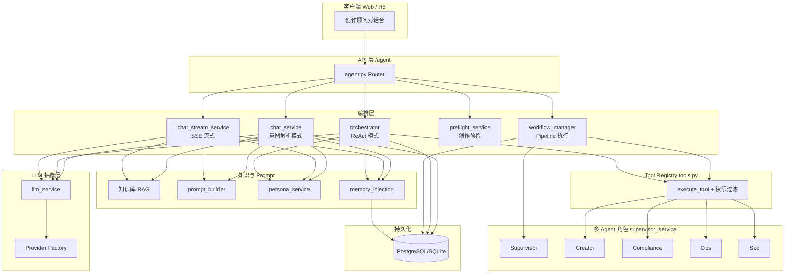
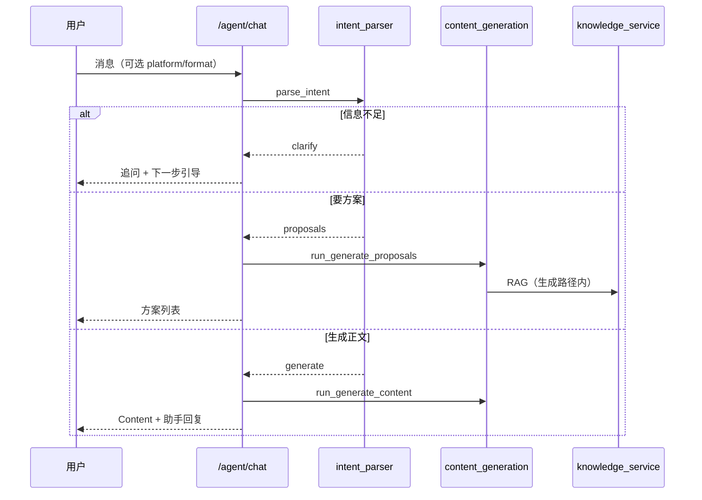
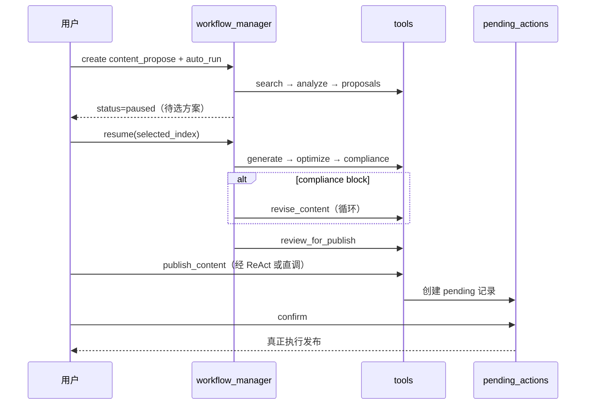

# 智营获客 · 智能体架构说明

> **HTML 可视化版（含架构图与前端调用示例）：** [智能体架构说明.html](./智能体架构说明.html)

---

## 文档元信息

| 字段 | 内容 |
|------|------|
| 文档编号 | AGENT-ARCH-001 |
| 版本号 | v1.2 |
| 创建日期 | 2026-08-07 |
| 适用范围 | 营销创作顾问（v0.4 Agent）、通用顾问（v0.6）、工作流与长期记忆；AI 销售经理（v1.6）为上层扩展 |
| 代码基线 | `apps/api/app/services/agent/`、`apps/api/app/routers/agent.py` |
| 关联文档 | [v0.4 Agent 执行计划](../02-执行计划/v0.4-智能体执行计划.md) · [智能体提示词重构设计约束](./智能体提示词重构设计约束.md) · [人格库设计手册](./人格库设计手册.md) · [PRD-AI销售经理-v1.6](../01-PRD/PRD-智营获客-AI销售经理-v1.6.md) |

---

## 1. 概述

智营获客的智能体体系以 **FastAPI 后端** 为唯一权威执行层，面向 Web / H5 提供统一的 `/agent` API。当前已落地的主线是 **「通用营销创作顾问」（小营）**：帮助用户在公众号、小红书、抖音等平台完成选题、写稿、合规检查与发布准备。

架构上采用 **多 Agent 分工 + Tool 注册表 + 工作流 Pipeline + Confirm 闸** 的组合，而不是单一「大 Prompt 聊天」：

| 能力域 | 实现状态 | 说明 |
|--------|----------|------|
| 会话与消息 | ✅ 已落地 | `AgentSession` / `AgentMessage` 持久化多轮对话 |
| 意图解析对话 | ✅ 已落地 | 默认 `chat` 模式：LLM 结构化 JSON → 方案/正文/澄清 |
| ReAct 编排 | ✅ 已落地 | `mode=react`：LLM 多步 Tool 循环（最多 8 步） |
| SSE 流式输出 | ✅ 已落地 | 正文生成阶段 token 流式推送 |
| Tool Registry | ✅ 已落地 | 权限过滤 + 统一 `execute_tool` 入口 |
| 多 Agent Supervisor | ✅ 已落地 | Creator / Compliance / Ops / Seo 角色与 handoff |
| Workflow Pipeline | ✅ 已落地 | 预定义步骤链 + `paused` 等人选 + `resume` |
| 长期记忆 | ✅ 已落地 | 用户/企业事实 + 会话摘要 + 注入预算 |
| 人格库 | ✅ 已落地 | 第 3 轮起检索变体，第 10 轮收敛提示 |
| Confirm 闸 | ✅ 已落地 | 发布/排期须经用户 confirm，禁止 Agent 自动发布 |
| AI 销售经理 | ⏳ 规划/扩展 | 复用本框架，叠加 CRM 子 Agent 与适配器层（见 §10） |

**设计原则（服务端强制）：**

1. **权限、额度、数据范围在 API 层校验**，不由前端或 Prompt 自行保证。
2. **Agent 不得未经用户确认自动发布**（BR-01）。
3. **合规审查仅建议/拦截**，不恢复强制人工审核流（FR-REVIEW-10）。
4. **Prompt 写原则与人设，不写决策树**（见 [智能体提示词重构设计约束](./智能体提示词重构设计约束.md)）。

---

## 2. 架构总览



**请求主路径：**

1. 客户端创建/选择 `AgentSession`，发送用户消息。
2. 编排层根据 `mode` 选择 **意图解析** 或 **ReAct** 或 **流式生成**。
3. 需要能力时经 **Tool Registry** 调用业务服务（内容生成、知识检索、合规、发布准备等）。
4. 工作流场景由 **Pipeline** 串联多步，在关键节点 **暂停** 等待用户输入后再 `resume`。
5. 所有写操作（发布、排期、CRM 写——销售经理场景）走 **Confirm 闸**。

---

## 3. 分层说明

### 3.1 API 层

- **路由前缀**：`/agent`（`apps/api/app/routers/agent.py`）
- **租户上下文**：`TenantContext` + `require_permission(...)` 注入
- **核心权限**：创作链路以 `content.create` 为主；发布/改稿等工具另有细粒度权限

| 资源组 | 主要端点 | 用途 |
|--------|----------|------|
| 会话 | `POST/GET /sessions`、`/sessions/{id}/messages` | 多轮对话容器 |
| 对话 | `POST /sessions/{id}/chat`、`/chat/stream` | 同步 / SSE 对话 |
| 预检 | `POST /sessions/{id}/preflight` | Workflow 启动前输入校验 |
| 工具 | `GET /tools`、`POST /tools/execute` | 工具发现与直调（调试/工作流） |
| 记忆 | `GET/POST/PATCH/DELETE /memories`、`/recall`、`/memory-context` | 长期记忆 CRUD 与注入预览 |
| 摘要 | `POST/GET /sessions/{id}/summary` | 会话摘要生成 |
| 工作流 | `GET /pipelines`、`POST/GET /workflows`、`/run`、`/resume` | Pipeline 编排 |
| 合规 | `POST /compliance/check` | 独立合规审查 |
| 运营 | `GET/POST /pending-actions` | Confirm 闸待确认操作 |
| SEO | `POST /seo/optimize` | 标题/标签优化 |
| 元数据 | `GET /agents` | 注册子 Agent 列表 |

### 3.2 编排层：三种对话模式

#### 模式 A：意图解析（默认）

**入口**：`chat_service.handle_chat`（`mode` 缺省或非 `react`）

```
用户消息 → intent_parser.parse_intent (LLM JSON)
         → action ∈ {proposals, generate, chat, clarify}
         → content_generation_service / 直接回复
```

- `proposals`：生成选题方案（不扣平台额度）
- `generate`：生成正文入库（扣 1 次平台额度）
- `clarify`：信息不足或边界场景，追问并给下一步引导
- `chat`：纯闲聊式回复

意图解析与预检使用不同的 System Prompt（`INTENT_SYSTEM_PROMPT` / `PREFLIGHT_SYSTEM_PROMPT`），预检额外支持 `input_class` 分类（寒暄、跑题、辱骂、违规等）。

#### 模式 B：ReAct 多步 Tool 循环

**入口**：`orchestrator.handle_react_chat`（`mode=react`）

- LLM 每轮输出 **唯一 JSON**：`tool_call` 或 `done`
- 最多 **8 步**（`MAX_REACT_STEPS`）
- 工具调用结果写回 `AgentMessage`（`role=tool`），供下轮推理
- 注入：长期记忆、人格库、收敛提示、可用工具 schema
- **不支持流式**（流式接口对 react 返回 400）

#### 模式 C：SSE 流式

**入口**：`chat_stream_service.stream_chat`

- 意图解析与 `chat_service` 一致
- `generate` 阶段对正文 **分块推送**（`text/event-stream`）
- 组装 Prompt 走 `prompt_builder.build_system_prompt` 完整分层结构

#### 创作预检（Preflight）

**入口**：`preflight_service.run_create_preflight`

在 UI 一键创作 / Workflow 启动前，判断用户输入是否足以 `proceed`：

- 合并会话历史，避免重复追问
- UI 已选 `platform` / `content_format` 时不再追问
- 规则兜底 + LLM 解析；支持 `proposal_count`（用户要求 N 个方向）

### 3.3 多 Agent Supervisor 模型

**实现文件**：`supervisor_service.py`

逻辑上的子 Agent 与工具归属：

| Agent Code | 名称 | 职责 | 典型工具 |
|------------|------|------|----------|
| `supervisor` | Supervisor | 路由与 handoff 协调 | （无直接工具） |
| `creator` | Creator | 检索、策划、撰写、改稿 | `search_knowledge`、`generate_*`、`revise_content`… |
| `compliance` | Compliance | 合规审查，不发布 | `check_compliance` |
| `ops` | Ops | 发布/排期就绪与 Confirm | `review_for_publish`、`publish_content`、`schedule_content` |
| `seo` | Seo | 标题与标签优化 | `optimize_metadata` |

**Handoff 规则示例**（`decide_after_compliance`）：

- 合规 `block` → 交还 Creator，触发 `revise_content` 改稿循环
- 合规 `pass` / `warn` → 交给 Ops 做发布就绪检查

工作流执行时，每步记录 `agent_code`；`extract_handoffs` 可从步骤序列还原 Agent 切换轨迹。

### 3.4 Workflow Pipeline

**定义文件**：`pipelines.py`  
**执行文件**：`workflow_manager.py`

| Pipeline Code | 步骤概要 | 暂停点 |
|---------------|----------|--------|
| `content_propose` | 检索 → 痛点分析 → 出方案 | ✅ 跑完后 `paused`，等人选方案 |
| `content_finish` | 写稿 → 优化 → 合规 → 发布就绪 | 由 `resume` 在用户选方案后追加执行 |
| `content_create` | 全自动链（含 strategy 自动选题） | 测试/运营用，不暂停 |

状态机：`pending` → `running` → `paused` / `completed` / `failed`

`resume_workflow` 接收 `selected_proposal_index`，将选中方案写入上下文后继续 `content_finish` 步骤。

合规 block 时，`compliance_revise_service` 驱动 **改稿-再审** 循环（有最大轮次上限）。

### 3.5 Tool Registry

**实现文件**：`tools.py`

每个工具注册为 `ToolSpec`：

- `name` / `description` / `parameters`（JSON Schema）
- `required_permissions`：与租户角色权限求交
- `handler`：异步执行函数

**统一入口**：

```text
list_available_tools(ctx)  → 按权限过滤后的 schema 列表（供 ReAct / 前端）
execute_tool(ctx, name, args) → 校验权限 → 调用 handler
```

`AgentToolContext` 封装 `db / tenant_id / user / membership / permissions / industry_code`，可转为 `TenantContext` 供下游服务使用。

**已注册工具一览**：

| 工具名 | 扣额度 | 所属 Agent | 说明 |
|--------|--------|------------|------|
| `list_scenes` | 否 | Creator | 场景模板列表 |
| `search_knowledge` | 否 | Creator | Hybrid/向量知识检索 |
| `analyze_pain_points` | 否 | Creator | 痛点分析（工作流） |
| `strategy_proposals` | 否 | Creator | 策略选题（全自动流） |
| `generate_proposals` | 否 | Creator | 选题方案 |
| `generate_content` | **是** | Creator | 正文生成入库 |
| `optimize_content` | 否 | Creator | 自检优化 |
| `revise_content` | 视实现 | Creator | 按指令改稿 |
| `check_compliance` | 否 | Compliance | LLM + 规则合规审查 |
| `review_for_publish` | 否 | Ops | 发布前就绪检查 |
| `publish_content` | — | Ops | 创建 **待确认** 发布动作 |
| `schedule_content` | — | Ops | 创建 **待确认** 排期动作 |
| `optimize_metadata` | 否 | Seo | 标题/标签优化 |
| `get_content` | 否 | — | 读内容（数据范围约束） |
| `get_quota` | 否 | Creator | 平台 AI 额度 |
| `get_wechat_settings` | 否 | — | 公众号绑定状态 |
| `get_calendar` | 否 | — | 排期/发布日历 |

### 3.6 Prompt 体系

**实现文件**：`prompt_builder.py`、`assistant_service.py`

`build_system_prompt` 组装顺序（**不可调整**，见需求规格 §3.4）：

```text
宪法块（不可覆盖）
  → 角色锁定
  → 稳定人格
  → 核心任务（仅 4 件）
  → 知识库调用指令
  → 零断点引导
  → 合规 System（行业包）
  → 场景模板
  → RAG 片段
  → 品牌配置
  → 个人提示词
  → 本次 topic / 补充指令
```

**宪法块**（`CONSTITUTION_BLOCK`）在所有生成路径前置，覆盖：偏题拉回、禁止编造、禁止自动发布、防 Prompt 泄露等。

**顾问配置**：`assistant_service` 统一为 `marketing`（小营）；历史 `finance` / `legal` code 归一化到营销顾问。

### 3.7 人格库

**实现文件**：`persona_service.py`、`persona_seeds.py`

- 平台人格库存储 P-001～P-009 等变体（知识库检索）
- **第 3 轮**用户消息后开始注入人格变体（`MIN_TURNS_FOR_PERSONA`）
- **第 10 轮**注入收敛提示，避免无限发散（`CONVERGE_USER_TURNS`）
- 命中后 **锁定** 到 `session.persona_code`（FR-ADVISOR-18）

详见 [人格库设计手册](./人格库设计手册.md)。

### 3.8 长期记忆

| 组件 | 文件 | 说明 |
|------|------|------|
| 事实 CRUD | `memory_service.py` | `scope=user`（用户级）或 `tenant`（企业级） |
| 注入组装 | `memory_injection.py` | 默认预算 2400 字符；含摘要 + 相关 recall |
| 会话摘要 | `summary_service.py` | LLM 生成摘要；支持 keyword/hybrid recall |
| 数据表 | `AgentMemoryFact`、`AgentSessionSummary` | 仅 `is_confirmed=true` 的事实默认注入 |

注入优先级：近期会话摘要 → 按 hint 召回的相关摘要/记忆 → 未带 hint 时取最近用户/企业各 5 条。

### 3.9 LLM 抽象层

**实现文件**：`llm_service.py`、`services/llm/`

| `llm_source` | 配置来源 | 额度 |
|--------------|----------|------|
| `platform` | 平台 Key + 模型配置 | 正文生成成功扣 1 次 |
| `tenant` | 租户自有 `LLMConfig` | 不扣平台额度 |

提供 `chat`（同步）与 `stream`（流式）两种调用；Provider 通过 factory 按配置选择（OpenAI 兼容等）。

---

## 4. 核心业务流程

### 4.1 交互式创作（推荐路径）



### 4.2 工作流 + Confirm 闸



### 4.3 合规与运营边界

- **ComplianceAgent**（`compliance_service.py`）：规则 + LLM 输出 `pass|warn|block`；结果写入 `AgentComplianceReport`
- **OpsAgent**（`ops_service.py`）：`publish` / `schedule` 仅创建 `AgentPendingAction`；`confirm_pending_action` 后才调用 `publish_service`
- ReAct System Prompt **明确禁止** Agent 直接 `publish_content` 完成发布，须引导用户在界面确认

---

## 5. 数据模型

| 表 / 模型 | 用途 |
|-----------|------|
| `agent_sessions` | 会话；含 `industry_code`、`persona_code`、`status` |
| `agent_messages` | 消息；`role` = user/assistant/tool；`message_type` = text/proposals/tool_call/… |
| `agent_memory_facts` | 长期记忆事实 |
| `agent_session_summaries` | 会话摘要（供 recall） |
| `agent_workflows` | 工作流实例；`pipeline_code`、`status`、`input_json`、`output_json` |
| `agent_workflow_steps` | 步骤级输入输出与 `agent_code` |
| `agent_compliance_reports` | 合规审查结果 |
| `agent_pending_actions` | Confirm 闸待确认动作 |

ORM 定义见 `apps/api/app/models/__init__.py`。

---

## 6. 安全、权限与审计要点

| 规则 | 实现位置 |
|------|----------|
| BR-01：禁止自动发布 | `ops_service` + ReAct/Ops 工具设计 |
| 工具权限 | `ToolSpec.required_permissions` ∩ 用户角色 |
| 内容数据范围 | `scope_service.can_view_content` |
| 平台额度 | `platform_llm_service`；方案/预检/ReAct 编排调用可 `check_platform_quota=False` |
| Prompt 防泄露 | 宪法块 + ReAct 边界话术「我不回答。」 |
| 租户隔离 | 所有查询带 `tenant_id`；记忆 scope 校验 |

---

## 7. 代码目录索引

```text
apps/api/app/
├── routers/agent.py              # HTTP API
├── services/
│   ├── agent/
│   │   ├── chat_service.py       # 意图解析对话
│   │   ├── chat_stream_service.py# SSE 流式
│   │   ├── orchestrator.py       # ReAct 编排
│   │   ├── intent_parser.py      # 意图 / 预检解析
│   │   ├── preflight_service.py  # 创作预检
│   │   ├── tools.py              # Tool Registry
│   │   ├── supervisor_service.py # 多 Agent 角色
│   │   ├── workflow_manager.py   # Pipeline 执行
│   │   ├── pipelines.py          # Pipeline 定义
│   │   ├── workflow_content_service.py
│   │   ├── compliance_service.py
│   │   ├── compliance_revise_service.py
│   │   ├── ops_service.py        # Confirm 闸
│   │   ├── seo_service.py
│   │   ├── memory_service.py
│   │   ├── memory_injection.py
│   │   ├── summary_service.py
│   │   ├── session_service.py
│   │   └── sse.py
│   ├── prompt_builder.py         # Prompt 分层组装
│   ├── persona_service.py        # 人格库注入
│   ├── assistant_service.py      # 顾问配置
│   ├── content_generation_service.py
│   ├── knowledge_service.py      # RAG
│   └── llm_service.py            # LLM 统一入口
└── models/__init__.py            # Agent 相关 ORM
```

---

## 8. 与前端的关系

- Web / H5 通过 REST + SSE 调用 `/agent`，**不在客户端执行业务规则**。
- 会话列表、消息历史、方案卡片、发布确认弹窗等 UI 状态与 `AgentChatResponse.action` 字段对齐（`clarify` / `proposals` / `generate` / `chat`）。
- 一键创作入口应先调 `preflight`，再创建 `workflow` 或走普通 `chat`。
- 发布/排期必须调 `pending-actions` 的 confirm/cancel，不可假设 Tool 返回即已发布。

---

## 9. 测试与验收

| 类型 | 位置 |
|------|------|
| Agent 里程碑验收 | `docs/02-执行计划/v0.4-智能体执行计划.md` |
| 顾问增强 | `docs/02-执行计划/v0.6-advisor执行计划.md`、`v0.6.1-advisor优化执行计划.md` |
| 用例集 | [智能体测试用例](./智能体测试用例.md) |
| 自动化脚本 | `apps/api/tests/` 下 `verify_*` 与 `run_*` 系列 |

本地修改 `apps/api/app/services/agent/` 后，Windows 环境须 **硬重启 API**（`scripts/restart-api.ps1`），勿依赖 `--reload`  alone。

---

## 10. 扩展：AI 销售经理（v1.6）

AI 销售经理 **不是另一套运行时**，而是在本架构之上的 **业务 Supervisor 扩展**（详见 [PRD-智营获客-AI销售经理-v1.6](../01-PRD/PRD-智营获客-AI销售经理-v1.6.md)）：

| 复用项 | 销售经理扩展 |
|--------|--------------|
| ReAct / propose-resume | 销售场景意图路由 |
| Tool Registry 模式 | CRM 读写在工具层注册 |
| Confirm 闸 | 发邮件、改分配、对外报价等写操作 |
| 长期记忆 + 人格库 | P-MGR 稳定人格 + 三库 RAG |
| Hybrid RAG | 营销库 / 线索库 / CPQ 库 |

规划中的 **8 个子 Agent**（分析官、商机官、内容官等）对应本框架中的 **Agent 角色 + 工具白名单** 模式；CRM 数据通过 **CrmAdapter 抽象层** 接入，与具体 CRM 实现解耦。

当前代码库中，营销创作链路已完整实现；销售经理子 Agent 的独立路由模块将按 v1.6 执行计划增量并入同一 `/agent` 或专用前缀，**编排范式保持一致**。

---

## 11. 当前方案优劣势

我们采用的是 **「混合编排」架构**：意图解析（确定性）+ ReAct（自主性）+ Workflow（可审计）+ 多 Agent 分工 + Confirm 闸（人机协同）。

### 11.1 优势

| 维度 | 说明 |
|------|------|
| 安全可落地 | 权限、额度、数据范围、发布确认全在 API 硬约束（BR-01） |
| 体验与成本可控 | 默认意图解析 + SSE；出方案不扣额度，正文入库才扣 1 次 |
| 人机协同 | Workflow `paused` 等人选；Confirm 闸等人确认发布 |
| 可解释可追溯 | Creator/Compliance/Ops 分工 + Workflow 步骤落库 |
| 知识可运营 | RAG + 人格库 + 长期记忆，非一次性 Prompt |
| 扩展性好 | Tool Registry + Pipeline；v1.6/v1.7 可复用运行时 |
| 私有化友好 | 自研 FastAPI，租户自有 LLM Key |

### 11.2 劣势与局限

| 维度 | 说明 |
|------|------|
| 编排路径偏多 | chat / stream / react / workflow / preflight 五套入口，维护成本高 |
| 意图与 ReAct 重复 | 行为一致性依赖测试兜底 |
| ReAct 无流式 | 多步场景体验弱于 SSE 创作页 |
| Pipeline 硬编码 | 改步骤要发版，不如声明式图编排灵活 |
| Supervisor 较轻 | handoff 为步骤级标记，非真正多 Agent 协商 |
| 可观测性不足 | 缺统一 Trace（LLM/Tool 耗时、Token） |
| 记忆召回简单 | keyword/hybrid，无专门压缩与重要性打分 |
| Eval 体系弱 | 缺 Prompt/工具自动化回归与线上监控 |

### 11.3 适用场景

| 场景 | 适合度 |
|------|--------|
| 营销内容创作 | ✅ 非常适合 |
| 需确认的高风险写操作 | ✅ 非常适合 |
| 销售管理多域推理 | ⚠️ 需 v1.6 扩展 |
| 完全自主无人值守 Agent | ❌ 不适合 |
| 超复杂开放域上百步推理 | ❌ 不适合 |

---

## 12. 业界智能体架构对比

### 12.1 六种主流范式

| 范式 | 代表 | 机制 | 优点 | 缺点 |
|------|------|------|------|------|
| 单轮 RAG 聊天 | 文档问答 | 检索 → 一次生成 | 简单便宜 | 无工具、无闭环 |
| ReAct / Tool Calling | OpenAI Assistants | 思考→工具→观察循环 | 灵活 | 难控费、难审计 |
| 意图路由 + 固定链路 | 多数 To B Copilot、我们的 chat_service | 分类→固定函数 | 稳定可测 | 新意图要改代码 |
| 工作流/状态机 | Temporal、我们的 workflow_manager | 步骤+暂停+持久化 | 可审计、人机协同 | 编排变更需设计 |
| 多 Agent Supervisor | CrewAI、v1.6 销售经理 | 主管拆任务→专家执行 | 职责清晰 | 调度复杂 |
| 图编排引擎 | LangGraph、Agentforce Flow | 图节点+条件边+检查点 | 统一表达多种模式 | 基础设施要求高 |

### 12.2 我们 vs 业界（能力矩阵）

| 能力 | 我们 | 纯 ReAct | LangGraph | Agentforce |
|------|------|----------|-----------|------------|
| Tool + RBAC | ✅ | 部分 | 需自建 | ✅ |
| Confirm 闸 | ✅ BR-01 | ❌ | 可建模 | ✅ |
| 暂停/恢复 | ✅ | ❌ | ✅ | ✅ |
| 多 Agent | ⚠️ 轻量 | ❌ | ✅ | ✅ |
| 行业 RAG | ✅ 三库 | 看接入 | 看接入 | Data Cloud |
| 私有化 | ✅ | 看部署 | ✅ | ❌ 云绑定 |
| Trace 观测 | ❌ 待建 | 部分 | ✅ | ✅ |
| 声明式编排 | ❌ | — | ✅ | ✅ |
| B2B CPQ 护城河 | ✅ | ❌ | 需自建 | 通用 CRM |

**定位**：私有化可落地的混合编排——比纯聊天强在 Tool+Workflow+Confirm；比 Agentforce 弱在可视化编排与观测，强在行业知识库+创作闭环+私有化。

---

## 13. 后续改进路线

| 阶段 | 改进项 | 说明 |
|------|--------|------|
| P0 近期 | Orchestrator 2.0 | 统一 intent/react/workflow 公共逻辑，减少重复 |
| P0 近期 | Agent Trace | 结构化记录 LLM/Tool 耗时与错误，管理端可排障 |
| P1 | Pipeline 配置化 | Registry 迁 DB/YAML，支持 A/B 链路 |
| P1 v1.6 | 销售经理 Supervisor | 三官 + 30 工具 + 4 Pipeline + Confirm |
| P2 中期 | ReAct 流式 + 记忆压缩 | 边调工具边输出；自动摘要与事实抽取 |
| P2 | Eval 回归门禁 | 测试用例 CI 化，Prompt 变更必过回归 |
| P2 v1.7+ | 智能体 × 商城 | 商品关联创作、课纲/详情一键生成 |
| P3 远期 | 图编排 / CrmAdapter / MCP | 评估 LangGraph；多 CRM；外部工具协议 |

### 不建议做的

- 去掉 Confirm 闸追求全自动（To B 风险高）
- MVP 阶段 8 子 Agent 全并行（先 Supervisor + 工具集验证）
- 为追热点全盘换 LangGraph（先补 Trace + 配置化）
- 单一 ReAct 替代意图解析（主路径成本与稳定性变差）

---

## 14. 关联文档

| 文档 | 说明 |
|------|------|
| [智能体提示词模板](./智能体提示词模板.md) | 提示词编写模板 |
| [智能体提示词重构设计约束](./智能体提示词重构设计约束.md) | 人性化对话 vs 问卷式交互 |
| [人格库设计手册](./人格库设计手册.md) | P-001～P-009、P-MGR |
| [智能体测试用例](./智能体测试用例.md) | 功能与边界测试 |
| [需求规格 §3 FR-AGENT](../00-总览/需求规格.md) | 正式需求编号 |
| [AI销售经理-方案对比与纳入建议](./AI销售经理-方案对比与纳入建议.md) | 架构分歧与融合建议 |
| [内容获客平台-执行计划](../02-执行计划/内容获客平台-执行计划.md) | v1.7+ 智能体 × 商城 |
| [v0.4-agent执行计划](../02-执行计划/v0.4-智能体执行计划.md) | 分期里程碑 |

---

*文档随代码演进更新；若实现与本文冲突，以 `apps/api/app/services/agent/` 源码为准。*
