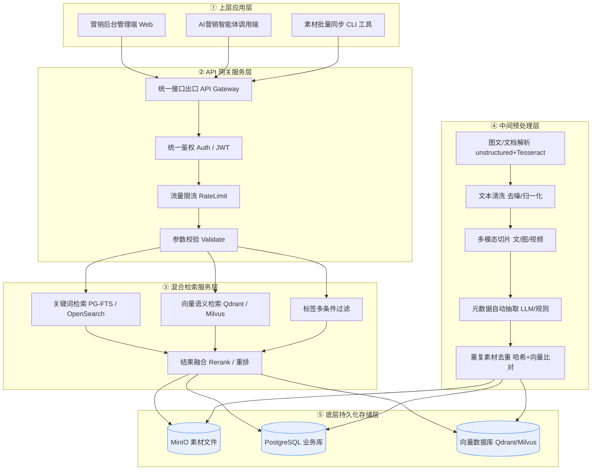
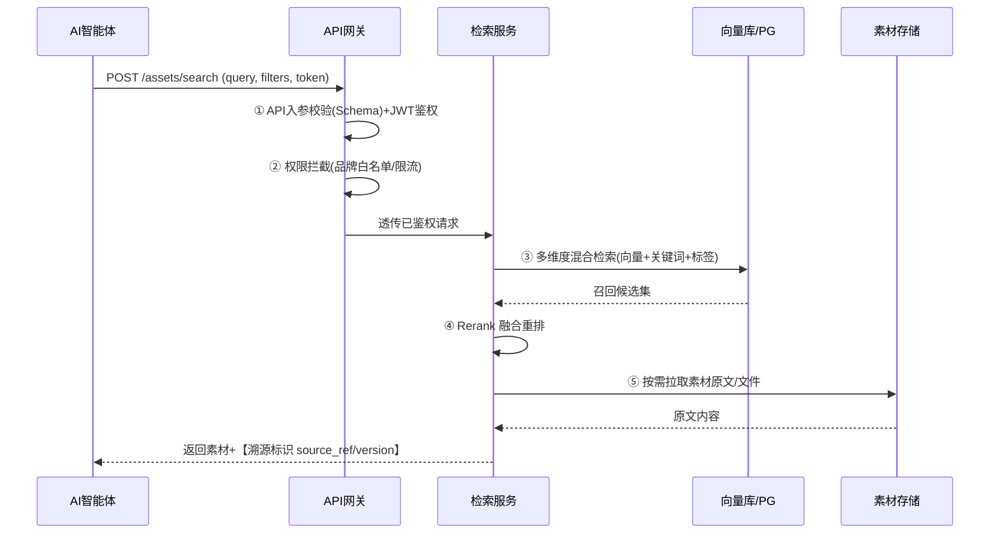

# 企业私有营销资料库搭建整体方案（全开源 / 私有化 / 智能体对接）

> **方案定位**：营销专属资料库，覆盖活动方案、海报文案、短视频脚本、投放素材、竞品营销案例、品牌话术、用户分层运营策略、活动复盘、投放数据报表、行业营销白皮书、公关稿件等全部营销资产。
>
> **硬性约束**：技术栈 100% 开源免费；对外提供标准 RESTful API 完整支撑营销 AI 智能体；全文表格化 + Mermaid 架构图 + 双视角拆分；五大核心模块（权限体系 / 向量分片 / 素材数据治理 / API 鉴权 / 智能体调用链路）不可省略。

---

## 一、业务需求定义与营销资产标准

### 1.1 使用人群与核心诉求

| 角色 | 核心诉求 | 资料库使用方式 |
| --- | --- | --- |
| 市场专员 | 快速找历史活动素材、复用海报模板 | 后台检索、下载、上传归类 |
| 营销策划 | 调取竞品案例、白皮书、话术库做方案 | 关键词/语义混合检索、原文拉取 |
| 投放运营 | 取投放素材、数据报表、受众策略 | 按渠道/受众筛选、批量导出 |
| 品牌公关 | 管理品牌话术、公关稿件、合规等级 | 高密级管控、二次核验查阅 |
| 内容编辑 | 文案参考、脚本库、素材溯源 | 原文溯源、版本比对 |
| 营销 AI 智能体 | 自动检索+原文返回+溯源，支撑问答/生成 | 标准 RESTful API 调用 |

### 1.2 资料库承载素材/数据类型与结构化元字段清单

| 素材大类 | 示例内容 | 主要文件格式 |
| --- | --- | --- |
| 活动方案 | 策划案、执行 SOP、复盘 | docx / pdf / md |
| 海报文案 | 视觉海报、主视觉、KV | jpg / png / psd |
| 短视频脚本 | 分镜脚本、口播稿 | docx / md / pdf |
| 投放素材 | 信息流图、落地页、素材包 | jpg / html / zip |
| 竞品营销案例 | 竞品打法拆解、战役分析 | pdf / md |
| 品牌话术 | 品牌 TONE、标准话术库 | md / xlsx |
| 用户分层运营策略 | 人群包、分层触达策略 | xlsx / md |
| 活动复盘 | 数据复盘、ROI 报告 | xlsx / pdf |
| 投放数据报表 | 投放日报/周报/月报 | xlsx / csv |
| 行业营销白皮书 | 行业洞察、趋势报告 | pdf / md |
| 公关稿件 | 新闻稿、声明、媒体通稿 | docx / pdf |

**结构化营销资产统一元字段清单（强制）**

| 字段名 | 类型 | 必填 | 说明 |
| --- | --- | --- | --- |
| asset_id | UUID | 是 | 素材唯一标识 |
| brand | 枚举 | 是 | 所属品牌线 |
| channel | 枚举 | 是 | 营销渠道（微信/抖音/小红书/信息流/户外…） |
| asset_type | 枚举 | 是 | 素材类型（见上表） |
| campaign | 字符串 | 否 | 关联活动名称 |
| campaign_period | 日期区间 | 否 | 活动周期 |
| audience | 枚举[] | 否 | 受众人群标签 |
| tags | 字符串[] | 否 | 自由标签 |
| compliance_level | 枚举 | 是 | 合规/保密等级 L1-L4 |
| status | 枚举 | 是 | 投放状态（草稿/投放中/已结束/失效） |
| creator | 用户ID | 是 | 创建人 |
| created_at / updated_at | 时间戳 | 是 | 时间 |
| effective_from / effective_to | 日期 | 否 | 有效期 |
| source_ref | 字符串 | 否 | 素材溯源外部引用 |
| file_path | 字符串 | 是 | MinIO 对象路径 |
| text_content | 文本 | 否 | 解析后纯文本（用于向量化） |

### 1.3 预估素材总量 / 增量 / 保密分级

| 指标 | 轻量团队（50人内） | 百人团队（分布式） |
| --- | --- | --- |
| 初始素材总量 | 约 10 万 | 约 100 万+ |
| 月度新增增量 | 3k–8k | 5万–10万 |
| 文本类占比 | 60% | 55% |
| 图文/视频类 | 40% | 45% |
| 单素材平均文本 | 2k–10k 字 | 同左 |

**品牌素材保密分级标准**

| 密级 | 定义 | 示例 | 默认权限 |
| --- | --- | --- | --- |
| L1 公开 | 对外可发布素材 | 已发布海报 | 全员可读 |
| L2 内部 | 内部流通素材 | 活动方案草稿 | 营销全员 |
| L3 机密 | 品牌战略/核心话术 | 品牌 TONE、定价话术 | 负责人+策划 |
| L4 绝密 | 未公开战略/并购公关 | 危机公关预案 | 超级管理员+品牌公关（二次核验） |

### 1.4 AI 营销智能体核心调用诉求与 API 能力清单

| 智能体诉求 | 对应 API 能力 | HTTP 方法 / 路径 |
| --- | --- | --- |
| 素材检索（语义+关键词） | 混合检索接口 | `POST /api/v1/assets/search` |
| 原文拉取 | 原文/文件下载 | `GET /api/v1/assets/{id}/content` |
| 元数据筛选 | 条件过滤列表 | `GET /api/v1/assets?brand=&channel=&...` |
| 素材溯源 | 溯源标识返回 | 响应内含 `source_ref` + `version` |
| 批量上传物料 | 批量入库接口 | `POST /api/v1/assets/batch-upload` |
| 文案参考调取 | 按标签/类型取参考 | `POST /api/v1/assets/reference` |

---

## 二、全链路分层技术架构设计

### 2.1 分层技术选型总表（全开源）

| 层级 | 职责 | 开源组件选型 | 替代可选项 |
| --- | --- | --- | --- |
| 底层-文件存储 | 素材原文件 | **MinIO**（S3 兼容对象存储） | Ceph、SeaweedFS |
| 底层-业务库 | 结构化元数据 | **PostgreSQL 16** | MySQL 8、SQLite |
| 底层-向量库 | 向量索引 | **Qdrant**（轻量）/ **Milvus**（集群） | Chroma、FAISS |
| 预处理-解析 | 文档/图文解析 | **unstructured** + **markitdown** + **Tesseract OCR** | pdfplumber、docling |
| 预处理-多模态 | 视频/语音转写 | **Whisper**（本地） | faster-whisper |
| 预处理-切片 | 文本切块 | **LangChain TextSplitter**（自研规则） | llama-index |
| 预处理-嵌入 | 向量化 | **BGE-M3 / bge-small-zh**（本地推理） | m3e、text2vec |
| 检索-关键词 | 倒排检索 | **PostgreSQL FTS** 或 **OpenSearch** | Meilisearch |
| API网关 | 鉴权/限流/出口 | **FastAPI** 自研网关 + **Nginx** | Kong（开源版） |
| 应用-后台 | 管理端 | **React** + **Ant Design** | Vue + Element Plus |
| 应用-同步 | 批量工具 | **Python CLI**（requests） | Node 脚本 |
| 部署 | 容器化 | **Docker Compose** / **Kubernetes** | Podman |
| 备份 | 定时备份 | **pg_dump** + **mc mirror** + **rclone** | restic |

### 2.2 完整可运行 Mermaid 分层架构流程图

### 2.3 各层落地说明

| 层级 | 落地要点 |
| --- | --- |
| 底层 | MinIO 分桶存储（按品牌线隔离）；PostgreSQL 存元数据+权限+审计；向量库存 embedding |
| 预处理 | 上传即触发异步流水线（Celery/RQ 队列），解析→清洗→切片→抽取→去重→入库 |
| 检索 | 关键词走 PG-FTS，语义走向量库，标签走 PG 条件过滤，三层结果经 Rerank 融合 |
| 网关 | 所有外部请求经 Nginx→FastAPI 网关，先做 JWT 校验+限流+参数 Schema 校验 |
| 应用 | 后台管人/管料/管权限；智能体走独立 API 账号；CLI 供大批量历史物料迁移 |

---

## 三、营销素材专属标准化数据治理规范

### 3.1 多级目录分类架构（四级）

| 层级 | 取值示例 | 说明 |
| --- | --- | --- |
| 一级 业务线 | 品牌市场 / 效果投放 / 电商 / 海外 | 按公司业务划分 |
| 二级 营销渠道 | 微信 / 抖音 / 小红书 / 信息流 / 户外 / PR | 渠道维度 |
| 三级 活动类型 | 大促 / 新品 / 节点 / 联名 / 常态 | 活动属性 |
| 四级 素材形式 | 文案 / 海报 / 视频 / 数据 / 方案 | 物理形态 |

> 目录仅作逻辑归类，物理存储统一在 MinIO，目录映射为元数据 `path_tags` 字段，避免文件散落。

### 3.2 强制统一元数据字段清单（见 1.2 表，此处强调落地校验）

| 落地要求 | 实现规则 |
| --- | --- |
| 字段不可缺 | 上传 API 强制校验 `brand/channel/asset_type/compliance_level/status/creator` |
| 枚举受控 | 渠道/类型/密级用 PostgreSQL ENUM 或字典表，禁止自由输入 |
| 有效期默认 | 未填 `effective_to` 默认 +1 年，到期自动转"待清理" |
| 溯源必带 | 外部引入素材必填 `source_ref`，否则驳回 |

### 3.3 自动打标 + 人工补充流程

| 标签类型 | 自动规则 | 人工补充 |
| --- | --- | --- |
| 渠道标签 | 按上传目录/文件名正则识别 | 策划可改 |
| 人群标签 | LLM 抽取正文受众（本地小模型） | 运营复核 |
| 活动类型 | 关键词匹配（大促/新品…） | 策划确认 |
| 自由标签 | 不自动 | 编辑手动加 |

**【营销业务人员操作规范】**
- 上传素材前先选对"业务线→渠道→活动类型→素材形式"四级目录；
- 系统自动打标后，须在 24h 内由本人复核标签准确性；
- 高密级（L3/L4）素材必须手动补充"有效期"与"可阅范围"；
- 禁止把已结束活动素材长期挂"投放中"状态。

**【开发落地实现规则】**
- 自动打标：上传后调本地轻量模型（如 qwen2.5-0.5B 本地推理或正则）抽取受众/活动类型，写 `tags`；
- 人工补充：后台提供标签编辑接口 `PUT /api/v1/assets/{id}/tags`，写审计日志；
- 字典兜底：未识别标签落入 `uncategorized` 队列，每日汇总给内容编辑处理。

### 3.4 过期/失效/重复素材自动清理定时任务

| 任务 | 触发 | 规则 | 动作 |
| --- | --- | --- | --- |
| 过期素材 | 每日 02:00 | `effective_to < now()` | 标记 `status=expired`，移入冷存储桶 |
| 失效活动物料 | 每周日 | 关联活动结束 +30 天 | 压缩归档，降密级可读 |
| 重复素材 | 实时+每日 | MD5 相同 或 向量余弦>0.98 | 保留最新，旧版软删 |

**【营销业务人员操作规范】**
- 收到"待清理"通知后 3 个工作日内确认是否保留，逾期系统自动归档；
- 认为误删可走"恢复申请"，由管理员从冷存储还原。

**【开发落地实现规则】**
- 定时任务用 **APScheduler / Celery beat**，清理逻辑为"软删"（置 `deleted_at`），保留 90 天可恢复；
- 重复比对：入库时算文件 MD5 + 文本向量，写入去重表；命中则关联 `dup_of`；
- 冷存储：MinIO 生命周期规则自动将 `expired` 前缀对象转低频存储，降成本。

---

## 四、精细化分级权限管控体系

### 4.1 完整角色矩阵

| 角色 | 上传 | 编辑 | 下载 | 跨品牌读 | 导出 | L3/L4 查阅 | 管理 |
| --- | --- | --- | --- | --- | --- | --- | --- |
| 超级管理员 | ✅ | ✅ | ✅ | ✅ | ✅ | ✅(免核验) | ✅ |
| 营销负责人 | ✅ | ✅ | ✅ | ✅ | ✅ | ✅(核验) | 部分 |
| 策划专员 | ✅ | 本人 | ✅ | 本品牌 | 本人 | ✅(核验) | ❌ |
| 投放运营 | ✅ | 本人 | ✅ | 本品牌 | 本人 | ❌ | ❌ |
| 内容编辑 | ✅ | 本人 | ✅ | 本品牌 | 本人 | ❌ | ❌ |
| 只读访客 | ❌ | ❌ | ✅(L1/L2) | 授权 | ❌ | ❌ | ❌ |
| AI 智能体账号 | ❌ | ❌ | API限范围 | 授权品牌 | ❌(禁批量) | 限定 | ❌ |

### 4.2 数据隔离规则

| 隔离维度 | 规则 |
| --- | --- |
| 品牌线隔离 | 元数据 `brand` 行级过滤，非授权品牌不可见 |
| 项目组隔离 | `campaign` 维度建项目空间，成员制可见 |
| L3/L4 二次核验 | 查阅须走审批流，生成一次性授权 token，留痕 |

### 4.3 全操作审计日志

| 审计项 | 记录字段 |
| --- | --- |
| 查看/下载/复制/导出 | 用户、asset_id、时间、IP、结果 |
| API 调用 | token、接口、参数摘要、耗时、状态码 |
| 分享行为 | 分享对象、渠道、时效 |

> 审计表独立库独立用户，仅追加（append-only），不可改不可删。

### 4.4 AI 智能体专属权限限制

| 限制项 | 实现 |
| --- | --- |
| 读取范围 | token 绑 `brand_whitelist`，超范围返回 403 |
| 禁批量导出 | 禁用 `/batch-download`，单次要原文上限 50 条/次 |
| 高频限制 | 网关限流 20 QPS/账号，超阈熔断 60s |

**【营销业务人员操作规范】**
- 涉密方案（L3/L4）查阅须在后台提交申请，写明用途，负责人审批后才可看；
- 严禁把智能体 API Key 写入前端代码或共享给外部；
- 发现素材异常外泄，立即在后台"冻结账号"并报警。

**【开发落地实现规则】**
- RBAC 模型：用户表→角色表→权限表（资源:操作），PostgreSQL 实现；
- 行级过滤：所有查询经 `row_level_filter(user)` 注入 `WHERE brand IN (...)`；
- API 鉴权：JWT（RS256）含 `roles` + `brand_whitelist` + `rate_tier`；
- 二次核验：L3/L4 查阅接口前置 `approval_check()`，无有效 `approval_token` 拒返。

---

## 五、开源向量库选型 & 营销 AI 智能体联动 RAG 方案

### 5.1 主流开源向量库对比（适配图文/长文案）

| 维度 | Milvus Lite | FAISS | Chroma | Qdrant |
| --- | --- | --- | --- | --- |
| 部署形态 | 单机/分布式 | 库（需自封装） | 单机优先 | 单机/分布式 |
| 亿级向量 | ✅（集群） | ✅（需自管） | ⚠️ 中等 | ✅ |
| 混合检索 | ✅ | ❌（纯向量） | ✅（含元数据过滤） | ✅（强过滤） |
| 多模态支持 | ✅ | ✅ | ✅ | ✅ |
| 运维复杂度 | 中 | 高（自研服务） | 低 | 低 |
| 营销场景适配 | 大团队优选 | 轻量嵌入 | 中小团队 | **中小/中均可** |
|  license | 开源 | 开源 | 开源 | 开源 |

> **选型结论**：50 人内轻量方案选 **Qdrant**（开箱即用、强元数据过滤、RAG 友好）；百人百万级选 **Milvus 集群**。FAISS 仅作嵌入式兜底，不自建服务。

### 5.2 营销素材专属切片策略 / 嵌入模型 / 增量入库

| 项 | 推荐 |
| --- | --- |
| 文本切片 | 按语义分块 512 token，重叠 64；长文案（白皮书）按章节+段落 |
| 图文切片 | 海报 OCR 出文字 + CLIP 出图向量，图文联合索引 |
| 视频切片 | Whisper 转写→按镜头/时间窗切块 |
| Embedding 模型 | **BGE-M3**（多语言多模态，768/1024 维，本地推理） |
| 中文备选 | bge-small-zh-v1.5、m3e-base |
| 增量入库 | 新素材入队→向量化→`upsert`，不重建全量索引 |
| 维度/距离 | cosine 距离，HNSW 索引 |

### 5.3 营销智能体完整调用链路（Mermaid）

### 5.4 营销问答优化方案（解决错乱/幻觉/无关召回）

| 问题 | 优化手段 |
| --- | --- |
| 素材匹配错乱 | 混合检索 + Rerank（bge-reranker 本地）；检索 top-k 提高至 20 再重排取 5 |
| 品牌话术幻觉 | 检索结果强制注入 system prompt 作为"唯一事实来源"，禁模型自由发挥 |
| 无关案例召回 | 过滤 `brand` + `compliance_level` + `campaign_period` 生效期；负向过滤失效素材 |
| 长文案截断 | 切片保留 `asset_id`+章节号，返回带出处锚点 |

**【营销业务人员操作规范】**
- 给智能体提问时尽量带"品牌+渠道+时间"限定词，召回更准；
- 智能体返回的素材必须显示溯源链接，编辑须点开核验再使用；
- 发现智能体"编话术"，在后台标记"幻觉样本"用于迭代。

**【开发落地实现规则】**
- 向量入库：预处理流水线调 BGE-M3 本地服务 `/embed`，批量 upsert 向量库；
- 多模态检索：`/search` 支持 `modality=text|image`，图搜图走 CLIP 向量；
- 上下文拼接： Retrieval 结果按 `source_ref` 排序，拼为 `【素材N】标题｜出处｜正文`，注入 prompt；
- 防幻觉：prompt 模板写死"仅依据下方素材回答，无依据则答'资料库未覆盖'"。

---

## 六、两套开源部署方案完整对比

### 6.1 方案对比总表

| 对比维度 | 轻量单机部署 | 分布式集群部署 |
| --- | --- | --- |
| 适用规模 | ≤50 人 / 10 万素材 | 100+ 人 / 100 万+ 素材 |
| 硬件最低配置 | 8C16G / 500G SSD | 3×16C32G / 2T NVMe + GPU 推理卡(可选) |
| 全套开源组件 | Docker Compose：MinIO+PostgreSQL+Qdrant+FastAPI+Nginx+React | K8s：MinIO 集群+PostgreSQL主从+Milvus集群+FastAPI多副本+Nginx Ingress |
| 部署难度 | 低（一条 compose up） | 中高（需 K8s 运维） |
| 月度维护成本 | ≈0（电费/机位） | ≈0 软件费，人力 0.5–1 人 |
| 并发承载上限 | 50–100 QPS | 1000+ QPS |
| 素材存储上限 | 单盘 500G–数 T | 对象存储水平扩展 PB 级 |
| 向量库 | Qdrant 单机 | Milvus 分布式 |
| 备份 | 每日 pg_dump + mc mirror | Velero + 定时快照 + 异地 rclone |

### 6.2【开发视角】分步部署流程与环境依赖

**轻量单机（Docker Compose）**
1. 依赖：Docker 24+ / Docker Compose v2 / 64 位 Linux。
2. 编写 `docker-compose.yml`：minio、postgres、qdrant、redis(队列)、api、nginx、web 七个服务。
3. `.env` 配置：密钥、MinIO bucket、PG 密码、JWT 私钥。
4. `docker compose up -d` 启动；`init.sql` 初始化表结构与枚举。
5. 启动 Celery worker 跑预处理队列；Nginx 暴露 80/443。

**分布式集群（Kubernetes）**
1. 依赖：K8s 1.28+ / Helm / 对象存储 CSI / Ingress Controller。
2. 用 Helm 部署 Milvus、PostgreSQL(CloudNativePG)、MinIO Operator。
3. FastAPI 打镜像（多副本 Deployment + HPA），Redis 用 Bitnami Helm。
4. Ingress 配 TLS + 限流注解；审计库独立 namespace。
5. 容器化思路：所有组件镜像化，配置走 ConfigMap/Secret，日志走 stdout 接 Loki。

---

## 七、分阶段落地实施排期

| 阶段 | 周期 | 交付物 | 负责人 |
| --- | --- | --- | --- |
| 阶段1 资产盘点+标准 | 第 1–2 周 | 元数据标准文档、四级目录、密级定义 | 营销负责人+架构 |
| 阶段2 基础环境+库部署 | 第 3–4 周 | MinIO/PG/向量库跑通、备份脚本 | 开发 |
| 阶段3 预处理+API网关 | 第 5–7 周 | 解析流水线、RESTful API、鉴权限流 | 开发 |
| 阶段4 后台+权限体系 | 第 8–10 周 | 管理端、RBAC、审计日志 | 开发+产品 |
| 阶段5 智能体对接+调优 | 第 11–13 周 | 智能体 API 联调、检索效果评测 | 开发+算法 |
| 阶段6 灰度+培训+切换 | 第 14–15 周 | 灰度名单、培训手册、全量切换 | 全员 |
| 阶段7 长期治理+迭代 | 持续 | 月度盘点、季度模型迭代 | 运营+开发 |

---

## 八、营销资料库高频故障 & 开源优化方案

### 8.1 语义检索匹配度低 / 案例召回杂乱

| 视角 | 处理办法 |
| --- | --- |
| 业务端 | 提问加"品牌+渠道+时间"限定；对低质结果点"不相关"反馈 |
| 技术端 | 开启 Rerank（bge-reranker 本地）；混合检索权重调参；扩充同义词词典；季度重训/换模型 |

### 8.2 大批量图文导入卡顿 / 向量入库缓慢

| 视角 | 处理办法 |
| --- | --- |
| 业务端 | 用 CLI 批量工具分桶上传，避开高峰期；单次≤500 条 |
| 技术端 | 预处理异步化（Celery 多 worker）；嵌入批处理（batch=32）；向量库开 `async` upsert；大文件走 MinIO 直传预签名 URL |

### 8.3 智能体 API 峰值超限 / 素材泄露风险

| 视角 | 处理办法 |
| --- | --- |
| 业务端 | 单个智能体 Key 不共享；异常流量立即冻结 Key |
| 技术端 | 网关令牌桶限流（20 QPS）；品牌白名单行级过滤；禁用批量导出；审计实时告警（异常下载量触发 Webhook） |

### 8.4 无效过期素材堆积 / 磁盘占用过高

| 视角 | 处理办法 |
| --- | --- |
| 业务端 | 收到清理通知及时确认；定期自查"我的素材"有效期 |
| 技术端 | 定时任务软删+冷存储生命周期；MinIO 对象过期策略；PG `VACUUM`；重复素材自动关联去重 |

---

## 九、长期运维、备份与迭代机制

### 9.1 结构化数据 + 向量索引定时开源备份

| 备份对象 | 工具 | 频率 | 保留 |
| --- | --- | --- | --- |
| PostgreSQL 元数据 | `pg_dump` + 压缩 | 每日 03:00 | 30 天 |
| MinIO 素材文件 | `mc mirror` | 每日增量 | 异地一份 |
| 向量索引 | 向量库 snapshot / 重导 | 每周 | 4 周 |
| 审计库 | 独立 `pg_dump` | 每日 | 90 天不可改 |

> 备份用 **rclone** 同步至第二存储（如另一 MinIO/本地磁盘），零付费。

### 9.2 全量操作日志存储 + 月度资产盘点

| 项 | 规则 |
| --- | --- |
| 日志存储 | 审计表 append-only，独立库独立账号 |
| 月度盘点 | 每月 1 号跑统计脚本：素材增量、失效数、密级分布、Top 下载，生成报表推送管理员 |

### 9.3 季度向量库 / 检索模型迭代调优

| 节奏 | 动作 |
| --- | --- |
| 每季度 | 评测召回率/准确率；必要时升级 Embedding（如 bge-m3→更新版）；调 Rerank 阈值 |
| 评测集 | 维护 200+ 标准营销问答对，自动化回归 |

### 9.4 开源组件安全更新 / 漏洞修复常态化

| 项 | 规则 |
| --- | --- |
| 漏洞监控 | 订阅 GitHub Security Advisory / `trivy` 镜像扫描 CI |
| 更新节奏 | 补丁级月更，大版本季度评估；更新前先备份+灰度 |
| 依赖审计 | `pip-audit` / `npm audit` 纳入 CI，阻断高危依赖入生产 |

---

## 附：全局约束自检清单

- ✅ 全链路开源免费（MinIO / PostgreSQL / Qdrant·Milvus / BGE-M3 / FastAPI / React / Docker / Whisper），无付费商用组件
- ✅ 技术选型 / 部署 / 向量库对比 / 存储 全部 Markdown 表格
- ✅ Mermaid 分层架构图 + 智能体调用链路图（独立代码块，可复制渲染）
- ✅ 五大核心模块齐备：权限体系 / 向量分片（切片策略）/ 素材数据治理 / API 鉴权 / 智能体调用链路
- ✅ 每个模块均区分【营销业务人员操作规范】+【开发落地实现规则】
- ✅ 九大模块全覆盖，无缺项，提供可落地执行细则
