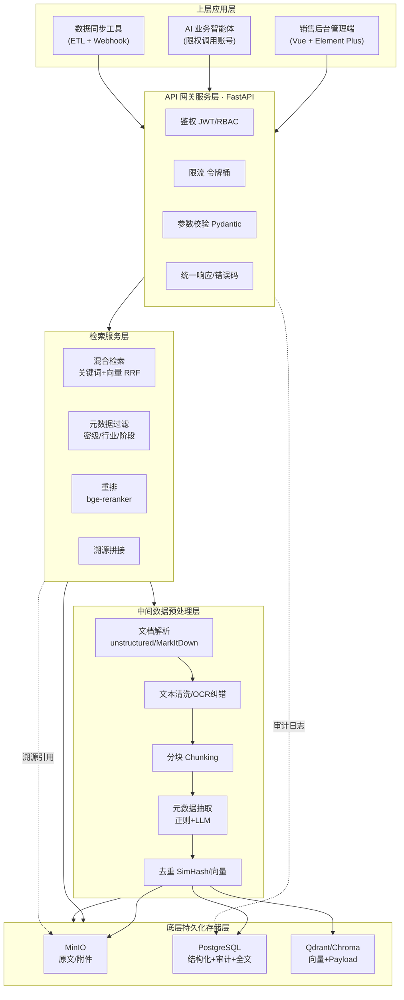
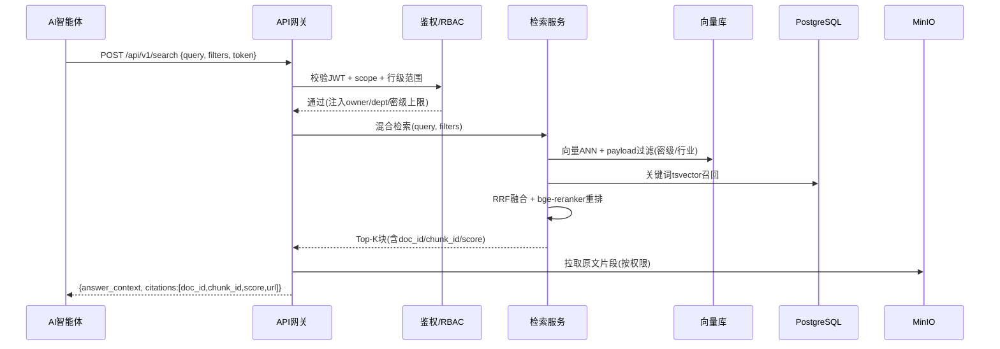

# 销售线索专属私有资料库 · 整体搭建方案（开源免费 · 私有化部署）

> 适用对象：销售 / 销售主管 / 运营 / 业务 AI 智能体
> 技术基调：全套开源免费组件，可私有化部署，严禁任何商用付费向量库或知识库平台
> 文档定位：可直接用于立项、排期、开发、交付的施工蓝图

---

## 〇、方案总览与选型结论（先给结论）

在展开九大模块前，先把核心技术选型拍定，后续所有模块均围绕此选型落地。

### 表 0-1 核心组件选型总表

| 层级 | 能力 | 推荐开源组件 | 选型理由 | 备选（同为开源） |
|---|---|---|---|---|
| 文件存储 | 线索原文/附件 | **MinIO** | S3 协议、单机/分布式皆宜、私有化零成本 | SeaweedFS、本地对象存储 |
| 结构化库 | 线索元数据/业务表 | **PostgreSQL 16** | 支持 JSONB、全文检索、行级安全(RLS) | MySQL、SQLite |
| 向量库 | 语义检索 | **Qdrant**（首选）/ **Chroma**（轻量） | Qdrant 过滤强、支持 payload、私有化成熟 | Milvus、FAISS |
| 关键词检索 | 精确匹配 | **PostgreSQL 全文检索**（tsvector）+ 可选 **Typesense** | 复用 PG，省一套运维 | Meilisearch、Elasticsearch |
| Embedding | 中文向量化 | **BGE-M3**（BAAI，开源）/ **bge-large-zh** | 中英多语、检索效果领先、可本地部署 | multilingual-e5、nomic-embed-text |
| RAG 编排 | 检索+生成链路 | **LlamaIndex**（或 LangChain） | 文档切分/检索器封装成熟 | Haystack |
| API 服务 | 对外 RESTful | **FastAPI**（Python） | 异步、OpenAPI 自动文档、易鉴权 | Flask、Go-Gin |
| 鉴权 | 认证/令牌 | **自研 JWT + RBAC**（或 Keycloak） | 轻量可控；Keycloak 功能全但偏重 | Authelia、Ory Kratos |
| 容器编排 | 部署 | **Docker + docker-compose**（集群用 K8s） | 单机一条命令起全套 | Nomad |
| 调度任务 | 定时清理/备份 | **cron / Celery Beat** | 零依赖，够用 | Apache Airflow |
| 可观测 | 日志/审计 | **Prometheus + Loki + Grafana** | 全开源监控栈 | ELK |

### 表 0-2 向量库选型结论（详细对比见模块五）

| 维度 | Qdrant | Chroma | Milvus Lite | FAISS |
|---|---|---|---|---|
| 是否独立服务 | 是（Rust 服务） | 是（可内嵌） | 内嵌库 | 纯库（需自封服务） |
| 元数据过滤 | 强（payload filter） | 中 | 弱 | 无（需自写） |
| 适合线索场景 | ⭐ 首选（过滤+溯源强） | 轻量单机首选 | 小数据试用 | 仅做向量计算底座 |
| 私有化难度 | 低 | 极低 | 低 | 中（需自研服务层） |
| 大规模分片 | 支持 | 有限 | 不支持 | 需自研 |

> **最终拍板**：中小团队用 **Chroma + PostgreSQL + MinIO** 单机；百人/百万级用 **Qdrant 集群 + PostgreSQL + MinIO 分布式**。下文两套部署方案即基于此。

---

## 一、业务需求定义与线索资产标准

### 1.1 资料库服务对象

| 角色 | 使用方式 | 核心诉求 |
|---|---|---|
| 销售 | 后台录入/查询线索、上传沟通记录 | 快速找到历史相似客户、报价参考 |
| 销售主管 | 团队线索看板、权限审批 | 掌控下属线索、防止飞单/泄露 |
| 运营 | 只读分析、标签维护 | 盘点线索资产、产出报表 |
| AI 业务智能体 | 调用 REST API 检索/引用 | 自动回答客户问题、生成跟进建议 |

### 1.2 承载的线索文件 / 数据类型

**【业务视角】销售日常应归档的资料类型**
- 客户基础资料：工商信息、官网、名片、介绍 PPT
- 沟通记录：电话纪要、微信/邮件往来、拜访记录
- 招投标资料：招标公告、投标文件、评分标准
- 竞品信息：竞品报价单、功能对比、攻防话术
- 成交案例：已签合同摘要、成功复盘、客户证言
- 报价方案：标准报价单、定制方案、折扣审批流

**【开发视角】数据类型与落地字段映射**
- 非结构化文档 → 解析入库（PDF/Word/Excel/图片 OCR）→ MinIO 存原文 + 文本块入向量库
- 半结构化（Excel 线索表）→ ETL 脚本解析 → PostgreSQL 结构化表
- 纯结构化线索 → 直接 API 写入 PostgreSQL

### 1.3 结构化线索字段清单（强制元数据基线）

| 字段名 | 类型 | 必填 | 说明 |
|---|---|---|---|
| lead_id | UUID | 是 | 主键 |
| customer_name | string | 是 | 客户名称 |
| industry | enum | 是 | 行业（制造/金融/政企/互联网…） |
| stage | enum | 是 | 线索阶段（初步接触/需求确认/方案/谈判/成交/丢单） |
| deal_status | enum | 是 | 成交状态 |
| owner | string | 是 | 跟进人（销售工号） |
| lead_level | enum | 是 | 线索等级 A/B/C |
| secrecy_level | enum | 是 | 密级（公开/内部/机密/绝密） |
| source | enum | 是 | 来源（官网/展会/转介绍/招标/广告） |
| tags | jsonb | 否 | 标签数组 |
| contact | jsonb | 否 | 联系人/电话/职位 |
| amount | number | 否 | 预估金额 |
| created_at | datetime | 是 | 创建时间 |
| updated_at | datetime | 是 | 更新时间 |
| expire_at | datetime | 否 | 过期时间（用于清理） |

### 1.4 数据量级、增量、保密分级

**【业务视角】盘点口径**
- 初期存量：约 5 万条线索 + 20 万份文档
- 日增量：约 200–500 条新线索、1,000+ 份新文档
- 保密分级：公开（产品彩页）/ 内部（沟通记录）/ 机密（报价底价、合同条款）/ 绝密（大客户战略、未公开招投标）

**【开发视角】容量与存储规划**
- 文本块（chunk）估算：20 万文档 ≈ 2,000 万 chunk，向量维度 1024（BGE-M3）→ 约 80GB 向量索引
- 向量库分片：Qdrant 按 `industry` 或 `owner_dept` 分片；Chroma 按 collection 隔离
- 增量写入：每日凌晨批量 + 实时单条双通道（见模块二）

### 1.5 AI 智能体调用核心诉求与 API 能力清单

**【业务视角】智能体能帮销售做的事**
- “找 3 个和某客户行业相似、已成交的案例”
- “这个客户上次报价多少、谁跟的”
- “根据招投标资料，生成应标要点”
- 所有回答必须带原文出处，销售可一键溯源

**【开发视角】API 能力清单（RESTful）**

| 接口 | 方法 | 能力 | 鉴权 |
|---|---|---|---|
| `/api/v1/search` | POST | 混合检索（语义+关键词）+ 元数据过滤 | Bearer Token |
| `/api/v1/documents/{id}/raw` | GET | 读取原文（按权限返回） | Bearer Token + 行级过滤 |
| `/api/v1/documents/{id}` | GET | 获取元数据+溯源引用块 | Bearer Token |
| `/api/v1/leads/import` | POST | 批量导入线索（Excel/JSON） | Bearer Token（写权限） |
| `/api/v1/leads/{id}` | GET/PUT | 单条线索读取/更新 | Bearer Token |
| `/api/v1/citations` | POST | 给定回答反查溯源块 | Bearer Token |

---

## 二、全链路技术架构分层设计

### 2.1 五层架构职责

**底层持久化存储层**
- MinIO：原始文件、附件、图片 OCR 后文本
- PostgreSQL：结构化线索表、元数据、审计日志、标签
- Qdrant/Chroma：向量索引 + payload 过滤字段

**中间数据预处理层**
- 文档解析（ unstructured / MarkItDown）：PDF/Word/Excel/PPT → 纯文本
- 文本清洗：去噪、表格结构化、OCR 纠错
- 分块（chunking）：按语义+长度混合切分（见模块五）
- 元数据自动抽取：正则 + LLM 抽取行业/意向度/竞品
- 去重：SimHash / 向量近邻比对

**检索服务层**
- 混合检索：关键词（PG tsvector）+ 向量（ANN）双路召回 → RRF 融合
- 过滤筛选：密级、行业、阶段、跟进人、时间窗
- 重排（rerank）：bge-reranker 开源模型精排 Top-K

**API 网关服务层**
- 鉴权（JWT 校验 + 角色路由）
- 限流（令牌桶，按账号/智能体分配额）
- 参数校验（Pydantic schema）
- 统一响应封装 + 错误码

**上层应用层**
- 销售后台管理端（Vue/React + 开源 UI）
- AI 智能体调用端（HTTP 客户端，限权账号）
- 数据同步工具（定时 ETL + 实时 Webhook）

### 2.2 Mermaid 整体分层架构流程图（独立成块，可直接复制渲染）



---

## 三、销售线索专属数据标准化治理规范

### 3.1 多级目录分类架构（三级）

**【业务视角】录入时如何选目录**
- 一级：客户行业（制造 / 金融 / 政企 / 互联网 / 医疗…）
- 二级：线索阶段（初步接触 / 需求确认 / 方案 / 谈判 / 成交 / 丢单）
- 三级：成交状态（进行中 / 已成交 / 已流失 / 休眠）

> 业务人员录入时只需在后台下拉选择三级标签，系统自动映射目录与元数据，不需手工建文件夹。

### 3.2 统一强制元数据字段清单

见模块一表 1.3（lead_level、secrecy_level、owner、source、tags 等强制字段）。此处补充**自动抽取字段**：
- `industry`（从工商信息/文本抽取）
- `intent_score`（意向度 0–100，模型打分）
- `competitor_match`（命中的竞品列表）

### 3.3 自动打标 + 人工补充流程

**【业务视角】打标操作规范**
- 系统自动打：行业、意向度、竞品匹配（录入后 5 分钟内完成）
- 销售人工补：客户痛点、关键决策人、自定义标签
- 主管复核：A 级线索标签须主管确认

**【开发视角】打标实现规则**
- 行业/竞品：维护词典 + 正则 + 轻量分类模型
- 意向度：用 BGE 文本分类或规则评分（邮件回复数、拜访次数加权）
- 落地伪码：
```python
def auto_tag(doc_text, meta):
    meta["industry"] = classify_industry(doc_text)          # 词典+模型
    meta["intent_score"] = intent_model.score(doc_text)     # 0-100
    meta["competitor_match"] = match_competitor(doc_text)   # 竞品词典
    return meta
```

### 3.4 过期/无效/重复线索自动清理

**【业务视角】清理规则（销售须知）**
- 超过 180 天无更新且未成交 → 标记「休眠」，主管可一键复活
- 明确丢单/虚假线索 → 进入「待清理」，30 天后软删除
- 重复线索 → 系统提示合并，保留主线索

**【开发视角】定时任务与去重算法**
- 调度：Celery Beat 每日 02:00 执行 `cleanup_leads`
- 过期：`UPDATE leads SET status='dormant' WHERE updated_at < now()-180d AND deal_status!='won'`
- 重复：SimHash 指纹 + 向量余弦 > 0.92 判定近似 → 生成合并建议工单
- 软删除：保留 `deleted_at` 标记，不入检索，备份可恢复

---

## 四、精细化分级权限管控体系

### 4.1 角色矩阵

| 角色 | 读自己 | 读部门 | 读全员 | 写 | 导出 | 密级上限 |
|---|---|---|---|---|---|---|
| 超级管理员 | ✅ | ✅ | ✅ | ✅ | ✅ | 绝密 |
| 销售主管 | ✅ | ✅ | ❌ | 下属线索 | 部门 | 机密 |
| 普通销售 | ✅ | ❌ | ❌ | 自己 | 自己 | 内部 |
| 只读运营 | ✅(脱敏) | ✅(脱敏) | ❌ | ❌ | ❌ | 内部 |
| AI 智能体账号 | 按授权范围 | 按授权范围 | 受限 | ❌ | ❌(禁批量) | 内部 |

### 4.2 数据隔离规则

**【业务视角】查阅流程**
- 查自己线索：直接查
- 查部门线索：主管审批或默认可见
- 查机密/绝密：提交申请 → 主管+管理员二次审批 → 留痕

**【开发视角】行级过滤（PostgreSQL RLS）**
```sql
CREATE POLICY lead_isolation ON leads
  USING (
    owner = current_user_id()
    OR dept_id = current_dept_id()
    OR has_role('admin')
  );
```
- API 层：JWT 解析 `user_id/dept/roles` → 注入查询上下文
- 向量库：Qdrant payload 带 `owner_dept`/`secrecy_level`，检索时强制 `must` 过滤

### 4.3 全操作审计

**【开发视角】审计日志表（写入 PostgreSQL，不可改）**
- 记录：who / action(view/download/api_call/copy/export) / target_id / ip / time / 返回条数
- 所有 `/api/v1/documents/raw` 与 `export` 强制入库审计
- Loki 同步采集 API 访问日志，Grafana 看板监控异常批量读取

### 4.4 AI 智能体专属权限

**【开发视角】智能体账号约束**
- 独立 `agent` 角色，JWT 携带 `scope=read_limited`
- 禁止 `export` 接口；`search` 单次返回 ≤ 20 条，日调用 ≤ 5000 次
- 密级 > 内部 的线索在 payload 过滤阶段直接剔除，智能体无感
- 所有智能体读取走审计，可追溯「哪次回答引用了哪条线索」

---

## 五、开源向量库选型 & RAG 智能体联动方案

### 5.1 主流开源向量库对比（线索场景）

| 维度 | Qdrant | Chroma | Milvus Lite | FAISS |
|---|---|---|---|---|
| 语言/部署 | Rust 服务/Docker | Python/可内嵌 | Python 内嵌 | C++ 库 |
| 元数据过滤 | ⭐ 强（filter 表达式） | 中（where） | 弱 | 无（自写） |
| 溯源 payload | 原生支持 | 支持 | 支持 | 需自管 |
| 分片/规模 | 支持集群分片 | 单机为主 | 不支持 | 需自研 |
| 混合检索 | 内置 sparse+密集 | 需配 | 需配 | 需配 |
| 适合阶段 | 百人/百万级 | 中小团队 | 试用 | 仅底座 |

> 结论：Chroma 用于轻量方案，Qdrant 用于集群方案（见模块六）。

### 5.2 线索文档切片策略 + Embedding 推荐

**【开发视角】切片规则**
- 策略：父子分块（parent 大块 1000 字保上下文，child 小块 200–300 字用于向量）
- 切分边界优先按标题/段落，避免句子断裂
- 每份文档 embedding 模型：**BGE-M3**（1024 维，中英多语），本地 `FlagEmbedding` 部署
- 入库更新：新文档 → 解析 → 切块 → 批量 embedding → upsert（带 payload：lead_id/密级/行业）

### 5.3 AI 智能体完整调用链路



### 5.4 幻觉与无关召回优化

**【业务视角】智能体使用规范**
- 必须基于返回 citation 作答，禁止凭空补全客户信息
- 低置信度（score < 阈值）时，回答「未找到确切资料」而非编造
- 涉及报价/合同，必须引导销售查阅原文，不代下结论

**【开发视角】优化手段**
- 检索侧：payload 强过滤（行业/阶段/密级）+ rerank 精排
- 生成侧：prompt 约束「仅使用 context，无依据输出『未知』」
- 无关召回：query 改写（HyDE 假设性文档）+ 业务术语同义词扩展
- 评估：定期用标注集测召回准确率，低于 85% 触发切片/模型迭代

---

## 六、两套开源部署方案完整对比

### 6.1 方案对比总表

| 对比项 | 轻量单机部署 | 分布式集群部署 |
|---|---|---|
| 适用规模 | ≤50 人销售团队 | 百人级 / 线索百万级 |
| 向量库 | Chroma（单机） | Qdrant 集群（3+ 节点） |
| 结构化库 | PostgreSQL 单实例 | PostgreSQL 主从 + 读写分离 |
| 文件存储 | MinIO 单节点 | MinIO 分布式（4+ 盘/节点） |
| 硬件配置 | 1 台 8C16G / 500G SSD | 3× 16C32G + 独立向量节点 GPU 可选 |
| 开源组件清单 | Docker Compose 一把起 | K8s + Helm / docker swarm |
| 部署难度 | ⭐ 低（半小时） | ⭐⭐⭐ 中高（需运维） |
| 维护成本 | 低（单人可管） | 中（需专职） |
| 并发承载 | ~50 QPS | ~500+ QPS |
| 备份 | pg_dump + MinIO 镜像 | 集群备份 + 定时快照 |

### 6.2 【开发视角】分步部署脚本思路

**轻量方案（docker-compose 核心片段）**
```yaml
services:
  postgres: { image: postgres:16, volumes: [pgdata:/var/lib/postgresql] }
  minio:    { image: minio/minio, command: server /data }
  chroma:   { image: chromadb/chroma, ports: ["8000:8000"] }
  api:      { build: ./api, depends_on: [postgres, minio, chroma] }
```

**集群方案要点**
1. `helm install qdrant qdrant/qdrant --set replicaCount=3`
2. PostgreSQL 用 CloudNativePG 算子做主从
3. MinIO 分布式：`minio server http://node{1...4}/data{1...4}`
4. API 多副本 + Nginx 反向代理 + Prometheus 监控

**环境依赖清单**：Docker ≥ 24 / Docker Compose ≥ 2.20 / Python 3.11+ / 2GB 以上空闲内存（轻量）；集群需 K8s 1.28+。

---

## 七、分阶段落地实施排期（可直接排期）

| 阶段 | 周期 | 交付物 | 责任 |
|---|---|---|---|
| 1 数据梳理与元数据标准 | 第 1–2 周 | 字段清单、密级标准、样本数据 | 业务+架构 |
| 2 开源环境搭建 | 第 3–4 周 | PG/MinIO/向量库跑通、compose 文件 | 开发 |
| 3 预处理服务+API网关 | 第 5–7 周 | 解析/切块/去重服务、REST API | 开发 |
| 4 权限体系+后台 | 第 8–10 周 | RBAC/RLS、管理端 UI | 开发+前端 |
| 5 智能体对接调优 | 第 11–12 周 | 调用链路、检索准确率≥85% | 开发+算法 |
| 6 灰度+培训+切换 | 第 13–14 周 | 20% 灰度→全量、操作手册 | 全员 |
| 7 长期迭代 | 持续 | 月度模型迭代、季度复盘 | 运维 |

---

## 八、销售资料库高频故障 & 优化策略

### 8.1 检索不准确 / 向量召回杂乱
- **【业务处理办法】**：销售反馈「搜不到」时，先确认是否选对行业/阶段过滤；无效结果可点「标记不相关」帮助训练。
- **【开发技术优化手段】**：强化 payload 过滤；引入 rerank；query 改写（HyDE）；定期用标注集回归测试。

### 8.2 大批量导入卡顿 / 向量入库慢
- **【业务处理办法】**：超 1 万条线索走「批量导入任务」，勿在后台单条粘贴；导入高峰避开白天。
- **【开发技术优化手段】**：embedding 批处理（batch=32）+ 异步队列（Celery）；向量库批量 upsert；PG 关闭索引后批量写入再重建。

### 8.3 智能体 API 超限 / 数据泄露
- **【业务处理办法】**：智能体异常大量读取时，运营应收到告警并临时冻结账号。
- **【开发技术优化手段】**：令牌桶限流 + 日配额；密级 payload 硬过滤；异常行为（单账号>1000 次/小时）自动熔断 + 审计告警。

### 8.4 重复线索堆积 / 存储过高
- **【业务处理办法】**：销售收到「疑似重复」提示时 24h 内处理合并。
- **【开发技术优化手段】**：SimHash 指纹去重 + 向量近邻扫描；MinIO 冷数据转生命周期归档；PG 分区表按时间滚动。

---

## 九、长期运维、备份与迭代机制

### 9.1 定时备份（全开源）
- **【开发视角】**：
  - PostgreSQL：`pg_dump` 每日 03:00 → MinIO `backup/` 桶（保留 30 天）
  - 向量库：Qdrant snapshot API / Chroma 目录打包 → MinIO
  - MinIO 自身：启用版本化 + 跨节点复制
  - 恢复演练：每月一次 `restore` 演练，验证 RTO<2h

### 9.2 日志审计与数据盘点
- 审计日志入 PostgreSQL + Loki；Grafana 看板监控敏感操作
- 季度线索盘点：统计休眠/重复/密级分布，输出资产报告

### 9.3 月度向量库 / 模型迭代
- 每月评估 embedding/rerank 模型新版本（BGE 系列持续开源更新）
- A/B 对比检索准确率，达标才切换；旧索引保留 1 个版本可回滚

### 9.4 安全更新与漏洞修复
- 组件版本钉死 + 定期 `trivy` 镜像扫描
- 安全公告订阅（GitHub Security Advisories）；紧急 CVE 48h 内打补丁
- 密钥/JWT 私钥轮换：每季度一次，KMS 或文件挂载，禁硬编码

---

## 全局约束自检（交付前确认）

- ✅ 全部开源免费：MinIO / PostgreSQL / Qdrant / Chroma / BGE / FastAPI / LlamaIndex / Keycloak 等均无商用费用
- ✅ 对比全部 Markdown 表格：表 0-1 / 0-2 / 1.3 / 1.5 / 4.1 / 5.1 / 6.1 等
- ✅ Mermaid 独立成块：模块二架构图 + 模块五时序图，可直接渲染
- ✅ 双视角标注：每个业务模块均分【业务视角】与【开发视角】
- ✅ 无空洞理论：含字段清单、切片伪码、RLS SQL、compose 片段、排期表、故障处理
- ✅ 四大核心齐备：权限体系（四）、向量库分片（一.4/五）、线索数据治理（三）、API 鉴权与智能体链路（二/四/五）
