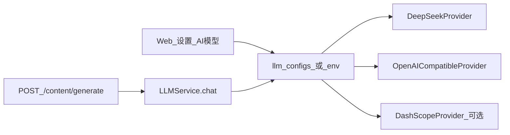
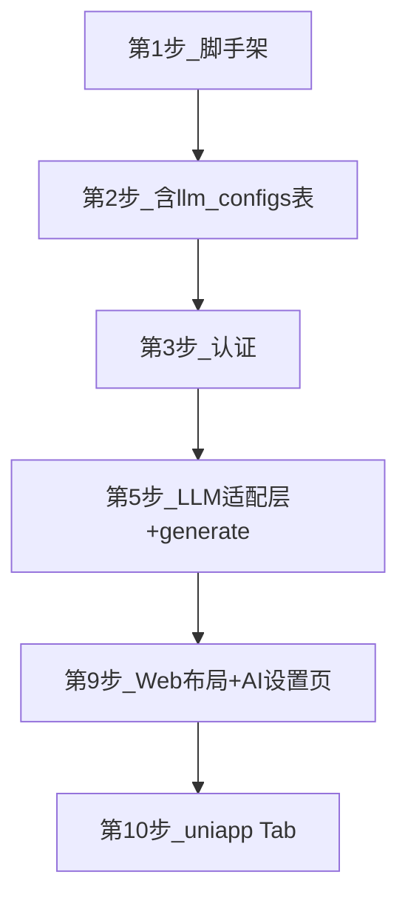

# P0：可插拔 LLM + 企知道风格 UI

## 需求摘要（已纳入 SRS v0.2）

| 项 | 优先级 | 验收 |
|----|--------|------|
| FR-GEN-01 DeepSeek 默认接入 | P0 | 配置 KEY 后可调用生成 |
| FR-GEN-01a 切换其他大模型 | P0 | 设置页改 provider/model 后生成成功 |
| FR-GEN-01b 密钥加密与脱敏 | P0 | DB 加密，界面 `sk-****` |
| FR-UI-01~07 Web 布局 | P0 | 顶栏+侧栏+Dashboard+对话创作 |
| FR-UI-09~12 APP/H5 | P0 | 底部 Tab + 卡片首页 |

**参考文档：**
- [ai-content-marketing-需求规格.md](C:\Users\admin\.cursor\plans\ai-content-marketing-需求规格.md) — §3.4 FR-GEN、§3.10 FR-UI
- [ai获客系统实现步骤_d9ded7ad.plan.md](C:\Users\admin\.cursor\plans\ai获客系统实现步骤_d9ded7ad.plan.md) — 第 5 / 9 / 10 步

**UI 参照原则：** 借鉴企知道「科创空间」的 SaaS 工作台 + AI 对话 + 营销拓客信息架构；**不复制** Logo、专利检索、产业链图谱等无关模块；自有品牌，主色 `#1677ff`。

---

## 一、LLM 可插拔架构（第 5 步核心）



### 后端文件（[`apps/api`](e:\ai-content-marketing\apps\api)）

| 路径 | 职责 |
|------|------|
| `app/services/llm/base.py` | `LLMProvider` 抽象：`chat()` / `stream()` |
| `app/services/llm/deepseek.py` | 默认实现，调用 `https://api.deepseek.com/v1/chat/completions` |
| `app/services/llm/openai_compatible.py` | 通用 OpenAI 兼容（含多数国产网关） |
| `app/services/llm/dashscope.py` | 通义（可选，二期前可 stub） |
| `app/services/llm/factory.py` | 按 `provider` 枚举实例化 |
| `app/services/llm_service.py` | 业务唯一入口，解析 tenant 配置 → 调用 Provider |
| `app/models/llm_config.py` | SQLAlchemy 模型 |
| `app/routers/llm_config.py` | CRUD + `POST /test` 连通性探测 |

### 数据表 `llm_configs`（第 2 步 Alembic 一并创建）

```sql
-- 字段要点
tenant_id, provider, base_url, api_key_encrypted, model, timeout_sec, is_active, created_at
```

- **优先级：** 租户 `llm_configs.is_active` > 环境变量 `LLM_PROVIDER` + `DEEPSEEK_API_KEY` 等
- **密钥：** Fernet 或 `cryptography` 对称加密；API 响应仅返回 `api_key_masked`
- **禁止：** 业务代码直接 `import httpx` 调 DeepSeek，必须经 `LLMService`

### 环境变量（`.env.example`）

```ini
LLM_PROVIDER=deepseek
DEEPSEEK_API_KEY=sk-...
DEEPSEEK_BASE_URL=https://api.deepseek.com
DEEPSEEK_MODEL=deepseek-chat

# 切换示例
# LLM_PROVIDER=openai_compatible
# LLM_BASE_URL=https://api.openai.com/v1
# LLM_API_KEY=sk-...
# LLM_MODEL=gpt-4o-mini
```

### API 端点

| 方法 | 路径 | 说明 |
|------|------|------|
| GET | `/api/v1/settings/llm` | 当前生效配置（脱敏） |
| PUT | `/api/v1/settings/llm` | 保存 provider/base_url/key/model |
| POST | `/api/v1/settings/llm/test` | 发送短 prompt，返回 latency + 模型名 |
| POST | `/api/v1/content/generate` | 生成内容（内部调 LLMService） |
| GET | `/api/v1/content/generate/stream` | SSE 流式（创作中心打字机，P0 可先非流式，第 9 步补 SSE） |

### P0 验收用例

1. 仅配 `DEEPSEEK_API_KEY` → 生成公众号 draft 成功
2. 设置页改为 `openai_compatible` + 有效 base_url/key/model → 再次生成成功
3. 错误 KEY → 前端 Toast「模型连接失败」+ 后端日志含 request_id
4. 租户 A/B 各自 KEY，互不可见

---

## 二、Web UI — 企知道科创空间气质（第 9 步）

### 布局骨架

```
┌─────────────────────────────────────────────────────┐
│ 顶栏 #1677ff │ Logo │ 产品名 │ 搜索? │ 消息 │ 头像 │
├──────────┬──────────────────────────────────────────┤
│ 侧栏     │  灰底 #f5f5f5                           │
│ 200px    │  ┌─ 白卡片 指标 ─┐ ┌─ 白卡片 快捷入口 ─┐ │
│ ·工作台  │  └──────────────┘ └───────────────────┘ │
│ ·营销创作│  ┌─ 创作：左模板 / 右对话流式 ─────────┐ │
│ ·内容库  │  └────────────────────────────────────┘ │
│ ·发布日历│                                           │
│ ·知识库  │                                           │
│ ·数据看板│                                           │
│ ·设置    │                                           │
└──────────┴──────────────────────────────────────────┘
```

### 关键页面与 FR 映射

| 页面 | 参照点 | 实现 |
|------|--------|------|
| 工作台 | 企知道 Dashboard 指标卡片 | Element Plus `el-row` + 4 指标卡 + ECharts 折线（FR-UI-04） |
| 创作中心 | 「科创 GPT」对话面板 | 左：平台/场景/选题；右：`el-scrollbar` + 流式 Markdown（FR-UI-05） |
| 设置 → AI 模型 | 企业 SaaS 表单页 | provider 下拉、base_url、KEY 密码框、model、测试按钮（FR-GEN-01a） |
| 内容库 | 多维筛选表格 | `el-table` + 状态 Tag 色（draft/approved/published）（FR-UI-06） |

### 设计 token（[`packages/shared/design-tokens.css`](e:\ai-content-marketing\packages\shared\design-tokens.css)）

```css
--color-primary: #1677ff;
--color-bg-page: #f5f5f5;
--radius-card: 8px;
--shadow-card: 0 1px 4px rgba(0,0,0,.08);
```

Web 与 uni-app 共用 token，保证 APP 气质一致（FR-UI-13）。

---

## 三、uni-app APP/H5（第 10 步）

| Tab | 参照 | 功能 |
|-----|------|------|
| 首页 | 企知道 APP 卡片摘要 | 待审核数、今日排期卡片（FR-UI-10） |
| 待办 | 清晰列表+角标 | 审核通过/驳回 |
| 创作 | 简化版 | 选题 + 调 generate API |
| 我的 | 设置入口 | 个人提示词、账号 |

组件：**uView-plus** 或 **uni-ui**；底部 Tab 固定，列表大留白（FR-UI-09~12）。

---

## 四、实施顺序（与总计划对齐）



**第一周 Day5 里程碑（LLM P0）：** DeepSeek 调通 + `/content/generate` 返回 draft；Day7 接 RAG。

**开发期仅需：** DeepSeek API Key（或任一 OpenAI 兼容 Key）；无需微信/备案。

---

## 五、不在 MVP 范围

- 多模型并行/路由策略（按场景自动选模型）→ 二期
- 复制企知道专利/产业链/招投标模块 → 明确禁止
- 微信真机 LLM 测试 → 与 LLM 无关，L4 部署后

---

## 确认后执行

回复 **「开始执行第 1 步」** 将在 [`e:\ai-content-marketing`](e:\ai-content-marketing) 创建 monorepo 并按上述顺序实现；LLM 与 UI 分别在第 5、9–10 步交付。
