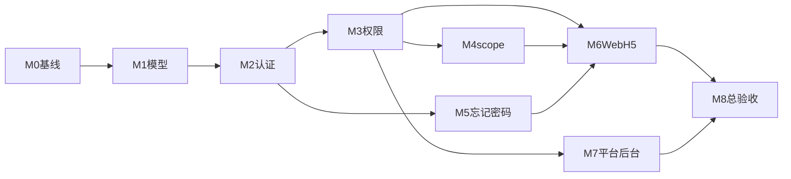

# AI 内容获客系统 — v0.3.3 执行计划

| 项目 | 说明 |
|------|------|
| 文档版本 | v0.3.3 |
| 关联需求 | [需求规格.md](./需求规格.md) v0.3.3 |
| 基础搭建 | [实现步骤计划.md](./实现步骤计划.md)（v0.2 从零搭建，历史参考） |
| 预估工期 | 15～18 人天（1 人全栈） |
| 测试环境 | `SMS_PROVIDER=mock`，`SMS_MOCK_CODE=1111` |

---

## 1. 总原则

| 原则 | 说明 |
|------|------|
| **先后端、后双端** | 每步 API 验证通过后再做 Web/H5 |
| **双端同步** | v0.3 起功能 Web + H5 同规则、同验收（平台 `/admin` 除外） |
| **服务端为准** | 权限与数据 scope 必须 API 强制；前端隐藏不算通过 |
| **一步一验** | 未通过当前里程碑 **禁止** 进入下一步 |
| **FR 可追溯** | 每项验证关联 [需求规格](./需求规格.md) 中的 FR/NFR ID |

---

## 2. 现状对照

| 模块 | 状态 | 关键路径 |
|------|------|----------|
| 平台额度 + Mock LLM | ✅ 已实现 | `apps/api/alembic/versions/009_platform_llm_quota.py`、`platform_llm_service.py`、Web `AdminPlatformLlm.vue` |
| User.tenant_id 单租户模型 | ❌ v0.2 | `apps/api/app/models/__init__.py` |
| Membership / TenantRole / Permission | ❌ | — |
| JWT active_tenant_id、选/切换公司 | ❌ | `auth_service.py`、`dependencies.py` |
| 权限引擎 + 团队/企业 API | ❌ | — |
| Dashboard/Analytics/Content scope | ❌ | — |
| 取消 reviewer 审核流 | ❌ | `content_service.py` 仍含审核逻辑 |
| 忘记密码 | ❌ | — |
| Web/H5 选公司、忘记密码、角色成员页 | ❌ | — |
| 平台企业管理 / 转移管理员 | ❌ | `AdminUsers.vue` 删用户仍可能删整租户 |

---

## 3. 里程碑依赖



**可并行：**

- M5 在 M2 完成后可与 M3/M4 部分并行（仅依赖公开 auth 路由）
- M7 在 M3 完成后可与 M6 并行
- **M8 必须等 M6 + M7 均完成**

---

## 4. M0：基线确认（0.5 天）

**目标：** 确认 v0.2 可用功能不回归；平台额度已交付项可复用。

**执行清单：**

1. `cd apps/api && alembic upgrade head`（至 `009_platform_llm_quota`）
2. 启动 API / Web / H5，跑通注册、登录、创作、内容列表、Mock 发布

**严格验证：**

| 编号 | 检查项 | 通过标准 | 关联 FR |
|------|--------|----------|---------|
| V0-1 | 迁移 | `alembic current` = `009`，无 pending migration | — |
| V0-2 | 平台额度 API | `GET /llm/quota` 新租户返回 `limit=100, used=0` | FR-GEN-01b |
| V0-3 | 扣费 | `POST /content/generate` 成功 → `used+1`；`POST /content/proposals` 成功 → `used` 不变 | FR-GEN-01b |
| V0-4 | 平台 AI 后台 | platform_admin 可 PATCH `/admin/platform-llm` 并 test 连接 | FR-ADMIN |
| V0-5 | 回归 | 现有 Web 登录、创作、内容库无 500 | — |

---

## 5. M1：数据模型与迁移（2～3 天）

**目标：** 从 `User.tenant_id + role` 迁到 Membership + TenantRole + Permission（FR-AUTH-10～12，§4.2）。

**执行清单：**

1. 新增迁移 `apps/api/alembic/versions/010_membership_roles.py`：
   - `tenant_memberships`（user_id, tenant_id, role_id, is_active, joined_at）
   - `tenant_roles`（tenant_id, code, name, is_system）
   - `tenant_role_permissions`（role_id, permission_code）
   - `tenants.credit_code`（nullable, 18 位）
   - `users` 去掉对单一 tenant 的强依赖（保留 platform_admin 标识）
2. 更新 [`apps/api/app/models/__init__.py`](apps/api/app/models/__init__.py)
3. 新增权限 Catalog 常量模块（与 [需求规格 §2.5](./需求规格.md) 完全一致）
4. 数据迁移：每个旧 User → 1 Tenant + 1 Membership(admin) + 内置 admin/editor 角色及权限种子

**严格验证：**

| 编号 | 检查项 | 通过标准 | 关联 FR |
|------|--------|----------|---------|
| V1-1 | 表结构 | 存在上述 3 张新表 + `tenants.credit_code` | FR-AUTH-10 |
| V1-2 | 种子角色 | 每个 tenant 恰好 2 条 system role：`admin`、`editor` | FR-AUTH-11 |
| V1-3 | editor 默认权限 | DB 中 editor 角色 permissions **精确等于** §2.5 带 ✅ 的 code 集合（8 项） | §2.5 |
| V1-4 | admin 权限 | admin 角色包含 §2.5 全部 permission code | §2.5 |
| V1-5 | 旧数据 | 迁移后每个旧用户仍有 1 条有效 Membership，角色为 admin | FR-AUTH-10 |
| V1-6 | 唯一约束 | 同一 `(user_id, tenant_id)` 仅 1 条 Membership | FR-AUTH-10 |
| V1-7 | 回滚演练 | `alembic downgrade -1` 再 `upgrade` 可重复执行（开发库） | — |

**editor 默认权限（8 项，用于 V1-3 对照）：**

`content.create`、`content.list_own`、`content.view_own`、`preference.manage`、`dashboard.view`、`analytics.view`

---

## 6. M2：认证、JWT、多公司（2 天）

**目标：** FR-AUTH-02/10～14、NFR-SEC-01。

**执行清单：**

1. JWT payload 增加 `active_tenant_id`（null = 待选公司）
2. 新/改接口于 [`apps/api/app/routers/auth.py`](apps/api/app/routers/auth.py)：
   - `GET /auth/me` → user、active_tenant、permissions[]、tenants[]
   - `POST /auth/select-tenant`
   - `POST /auth/switch-tenant`
3. 注册 FR-AUTH-11：Tenant + 内置角色 + 首成员 admin
4. [`apps/api/app/dependencies.py`](apps/api/app/dependencies.py)：`get_current_membership()` 校验 JWT tenant 与 Membership
5. 所有业务路由从 `user.tenant_id` 改为 `active_tenant_id`

**严格验证：**

| 编号 | 检查项 | 通过标准 | 关联 FR |
|------|--------|----------|---------|
| V2-1 | 单公司登录 | 1 家 Membership → 登录后直接可用，token 含 `active_tenant_id` | FR-AUTH-13 |
| V2-2 | 多公司登录 | 2 家 Membership → 登录后 `need_select_tenant=true` 或 `active_tenant_id=null` | FR-AUTH-13 |
| V2-3 | 必须先选 | 未 select-tenant 时 `GET /contents` → **403**，detail 含「请先选择公司」 | FR-AUTH-13 |
| V2-4 | select-tenant | 选 A 公司 → 后续 API 仅返回 A 的数据 | FR-AUTH-04 |
| V2-5 | switch-tenant | A→B 后，A 的 content_id 用同一 token 请求 → **404 或 403** | FR-AUTH-14 |
| V2-6 | 非法 tenant | select 非本人 Membership 的 tenant_id → **403** | NFR-SEC-01 |
| V2-7 | 禁用成员 | Membership.is_active=false → 该公司不可选、不可切换 | FR-AUTH-16 |
| V2-8 | JWT 篡改 | 改 payload 中 tenant_id → **403** | NFR-03 |

**API 用例（李四：Membership 甲 + 乙）：**

```
1. POST /auth/login → need_select
2. POST /auth/select-tenant {tenant_id: 甲} → 200
3. GET /contents → 仅甲的数据
4. POST /auth/switch-tenant {tenant_id: 乙} → 200
5. GET /contents → 仅乙的数据
```

---

## 7. M3：权限引擎与团队 API（3 天）

**目标：** §2.5、FR-TEAM-01～10、FR-TENANT-01～10。

**执行清单：**

1. 新增 `apps/api/app/services/permission_service.py`；`require_permission("content.create")` 依赖
2. 新路由：`/team/roles`、`/team/members` CRUD
3. 企业路由：`GET/PATCH /tenant/profile`（含 credit_code 校验）
4. FR-TEAM-10：非 admin 操作者禁止增删改 admin 成员
5. 加入公司 FR-AUTH-12：新建 Membership，默认 editor

**严格验证：**

| 编号 | 检查项 | 通过标准 | 关联 FR |
|------|--------|----------|---------|
| V3-1 | `/me` permissions | editor 登录返回 permissions 与 §2.5 editor 默认一致 | §2.5 |
| V3-2 | 无权限 API | editor 调 `PATCH /tenant/profile` → **403** | FR-TENANT-07 |
| V3-3 | 自定义角色 | admin 建「运营」，勾 `team.member.manage` + `dashboard.view_all` → 可管普通成员 | FR-TEAM-02/03 |
| V3-4 | FR-TEAM-10 | 「运营」尝试把某人设为 admin 或禁用 admin → **403** | FR-TEAM-10 |
| V3-5 | 至少 1 admin | 删除/降级最后一名 admin → **400**，事务回滚 | FR-TEAM-10 |
| V3-6 | 信用代码 | `credit_code="123"` → **422**；合法 18 位 → 200 | FR-TENANT-08/09 |
| V3-7 | 添加成员 | 新手机号 → Membership 角色=editor；已存在 User 仅新增 Membership | FR-TEAM-06 |
| V3-8 | 角色删除 | 有成员的自定义角色删除 → **400** | FR-TEAM-04 |

---

## 8. M4：业务 scope + 取消审核（2～3 天）

**目标：** FR-DASH/ANLY、内容库 scope、FR-REVIEW-10～11、FR-BRAND-10。

**执行清单：**

1. Dashboard / Analytics API：无 `*.view_all` 时 SQL 强制 `author_id = current_user.id`
2. Content list/detail：按 `content.list_own` / `list_all` 过滤
3. 废弃 [`apps/api/app/services/content_service.py`](apps/api/app/services/content_service.py) 审核流；前端去掉 pending_review UI
4. `UserPromptProfile` 绑定 `user_id`，与 tenant 无关

**严格验证：**

| 编号 | 检查项 | 通过标准 | 关联 FR |
|------|--------|----------|---------|
| V4-1 | editor 看板 | 甲公司 editor 仅见本人创作数；admin 见全公司，admin 数 ≥ editor 数 | FR-DASH-04/05 |
| V4-2 | 篡改参数 | editor 请求 `?scope=all` 或 `author_id=他人` → 仍仅本人数据 | FR-DASH-07 |
| V4-3 | 内容库 | editor `GET /contents` 不含他人文章 | FR-TEAM + §2.5 |
| V4-4 | 跨作者详情 | editor `GET /contents/{他人id}` → **403** | content.view_own |
| V4-5 | 审核废止 | `POST /contents/{id}/submit-review` → **404 或 410** | FR-REVIEW-10 |
| V4-6 | 个人偏好 | 李四在甲改偏好 → 切到乙 `GET /preference` 内容 **完全相同** | FR-BRAND-10 |
| V4-7 | 平台额度 | 同 M0 V0-3（回归） | FR-GEN-01b |

---

## 9. M5：忘记密码（1 天）

**目标：** FR-AUTH-18～22、NFR-SEC-04、FR-CLIENT-04。

**执行清单：**

1. `POST /auth/password/forgot/send-code`（scene=`reset_password`）
2. `POST /auth/password/forgot/reset`
3. [`apps/api/app/services/sms_service.py`](apps/api/app/services/sms_service.py) 场景隔离：login 码不能用于 reset
4. 成功后不签发 JWT（FR-AUTH-22）

**严格验证：**

| 编号 | 检查项 | 通过标准 | 关联 FR |
|------|--------|----------|---------|
| V5-1 | Mock 码 | send-code 后 reset 用 **1111** → 200 | FR-AUTH-20 |
| V5-2 | 旧密码失效 | reset 后旧密码 login → **401**；新密码 → **200** | FR-AUTH-21 |
| V5-3 | 不自动登录 | reset 响应体 **无** access_token | FR-AUTH-22 |
| V5-4 | 场景隔离 | login 场景码用于 reset → **400** | NFR-SEC-04 |
| V5-5 | 频控 | 60s 内重复 send → **429** | FR-AUTH-20 |
| V5-6 | 错误码 | 连续错误验证码 reset → **400/429** | FR-AUTH-21 |
| V5-7 | 未注册号 | send-code 返回产品约定文案（实现后写死测试） | FR-AUTH-20 |

---

## 10. M6：用户端 UI — Web + H5 同步（4～5 天）

**目标：** §3.9～3.11、FR-CLIENT-01～05、FR-UI-02～03/10～12/21～22。

**执行清单（Web 与 H5 同批交付）：**

| 子步 | 内容 | 主要文件 |
|------|------|----------|
| 6a | 选公司页、顶栏切换器、路由守卫 | Web [`router.js`](apps/web/src/router.js)；H5 `apps/mp/pages/` |
| 6b | 忘记密码页（3 步） | Web/H5 登录模块 |
| 6c | 设置：企业信息、角色与成员（权限勾选 UI 分组同 §2.5） | Web/H5 设置模块 |
| 6d | 侧栏/Tab 按 `/me.permissions` 动态渲染 | Web layout；H5 tabBar |
| 6e | 工作台/看板 scope 标签（P1） | Dashboard / Analytics 页 |

**严格验证（Web 与 H5 各测一遍）：**

| 编号 | 检查项 | 通过标准 | 关联 FR |
|------|--------|----------|---------|
| V6-1 | UAT-1 | 张三建甲=admin；李四=editor → 李四只见创作/偏好/本人内容库/本人看板 | §6.1 #1 |
| V6-2 | UAT-2 | 李四加入乙 → 登录 **必须先选**；选乙后看不到甲文章 | §6.1 #2 |
| V6-3 | UAT-3 | 自定义「运营」可管成员但 **不能** 动 admin | §6.1 #3 |
| V6-4 | UAT-4 | admin 改公司名+信用代码 → 顶栏同步；editor **无** 企业信息入口 | §6.1 #4 |
| V6-5 | UAT-5 | 偏好切换公司不变 | §6.1 #5 |
| V6-6 | UAT-7 | 忘记密码 1111 改密 → 双端旧密码失败、新密码成功 | §6.1 #7 |
| V6-7 | FR-CLIENT | §1.5 清单每一项 Web PASS 后 H5 **同样 PASS** | FR-CLIENT-05 |
| V6-8 | 路由守卫 | 无 `analytics.view` 手动输入 URL → 被拦截 | FR-UI-12 |
| V6-9 | 切换刷新 | switch 公司后 ≤2s 内菜单与首页数据更新 | NFR-UX-01 |

---

## 11. M7：平台管理后台（2 天，仅 Web）

**目标：** §3.12、FR-ADMIN-TENANT/USER；修正删用户逻辑。

**执行清单：**

1. 菜单：**企业管理**（新）、**账号管理**（升级 [`AdminUsers.vue`](apps/web/src/views/admin/AdminUsers.vue)）
2. 新页面 `AdminTenants.vue`；更新 [`AdminLayout.vue`](apps/web/src/layouts/AdminLayout.vue)
3. API 于 [`apps/api/app/routers/admin.py`](apps/api/app/routers/admin.py)：
   - `GET /admin/tenants`、`GET /admin/tenants/{id}/members`
   - `POST /admin/tenants/{id}/transfer-admin`
4. 重构 `delete_user_account`：删 User + Memberships，**不删 Tenant**

**严格验证：**

| 编号 | 检查项 | 通过标准 | 关联 FR |
|------|--------|----------|---------|
| V7-1 | UAT-10 | 租户列表可搜公司名；成员列表含手机号、姓名、角色 | §6.2 #10 |
| V7-2 | UAT-11 | 转移 admin：李四→admin，张三→editor；张三 **失去** tenant.manage / team 入口 | §6.2 #11 |
| V7-3 | 转移边界 | 目标已是 admin → **400**；非成员 → **404** | FR-ADMIN-TENANT-06 |
| V7-4 | 跨租户 | 李四在乙仍为 editor，甲变 admin **不影响** 乙 | FR-ADMIN-TENANT-04 |
| V7-5 | UAT-12 | 删账号后 Tenant 及 Content 仍在；该手机号无法登录 | FR-ADMIN-USER-06 |
| V7-6 | 列表字段 | 租户列表含：成员数、额度 used/limit、信用代码、行业 | FR-ADMIN-TENANT-02 |
| V7-7 | 权限 | 非 platform_admin 访问 `/admin/tenants` → **403** | §2.6 |
| V7-8 | FR-TEAM-10 | 企业内「运营」仍不能改 admin；平台 admin **可以** transfer | FR-ADMIN-TENANT-06 |

---

## 12. M8：总验收与发布门禁（1 天）

**目标：** [需求规格 §6.3](./需求规格.md) MVP 清单 **全部勾选**。

**发布门禁（缺一不可）：**

- [ ] M0～M7 各步验证表全部 PASS
- [ ] §6.1 UAT 场景 1～9（Web + H5）
- [ ] §6.2 UAT 场景 10～12（Web `/admin`）
- [ ] §6.3 清单 11 项全部 [x]
- [ ] 无 P0 open bug
- [ ] `alembic head` 一致；README 测试账号与 1111 说明已更新

**性能抽检（NFR）：**

| 指标 | 标准 |
|------|------|
| 列表 API | p95 < 2s（100 条内容） |
| 生成 API | 单次 < 60s（mock LLM 除外） |
| 切换公司 | 端到端 ≤ 2s |

---

## 13. 测试账号与数据准备

| 角色 | 手机号 | 密码 | 用途 |
|------|--------|------|------|
| platform_admin | 13800000000 | admin123456 | M7 平台后台 |
| 张三 | 13900000001 | Test123456 | 甲公司 admin |
| 李四 | 13900000002 | Test123456 | 甲 editor + 乙 editor |
| 验证码 | — | **1111** | 登录 / 找回密码 |

**每里程碑开始前：** 用干净 SQLite 或专用测试库跑迁移 + 种子，避免脏数据导致假 PASS。

---

## 14. 双端验收矩阵（M8 签字用）

| 场景 | Web | H5 | API 日志 | UAT |
|------|-----|-----|----------|-----|
| 选公司 | ☐ | ☐ | ☐ | §6.1 #2 |
| 切换公司 | ☐ | ☐ | ☐ | §6.1 #2 |
| 忘记密码 | ☐ | ☐ | ☐ | §6.1 #7 |
| editor 本人看板 | ☐ | ☐ | ☐ | §6.1 #1 |
| 角色权限勾选 | ☐ | ☐ | ☐ | §6.1 #3 |
| 企业信息+信用代码 | ☐ | ☐ | ☐ | §6.1 #4 |
| 个人偏好全局 | ☐ | ☐ | ☐ | §6.1 #5 |
| 平台额度展示 | ☐ | ☐ | ☐ | §6.3 |
| 平台转移管理员 | ☐ | N/A | ☐ | §6.2 #11 |

---

## 15. FR 映射索引

| 里程碑 | 主要 FR / NFR |
|--------|---------------|
| M0 | FR-GEN-01a/b |
| M1 | FR-AUTH-10/11/12 |
| M2 | FR-AUTH-02/13/14、FR-AUTH-04、NFR-SEC-01、NFR-03 |
| M3 | FR-TEAM-01～10、FR-TENANT-01/04～10 |
| M4 | FR-DASH-03～07、FR-ANLY-01～04、FR-REVIEW-10/11、FR-BRAND-10 |
| M5 | FR-AUTH-18～22、NFR-SEC-04、FR-CLIENT-04 |
| M6 | FR-CLIENT-01～05、FR-UI-02/03/10/11/12/21/22 |
| M7 | FR-ADMIN-TENANT-01～08、FR-ADMIN-USER-01～07 |
| M8 | §6.1～6.3 全部、NFR-01/UX-01 |

---

## 16. 文档修订记录

| 版本 | 日期 | 说明 |
|------|------|------|
| v0.3.3 | 2026-07-06 | 初稿：M0～M8 执行步骤与严格验证标准 |
