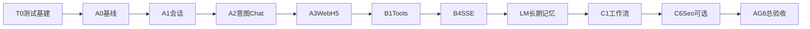

# AI 内容获客 — v0.4 Agent 智能体执行计划

| 项目 | 说明 |
|------|------|
| 文档版本 | v0.4-agent |
| 关联需求 | [需求规格.md](./需求规格.md) v0.3.3 + §3.11 FR-AGENT（实施中写入） |
| 前置基线 | v0.3.3 已通过 `run_m0_m8.py` |
| 预估工期 | T0+A：5～7 人天；B：8～10；LM：8～10；C：15～18；合计约 30～36 人天 |

---

## 1. 总原则

| 原则 | 说明 |
|------|------|
| 先后端、后双端 | API 验收通过后再改 Web/H5 |
| 一步一验 | 当前里程碑全部 PASS 才进入下一步 |
| 服务端为准 | 额度、权限、发布确认在 API 强制 |
| 不破坏 v0.3.3 | 每步跑 `run_m0_m8.py` |
| BR-01 | Agent **禁止**未经用户 confirm 自动 publish |
| FR-REVIEW-10 | 不恢复强制审核流；Compliance 仅建议/拦截 |

---

## 2. 里程碑依赖



**实施顺序：** `T0 → A0→A3 → B1→B4 → LM1→LM5 → C1→C6 → AG8`

---

## 3. Phase T：自动测试基建

| 里程碑 | 目标 | 验收脚本 |
|--------|------|----------|
| T0 | conftest、FakeLLM、无网络 unit | `verify_t0.py` |

| 编号 | 通过标准 |
|------|----------|
| VT0-1 | 断网 `pytest tests/unit -q` PASS |
| VT0-2 | FakeLLM 同输入 deterministic |
| VT0-3 | unit 全量 ≤ 30s |

---

## 4. Phase A：半智能体

| 里程碑 | 目标 | 验收 |
|--------|------|------|
| A0 | 迁移 012、health、目录 | `verify_a0.py` |
| A1 | 会话 CRUD、消息落库 | `verify_a1.py` |
| A2 | 意图 JSON + chat 调 proposals/generate | `verify_a2.py` |
| A3 | Web/H5 Create 接 Agent | `verify_a3.py` |

### A0 严格验证

| 编号 | 通过标准 |
|------|----------|
| VA0-1 | alembic head 含 `012`；表 `agent_sessions` / `agent_messages` 存在 |
| VA0-2 | `GET /api/v1/agent/health` → 200 |
| VA0-3 | `run_m0_m8.py` 全 PASS |

### A1 严格验证

| 编号 | 通过标准 |
|------|----------|
| VA1-1 | `POST /agent/sessions` → 200 + id |
| VA1-2 | 跨租户 GET session → 404 |
| VA1-3 | 追加 3 条消息后 GET messages 顺序正确 |
| VA1-4 | 无 `content.create` → 403 |
| VA1-5 | `run_m0_m8.py` PASS |

### A2 严格验证

| 编号 | 通过标准 |
|------|----------|
| VA2-1 | proposals 不扣额度 |
| VA2-2 | generate 扣 1 次额度 |
| VA2-3 | 缺参 clarify |
| VA2-4 | 正文含免责声明 |
| VA2-5 | douyin+article → 400 |

---

## 5. Phase B：工具型 Agent

| 里程碑 | 内容 | 验收 |
|--------|------|------|
| B1 | Tool Registry ≥8 工具 | verify_b1 |
| B2 | ReAct 循环 MAX_STEPS=8 | verify_b2 |
| B3 | revise_content 改稿 | verify_b3 |
| B4 | SSE 流式 | verify_b4 |

---

## 6. Phase LM：长期记忆

| 层级 | 说明 | 表 |
|------|------|-----|
| L0 | brand + user_prompt（已有） | 现有 |
| L1 | 会话 messages | agent_messages |
| L2 | 会话摘要 | agent_session_summaries（014） |
| L3 | 语义事实 | agent_memory_facts（014） |
| L4 | 行为统计 | agent_preference_stats（可选） |

| 里程碑 | 验收 |
|--------|------|
| LM1 | 记忆 CRUD + scope 隔离 | verify_lm1 |
| LM2 | 会话摘要 + recall | verify_lm2 |
| LM3 | Orchestrator 注入 + token 预算 | verify_lm3 |
| LM4 | 推断记忆须 confirm | verify_lm4 |
| LM5 | 向量 hybrid（与 C4 共用 embedding） | verify_lm5 |

---

## 7. Phase C：自治增强

| 里程碑 | 内容 | 验收 |
|--------|------|------|
| C1 | WorkflowManager + pipeline | verify_c1 |
| C2 | ComplianceAgent | verify_c2 |
| C3 | Confirm 闸 + OpsAgent | verify_c3 |
| C4 | pgvector hybrid RAG | verify_c4 |
| C5 | 多 Agent Supervisor | verify_c5 |
| C6 | SeoAgent + 历史会话（可选） | verify_c6 |

---

## 8. AG8 总验收

```bash
cd apps/api
.venv/Scripts/python.exe tests/run_m0_m8.py
.venv/Scripts/python.exe tests/run_agent_a_c.py
```

| 编号 | 通过标准 |
|------|----------|
| VAG8-1 | run_agent_a_c 全 PASS |
| VAG8-2 | run_m0_m8 全 PASS |
| VAG8-6 | 无未 confirm 自动 publish |

---

## 9. FR-AGENT 建议 ID

| ID | 描述 |
|----|------|
| FR-AGENT-01 | 多轮会话持久化 |
| FR-AGENT-02 | Tool Calling |
| FR-AGENT-03 | publish/schedule 须 confirm |
| FR-AGENT-04 | Compliance Agent |
| FR-AGENT-05 | Hybrid 向量 RAG |
| FR-AGENT-06 | 工作流可观测 |
| FR-AGENT-07 | 长期记忆 scope 隔离 |
| FR-AGENT-08 | 会话摘要召回 |
| FR-AGENT-09 | 推断记忆须 confirm |
| NFR-AGENT-01 | CI 无外网依赖 |
| NFR-AGENT-02 | verify 与 FR 可追溯 |

---

## 10. 当前进度

| 里程碑 | 状态 |
|--------|------|
| T0 | ✅ 已完成 |
| A0 | ✅ 已完成 |
| A1 | ✅ 已完成 |
| B2 | ✅ 已完成 |
| B3 | ✅ 已完成 |
| B4 | ✅ 已完成 |
| LM1 | ✅ 已完成 |
| LM2 | ✅ 已完成 |
| LM3 | ✅ 已完成 |
| LM4 | ✅ 已完成 |
| LM5 | ✅ 已完成 |
| C1 | ✅ 已完成 |
| C2 | ✅ 已完成 |
| C3 | ✅ 已完成 |
| C4 | ✅ 已完成 |
| C5 | ✅ 已完成 |
| C6 | ✅ 已完成 |
| AG8 | ✅ 已完成 |
| **WF1** | ✅ 已完成（交互式工作流 propose 暂停 + resume） |
| **WF2** | ✅ 已完成（Web 创作页接工作流） |
| **WF3** | ✅ 已完成（H5 创作页接工作流） |

验收命令：

```bash
cd apps/api
.venv/Scripts/python.exe -m alembic upgrade head
.venv/Scripts/python.exe tests/run_agent_a_c.py
.venv/Scripts/python.exe tests/verify_wf_ui.py   # WF1 交互式工作流
.venv/Scripts/python.exe tests/verify_wf3.py     # WF3 H5 工作流
```
