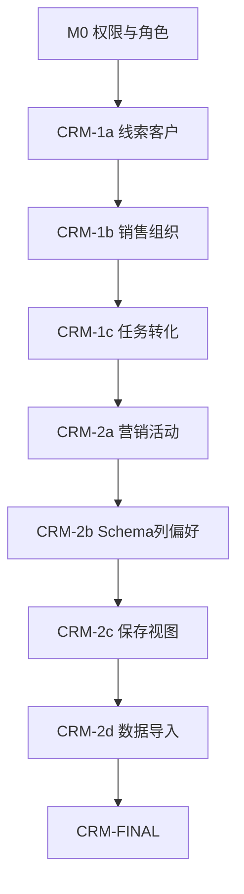

# AI 内容获客 — v0.5 内置 CRM 详细执行计划（逐步验收）

| 项目 | 说明 |
|------|------|
| 文档版本 | v1.1-crm-auto-test |
| 关联需求 | [需求规格.md](./需求规格.md) v0.5.3.1（§2.8、§3.14～3.17） |
| 前置基线 | `python apps/api/tests/run_m0_m8.py` **PASS** |
| 总验收入口 | `python apps/api/tests/run_crm_all.py` |
| Alembic Head | **029**（`tests/alembic_head.py` 统一断言） |
| 预估工期 | 约 **27～35 人天**（9 个 Phase，共 **42 个 Step**） |

---

## 0. 执行规则（必须遵守）

### 0.1 一步一验

1. **只允许顺序执行** Step 清单；不得跳过。
2. 每个 Step 完成後必须：
   - 跑该 Step 的 **专项验收**（下表「验收命令」）→ 全部 PASS
   - 跑 **回归门禁**（§0.3）→ PASS
3. 任一 FAIL → **停止**，修复後从该 Step 重跑，不得进入下一步。

### 0.2 Step 状态标记

| 标记 | 含义 |
|------|------|
| ⬜ | 未开始 |
| 🔄 | 进行中 |
| ✅ | 本 Step 专项 + 回归均 PASS |

### 0.3 每步回归门禁（固定）

```bash
cd apps/api
python tests/run_m0_m8.py
python tests/run_agent_a_c.py
```

| 编号 | 通过标准 |
|------|----------|
| RG-1 | `run_m0_m8.py` 退出码 0 |
| RG-2 | `run_agent_a_c.py` 退出码 0 |

> CRM 相关 Step 从 **M0-1** 起额外跑：`python tests/verify_crm_regression.py`（仅已完成的 CRM verify 脚本）。

### 0.4 Phase 结束门禁

每个 Phase（M0、1a…2d、FINAL）结束时额外执行：

```bash
python tests/run_crm_all.py --through <阶段名>
```

示例：`--through 1a` 只跑到 `verify_crm_1a.py`。

### 0.5 自动化验收矩阵（v1.1）

| 类型 | 脚本/命令 | 说明 |
|------|-----------|------|
| 单步专项 | `python tests/verify_crm_<phase>.py --step <步号>` | 42 Step 逐步对应 |
| 阶段全量 | `python tests/verify_crm_<phase>.py` | Phase 内全部 Step |
| 单元测试 | `pytest tests/unit/test_crm_scope.py -q` | 1a-2 / 1b-3 scope |
| 共享工具 | `tests/verify_crm_helpers.py` | 登录、sales 测试账号、文件检查 |
| Alembic | `tests/alembic_head.py` → **029** | 全仓库 head 断言统一 |
| 回归 | `python tests/verify_crm_regression.py` | 默认 `run_m0_m8`；Agent 可选 |
| Agent 跳过 | `VERIFY_SKIP_AGENT=1 python tests/verify_crm_regression.py` | LLM 不稳定时 |
| 串联 | `python tests/run_crm_all.py --through <M0\|1a\|…>` | 按 Phase 顺序 |

**Web/H5 文件存在性**（无需人工时）：`verify_crm_1a.py --step 1a-6/1a-7` 等用 `check_files()` 断言 Vue 页面。

### 0.6 当前进度（2026-07-07）

| Phase | Step | 状态 | 专项命令 |
|-------|------|------|----------|
| M0 | M0-1～M0-5 | ✅ | `verify_crm_m0.py` |
| 1a | 1a-1～1a-7 | ✅ | `verify_crm_1a.py` |
| 1b | 1b-1～1b-5 | ✅ | `verify_crm_1b.py` |
| 1c | 1c-1～1c-6 | ✅ | `verify_crm_1c.py` |
| 2a | 2a-1～2a-5 | ✅ | `verify_crm_2a.py --step 2a-N` |
| 2b | 2b-1～2b-6 | ✅ | `verify_crm_2b.py --step 2b-N` |
| 2c | 2c-1～2c-5 | ✅ | `verify_crm_2c.py --step 2c-N` |
| 2d | 2d-1～2d-5 | ✅ | `verify_crm_2d.py --step 2d-N` |
| 2e | 2e-1～2e-8 | ✅ | `verify_crm_2e.py --step 2e-N` |
| 2f | 2f-1～2f-11 | ✅ | `verify_crm_2f.py --step 2f-N`；见 [v0.5-crm-2f执行计划.md](./v0.5-crm-2f执行计划.md) |
| FINAL | F-1～F-2 | ✅ | `verify_crm_final.py`；F-2 API 见 `verify_crm_uat_f2.py`，Web/H5 点选见 `--print-manual` |

---



| Phase | Step 范围 | 专项验收脚本 | 预估 |
|-------|-----------|--------------|------|
| M0 | M0-1～M0-5 | `verify_crm_m0.py` | 2～3 天 |
| CRM-1a | 1a-1～1a-7 | `verify_crm_1a.py` | 5～7 天 |
| CRM-1b | 1b-1～1b-5 | `verify_crm_1b.py` | 4～5 天 |
| CRM-1c | 1c-1～1c-6 | `verify_crm_1c.py` | 4～5 天 |
| CRM-2a | 2a-1～2a-5 | `verify_crm_2a.py` | 5～6 天 |
| CRM-2b | 2b-1～2b-6 | `verify_crm_2b.py` | 3～4 天 |
| CRM-2c | 2c-1～2c-5 | `verify_crm_2c.py` | 3～4 天 |
| CRM-2d | 2d-1～2d-5 | `verify_crm_2d.py` | 3～4 天 |
| CRM-2e | 2e-1～2e-8 | `verify_crm_2e.py` | 3～5 天 |
| CRM-2f | 2f-1～2f-11 | `verify_crm_2f.py` | 5～8 天 |
| FINAL | F-1～F-2 | `verify_crm_final.py` | 1 天 |

---

## 2. Phase M0：权限 Catalog + 五内置角色

**目标：** CRM 权限码入库；`admin/editor/sales/sales_manager/marketing` 种子；双端角色/权限 UI 可展示。

### Step M0-1：后端权限 Catalog

| 项 | 内容 |
|----|------|
| **实施** | 修改 `apps/api/app/permissions.py`：`ALL_PERMISSIONS` 增加全部 `crm.*`（§2.5）；新增 `SALES_DEFAULT_PERMISSIONS`、`SALES_MANAGER_DEFAULT_PERMISSIONS`、`MARKETING_DEFAULT_PERMISSIONS`（§2.8，含 `crm.lead.convert`；sales **不含** `crm.task.assign`） |
| **验收命令** | `python tests/verify_crm_m0.py --step M0-1` |

| 编号 | 通过标准 |
|------|----------|
| VM0-1-1 | `len(ALL_PERMISSIONS)` 含 §2.5 全部 CRM 码（≥35 个 `crm.*`） |
| VM0-1-2 | `SALES_DEFAULT` ⊆ `ALL_PERMISSIONS`；含 `crm.lead.convert` |
| VM0-1-3 | `SALES_DEFAULT` **不含** `crm.task.assign`、`crm.lead.assign` |
| VM0-1-4 | `SALES_MANAGER` 含 `list_team`、`list_territory`、`crm.task.assign` |
| VM0-1-5 | `MARKETING` 含 `crm.campaign.*`、`crm.lead.list_all`；**不含** `crm.customer.create` |
| VM0-1-6 | `EDITOR_DEFAULT` 与 CRM 权限 **无交集** |

---

### Step M0-2：角色种子与存量迁移

| 项 | 内容 |
|----|------|
| **实施** | 修改 `membership_service.seed_tenant_roles()`：创建 5 角色并写权限；新增 Alembic `0xx_crm_roles.py` 为已有 tenant 补 `sales`/`sales_manager`/`marketing` |
| **验收命令** | `python tests/verify_crm_m0.py --step M0-2` |

| 编号 | 通过标准 |
|------|----------|
| VM0-2-1 | 新注册 tenant：`tenant_roles` 恰好 5 条 `is_system=true` |
| VM0-2-2 | `admin` 权限数 = `len(ALL_PERMISSIONS)` |
| VM0-2-3 | `sales` 权限集 = `SALES_DEFAULT_PERMISSIONS`（精确集合） |
| VM0-2-4 | 迁移前已存在 tenant：补种后亦有 5 内置角色 |
| VM0-2-5 | `verify_m1.py` 中「每 tenant 2 角色」断言 **已更新** 为 5 |

---

### Step M0-3：内置角色保护与团队 API

| 项 | 内容 |
|----|------|
| **实施** | `team_service`：删除 `is_system` → 403（已有）；`update_role_permissions` 非 admin 改内置角色 → 403（**FR-TEAM-12 已实现**）；`verify_m3.py` V3-12 |
| **验收命令** | `python tests/verify_m3.py` |

| 编号 | 通过标准 |
|------|----------|
| VM0-3-1 | admin `PATCH /team/roles/{editor_id}` → 200 |
| VM0-3-2 | editor `PATCH /team/roles/{editor_id}` → 403 |
| VM0-3-3 | 任意角色 `DELETE /team/roles/{editor_id}` → 400/403 |
| VM0-3-4 | 拥有 `team.role.manage` 的**非 admin** 自定义角色用户改 `sales` → 403 |

---

### Step M0-4：CRM 目录骨架与健康检查

| 项 | 内容 |
|----|------|
| **实施** | 创建 `apps/api/app/models/crm/`、`services/crm/`、`routers/crm/` 包；`main.py` 挂载 `routers.crm`（可空路由）；`GET /api/v1/crm/health` → 200 |
| **验收命令** | `python tests/verify_crm_m0.py --step M0-4` |

| 编号 | 通过标准 |
|------|----------|
| VM0-4-1 | `GET /api/v1/crm/health` → 200 `{"status":"ok"}` |
| VM0-4-2 | 无 CRM 权限用户访问 `/crm/health` 可 200（健康检查不鉴权） |
| VM0-4-3 | `alembic heads` 含 CRM 角色迁移 revision |

---

### Step M0-5：Web/H5 权限 UI

| 项 | 内容 |
|----|------|
| **实施** | `apps/web/src/config/permissions.js` 增加 CRM 分组；角色页展示 5 内置；H5 设置同步（若已有角色页） |
| **验收命令** | `python tests/verify_crm_m0.py --step M0-5` + 人工 **Web** 抽检 |

| 编号 | 通过标准 |
|------|----------|
| VM0-5-1 | Web 设置 → 角色 → 权限勾选可见 CRM 分组（线索/客户/任务/活动/组织/导入/视图） |
| VM0-5-2 | 角色列表显示 5 个「系统内置」 |
| VM0-5-3 | `sales` 用户登录 Web：侧栏 **无** 线索菜单（尚未做 CRM 页面时仅验 permissions 数组） |
| VM0-5-4 | **Phase M0 全量**：`python tests/verify_crm_m0.py` 退出码 0 |

---

## 3. Phase CRM-1a：线索 + 客户 + 跟进

**目标：** 固定字段 CRUD；`list_own` / `list_all`；Web+H5 主流程；字段见 §3.14.12。

### Step 1a-1：数据库迁移

| 项 | 内容 |
|----|------|
| **实施** | Alembic：表 `leads`、`customers`、`contacts`、`crm_activities`（字段见旧版 §4.1） |
| **验收命令** | `python tests/verify_crm_1a.py --step 1a-1` |

| 编号 | 通过标准 |
|------|----------|
| V1a-1-1 | 四表存在；`leads.company_name`、`contact_name`、`mobile` 非空约束符合设计 |
| V1a-1-2 | 所有表含 `tenant_id` 索引 |
| V1a-1-3 | `extra_data` JSON 列可 NULL，默认 `{}` |
| V1a-1-4 | `contacts.customer_id` FK → `customers.id` |

---

### Step 1a-2：`crm_scope_service`（MVP）

| 项 | 内容 |
|----|------|
| **实施** | `services/crm/crm_scope_service.py`：`list_all` / `list_own`（`owner_user_id`）；列表/详情统一调用 |
| **验收命令** | `pytest tests/unit/test_crm_scope.py -q` |

| 编号 | 通过标准 |
|------|----------|
| V1a-2-1 | 有 `crm.lead.list_all` → 返回 tenant 全量 |
| V1a-2-2 | 仅 `list_own` → `owner_user_id == me` |
| V1a-2-3 | 无 CRM 列表权限 → 空列表或 403（与 `require_permission` 一致） |
| V1a-2-4 | unit ≥4 用例 PASS |

---

### Step 1a-3：线索 API

| 项 | 内容 |
|----|------|
| **实施** | `models/crm/lead.py`、`lead_service.py`、`routers/crm/leads.py`；创建默认 `owner=当前用户` |
| **验收命令** | `python tests/verify_crm_1a.py --step 1a-3` |

| 编号 | 通过标准 |
|------|----------|
| V1a-3-1 | `sales` 用户 `POST /crm/leads` → 201；body 含 `company_name` |
| V1a-3-2 | `editor` 无 `crm.lead.create` → 403 |
| V1a-3-3 | 用户 A 创建；用户 B（`sales` 仅 own）`GET /crm/leads` **不含** A 的记录 |
| V1a-3-4 | admin `GET /crm/leads` 含 A 的记录 |
| V1a-3-5 | `PATCH` 改 `owner` 无 `assign` 权限 → 403 |
| V1a-3-6 | `DELETE` 软删后列表不可见；admin `list_all` 可选可见已删（实现约定写死） |

---

### Step 1a-4：客户 + 联系人 API

| 项 | 内容 |
|----|------|
| **实施** | `customers.py`、`contacts` 嵌套路由；联系人权限随客户 scope |
| **验收命令** | `python tests/verify_crm_1a.py --step 1a-4` |

| 编号 | 通过标准 |
|------|----------|
| V1a-4-1 | 客户 CRUD 同线索 scope 规则 |
| V1a-4-2 | 可见客户下 `POST contacts` → 201 |
| V1a-4-3 | 不可见客户 → `GET contacts` 403/404 |
| V1a-4-4 | `is_primary=true` 时同客户仅允许一个首要联系人（或自动取消旧首要） |

---

### Step 1a-5：跟进 API

| 项 | 内容 |
|----|------|
| **实施** | `routers/crm/activities.py`；`GET ?lead_id=` 时间线倒序 |
| **验收命令** | `python tests/verify_crm_1a.py --step 1a-5` |

| 编号 | 通过标准 |
|------|----------|
| V1a-5-1 | 可见线索上 `POST /crm/activities` → 201 |
| V1a-5-2 | `GET` 时间线按 `created_at` DESC |
| V1a-5-3 | 不可见线索 → 403 |
| V1a-5-4 | `activity_type` 枚举非法 → 422 |

---

### Step 1a-6：Web 线索/客户页面

| 项 | 内容 |
|----|------|
| **实施** | Web：`views/crm/Leads.vue`、`LeadDetail.vue`、`Customers.vue`；`router.js` + `permissions.js` NAV 按 permissions |
| **验收命令** | `python tests/verify_crm_1a.py --step 1a-6` |

| 编号 | 通过标准 |
|------|----------|
| V1a-6-1 | `Leads.vue`、`Customers.vue` 文件存在 |
| V1a-6-2 | `router.js` 含 `/crm/leads`、`/crm/customers` 路由 |
| V1a-6-3 | `permissions.js` NAV 含「线索」「客户」且绑定 `crm.lead.*` / `crm.customer.*` |
| V1a-6-4 | `api/client.js` 导出 `crmApi` |

---

### Step 1a-7：H5 + Phase 验收

| 项 | 内容 |
|----|------|
| **实施** | H5：`pages/crm/leads.vue`、`customers.vue`；`pages.json` + `MINE_MENU` 入口 |
| **验收命令** | `python tests/verify_crm_1a.py --step 1a-7`；Phase 结束 `python tests/run_crm_all.py --through 1a` |

| 编号 | 通过标准 |
|------|----------|
| V1a-7-1 | H5 页面文件存在 |
| V1a-7-2 | `pages.json` 注册 CRM 页面 |
| V1a-7-3 | `mp/utils/permissions.js` MINE_MENU 含线索/客户且需 CRM 权限 |
| V1a-7-4 | **Phase 1a 全量** `verify_crm_1a.py` → 0 |
| V1a-7-5 | `run_crm_all.py --through 1a` → 0 |

---

## 4. Phase CRM-1b：销售组织 + Scope 并集

### Step 1b-1：地区树 + 成员档案表

| Alembic | `sales_territories`、`membership_sales_profile` |
| **验收** | `verify_crm_1b.py --step 1b-1` |

| 编号 | 通过标准 |
|------|----------|
| V1b-1-1 | 地区 `parent_id` 自关联；`manager_membership_id` 可空 |
| V1b-1-2 | 成员档案 `membership_id` 唯一 |

---

### Step 1b-2：销售组织 API

| **实施** | `sales_org_service.py`、`territories.py`、`sales_profile.py`；成环检测 |
| **验收** | `verify_crm_1b.py --step 1b-2` |

| 编号 | 通过标准 |
|------|----------|
| V1b-2-1 | 创建父子地区 → 200 |
| V1b-2-2 | 成环 `parent_id` → 422 |
| V1b-2-3 | 汇报关系成环 → 422 |
| V1b-2-4 | 无 `crm.org.manage` → 403 |

---

### Step 1b-3：Scope 并集实现

| **实施** | 扩展 `crm_scope_service`：`list_team`、`list_territory`、并集；地区负责人子树 |
| **验收** | `pytest tests/unit/test_crm_scope.py -q` |

| 编号 | 通过标准 |
|------|----------|
| V1b-3-1 | 上级可见下级 `owner` 单据 |
| V1b-3-2 | 地区负责人可见该地区+子树单据 |
| V1b-3-3 | 并集：仅满足 territory、不满足 team 仍可见 |
| V1b-3-4 | unit ≥6 用例（含边界：无地区、无上级） |

---

### Step 1b-4：Web 销售组织设置

| **实施** | `SettingsCrmOrg.vue`；成员表扩展主地区/上级 |
| **验收** | 人工 Web + `verify_crm_1b.py --step 1b-4` |

| 编号 | 通过标准 |
|------|----------|
| V1b-4-1 | admin 可维护地区树 |
| V1b-4-2 | `sales` 不可见销售组织设置 |

---

### Step 1b-5：Phase 验收

| **验收** | `python tests/verify_crm_1b.py` + `run_crm_all.py --through 1b` |

| 编号 | 通过标准 |
|------|----------|
| V1b-5-1 | `sales_manager` 可见下级线索，看不见无关节点 |
| V1b-5-2 | 篡改 `?owner_id=` 参数不越权 |

---

## 5. Phase CRM-1c：任务 + 转化 + 工作台

### Step 1c-1：任务表与 API

| **验收** | `verify_crm_1c.py --step 1c-1` |

| 编号 | 通过标准 |
|------|----------|
| V1c-1-1 | 任务 CRUD；`assignee` 默认创建人 |
| V1c-1-2 | `sales` 无 `task.assign` 不能改他人为执行人 |
| V1c-1-3 | `sales_manager` 可 `assign` |

---

### Step 1c-2：线索转化

| **实施** | `POST /crm/leads/{id}/convert`；§3.14.12 字段映射 |
| **验收** | `verify_crm_1c.py --step 1c-2` |

| 编号 | 通过标准 |
|------|----------|
| V1c-2-1 | 转化后 `leads.status=已转化`；`customers.converted_from_lead_id` 正确 |
| V1c-2-2 | 生成首要联系人 `name=contact_name` |
| V1c-2-3 | 重复转化 → 409 |
| V1c-2-4 | 无 `crm.lead.convert` → 403 |

---

### Step 1c-3：工作台 CRM 指标

| **实施** | 扩展 `dashboard/stats`：新线索、今日任务、逾期任务（按 scope） |
| **验收** | `verify_crm_1c.py --step 1c-3` |

| 编号 | 通过标准 |
|------|----------|
| V1c-3-1 | `sales` 仅计本人 |
| V1c-3-2 | `sales_manager` 计数 ≥ 下级之和 |

---

### Step 1c-4：Web 任务 + 详情 Tab

| **验收** | 人工 + API |

| 编号 | 通过标准 |
|------|----------|
| V1c-4-1 | 线索详情 Tab「任务」可新建/完成 |
| V1c-4-2 | 侧栏「任务」列表可筛选 |

---

### Step 1c-5：H5 待办

| **验收** | H5 人工 |

| 编号 | 通过标准 |
|------|----------|
| V1c-5-1 | 「我的任务」列表；标记 `done` |

---

### Step 1c-6：Phase 验收

| **验收** | `verify_crm_1c.py` + `run_crm_all.py --through 1c` |

---

## 6. Phase CRM-2a：营销活动

### Step 2a-1：表 `marketing_campaigns`、`campaign_contents`

### Step 2a-2：活动 CRUD + scope

### Step 2a-3：关联内容 API；内容库筛 `campaign_id`

### Step 2a-4：创作页 / Workflow 可选 `campaign_id`

### Step 2a-5：Phase 验收 `verify_crm_2a.py`

| 编号 | 通过标准 |
|------|----------|
| V2a-5-1 | `marketing` 角色可建活动；`sales` 不可 |
| V2a-5-2 | 活动详情线索数 = 带 `campaign_id` 的线索计数 |
| V2a-5-3 | 关联 2 篇 `content` 后计数正确 |

---

## 7. Phase CRM-2b：Schema + 列偏好

### Step 2b-1：表 `entity_field_definitions`、`user_entity_view_preferences`

### Step 2b-2：种子 §3.14.12 + `schema_service`

### Step 2b-3：自定义字段 `cf_*` + `extra_data` 校验

### Step 2b-4：`DynamicField` + 列设置 Web

### Step 2b-5：H5 动态列（简化）

### Step 2b-6：Phase 验收 `verify_crm_2b.py`

| 编号 | 通过标准 |
|------|----------|
| V2b-6-1 | 中文 label 与 §3.14.12 一致 |
| V2b-6-2 | 删系统字段 API → 403 |
| V2b-6-3 | 用户 A/B 列偏好互不影响 |

---

## 8. Phase CRM-2c：保存视图

### Step 2c-1：表 `entity_list_views`

### Step 2c-2：`view_service` + filters 解析

### Step 2c-3：列表 API `view_id`；scope 后再 filter

### Step 2c-4：Web 视图切换/保存/钉选

### Step 2c-5：Phase 验收 `verify_crm_2c.py`

| 编号 | 通过标准 |
|------|----------|
| V2c-5-1 | 保存 `status=跟进中` 视图后切换生效 |
| V2c-5-2 | 公开视图：他人可见视图定义，但数据仍受 scope 限制 |
| V2c-5-3 | `cf_*` 字段可作 filter |

---

## 9. Phase CRM-2d：数据导入

### Step 2d-1：表 `crm_import_jobs`、`crm_import_rows`

### Step 2d-2：`import_service` 解析 CSV/XLSX

### Step 2d-3：模板下载（中文表头）；映射 UI

### Step 2d-4：预览 + 执行 + 错误 CSV

### Step 2d-5：Phase 验收 `verify_crm_2d.py`

| 编号 | 通过标准 |
|------|----------|
| V2d-5-1 | 10 行 8 成功 2 失败 |
| V2d-5-2 | `mobile` 重复 `skip` |
| V2d-5-3 | 无 `assign` 时 `owner`=导入人 |
| V2d-5-4 | 模板含「公司名称」「手机」等中文列 |

---

## 10. Phase CRM-FINAL

### Step F-1：全自动化

```bash
cd apps/api
python tests/run_crm_all.py
python tests/run_m0_m8.py
python tests/run_agent_a_c.py
```

| 编号 | 通过标准 |
|------|----------|
| VF-1 | `run_crm_all.py` 退出码 0 |
| VF-2 | 回归 RG-1、RG-2 |
| VF-3 | `verify_crm_uat_f2.py` §6.2 场景 13～29 API 断言 |

---

### Step F-2：人工 UAT（需求 §6.2 场景 13～29）

| 编号 | 场景 |
|------|------|
| UAT-13～22 | CRM 核心 + Schema |
| UAT-23～27 | 视图 + 导入 |
| UAT-28～29 | 角色 `sales` / `sales_manager` |

**自动化（API + 双端文件门禁）：**

```bash
cd apps/api
python tests/verify_crm_uat_f2.py
python tests/verify_crm_uat_f2.py --print-manual   # Web/H5 须人工点测清单
```

**通过标准：** `verify_crm_uat_f2.py` 全 PASS；Web 与 H5 **各测一遍** `--print-manual` 清单（FR-CLIENT-01）。

---

## 11. 验收脚本清单

| 脚本 | 阶段 | 说明 |
|------|------|------|
| `verify_crm_regression.py` | 每步 | 跑已存在的 CRM verify |
| `verify_crm_m0.py` | M0 | 支持 `--step M0-N` |
| `verify_crm_1a.py` | 1a | 支持 `--step 1a-N` |
| `verify_crm_1b.py` | 1b | 同上 |
| `verify_crm_1c.py` | 1c | 同上 |
| `verify_crm_2a.py` | 2a | 同上 |
| `verify_crm_2b.py` | 2b | 同上 |
| `verify_crm_2c.py` | 2c | 同上 |
| `verify_crm_2d.py` | 2d | 同上 |
| `verify_crm_2e.py` | 2e | 缺口补齐；见 [v0.5-crm-gap执行计划.md](./v0.5-crm-gap执行计划.md) |
| `verify_crm_2f.py` | 2f | §3.18.2 收尾；见 [v0.5-crm-2f执行计划.md](./v0.5-crm-2f执行计划.md) |
| `verify_crm_final.py` | FINAL | 汇总检查 |
| `verify_crm_uat_f2.py` | F-2 | §6.2 场景 13～29 API；`--print-manual` 人工清单 |
| `run_crm_all.py` | ALL | 串联；支持 `--through` |

**`verify_crm_*.py` 统一约定：**

```python
# 每个脚本提供：
# python verify_crm_1a.py           # 全量
# python verify_crm_1a.py --step 1a-3  # 单步
# 输出：=== CRM-1a 全部通过 === 或 列出失败编号
```

---

## 12. 目录结构（目标）

见 v0.5 原版 §12；实施时按 Step 逐步创建，避免一次空壳过多。

---

## 13. 风险与规避

| 风险 | 规避 |
|------|------|
| Scope 散落 | Code review：列表必须经 `crm_scope_service` |
| 步骤跳号 | `run_crm_all.py` CI 强制顺序 |
| verify 漂移 | 每个 FR 编号在 verify 中断言注释 `FR-CRM-xxx` |
| 双端不一致 | 1a-7、1c-5、F-2 强制 H5 |

---

## 14. 文档修订记录

| 版本 | 日期 | 说明 |
|------|------|------|
| v1.3-crm-2e | 2026-07-07 | CRM-2e 缺口补齐 + `verify_crm_2e.py`；F-2 API `verify_crm_uat_f2.py` |
| v1.4-crm-2f | 2026-07-07 | CRM-2f §3.18.2 收尾 PASS；`verify_crm_final.py --through 2f` |
| v1.2-crm-final | 2026-07-07 | M0～2d + FINAL 自动化验收全部通过；alembic 029 |
| v1.0-crm-detailed | 2026-07-07 | 42 Step 逐步执行 + 严格验收表 + run_crm_all 约定 |
| v0.5.3.1-crm | 2026-07-07 | FR-TEAM-12；栏位/角色澄清 |
| v0.5-crm | 2026-07-07 | 初稿里程碑 |
