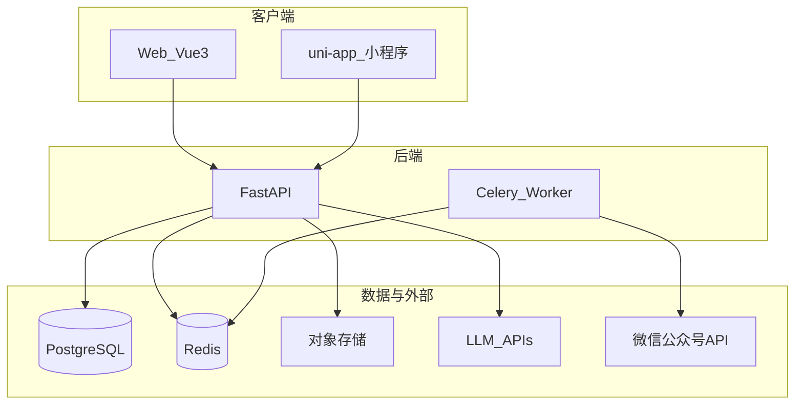
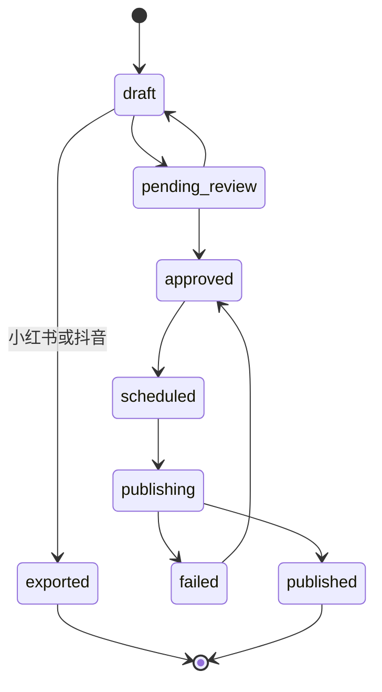

> **v0.3.3 增量开发：** 企业与权限（Membership、多公司切换、角色权限）、忘记密码、平台企业管理/转移管理员、Web+H5 双端对齐等，请参见 **[v0.3.3 执行计划](./v0.3.3执行计划.md)**（主实施文档）。本文档为 v0.2 从零搭建指南，仍作基础架构参考。

# AI 内容获客系统 — 小白一步一步实现计划

## 你要做的是什么（一句话）

帮小财务公司：**用 AI 生成营销内容 → 人工审核 → 公众号自动发；小红书/抖音生成后导出**；内置 CRM 管理线索、客户、任务与营销活动（见 [v0.5-crm执行计划.md](./v0.5-crm执行计划.md)）。

## 最终目录结构（目标）

```
e:\ai-content-marketing\
├── apps/
│   ├── api/              # FastAPI 后端
│   ├── web/              # Vue 3 管理端
│   └── mp/               # uni-app 微信小程序
├── packages/
│   └── shared/           # 共享 TypeScript 类型、API 常量
├── docker-compose.yml    # PostgreSQL + Redis + API（本地开发）
└── README.md
```

与 [e:\frappe-crm](e:\frappe-crm) **并列、独立 Git 仓库**；**内置 CRM** 见 [v0.5-crm执行计划.md](./v0.5-crm执行计划.md)（不对接 Frappe）。

**需求规格文档：** [需求规格.md](./需求规格.md)（FR/NFR、验收清单、状态机） · **v0.5 CRM：** [v0.5-crm执行计划.md](./v0.5-crm执行计划.md) · **v0.3.3 执行计划：** [v0.3.3执行计划.md](./v0.3.3执行计划.md)

---

## 架构总览



**内容状态机（MVP 必须实现）：**



---

## 第 0 步：准备开发环境（现在做，约 1–2 天）

> **微信服务号、小程序、备案域名** 推迟到 **第 11 步实际部署** 再申请。开发期全部在本地完成，不依赖微信真机。

### 0.1 安装开发工具（Windows）

| 工具 | 用途 | 现在是否必需 |
|------|------|--------------|
| Node.js 20 LTS | Web / uni-app | 必需 |
| Python 3.11+ | 后端 | 必需 |
| Git | 版本管理 | 必需 |
| Docker Desktop | 本地 Postgres/Redis | 必需 |
| VS Code / Cursor | 编辑器 | 必需 |
| 微信开发者工具 | 小程序真机调试 | **部署后再装/再用** |

验证命令：

```powershell
node -v
python --version
docker --version
git --version
```

### 0.2 现在就要申请的账号

1. **DeepSeek**：开放平台注册 → 创建 API Key → 充值少量余额（生成内容必需）

**开发期可选（可先用本地替代）：**

2. **对象存储**：开发期可用本地文件夹 `apps/api/storage/` 存上传文件和导出 zip；上线前再换 OSS/COS

### 0.3 推迟到第 11 步（部署前）再申请

以下 **开发阶段不需要**，等核心功能在本地跑通后再办：

| 项目 | 用途 | 开发期替代方案 |
|------|------|----------------|
| **ICP 备案 + HTTPS 域名** | 小程序/公众号线上回调 | 本地 `localhost` / `127.0.0.1` |
| **微信公众号（服务号）** | 自动发布 | **Mock 发布适配器**（见下） |
| **微信小程序 AppID** | 移动端 | uni-app 先跑 **H5 模式**（浏览器），或 Web 移动端响应式 |

### 0.4 本地开发替代方案（重要）

**公众号发布 — 适配器模式：**

```
WeChatPublisher (接口)
├── MockWeChatPublisher   ← 开发期默认：写日志 + 标记 published + 存本地 HTML 预览
└── RealWeChatPublisher   ← 部署后：真实微信 API
```

环境变量 `WECHAT_PUBLISHER=mock`（开发） / `real`（生产）。

**小程序 — 开发期两种选一：**

- **推荐小白**：第 9–10 步优先把 **Web 做全**（含手机浏览器访问），小程序代码先写 uni-app 但用 `npm run dev:h5` 在 Chrome 调试  
- 部署后再注册小程序 AppID，用微信开发者工具真机预览

**小程序登录 — 开发期：**

- 仅用 **账号 + 密码 + JWT**（与 Web 相同），不接 `wx.login`

### 0.5 部署时才做的微信后台配置（第 11 步清单）

- 小程序 request / download 合法域名 → 指向 API  
- 公众号网页授权回调域名、IP 白名单  
- 服务号绑定与 API 权限开通  

## 第 1 步：创建项目骨架（第 1 天）

### 1.1 新建仓库

```powershell
mkdir e:\ai-content-marketing
cd e:\ai-content-marketing
git init
```

### 1.2 后端脚手架 `apps/api`

```powershell
cd e:\ai-content-marketing
mkdir apps\api
cd apps\api
python -m venv .venv
.\.venv\Scripts\activate
pip install fastapi uvicorn sqlalchemy asyncpg alembic pydantic-settings python-jose passlib httpx celery redis
```

最小目录：

```
apps/api/
├── app/
│   ├── main.py           # FastAPI 入口
│   ├── config.py         # 环境变量
│   ├── models/           # SQLAlchemy 模型
│   ├── schemas/          # Pydantic 请求/响应
│   ├── routers/          # 路由
│   ├── services/         # 业务逻辑
│   └── tasks/            # Celery 任务
├── alembic/              # 数据库迁移
├── requirements.txt
└── .env.example
```

**第一个里程碑**：`http://127.0.0.1:8000/health` 返回 `{"status":"ok"}`。

### 1.3 本地 Docker 数据库

在项目根目录 `docker-compose.yml`：

- `postgres:16`（端口 5432）
- `redis:7`（端口 6379）

启动：`docker compose up -d`

### 1.4 Web 脚手架 `apps/web`

```powershell
cd e:\ai-content-marketing\apps
npm create vue@latest web
# 选项：TypeScript Yes，Router Yes，Pinia Yes
cd web
npm install axios
```

**里程碑**：`npm run dev` → 浏览器打开登录占位页。

### 1.5 uni-app 脚手架 `apps/mp`

用 HBuilderX 或 CLI 创建 **uni-app Vue3** 项目到 `apps/mp`。

**里程碑（开发期）**：`npm run dev:h5` 在浏览器看到 Hello 页面（**不需要**微信 AppID）。

### 1.6 共享类型 `packages/shared`

放 `ContentStatus`、`Platform`、`IndustryCode` 等 TypeScript 枚举，Web 和小程序共用 API 路径常量。

---

## 第 2 步：数据库设计（第 2–3 天）

用 Alembic 建表。MVP 表清单（**全部带 `industry_code`、`tenant_id`，为多行业预留**）：

| 表 | 作用 |
|----|------|
| `tenants` | 租户（一家财务公司） |
| `users` | 用户，归属 tenant，角色 admin/editor/reviewer |
| `industry_packs` | 行业包元数据（MVP 只插 `finance` 一行） |
| `tenant_brand_profiles` | 租户品牌：人设、语气、范文、CTA |
| `user_style_preferences` | 用户风格（MVP 可少量字段） |
| `user_prompt_profiles` | 个人提示词（MVP：`global_instructions` 一个字段） |
| `knowledge_bases` | scope=platform/tenant，带 industry_code |
| `knowledge_documents` | 上传的文件/文本 |
| `knowledge_chunks` | 分块 + embedding（pgvector） |
| `content_templates` | 行业+平台+场景的 Prompt 模板 |
| `contents` | 生成的内容主体 |
| `content_reviews` | 审核记录 |
| `publish_tasks` | 公众号发布/定时任务 |
| `platform_accounts` | 绑定的微信公众号等 |
| `llm_configs` | 租户 LLM 配置（provider、base_url、api_key 加密、model） |
| `export_records` | 小红书/抖音导出记录 |

**MVP 可简化**：`user_prompt_profiles` 先一张表一个 textarea；分平台/场景规则二期再加。

安装 pgvector 扩展用于 RAG（或 MVP 先用全文检索 `ILIKE`，二期换向量）。

---

## 第 3 步：用户与租户（第 4–5 天）

### 3.1 实现 API

- `POST /api/v1/auth/register` — 注册租户 + 第一个管理员（选 industry=finance）  
- `POST /api/v1/auth/login` — 返回 JWT  
- `GET /api/v1/me` — 当前用户与租户信息  

### 3.2 Web 页面

- 登录页、注册页（选行业下拉，MVP 只有「代理记账/财税」）  
- 登录后进入空白 Dashboard  

### 3.3 小程序（开发期）

- **不接微信登录**；与 Web 相同：账号 + 密码 + JWT  
- uni-app H5 模式调 API（`http://127.0.0.1:8000`）  
- 部署注册小程序 AppID 后再切微信开发者工具 + 真机  

**里程碑**：Web 能注册、登录、看到 Dashboard；H5 端能登录（可选，Web 优先）。

---

## 第 4 步：知识库（第 6–8 天）

### 4.1 租户私有知识库

- `POST /api/v1/knowledge/documents` — 上传 PDF/TXT/粘贴文本  
- 后台 Celery 任务：解析 → 分块 → 存 `knowledge_chunks`  
- MVP 检索：按 `tenant_id + industry_code` 过滤后关键词/pgvector 相似度  

### 4.2 平台行业公共库（finance）

- 准备 10–20 篇 Markdown（税法常识、申报节点 FAQ）  
- 脚本导入为 `scope=platform, industry_code=finance`  

### 4.3 Web 页面

- 「知识库」：上传列表、删除、查看解析状态  

**里程碑**：上传公司服务价目表后，生成时能检索到片段。

---

## 第 5 步：AI 内容生成（第 9–12 天）

### 5.1 可插拔 LLM 接入

- `app/services/llm/base.py` — `LLMProvider` 接口（chat / stream）  
- `DeepSeekProvider` — 默认实现  
- `OpenAICompatibleProvider` — 覆盖 OpenAI 及多数国产兼容网关  
- （可选）`DashScopeProvider` 通义  
- `LLMService.chat()` — 业务唯一入口，按 `llm_configs` 或环境变量选 provider  

环境变量示例：

```
LLM_PROVIDER=deepseek
DEEPSEEK_API_KEY=sk-...
# 或
LLM_PROVIDER=openai_compatible
LLM_BASE_URL=https://...
LLM_API_KEY=...
LLM_MODEL=gpt-4o-mini
```

- 表 `llm_configs`：tenant 级 provider、base_url、api_key（加密）、model  
- Web「设置 → AI 模型」：切换并测试连通性  

### 5.2 Prompt 组装（三层，代码写死顺序）

```
1. System：合规 + 输出 JSON schema（不可被用户覆盖）
2. 行业模板 content_templates（finance + platform + scene）
3. RAG：tenant_kb 优先，再 industry_kb
4. tenant_brand_profiles
5. user_style_preferences + user_prompt_profiles（若 apply_user_prompt=true）
6. 本次 topic、ephemeral_instruction（可选，不保存）
```

### 5.3 生成 API

- `POST /api/v1/content/generate`  
  - body: `{ industry_code, platform, scene, topic, apply_user_prompt }`  
  - platform: `wechat` | `xhs` | `douyin`  
  - 返回结构化 JSON 写入 `contents` 表，status=`draft`  

### 5.4 预制 finance 模板（至少 15 个 scene）

例如：`tax_deadline_reminder`、`bookkeeping_intro`、`small_company_register`、`case_penalty_story`…

### 5.5 Web「创作中心」

- 选平台、选场景、填选题 → 生成 → 富文本编辑  

**里程碑**：能生成一篇公众号 HTML 文、一套小红书文案、一份抖音分镜脚本。

---

## 第 6 步：审核流（第 13–14 天）

- `POST /api/v1/content/{id}/submit-review` → `pending_review`  
- `POST /api/v1/content/{id}/approve` / `reject` — reviewer 或 admin  
- **规则**：只有 `approved` 才能进入发布队列  

Web：待审核列表；小程序：待办 + 通过/驳回。

---

## 第 7 步：公众号发布（第 15–18 天）

> 开发期用 **Mock 发布**；真实微信 API 在第 11 步部署时切换。

### 7.1 发布适配层（现在实现）

- 定义 `WeChatPublisher` 接口：upload_media / create_draft / publish / get_stats  
- `MockWeChatPublisher`：  
  - 将待发文 HTML 存 `storage/published/{content_id}.html`  
  - 直接标记 `published`，写 publish_log  
  - 模拟阅读数（可选，用于 Dashboard 联调）  
- `RealWeChatPublisher`：先留空壳 + TODO，部署时实现  

### 7.2 发布 Celery 任务（与 Mock 对接）

- `POST /api/v1/content/{id}/schedule` — 设 `scheduled_at`  
- Worker 到点调用 `WeChatPublisher`（开发期走 Mock）  
- 状态：`scheduled → publishing → published / failed`  

### 7.3 设置页「公众号绑定」（UI 先做，逻辑 Mock）

- Web 设置页保留「绑定公众号」入口  
- 开发期显示「Mock 模式，部署后可用」；按钮可模拟绑定成功  

### 7.4 真实微信对接（推迟到第 11 步）

- 申请服务号 → OAuth / appid+secret → 实现 `RealWeChatPublisher`  
- 绑定前校验账号类型为**服务号**  
- 数据回拉：阅读/分享统计  

**开发期里程碑**：审核通过后 Mock 发布成功，本地可打开 HTML 预览；Dashboard 有模拟数据。

---

## 第 8 步：小红书 / 抖音导出（第 21–23 天）

### 8.1 小红书

- 生成：标题 + 正文 + 话题标签 + 封面变量（公司名、主题）  
- **模板出图**：HTML/CSS 或 Pillow 生成 1080x1440 封面（至少 1 个 finance 模板）  
- `POST /api/v1/content/{id}/export/xhs` → zip（文案.txt + cover.png）  
- Web：下载 zip；H5/小程序：复制文案（部署后再测微信内保存图片）

### 8.2 抖音

- 输出：分镜脚本 JSON（镜号、画面、旁白、字幕、时长）  
- `POST /api/v1/content/{id}/export/douyin` → markdown 或 pdf  
- 状态记 `exported`，**不调抖音 API**  

**里程碑**：小红书 zip 可下载；抖音脚本可复制。

---

## 第 9 步：Web 完善（第 24–26 天）

> **UI 参照企知道·科创空间 Web**（顶栏+侧栏+工作台+AI 对话创作），自有品牌，不复制其 Logo/专利模块。

| 页面 | 功能 |
|------|------|
| 工作台 Dashboard | 指标卡片 + 快捷入口 + ECharts 趋势（FR-UI-04） |
| 创作中心 | 左侧模板/选题，右侧 **流式对话生成**（打字机效果，FR-UI-05） |
| 内容库 | 筛选表格 + 状态 Tag（FR-UI-06） |
| 发布日历 | 公众号排期 |
| 知识库 | 上传与管理 |
| 数据看板 | 阅读/生成统计 |
| 设置-品牌 / 偏好 / 公众号 / **AI 模型** | 含 LLM 配置页 |

**布局：** 顶栏 `#1677ff` 系 + 左侧 200px 导航 + 灰底 `#f5f5f5` 内容区 + 白卡片模块。

UI：**Element Plus** + **ECharts**；抽取 `packages/shared/design-tokens.css` 与 uni-app 共用。

---

## 第 10 步：uni-app 移动端（第 27–29 天）

> **UI 参照企知道 APP/H5**：底部 Tab、卡片首页、清晰列表（FR-UI-09~12）。

| Tab/页面 | 功能 |
|----------|------|
| 首页 | 待办卡片 + 今日排期 |
| 待办 | 审核通过/驳回 |
| 创作 | 简化选题+生成（可选） |
| 我的 | 个人提示词、设置 |

组件库：**uView-plus** 或 **uni-ui**；设计 token 与 Web 主色一致。

开发期 H5 调试；部署后微信小程序真机。

---

## 第 11 步：部署上线 + 微信/域名申请（第 30 天起）

### 11.1 部署前申请（与备案并行，约 2–4 周）

1. **购买域名 + 提交 ICP 备案**  
2. **注册微信公众号（服务号）** — MVP 自动发布仅支持服务号  
3. **注册微信小程序** — 获取 AppID  
4. **（可选）对象存储 OSS/COS** — 替换本地 `storage/`  

### 11.2 服务器部署

1. 云服务器（2核4G 起）+ HTTPS（Nginx + 证书）  
2. Docker 部署：`api` + `worker` + `postgres` + `redis`  
3. 环境变量：`LLM_*`（或租户 llm_configs）、`JWT_SECRET`、`WECHAT_PUBLISHER=real`、微信 appid/secret  

### 11.3 微信后台配置

- 小程序：request / download 合法域名  
- 公众号：授权回调域名、IP 白名单  
- 实现并切换 `RealWeChatPublisher`  

### 11.4 小程序真机验证

- 安装微信开发者工具，导入 `apps/mp`  
- 真机预览 + 内测  

### 11.5 内测验收

- [ ] 上传知识库 → 生成 → 审核 → **真实**公众号定时发布成功  
- [ ] 小红书 zip 含封面；抖音脚本可复制  
- [ ] 微信小程序完成审核操作  
- [ ] 租户数据隔离  
- [ ] （开发期已完成）Mock 发布流程与线上一致  

找 2–3 家小财务公司种子用户。

---

## 测试策略（推迟微信/备案不影响主流程）

### 四层测试分工

| 层级 | 何时 | 测什么 | 工具 |
|------|------|--------|------|
| **L1 接口** | 开发全程 | API 入参/出参、权限、tenant 隔离 | pytest + httpx |
| **L2 业务流程** | 第 6–8 步起 | 生成→审核→Mock 发布→导出 | pytest + `WECHAT_PUBLISHER=mock` |
| **L3 前端** | 第 9–10 步 | Web 页面、uni-app H5 | 手工 + 可选 Playwright |
| **L4 微信集成** | **仅第 11 步后** | 真发文、OAuth、小程序真机 | 测试服务号 + 开发者工具 |

### 本地可完整覆盖（约 80%）

- 注册/登录/JWT、知识库、LLM 生成（DeepSeek 或已配置备用模型）、审核状态机  
- 小红书/抖音导出（zip、脚本）  
- Celery 定时触发 Mock 发布  
- 两租户数据互不可见  

### 必须部署后补测（L4）

- 图文在微信内排版与图片显示  
- 微信 API 错误码（quota、违规、token 过期）  
- 小程序 request 合法域名、保存相册  
- 服务号 vs 订阅号绑定校验  

### Mock 与真实发布器一致性要求

- `MockWeChatPublisher` 与 `RealWeChatPublisher` **同一接口**（方法签名相同）  
- 集成测试对 Mock 跑一遍；切换 `WECHAT_PUBLISHER=real` 后 **只补跑 L4 清单**（约 3–5 天），不重写业务代码  

### L4 部署后回归清单

- [ ] OAuth 绑定测试服务号成功  
- [ ] 审核通过后真实发文可在微信中看到  
- [ ] 定时发布误差在可接受范围（如 ±2 分钟）  
- [ ] 小程序登录、审核、复制文案真机通过  
- [ ] 失败场景：错误 appsecret 时前端有明确提示  

---

## 第 12 步：二期扩展（MVP 后再做）

按优先级：

1. **新行业 pack** — 新增 `industry_code` + 模板 + 公共 KB，不改主流程  
2. **个人提示词增强** — `UserPromptRule` 分平台/场景；租户开关 `allow_user_custom_prompts`  
3. **内置 SaaS CRM** — 线索/客户/任务/营销活动；见 [v0.5-crm执行计划.md](./v0.5-crm执行计划.md)（**不对接** Frappe）  
4. **订阅号降级** — 仅生成+复制，不自动发  
5. **小红书/抖音官方 API** — 调研后再接  

---

## 小白学习路径（卡住时学什么）

| 阶段 | 建议学习 |
|------|----------|
| 第 1–3 步 | FastAPI 官方 Tutorial、SQLAlchemy 基础 |
| 第 4–5 步 | HTTP REST、JSON、Prompt 基础 |
| 第 7 步 | 适配器模式；微信文档留到部署前阅读 |
| 第 9–10 步 | Vue 3 + Pinia、uni-app H5 模式 |
| 第 11 步 | 备案流程、微信公众平台、Docker + Nginx |

---

## 风险提醒（避免踩坑）

- 财税内容 **必须人工审核后再发**，AI 不可直接进发布队列  
- 公众号 **仅承诺服务号**自动发  
- 小红书 MVP **必须有封面图**，不要只导出纯文字  
- 个人/租户数据 **严格 tenant_id 隔离**  
- 微信/备案 **开发期不申请**，用 Mock + H5；**部署前 2–4 周**启动备案（与开发并行到第 11 步）  
- 切换 `WECHAT_PUBLISHER=real` 前在测试服务号充分验证  

---

## 建议的第一周每日任务（可直接照着做）

| 天 | 任务 |
|----|------|
| Day1 | 装工具、申请 DeepSeek Key、建 Git 仓库、docker-compose 起 Postgres/Redis |
| Day2 | FastAPI `/health` + 第一个 Alembic 迁移 tenants/users |
| Day3 | 注册/登录 API + Web 登录页 |
| Day4 | `industry_packs` 插入 finance；`content_templates` 表 + 3 个模板 JSON |
| Day5 | LLM 适配层通（DeepSeek）；`/content/generate` 返回纯文本 |
| Day6 | 知识库上传 + 简单检索 |
| Day7 | 生成接口接 RAG + Web 创作页能跑通一次完整生成 |

---

## 与 Frappe CRM 的关系（参考 only）

- 本仓库 **独立实现** 内置 CRM；**不修改、不对接** [e:\frappe-crm](e:\frappe-crm) 运行时  
- 产品字段与流程可参考 `e:\frappe-crm\crm-app`（Lead/Contact/Territory/Task），技术栈不兼容（Frappe Framework vs FastAPI + Element Plus + uni-app）  
